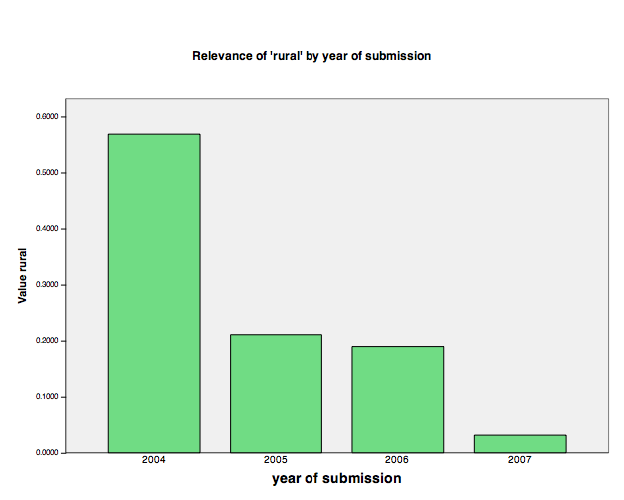
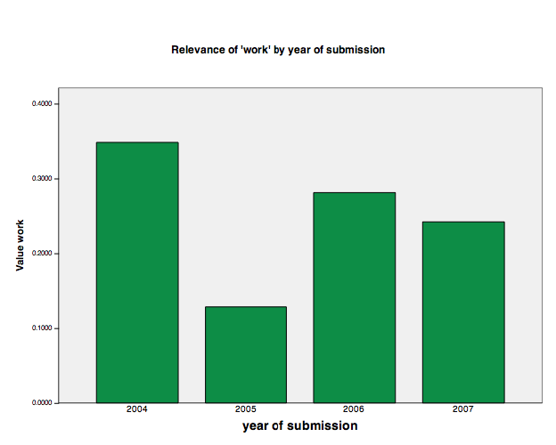

#Communities at a Crossroads
##Material Semiotics for Online Sociability in the Fade of Cyberculture
###Annalisa Pelizza

Theory on Demand #28  
**Commumities at a Crossroads: Material Semiotics for Online Sociability in the Fade of Cyberculture** Annalisa Pelizza  

Cover design: Katja van Stiphout  
Design and EPUB development: Kelly Mostert  

Published by the Institute of Network Cultures, Amsterdam, 2018  

ISBN: 978-94-92302-25-0

**Contact**
Institute of Network Cultures  
Phone: +3120 5951865  
Email: info@networkcultures.org  
Web: http://www.networkcultures.org  

This publication is licensed under the Creative Commons Attribution-NonCommercial-NoDerivatives 4.0 International (CC BY-NC-SA 4.0)  

This publication is available through various print on demand services and freely downloadable from http://networkcultures.org/publications

#Contents

Foreword to 2018 edition

Acknowledgements 

Introduction

1. Unfolding Cultures
2. From the Prairie to the Battlefield
3. In Search of Community
4. What Remains of Community
5. Communities Beyond 'Community'
6. Mediators Upkeeping Communities
7. From Definitions to Maps
8. Conclusions: Dropping Foundational Distinctions

Annexes

References 

# FOREWORD TO 2018 EDITION

This book was written between 2006 and 2009 as part of my Ph.D.
promotion. As often with similar cases, at that time the reasons for not
publishing it outnumbered the motives to follow up. First, by the time
this book was finalized, the 2008 financial crisis was ravaging Europe,
and odds of engaging in a research job in social sciences and humanities
were infinitesimal. Some of the research centers with which I
collaborated in conducting this research were discontinued in the same
weeks in which I was laying down the conclusions. In such a scenario,
this book was more likely to mark the end point of my research career --
as that of many others, rather than its beginning. Even when publishers
started to approach me, I preferred not to indulge in what at that
moment appeared as pointless vanity.

Second, at that time I was probably not fully aware of the importance of
keeping a memory of the present. Being myself involved in some digital
communitarian initiatives, conducting research was a way to reflect upon
our collective grassroots practices in a moment in which they were
mimicked by commercial services run by multinational corporations. The
attempt to figure out in what ways our practices and infrastructures
were different from the emerging services prevailed over the thrust to
historicize.

Last but definitely not least, as a young researcher, I was caught in
the modesty of the witness. As Haraway has recalled, in order for
modesty to be visible, the modest witness must be invisible.[^01foreword_1] It took
me some years, several readings, and many meaningful relationships to
realize that modesty and invisibility are a luxury that women cannot
afford. I wish to thank Joy Clancy, Stefania Milan, Nelly Oudshoorn,
Lissa Roberts -- and more recently Evelyn Ruppert, Anita Say Chan, Lucy
Suchman, and Sally Wyatt -- for having nurtured this awareness. I am
also deeply grateful to Geert Lovink and Miriam Rasch at the *Institute
of Networked Cultures* in Amsterdam for having expressed their
enthusiasm in making this work visible.

So, why have I made up my mind and decide to publish this book almost
ten years after its first release for academic purposes? A few factors
led me to overcome my reticence. First, in January 2017 I read a *Wired*
article titled 'How Silicon Valley Utopianism Brought You the Dystopian
Trump Presidency'.[^01foreword_2] The main argument of this article that Donald
Trump came to power by cleverly harnessing cyberculture's libertarian
myths and social media, was embarrassing. *Wired* was indeed admitting
that populism has been boosted by social media and underpinned by
libertarian credos. The source of embarassement was that *Wired* was
writing it. One could say that nowadays no one can avoid being populist,
for the reason that cultural traits introduced by libertarian
cyberculture are not recognized anymore in their historically situated
genesis. They have become universal and *Wired* has had a major role in
such universalization. Only an archaeology can return
anarco-individualism, suspicion of institutions, and techno-localism to
their historical context, and thus trim their universalistic reach. To
some extent, this book constitutes an archaeology. A double archaeology.
I will soon return to this point.

Second, the Cambridge Analytica scandal is only starting to reveal the
subtle mechanisms of manipulation allowed by social media platforms. For
those who participated in the early 2000s critical internet studies
wave, these revelations can hardly come as a surprise. Very early social
media abdicated to their communitarian, peer origins, and reproduced the
intermediated broadcasting model. It is thus worthwhile to recall -- as
this book does in its first part -- the genesis of the Web 2.0 ideology
in a period in which internet cultures were confused by the Dotcom burst
and new business models were lagging behind.

This point brings me to the third reason for publishing this book now.
The book is thought for those who have not lived the early days of the
Web 2.0 hype, a cohort that has now reached the age of higher education.
These are primarily Generation Z students and those who are interested
in how the internet looked like before *Facebook* and *YouTube*. My
students at a technical university in Northern Europe, for example, know
about the mailing list culture of the 1990s. They also know about art
and communitarian experiments in the same period. However, they know
less about how utopian roots turned into ideologies that eventually
brought on the commercialization of the internet, its geographical
closure, and its securization. While the goal of this book is not
nostalgic, it suggests that things could have been otherwise.

In 2018, a book written between 2006 and 2009 can be read under the lens
of a double archaeology. On one hand, the 2009 edition encompassed
hegemonic and minoritiarian early digital experiences. From the
here-and-now of 2009, it looked back to the genesis of network cultures
in the 1980s and 1990s. In the second part, it compared those early
discourses and practices to current communitarian developments. On the
other hand, this 2018 edition adds a second level of historicization.
From the 2018-now, it looks back ten years, before Snowden, when
Lawrence Lessig was committed to foster the Creative Commons, and when a
book such as Goldsmith and Wu's *Who Controls the Internet* could cause
a stir[^01foreword_3]. That was a time when peer-to-peer networks still challenged
centralization attempts by big players. Many of those networks are
analysed in this book. Some of them have ceased to exist for various
reasons, some others are still active today.

This double temporality allows diving into digital communalism at
different depths. The reader could approach it from the present tense
indicating the 2009 now, and follow communitarian accounts as they
unfold. Alternatively, she can retain a 2018 point of view and trace
back current developments to that period of profound internet
transformations. On a close look, these two attitudes may be
respectively compared to Silver's descriptive and analytical stage of
internet studies.[^01foreword_4] It is in order to keep this double archaeological
lens that the manuscript has not undergone major modifications in its
2018 edition. Most changes have been stylistic and linguistic. A
methodological chapter has been shrunk and integrated in the
introduction for readability's sake. Data and cases are those from the
original 2009 manuscript. When a note was added in 2018 in the light of
major developments, this is clearly marked.

*Communities at a Crossroads* returns a multi-faceted picture of
internet sociability between the two centuries. Almost one thousand
digital communities are analysed here through their own words and
rationales, as well as by focusing on the degrees of access and
participation that their software architectures allowed. What emerges is
a composite landscape made of non-profit and commercial, grassroots and
institutional, deterministic, and open efforts to articulate the tension
between technology and society. Above all, this rather encompassing
study of digital sociability shows that in the 2000s stabilization and
innovation dynamics materialized in similar ways in textual and software
artefacts. Today, one could say that this study anticipated the
'material turn' in Technology Studies, without renouncing to textual
components.

Annalisa Pelizza

Amsterdam/Sydney, August 2018

[^01foreword_1]: D. Haraway, *Modest\_witness\@Second\_Millenium.
    FemaleMan\_meets\_ Onco\_Mouse™: Feminism and technoscience*, New
    York: Routledge, 1997.

[^01foreword_2]: J. Tanz, 'How Silicon Valley Utopianism Brought You the Dystopian
    Trump Presidency', *Wired*, 20 January 2017,
    https://www.wired.com/2017/01/silicon-valley-utopianism-brought-dystopian-trump-presidency/?mbid=nl\_12217\_p3&CNDID=.

[^01foreword_3]: J. Goldsmith and T. Wu, *Who Controls the Internet?: Illusions of
    a Borderless World*, New York: Oxford University Press, 2006.

[^01foreword_4]: D. Silver, 'Looking Backwards, Looking Forwards: Cyberculture
    Studies, 1990-2000', in D. Gaunlett (ed.) *Web Studies*, London:
    Arnold Publishers, 2000.

*To my family, in whichever odd geometry it materializes*

# ACKNOWLEDGEMENTS

As the ANT teaches, showing gratefulness to all those who contributed to
the course of action that led to this work could turn into a short
summary of the pages that follow.

I thank Elisa Ribaudo, Carmela Torelli, Valerio Minetti, and Davide
Diamantini at the 'Quality of Life in the Information Society' *QUA\_SI
Ph.D* *Program*, University of Milan-Bicocca. Guido Martinotti, my
promoter, prodded my stamina in a risky but clever way. Tommaso
Venturini was a study partner not only in Milan, but since our
undergraduate studies at the University of Bologna. His lucid (and
ludic) suggestions on handling large qualitative data sets were a moment
of nimbleness amidst many doubts.

At the Emilia-Romagna government -- where I used to work during the last
edits of this endeavour -- I am grateful to Silvia Pagnotta, Francesca
Paron e Giancarlo 'Ambrogio' Vitali for understanding the needs and
anxieties of a doctoral student. Thanks also to Giovanni Grazia for his
suggestions on pc emulators for Mac OS.

I wish to thank Neil Hartley and the *Leximancer* staff at the
University of Queensland for providing me with a full trial release of
their software for research purposes. In 2006 Anne Balsamo (University
of Southern California) and David Theo Goldberg (University of
California at Irvine) accepted and facilitated my participation in the
*Seminar in Experimental Critical Theory: 'technoSpheres: FutureS of
Thinking'* at the Human Research Institute, University of California at
Irvine. This was an amazing possibility to enlarge the scope of my
research, and I hope these pages bring forward traces of that
experience. Thanks also to the Annenberg School Center for the Digital
Future, University of Southern California, for having provided me with a
copy of their 2007 'Digital Future Report'.

I am grateful to Tatiana Bazzichelli and Antonio Caronia for their
interest in this research, which brought about my involvement in the AHA
mailing list. Within this network I had an early opportunity to publicly
discuss the theoretical foundations of this work. I would also like to
thank the global Transmission.cc network for having welcomed me -- a
non-techie -- at their spring 2006 workshop, and for the food (for
thought and for the belly) I was fed with at that event. Thanks to
Agnese Trocchi, Andrew Lowenthal, and Andy Nicholson. A huge credit goes
to the *Telestreet* network, and *Orfeo TV* in particular, where I
developed my early reflections and doubts, which have found (partial)
answers in this work.

I am particularly indebted to Ars Electronica and the Boltzmann
Institute Media.Art.Research. in Linz for the interest they have shown
towards this research since its inception. Notably, I wish to thank
Gabriela Blome, Dieter Daniels, Katja Kwastek, Bianca Petscher, and
Gerfried Stocker. The warmest gratitude goes to Andreas Hirsch and
Ingrid Fischer-Schreiber, designers and coordinators of the Digital
Communities competition, for their unique capability to conjugate
professionality and friendship.

Those who will be patient enough to reach the end of this work will
learn that the degree of heterogeneity of actors is an evaluation
criterion for textual accounts. These acknowledgements should thus be a
good text. There are long networks that have few opportunities to
strengthen, and yet they are present, especially when made of women. In
this work there is something by Roberta Buiani, Monica Fagioli, Ilenia
Rosteghin, and Sara Zambotti. I would also like to thank Daniela
Panosetti for her willingness to engage in scientific discussions, even
in a field that is not her own cup of tea, and Francesco Mazzuchelli,
for the precious support with 'computer science diplomacy'.

Finally, my gratefulness goes to the shorter networks. To Cesarina,
Gino, Giuseppe, and Mercedes, for waiting for me. To Michela, who was
there at the right moment and in the right way. To Giorgia, for her
power in facing challenges that have the sole merit of having relegated
mine to placid cabotage. To Ciro, with whom I have crossed these
prairies for the second time. To Antonio e Anna, for having escorted me
until this point with their great energy and entrepreneurship. To that
assemblage of actual and potential elements that could be labeled 'I',
for having kneaded the contributions of many with the yeast of
curiosity.

Linz/Milan, February 2009

# INTRODUCTION

## 'Digital Communities', a Shifting Subject

'To what extent is talking of communal ties on the internet meaningful
today?' At the turn of the 21st century this question resonates with
many who had taken part in the early waves of TCP/IP-mediated grassroots
cultures.[^03introduction_1] With the 2000's 'Dotcom burst', the War on Terror and its
privacy intrusions, and the emergence of the 'Web 2.0' wave, spontaneous
online aggregations find themselves at a crossroads. This book
investigates the conditions under which, since the early 2000s, it has
been possible to re-launch a discourse on online digital sociability,
despite increasing trends in commercialization, securization, and
territorialization. Far from being ill-timed, investigating online
communities today is strategic. Indeed, after the Dotcom burst and the
aftermath of 9/11, on one hand, and the explosive renaissance of digital
participation with social networking applications, on the other, the
culture of digital communitarians[^03introduction_2] seems to have either lost autonomy
in favour of giant internet companies and governments or been
popularized and absorbed into the 'Web 2.0' hype.[^03introduction_3] [^03introduction_4]

The experiences that marked the birth and development of digital
communitarian cultures until the end of 1990s have been extensively
mapped by historical, cultural, and media literature. From cold-war
academic research with its cybernetic decentralized logics, to early
civic networks pursuing the democratization of information technology;
from counter-culture's communitarian legacy, to virtual life on the
*WELL*; from 1970s' and 1980s' early Bulletin Board Systems (BBS), to
Free and Libre Open Source Software (FLOSS) communities based on
reputation capital; from net art's focus on the aesthetic of interaction
and underground lists like *Nettime*, to the encounter of media artists
with the global movement for social justice which saw the emergence of
*Indymedia*: these diverse experiences have partly overlapped and
contributed elements to the communitarian cultures which crystallized by
mid 1990s.

What came after the first internet bubble has received less systematic
scholarly attention. This was partly due to diverse sectors and actors
appropriating the landscape of digital sociability in the first decade
of the 21st century, so that its boundaries became less clearly
identifiable. While 'online communities' disappeared from the digital
culture's agenda, articles about 'social networking sites' colonized
high-tech magazines' columns; 'communities of practice' constituted the
backbone of corporate knowledge management policies; and internet
marketers invoked use of 'Web 2.0' platforms as strategic components of
business strategies.

To understand the origins of a shift that has transformed the online
communitarian landscape for good, this book begins by recognizing that
the anarchic prairie of the internet has turned into a battlefield.
Nowadays it is well acknowledged that many of the utopias that
underpinned the 'digital revolution' have revealed their naivety, if not
complicity with the established order.[^03introduction_5] The book shows some signs of
this shift that have become undoubtedly visible in this first decade of
the new century, when libertarian cyberculture that had nurtured a
virtual communitarian utopia of peer networks -- as means for the
empowerment of individuals, strengthening of democracy, and achievement
of social justice -- has come to a crossroads. In the last years, free
internet communitarian culture had to face three major threats: massive
commercial expansion of internet companies; increasingly strict laws on
intellectual property; and the proliferation of 'dataveillance'
technologies related to the 'War on Terror'.[^03introduction_6]

By the end of 2000s, disenchantment about the use of information and
communication technologies (ICTs) for collaborative production of
knowledge was shared by many. According to *Nettime*'s moderator Felix
Stalder, 'by now it is clear that something more than simple
collaboration is needed in order to create community'.[^03introduction_7] According to
Stalder, the aim of collaboration has shifted from community-making
towards purpose-specific projects. Such conviction is shared by activist
and artistic networks that reflect on state-of-the-art forms of digital
aggregation. They are trying to re-focus the scope of online
communities, while at the same time questioning the innovative potential
of social networking platforms.[^03introduction_8]

## The Crisis of Foundational Myths

Between late 1990s and mid-2000s, three main techno-libertarian myths
had to face counter-evidence. These myths were based on the cybernetic
vision of information technology as the source of a second industrial
revolution that bore the promise of emancipation for the citizenry.
First, in spite of declarations of cyberspace independence, it turned
out that geography matters, and that the libertarian credo of an
intrinsically ungovernable internet was an illusion. In 2006, Stanford's
researchers Goldsmith and Wu depicted a more and more controlled and
territorialized internet. The 'Balkanization of the Net'[^03introduction_9] was the
result of cooperation between governments and global internet companies,
officially fostering freedom of networking. As a consequence, one of the
pillars of cyberculture -- i.e., the possibility that the virtual and
the brick-and-mortar domains could be kept separate -- began to crumble.

The second libertarian myth, that had to face the new climax of early
2000s, was the that of the emergence of a creative class: a new social
class whose roots would lie at the convergence of cultural values
prompted by the social actors that had led the digital revolution, on
one side, and internet entrepreneurs' vision, on the other. The
lifestyle and economic weight of such a class was expected to influence
the global market as well as political systems. However, the Dotcom
burst ratified the failure of the 'Fifth State'.[^03introduction_10] Even if the net
economy did eventually recover from the burst, the coalition between
knowledge workers and internet companies -- that in the meanwhile had
become giant corporations -- never did.

The third myth that had to face a self-reflexive stage concerned the
creation of digital commons. The digital commons, it was believed, would
empower disadvantaged individuals against governmental authorities and
business interests. However, while the openness of digital architecture
-- of code, practices, and standards -- was a *condicio sine qua non*
for the existence of the early internet, the question of how a digital
commons-driven economy should or could distribute resources and wealth
has long been a matter of dispute. The rapid diffusion of social
behaviours and commercial services subsumed under the heading 'Web 2.0'
is a perfect example. With commercial multi-user platforms and
user-generated content, the rationale behind independent communities
focusing on collaborative knowledge production seemed to have come to
large-scale realization thanks to the corporate facilities provided by
*YouTube*, *MySpace*, *Flickr*, and *Yahoo*!. However, as Lovink has
pointed out, while the 'ideology of the free' has been pushing millions
of people to contribute with their content to Web 2.0 platforms, there
is a endemic lack of models fostering a distributed and decentralized
internet economy.[^03introduction_11] No consistent distribution of resources
corresponds to the 'cult of the amateur'[^03introduction_12].

These arguments will be further discussed in chapters 1-3. For the time
being, we can anticipate that they highlight a set of contradictions
between recent developments and key characteristics that had originally
marked the growth of the online community paradigm, and of the internet
as a whole. The Dotcom burst, the territorialization of the net, and the
advent of Web 2.0, in particular, brought to light fractures in
communitarian internet cultures. These fractures have been pointed to by
scholars from diverse disciplines, who indeed wondered about the
enduring possibility of communitarian ties on the internet.

## Scholars' Reactions to the Crisis of the Digital Communitarian Culture

By introducing 'network individualism', Manuel Castells and Barry
Wellman have called into question the possibility of identifying
communitarian relationships online. According to Wellman, portability,
ubiquitous computing, and globalized connectivity fostered the movement
from place-to-place aggregations to person-to-person networks. As a
consequence, communities are not to be found in bounded groups anymore,
but rather in loose networks.[^03introduction_13] Similarly, in Castells' 'space of
flows' the individual is the hub of different kinds of flows that move
from the place to the subject and vice versa.[^03introduction_14]

Rather than advocating for macro models, humanities on their side have
produced meta-reflections aiming at putting order among the multiple
souls of digital communitarian culture. Sociologist of culture Patrice
Flichy, for example, called into question the existence of a homogeneous
internet communitarian culture. He identified three principal
imaginaries related to amateurs experimenting with information
technology: initiatives linked with counter-culture and the hippie
movement; hackers interested in technical virtuosity; and ICT community
projects originated by civil society.[^03introduction_15] Differently, historian Fred
Turner has traced the cultural origins of the U.S. cyberculture movement
to the early days of the Free Speech movement. By focusing on
spokespersons like Kevin Kelly, Stewart Brand, and the *Wired Magazine*,
Turner has shown that over the years the libertarian, anarchist
*digerati* culture has turned into open support for neo-conservative
political positions, like Newt Gingrich's Contract with America.[^03introduction_16] As
a consequence, those scholars who are more optimistic about the
renaissance of digital ties based on commonality can be so only on
condition that communitarian efforts get rid of libertarian ideology.
Notably, media theorists Geert Lovink and Ned Rossiter have re-examined
the notion of virtual communities as 'organized networks' and 'osmotic
interfaces' that reflect society while anticipating new forms of social
interaction.[^03introduction_17]

## A Non-essentialist Perspective for Diluted Communities

According to many analysts, the crisis of foundational myths suggests
that cyberculture utopias are facing the counter-evidence of both a more
and more controlled and territorialized internet and of a newly new
economy based on the exploitation of informal cognitive labour. This
seems to have consequences for online communalism. First, at stake is
the correlation between access to digital networks and empowerment of
individuals and communities. As we will see in chapter 1, such
correlation lies at the core of the digital communitarian paradigm.
However, with the rise of social networking services acting as
intermediaries, the immediate character of this correlation cannot be
taken for granted anymore. That uploading personal information on a
digital platform, participating in e-democracy focus groups or keeping a
personal blog would necessarily empower individuals and communities
indeed needs demonstration.

Second, with the above crisis, the communitarian paradigm has acquired a
paradoxical character. While this first decade of the 21st century is
witnessing the diffusion of the virtual *gemeinschaft* well beyond
*digerati* niches, counterculture or civil society experiments, this
proliferation entails an ontological 'dilution'. It is by no means clear
whether there exist ties that are specific enough to be labelled
'communitarian', and that could make up a special type of relationship.
'Community' seems to be diluted everywhere and yet it is difficult to
describe what it is supposed to be made of. While communitarian ties
enabled by digital platforms are more and more invoked, the internet is
revealing itself as a more bureaucratic, controlled, and profit-oriented
domain than ever.

As a consequence, scholars and commentators have argued that when the
cyberculture paradigm -- together with its actors and technical
platforms -- shows its limits, other players are likely to appropriate
'online communities' as techno-social assemblages made of specific
ideologies, interaction models, values, rules, and technical protocols.
Drawing on similar evidence but avoiding swift conclusions, this book
suggests that such developments can constitute an opportunity to answer
a still open question by means of empirical analysis: under what
conditions is it possible to conceptualize online sociability in the
first decade of the 21st century?

By avoiding macro accounts and linear evolutionary perspectives, the
book answers this question by investigating theories of actions that
have underpinned the development of techno-social assemblages for online
collaboration after the fade of the 'golden age' of digital communities.
It privileges the analysis of probably the largest archive on digital
communities worldwide, and in doing so it returns a multi-faceted
picture of contemporary sociability online. This outcome, however,
requires a radical epistemological turn and well-thought empirical
methods. In particular, it needs an anti-essentialist approach that
frees the communitarian perspective from some of the constraints that
pulled it into the blind alley anticipated above, further described in
chapters 1-3.

In order to introduce such an approach, it should be recalled that the
conceptualization of community lies at the very heart of the social
sciences. It has been of crucial importance in identifying the types of
society brought about by modernity. The evolutionist distinction between
*gemeinschaft* and *gesellschaft* by Ferdinand Tönnies, for instance,
marked the dichotomy between a pre-modern form of human organization
based on emotional will (*Wesenwille*) and a modern society based on
rational will (*Kürwille*).[^03introduction_18] An opposition between pre-modern group
solidarity vs. individual inclusion into a modern organizational
structure was conveyed also by Émile Durkheim's notion of mechanical vs.
organic solidarity.[^03introduction_19] Such a binary distinction between a supportive
community and an evolution towards individualized networks persists also
in contemporary references to 'community'.[^03introduction_20] Here, the term
'community' indicates social assemblages whose elements are maintained
together by strong, solidarity-based ties, as opposed to weak,
individual-based ties. In other words, 'community' is a 'substance' that
differentiates a specific type of social aggregate from other types.

Following this tradition, studies on digital communities have often
concentrated on the extent to which online collaboration could be
conceived of as a 'real' community, rather than a simple transaction.
Durability over time, regularity of the rhythm of interaction, presence
of one or few shared interests were used as indicators to distinguish
'successful' communities from other types of looser social
aggregates.[^03introduction_21] These approaches acknowledged as genuine online
communities only those groups featuring *a priori* established
characteristics like emotional investment, sense of belonging, active
engagement, durability over time, and face-to-face encounters.

From an epistemological viewpoint, social research methodologists label
this epistemic strategy 'intensive classification'.[^03introduction_22] Intensive
classification proceeds by articulating the characteristics an item must
manifest in order to be classified as a concept. As in Plato's cave,
once an abstract 'Form' (*Idea*) of online community is established,
only cases of online collaboration matching those criteria can be
considered as its occurrences. Latour calls this classification method
'ostensive', and highlights its inadequacy to account for change:

\[t\]he problem with any ostensive definition of the social is that no
extra effort seems necessary to maintain the groups in existence
\[...\]. The great benefit of a performative definition, on the other
hand, is just the opposite: it draws attention to the means necessary to
ceaselessly upkeep the groups.[^03introduction_23]

Ostensive definition does not fit unstable social groups. This is
particularly true of online communities. Despite their ostensive
efforts, early authors agreed that online assemblages were transient
aggregations where durability, stability, and order were
exceptions.[^03introduction_24] Even when the social assemblage reached a sort of
self-consciousness as a community, it was somewhat impossible to trace
clear delimitations between the inner and the outer social space. In the
WELL, for example, more than 80 per cent of the subscribers where
lurkers: ephemeral participants rarely intervening in discussions.[^03introduction_25]
This fleeting character of digital communities has only been accentuated
by the above-mentioned proliferation of digital sociability in diverse
domains, which contributed to its 'opacity', a resistance to being
'grasped'.

If internet instability is the norm, then the presence of communitarian
ties needs to be demonstrated each time anew and cannot be simply
postulated. Are there homogeneous ties that are peculiar to a substance
labelled 'community'? Does the traditional distinction between
*gemeinschaft* and *gesellschaft* retain its meaning? What is difficult
-- if not impossible -- when researching online forms of aggregation is
exactly individuating a closed list of features that are specific to
communitarian digital assemblages.

In order to address this conundrum, the book proceeds in a different way
than earlier studies. It does not aim to distinguish 'genuine
communities' from 'simple transactions', nor does it postulate
specifically 'communitarian' types of relationship. It does not set any
specific social aggregate or theory as a starting point. For example, it
does not begin with setting 'networks' rather than 'groups' as the best
social assemblage to start with, nor does it take 'social networking
sites' as the brand new machinery for social capital production. Rather,
it asks involved actors themselves what they mean by 'digital
community'.

In other words, in this book I prefer to adopt a 'Wittgensteinian'[^03introduction_26]
epistemic approach in which a concept is defined *a posteriori*, as the
result of clustering together occurrences seen as similar. This
'extensive classification'.[^03introduction_27] corresponds to Latour's performative
definition. Concepts are empirically defined through recognition of
objects as members of a cluster: 'they are made by the various ways and
manners in which they are said to exist'.[^03introduction_28] Since they need to be
constantly kept up by group-making efforts, digital communities cannot
be the object of an ostensive definition, but only of a performative
one: '\[t\]he object of an ostensive definition remains there, whatever
happens to the index of the onlooker. But the object of a performative
definition vanishes when it is no longer performed'.[^03introduction_29] Research
dealing with the transient nature of online sociability thus needs to
focus on how heterogeneous entities are woven together, and the means
whereby they are kept assembled, instead of postulating the substance of
community.

This anti-essentialist approach avoids defining beforehand what
communitarian ties are supposed to be. Rather, it suggests to start from
the observation of different, conflicting selections. To do so, the
research summarized in this book adopts a bottom-up method that asks
social actors themselves which theories of action supported their forms
of online communality.

For this reason, this book is not written in the specialized
meta-language of specific disciplines, but rather strives to adopt a
language based on lay words.[^03introduction_30] Indeed, any preliminary classification
based on the type of technology used, the type of social ties created or
the shared interests and commons would get stuck in the necessity to
define those types in advance, thus postulating concepts derived from
other researchers, other disciplines, or from the market-driven digital
hype.[^03introduction_31] Paradoxically, if we want to keep our feet on the solid
ground of science, we cannot rely on other concepts but those provided
by social actors themselves.

## Ars Electronica's Digital Communities Competition as Space of Controversy

Driven by an interest in recent transformations of digital communalism,
and adopting an anti-essentialist epistemic approach, this book aims to
investigate the communitarian potential of digital techno-social
assemblages in the first decade of the 21st century, as it is accounted
for by those actors who are directly involved. Notably, it inquiries how
actors themselves account for the relationship between access to
information technologies and societal empowerment, a relationship that
lies at the core of the digital communitarian paradigm.

To do so, the second part of the book analyses theories of empowerment
that have underpinned the development of computer-mediated sociability
in 2000s. It draws upon research conducted between 2004 and 2009 on
probably the largest digital communities archive worldwide. Cases are
provided by the applications submitted to the world's leading
competition on digital culture, the *Prix Ars Electronica* in Linz,
Austria.

Initiated in 1979, the *Ars Electronica Festival for Art, Technology and
Society* (www.aec.at) was the forerunner of 1980s' festivals on art and
new media technologies, like *VIPER International Festival for Film
Video and New Media* (Basel), *Imagina* (Montecarlo), *ISEA
International Symposium on Electronic Art* (worldwide), *Multimediale*
(Karlsruhe), *Next Five Minutes* (Amsterdam), *DEAF Dutch Electronic Art
Festival* (Rotterdam), *Transmediale* (Berlin). As Bazzichelli has
recalled, these events characterized the emergent phase of an electronic
culture that was meant to fill the gap between humanistic and
techno-scientific forms of knowledge.[^03introduction_32] In mid 1980s, engineers and
computer scientists started to collaborate with architects, musicians,
and visual artists on electronic art projects that required
multi-faceted skills and know-how from both the technological and the
humanities domains.

The *Prix Ars Electronica*, 'competition for CyberArts', was established
in 1987 as an international forum for artistic creativity and innovation
in the digital realm. The first edition included three categories. Over
the years categories have expanded, to reach eight categories in 2007.
Since the early days, an accurate selection of the jury members among
the top experts in each category, the largest prize pursued worldwide in
this domain, and pervasive media coverage characterized the *Prix* as a
leading international competition in the field of digital media art.

Thanks to its yearly pace, its international scope and its leading
position in the digital media art domain, nowadays the *Prix* retains
one of the largest archives of media art from the last 30 years.
Long-term archiving characterizes its treatment of participant projects.
Textual and visual materials of all winning works since the
competition's inception, as well as information on the winning artists
and jury members, are collected in the open *Prix* archive. Furthermore,
a closed database gathers all applications submitted over the years in
all categories, including non-winning entries. This database represents
an extremely rich resource to map the evolution of digital culture. As
such, it is used as a data source for the empirical analyses conducted
in the second part of the book.

Established in 2004, the Prix's *Digital Community* competition is meant
to focus on the socio-political potential of digital networked systems.
It aims to acknowledge important achievements by online communities,
especially in the fields of social software, ubiquitous computing,
mobile communications, peer-to-peer production, and net.art. It
acknowledges innovations impacting human coexistence, bridging the
geographical, economic, political or gender-based digital divide,
sustaining cultural diversity and the freedom of artistic expression,
enhancing accessibility of technological infrastructures. As the call
for entries affirms, 'the "Digital Communities" category is open to
political, social, cultural and artistic projects, initiatives, groups,
and scenes from all over the world utilizing digital technology to
better society and assume social responsibility'.[^03introduction_33] The competiton is
open to non-profit projects developed by governments, businesses, and
civil society organizations.

The designers of the new category dedicated to online communities
explicitly referred to four leading paradigms of early 2000s: the
counterculture legacy, the renaissance of political activism in the form
of the Global Movement for Social Justice, the popularization of the
web, and the wide diffusion of collaborative patterns of
organization.[^03introduction_34]

Despite this initial categorization, the cases analysed here have not
been *a priori* labelled as occurrences of digital communities by the
researcher. Rather, they have been identified as such by several expert
actors. First, projects participating in the competition have been
*said* to be occurrences of digital communities by the project
representatives who submitted their application, or by the International
Advisory Board who proposed some of the entries. Second, they have been
*acknowledged* as such by the independent international jury who
excluded those projects that did not fulfil the requirements. Projects
which passed all these stages thus *became* digital communities, and are
analysed and discussed in the second part of this book.

Methodologically, the Prix Ars Electronica's *Digital Communities*
competition is seen as a peculiar form of controversy dealing with the
acknowledgement of the most innovative practices of online collaboration
and sociability. Controversies are ideal methodological entry points
whereby it is possible to penetrate the inner workings of science and
technology before they get crystallized into a black box. Situations
where techno-social ties are indeed made visible and graspable are those
where meaning emerges from comparison and 'polemic structures':[^03introduction_35]
meetings, trials, and plans in science labs, distance in time or space,
breakdowns and fractures, but also fiction, archives, and museum
collections.[^03introduction_36] Prix Ars Electronica's *Digital Communities*
competition thus constitutes an arena wherein the black box of
techno-social assemblages is re-opened, contrasting meanings are made
explicit, and the most innovative ones are selected by an
internationally renowned board of experts.

Notably, the *Digital Communities* competition can be associated with a
form of controversy in three respects. First, contests constitute a
primeval form of polemic structure, an arena where meaning emerges from
comparison between different projects. Projects struggle in order to be
recognized as successful digital communities. Second, like
controversies, competitions present some recurring elements like a
spokesperson, anti-groups, limes, and accounts.[^03introduction_37] The *Digital
Communities* contest is the place where online networks achieve
representation: it constitutes the moment in an unstable process of
social innovation when spokespersons must emerge and -- together with
them -- self-representations, identity, and opponents. In other words,
online assemblages are caught in the moment in which they struggle to
crystallize into the form of 'digital community'. Third, to grasp
controversies one needs accounts: agencies and actors are made visible
into accounts. In this analysis I have been using as accounts the traces
left behind by group-makers: the applications submitted from 2004 to
2007 by participants for the purpose of an award. Since the applications
are produced in the moment when online assemblages fix the instant and
take a picture of themselves, they represent accounts about what
participants conceive of as digital communities.

## Quali-quantitative Methods

Given the epistemological considerations anticipated above, in order to
answer the overarching question addressed in this book (i.e., under what
conditions is it possible to conceptualize online sociability in the
first decade of the 21st century?), the Prix Ars Elextronica data set
was analysed by focusing on how actors speaking for online communities
describe the theories of actions underpinning techno-social
collaboration. Three sets of sub-questions were identified to
operationalize the main question for analytical purposes.

The first sub-question asked community spokespersons what they mean by
'online community'. To do so, concept profiling methods were adopted to
explore the semantic elements *explicitly* associated with the notion of
'online community' in the submissions to Prix Ars Electronica. In
chapter 4, the resulting semantic configuration was then compared to
those of the early subcultures recalled in chapter 1. Furthermore,
Wellman's well-established distinction between communities as bounded
groups vs. loose networks was tested.[^03introduction_38] Chapter 4 thus attempts to
provide a definition of online/digital community, as established by
communities' spokespersons. It shows which paths have been abandoned in
the first decade of the 21st century with respect to the original
cyberculture: cybernetic discourse and its reliance on technology as a
neutral organizational agency and the immaterial gift as a way to
maintain communities as social homeostats. All in all, it shows that new
framings in the 2000s have taken the place of the old 'online
community', which do not necessarily distinguish between bounded groups
and loose networks.

While the first sub-question analysed how online communities are
*explicitly* profiled, the second did it *implicitly*. It indeed
identified the most recurring and central topics, and narratives
addressed in the data set. Here, no prior concepts were profiled *a
priori* -- not even 'online community'. Rather, as discussed in the
previous sections, submission to a competition for 'digital communities'
was conceived of as a performative act defining what this kind of
techno-social assemblage is supposed to be. My aim here was identifying
the matters of concern emerging from the whole data set, and related
narratives. To do so, I extracted some concepts and narratives through
quali-quantitative analysis supported by co-occurrence patterns. As
discussed in chapter 5, those narratives only partially overlap with the
discourses prompted by early cybercultures. Even when they do -- like in
the case of creative labour, public art, and social software -- they
articulate originally simplistic oppositions in more elaborated accounts
of the peculiar mediation exerted by techno-social assemblages.

Finally, in order to map the different theories of action underpinning
the digital communities participating in the competition, the third set
of questions analysed the expected relationship between societal
outcomes and role of technological artefacts, as it was laid down by
communities' spokespersons. In order to do so, I conducted narrative
analyses of fewer cases. By focusing on the artefacts whereby groups are
assembled, chapter 6 describes the theories of action underpinning the
rationale of prize-winning techno-social assemblages self-labelled as
digital/online communities, and proposes a typology. Chapter 7 expands
this typology by focusing on a different type of materiality, and looks
at the possibilities of access provided for on the project's website.

The book argues that in order to conceptualize online sociability in the
first decade of the 21st century, it is necessary to get over the
foundational distinction between *gemeinschaft* and *gesellschaft*. It
is only when the foundations of 21st century's social theory are put
into discussion -- notably the demise of sociability and commitment in
modern technological societies -- that it is possible to grasp and
theorize contemporary techno-social assemblages. In particular, such a
move allows accounting for the performative role of (digital and
analogue) artefacts in upkeeping communalist efforts.

In order to achieve this evidence, qualitative and quantitative
analytical methods were developed. The choice of the techniques for data
analysis had indeed to take into account two main constraints. First,
the high number of applications made the Ars Electronica archive
unsuitable for purely qualitative analysis. Original submissions for the
period 2004-2007 amounted to 1411. Out of these, 920 participating
projects and related applications resulted after excluding blank
applications and submissions discharged by the International Advisory
Board and the jury as non-representatives of digital communities. I
tackled the problem by planning two distinct analytical moments. The
first took into account the whole data set (N cases) and used mixed
quali-quantitative techniques provided by textual co-occurrence analysis
and Boolean analysis software applications, while the second
concentrated on a selected number of case studies (n cases), using
narrative analysis techniques.

As to the second constraint, I needed to avoid *a priori* postulating
analytical categories. In line with a non-essentialist, bottom-up
approach, no hidden forces nor actors could be assumed in advance. As a
consequence, when analysing the whole data set (N cases) I chose to use
relational analysis, a method based on measuring how often concepts
occur close together within the text. Concepts co-occurrence turned out
helpful in addressing my main epistemological concern: that *a priori*
categories impose the reality of the investigator, rather than measuring
the categories used by the authors of the text themselves. By using
relational analysis, 'relevant categories' were defined as those that
are most frequent *and* co-variate the most with other high-frequency
words recurring in the text.[^03introduction_39]

More details about this software-embedded definition of relevancy -- and
the diverse ways in which software was set to answer different questions
-- are discussed in chapters 4 and 5. For the time being, it suffices to
highlight the coherence and consistency of techniques for data
collection and analysis with epistemological choices, as outlined in
Table 1.

+-----------------+-----------------+-----------------+-----------------+
| **Epistemologic | **Choice of the | **Method**      |                 |
| al              | sample**        |                 |                 |
| assumptions**   |                 |                 |                 |
+=================+=================+=================+=================+
|                 |                 | **Technique of  | **Technique of  |
|                 |                 | data            | data analysis** |
|                 |                 | collection**    |                 |
+-----------------+-----------------+-----------------+-----------------+
| Performative    | Objects of      | Submissionsexpo | Quali-quantitat |
| classification  | study are the   | rted            | ive             |
| of digital      | projects        | from online     | (for N cases)   |
| communities     | participating   | archive as txt  | and qualitative |
| (DC): DC        | in Ars          | file with ASCII | (for n cases)   |
| definition is   | Electronica's   | codification    | analysis of     |
| the result of   | competition.    |                 | submissions     |
| clustering      | They are *said* | Navigation of   |                 |
| together        | and             | DCs' websites   | Profile         |
| objects *said*  | *acknowledged*  |                 | analysis of     |
| to be           | as DCs by       |                 | websites        |
| occurrences of  | different       |                 |                 |
| the concept.    | social actors:  |                 |                 |
| Acknowledgement | the projects    |                 |                 |
| as distributed  | authors + Prix  |                 |                 |
| enuciative      | Ars             |                 |                 |
| action          | Electronica's   |                 |                 |
|                 | International   |                 |                 |
|                 | Advisory Board  |                 |                 |
|                 | + independent   |                 |                 |
|                 | jury            |                 |                 |
+-----------------+-----------------+-----------------+-----------------+
| Study of        | 1\) Prix Ars    |                 |                 |
| controversies   | Electronica     |                 |                 |
|                 | competition     |                 |                 |
| 1\) Meaning     | as a form of    |                 |                 |
| emerges from    | controversy,    |                 |                 |
| comparison      | a situation     |                 |                 |
| and/or          | where meaning   |                 |                 |
| polemic         | emerges from    |                 |                 |
| structures.     | comparison      |                 |                 |
|                 | between         |                 |                 |
| 2)              | different       |                 |                 |
| Controversies   | projects        |                 |                 |
| and agency are  | struggling to   |                 |                 |
| made visible    | be defined as   |                 |                 |
| into accounts   | successful      |                 |                 |
|                 | DC.             |                 |                 |
|                 |                 |                 |                 |
|                 | 2\) Use of      |                 |                 |
|                 | archived        |                 |                 |
|                 | submission      |                 |                 |
|                 | forms as        |                 |                 |
|                 | accounts:       |                 |                 |
|                 | meaning         |                 |                 |
|                 | emerges also    |                 |                 |
|                 | from distance   |                 |                 |
|                 | in time         |                 |                 |
+-----------------+-----------------+-----------------+-----------------+

<small>Table 1 - *Resume: from epistemological assumptions to techniques of
data collection and analysis*</small>

## Structure of the Book

This book is composed of two main parts. Drawing on offline literature
and online sources, including mailing lists and email interviews, the
first part recalls the heterogeneous origins of digital sociability.
Even if diachronic comparison lies at the core of chapters 1-3, this
book doesn't intend to provide a comprehensive historical reconstruction
of early online forms of communalism. A systematic history would deserve
a research work in itself, and consistent attempts in this direction are
numerous. More modestly, the first part aims to return the complexity
and heterogeneity of cybercultures (in the plural!) before the 2000s
crisis. Chapter 1 addresses the legacies of libertarian, civic,
artistic, and activist utopias inherited by digital communitarian
culture. Chapter 2 throws light on its aporiai, concerning both
socio-economic developments and the politics of information. Chapter 3
discusses the arguments of those authors who have addressed the question
on whether it is possible to talk of communitarian ties online today.
After having discussed some of the ideologies linked to the societal
potential of ICT, a few hypotheses on the current condition of digital
communities in 2000s are sketched.

The second part engages in empirical analyses of contemporary forms of
digital communities, and compares them with the literature discussed in
the first part. Chapter 4 provides a first definition of 'online
community' by explicitly exploring the elements associated with it in
the applications submitted to Prix Ars Electronica's Digital Communities
competition. It also verifies a hypothetical counter-argument to
Wellman's thesis on weak ties by conducting co-occurrence analysis.

Chapter 5 identifies some relevant topics and narratives emerging from
the whole data set and compares them with those prompted by early
cybercultures. Continuing with a purely qualitative method, chapter 6
conducts a narrative analysis of the prize-winning projects. After a
detailed description of all the projects that won a first or second
prize from 2004 to 2007, it draws a map of the different techno-social
theories of action underpinning those projects. Finally, chapter 7
suggests a system of classification for digital communities based on two
diverse forms of materiality, while chapter 8 draws conclusions and
proposes further directions of analysis.

[^03introduction_1]: Note from the 2018 Edition. As mentioned in the Foreword, the
    research underpinning this book was conducted on a data set created
    in the period 2004-2007. Ethnographic observation and participation
    in digital media groups, mailing lists, and online networks started
    however much earlier, in 2001. With the exception of the Foreword --
    written for the 2018 Edition, throughout the book the present tense
    refers to the period 2006-2009.

[^03introduction_2]: With 'communitarian', 'communalism' and 'communitarianism' I do
    not refer to those political philosophies whose most influential
    exponents are Alasdair MacIntyre, Michael Sandel, Charles Taylor,
    and Michael Walzer, quoted by D. Bell, 'Communitarianism', in E. N.
    Zalta (ed.) *The* *Stanford Encyclopedia of Philosophy*, Stanford
    CA: Stanford University, 2016,\
    https://plato.stanford.edu/archives/sum2016/entries/communitarianism/.
    Differently, I use these terms in their most mundane meaning of
    'related to community', the goal of this work being to ask actors
    themselves what they mean by it.

[^03introduction_3]: Goldsmith and Wu, Who Controls the Internet?

[^03introduction_4]: H. Jenkins, *Convergence Culture: Where Old and New Media
    Collide*, New York-London: New York University Press, 2006.

[^03introduction_5]: F. Turner, From Counterculture to Cyberculture: Stewart Brand, the
    Whole Earth Network, and the Rise of Digital Utopianism, Chicago and
    London: The University of Chicago Press, 2006.

[^03introduction_6]: C. Formenti, 'Composizione di classe, tecnologie di rete e
    post-democrazia', in A. Di Corinto (ed.) *L'innovazione necessaria*,
    Milano: RGB -- Area 51, 2005.

[^03introduction_7]: Interview with Stalder in T. Bazzichelli, 'Stalder: il Futuro
    delle Digital Communities', *Digimag*, 14 May 2006.

[^03introduction_8]: M. Fuster i Morell, 'The new web communities and political
    culture', in VV.AA., *Networked Politics: Rethinking Political
    Organization in an Age of Movements and Networks*, Seminar Networked
    Politics, Berlin, June 2007,
    https://www.scribd.com/document/118788762/Networked-Politics-Rethinking-political-organization-in-an-age-of-movements-and-networks.

[^03introduction_9]: Goldsmith and Wu, Who Controls the Internet?

[^03introduction_10]: Formenti, 'Composizione di classe, tecnologie di rete e
    post-democrazia'.

[^03introduction_11]: G. Lovink, *Zero Comments*, New York: Routledge, 2007.

[^03introduction_12]: Lovink, Zero Comments.

[^03introduction_13]: B. Wellman, 'Physical place and cyberplace: The rise of
    personalized networking', *International Journal of Urban and
    Regional Research* 25.2 (2001): 227-252.

[^03introduction_14]: M. Castells, *The Rise of The Network Society, Volume I: The
    Information Age*, Oxford: Blackwell, 1996; *Internet Galaxy*,
    Oxford: Oxford University Press, 2001; 'Space of Flows, Space of
    Places: Materials for a Theory of Urbanism in the Information Age',
    in S.Graham (ed.) *The Cybercities Reader*, London: Routledge, 2004.

[^03introduction_15]: P. Flichy, *L'imaginaire d'Internet*, Paris: La Découverte, 2001,
    see section 1.2.1 in this book.

[^03introduction_16]: Turner, From Counterculture to Cyberculture.

[^03introduction_17]: G. Lovink and N. Rossiter, 'Dawn of the Organised Networks',
    *Fibreculture Journal* 5.29 (2005),
    http://five.fibreculturejournal.org/fcj-029-dawn-of-the-organised-networks/.
    Note to the 2018 Edition: this early insight was further developed
    in G. Lovink and N. Rossiter, *Organization after Social Media*,
    Colchester / New York / Port Watson: Minor Compositions, 2018.

[^03introduction_18]: F. Tönnies, *Gemeinschaft und Gesellschaft,* Leipzig: Buske, 8th
    edition 1935. English translation by C. P. Loomis, *Community and
    Society*, Mineola, N.Y.: Dover Publications, 2002.

[^03introduction_19]: É. Durkheim, *De la division du travail social*, Paris: PUF, 8th
    edition 1967. English translation by G. Simpson, *On the Division of
    Labour in Society,* New York: The MacMillan Company, 1933.

[^03introduction_20]: U. Beck, The Reinvention of Politics: Rethinking Modernity in the
    Global Social Order, London: Polity Press, 1996;

    Castells, The Rise of the Network Society; The Power of Identity;
    The End of the Millennium;

    A. Giddens, Modernity and Self-Identity: Self and Society in the
    Late Modern Age, London: Polity Press, 1991;

    Wellman, 'Physical place and cyberplace', see section 3.1 in this
    book.

[^03introduction_21]: G.S. Jones, Cybersociety 2.0: Revisiting Computer-Mediated
    Communication and Community, Thousand Oaks, Cal.: Sage Publications,
    1998;

    A.J. Kim, Community Building on the Web: Secret Strategies for
    Successful Online Communities, London: Addison Wesley, 2000;

    M. Smith, *Voices from the WELL: The Logic of the Virtual Commons*,
    Unpublished Dissertation, University of California Los Angeles Los
    Angeles, 1992,
    https://dlc.dlib.indiana.edu/dlc/bitstream/handle/10535/4363/Voices\_from\_the\_WELL.pdf?sequence=1&isAllowed=y.

    M. Smith and P. Kollock, *Communities in Cyberspace*, New York:
    Routledge, 1999;

    M. Taylor, *The Possibility of Cooperation*, Cambridge: Cambridge
    University Press, 1987.

[^03introduction_22]: G. Gasperoni, and A. Marradi. 'Metodo e tecniche nelle scienze
    sociali', in *Enciclopedia delle Scienze Sociali*, vol. v, Roma:
    Istituto della Enciclopedia Italiana, 1996.

[^03introduction_23]: B. Latour, Reassembling the Social. An Introduction to
    Actor-Network-Theory, Oxford: Oxford University Press, 2005, p. 35.

[^03introduction_24]: Smith, Voices from the WELL.

[^03introduction_25]: H. Rheingold, *The Virtual Community: Homesteading on the
    Electronic Frontier*, Reading, Mass.: Addison-Wesley, 1993 (2000);

    J. Nielsen, 'The 90-9-1 Rule for Participation Inequality in Social
    Media and Online Communities', *Nielsen Norman Group Newsletter*, 9
    October 2006,
    http://www.useit.com/alertbox/participation\_inequality.html.

[^03introduction_26]: I wish to thank Prof. Dieter Daniels for the suggestion of this
    label during my talk at the 'Community vs Institution' panel
    organized by the Boltzmann Institute Media.Art.Research at the
    *re:place* conference in Berlin, 14-18 November 2007. One can find
    an echo of this way of proceeding in Wittgenstein's language games.
    In 1933 the philosopher introduced language games to his students as
    a technique aimed to address one of the major philosophical puzzles,
    namely the tendency to make questions about general substantives --
    'what is knowledge, space, numbers, etc.?' -- and to answer them by
    naming a substance. Wittgenstein substituted Platonic Form by
    'family resemblance': 'we tend to think that there must be something
    shared by, for instance, all games, and that this common property
    justifies the application of the general substantive "game" to all
    the games, while, on the contrary, games constitute a family whose
    members display family resemblances. Inside a family, some members
    share the same nose, some others the same eyebrow, some others the
    same gait. These resemblances combine and intertwine'. L.
    Wittgenstein, *The Blue and Brown Books*, Oxford: Blackwell, 1975,
    pp. 26-27. Author's revised translation. Italic in the text.

[^03introduction_27]: Gasperoni and Marradi, 'Metodo e tecniche nelle scienze sociali'.

[^03introduction_28]: Latour, *Reassembling the* Social, p. 34.

[^03introduction_29]: Latour, Reassembling the Social, p. 37.

[^03introduction_30]: Notably, the terms 'digital', 'virtual', 'cyber' and 'online'
    community are used as synonymous. Similarly, we use the terms
    'group', 'assemblage', 'aggregate' in their most plain meaning
    indicating a whole composed of heterogeneous elements.

[^03introduction_31]: The fluctuating meanings associated with the popular,
    market-driven label 'Web 2.0' is an excellent example of this.

[^03introduction_32]: Bazzichelli, *Networking.*

[^03introduction_33]: Prix Ars Electronica (2004), *Call for Digital Communities
    application*.
    http://www.aec.at/prix\_categories\_en.php?cat=Digital%20Communities
    accessed 30 October 2008.

[^03introduction_34]: Andreas Hirsch, initiator of the competition, personal e-mail
    exchange with the author, 21 October 2007.

[^03introduction_35]: A. J. Greimas and J. Courtés, *Sémiotique. Dictionnaire raisonné
    de la théorie du langage*, Paris: Hachette, 1979. 'Polemic' define
    polemic structure as the dualistic principle (subject/anti-subject)
    on which any human activity is based. As they can be also
    contractual (agreement, cooperation, etc.) and not only hostile
    (blackmail, provocation, open struggle, etc), polemic structures lie
    at the core of any form of narration.

[^03introduction_36]: These situations are numbered in Latour, *Reassembling the*
    Social, pp. 79-82.

[^03introduction_37]: Latour, Reassembling the Social, pp. 52-58.

[^03introduction_38]: Wellman, 'Physical place and cyberplace'.

[^03introduction_39]: R.P. Weber, *Basic Content Analysis*, Newbury Park, CA: Sage
    Publications, 1990.

# 1. UNFOLDING CULTURES

This chapter reviews some of the experiences that marked the birth and
development of digital communitarian culture, as they have been recalled
by scholars as well as protagonists themselves. It highlights some of
their cultural features, and reviews a few categorizations developed to
bring order into highly dispersed and multi-faceted experiences.
Notably, this chapter suggests that many -- although not all -- of the
'memes' that characterize the culture of the so called 'digital
communitarians' are rooted in the U.S. cybercultural, libertarian
paradigm. However, when it comes to explaining how digital communities
are maintained and reproduced, that paradigm falls short of convincing
explanations, and anti-essentialist, materialist perspectives have to be
mobilized.

## 1.1 At the Beginning there was (allegedly) the WELL

Since long before the popularization of the web in mid 1990s,
community-making has been a significant driving force for the
development of the internet. Group-making efforts may not be separated
from the infrastructural development of the Net. From *Usenet* to early
*Computer Hobbyist BBS*, from *Fidonet* to *Free-Net*, during the 1970s
and 1980s, hackers, university developers, and simple amateurs pursued
the utopia of a bottom-up digital infrastructure where technical
applications went hand-in-hand with group formation.[^04chapter01_1]

However, common knowledge usually refers the first appearance of the
term 'virtual community' to Howard Rheingold's homonymous book
describing affiliations arising from practices of computer-mediated
communication.[^04chapter01_2] The book aimed to introduce cyberspace to outsiders,
as well as to enlighten stereotypes associated with early adopters'
subcultures. It described social relations established through the
*World Earth 'Lectronic Link* (WELL) and other computer-mediated
communication systems (CMC) from the 1980s.[^04chapter01_3] As some observers have
pointed out, in so doing the book performatively unveiled the link
between the 1960s' counterculture and the cyber age.[^04chapter01_4]

In early 1990s, the WELL -- a San-Francisco-Bay-Area-based BBS started
by Stewart Brand and Lawrence Brilliant in 1985 -- involved eight
thousand people in 'online conferencing'. The system ran on a Unix-based
software called *PicoSpan* and was hosted on a computer located in the
offices of the *Whole Earth Software Review*. Users had to dial in with
a modem, log in, call up a list of wide-ranging conference labels and
select the preferred topic to post on or start their own.

Actually, the WELL was a resonant case among the many forms of social
uses of telecommunication systems developed between late 1970s and
1980s. Nonetheless, even today the cybernetic version of the *Whole
Earth Catalog* is widely recognized as one of the primary experiences
that contributed to the intellectual and organizational context that
influenced emergent internet communitarian culture. As Fred Turner
recalls, 'in its membership and its governance, the WELL carried forward
a set of ideals, management strategies, and interpersonal networks first
formulated in and around the *Whole Earth Catalog* \[...\] by
counterculturalists, hackers and journalists'.[^04chapter01_5] [^04chapter01_6] In order to
review the experiences that marked the birth and development of the
digital communitarian culture, I therefore start from Rheingold's
approach to computer-mediated sociability.

As a first-person account by a native informant, *The Virtual Community*
aimed to introduce cyberspace to wider segments of society, to inform
them about its role in political liberties and to throw light on
stereotypes associated with early adopters' subcultures. While
conceptually resonating cyberculture's distinction between life online
and 'real life', virtual *persona*, and bounded body,[^04chapter01_7] Rheingold's
description reveals the effort to show the social thickness of the
digital domain:

> people in virtual communities use words on screen to exchange
> pleasantries and argue, engage in intellectual discourse, conduct
> commerce, exchange knowledge, share emotional support, make plans,
> brainstorm, gossip, feud, fall in love, find friends and lose them,
> play games, flirt, create a little high art and a lot of idle talk.
> People in virtual communities do just about everything people do in
> real life, but we leave our bodies behind. You can't kiss anybody and
> nobody can punch you in the nose, but a lot can happen without those
> boundaries. To the millions who have been drawn into it, the richness
> and vitality of computer-linked cultures is attractive, even
> addictive.[^04chapter01_8]

In Rheingold's words one can notice the endeavour to clarify to
outsiders the social practices that come about in a domain perceived as
murky. The author seems to be conscious of the stereotypes of those
unaware of the assorted cultural forms that had developed in the
computer networks over the previous ten years:

> many people are alarmed by the very idea of a virtual community,
> fearing that it is another step in the wrong direction, substituting
> more technological ersatz for yet another natural resource or human
> freedom. These critics often voice their sadness at what people have
> been reduced to doing in a civilization that worships technology,
> decrying the circumstances that lead some people into such
> pathetically disconnected lives that they prefer to find their
> companions on the other side of a computer screen.[^04chapter01_9]

In this excerpt, Rheingold rhetorically (and critically) echoes U.S.
middle class' suspicion towards artificial life and cold war's dystopias
on thinking machines. 'Ersatz', for instance, is an oft-recurring word
in Philip Dick's novels.[^04chapter01_10]

In order to familiarize the broad public with online behaviours, the
author suggests a parallel between the North-American
neighbourhood-community tradition[^04chapter01_11] and the culture of early adopters
of CMC systems. Computer-mediated social groups could thus represent an
instance of that 'third place' -- besides the living space and the
workplace -- of informal public life where people gather for
conviviality:

> perhaps cyberspace is one of the informal public places where people
> can rebuild the aspects of community that were lost when the malt shop
> became a mall. \[...\] The feeling of logging into the WELL for just a
> minute or two, dozens of times a day, is very similar to the feeling
> of peeking into the café, the pub, the common room, to see who's
> there, and whether you want to stay around for a chat.[^04chapter01_12]

Echoing the foundational distinction between *gemeinschaft* and
*gesellschaft*, individual solidarity and institutional bureaucracy,
traditional village and modern city, Rheingold introduces the metaphor
of digital communities evolving into bigger concentrations, as small
towns of few inhabitants grow into metropolises. Differently from real
life, however, in metropolitan cyberspace the values rooted in the
essence of human beings will keep having a crucial role, they will not
be replaced by mechanical rationality:

> some knowledge of how people in a small virtual community behave will
> help prevent vertigo and give you tools for comparison when we zoom
> out to the larger metropolitan areas of cyberspace. Some aspects of
> life in a small community have to be abandoned when you move to an
> online metropolis; the fundamentals of human nature, however, always
> scale up. [^04chapter01_13]

For Rheingold, online affiliation does not only offer the possibility to
expand individuals' social capital nor does it only enable weak ties: it
can also provide a strong sense of belonging and communion among
individuals who had never met face to face. This is inherent in
Rheingold's definition of virtual communities as 'social aggregations
that emerge from the Net when enough people carry on those public
discussions long enough, with sufficient human feeling, to form webs of
personal relationships in cyberspace'.[^04chapter01_14] [^04chapter01_15]Indeed, his account
often remarks the emotional support WELLites used to assure to members
(or members' relatives) in difficult conditions:

> sitting in front of our computers with our hearts racing and tears in
> our eyes, in Tokyo and Sacramento and Austin, we read about Lillie's
> croup, her tracheostomy, the days and nights at Massachusetts General
> Hospital, and now the vigil over Lillie's breathing and the watchful
> attention to the mechanical apparatus that kept her alive. It went on
> for days. Weeks. Lillie recovered, and relieved our anxieties about
> her vocal capabilities after all that time with a hole in her throat
> by saying the most extraordinary things, duly reported online by
> Jay.[^04chapter01_16]

In other words, for Rheingold, communitarian ties are a specific,
qualitatively characterized type of social relationship, distinct from
other relationships. His key purpose is to demonstrate that similar,
supposedly genuine ties can also develop online.

The depiction of supportive, informed, self-organized citizens, as
opposed to political and economic institutional powers, is deep-seated
in *The Virtual Community*.[^04chapter01_17] Not only does the author foresee the
'pitfall that political and economic powers seize, censor, meter and
finally sell back the Net'[^04chapter01_18] to the real creators, the grassroots
communities. He also fosters the role of citizens in deciding how public
funds should be applied to the development of the net. A clear
opposition between two cultures of initiators of the net is at stake in
Rheingold's pages. On one hand, there are the NDRC-funded top-down,
'high-tech, top-secret doings that led to ARPANET'; on the other hand,
there are the anarchic, transparent, bottom-up uses of CMC that grew
explosively and almost 'biologically' led to BBSs and Usenet.[^04chapter01_19]

More than a political concern, however, this opposition can be explained
in terms of diverse organizational paradigms. Rheingold and the WELL
core team were suspicious of hierarchically organized institutions.[^04chapter01_20]
As Saxenian has pointed out, decentralized collaboration, and informal,
non-hierarchical labour relations were the unifying element of Silicon
Valley hi-tech industry's culture.[^04chapter01_21] That same computer industry
assured employment to many WELL members working in the San Francisco Bay
Area as self-entrepreneurs, software developers, consultants,
journalists, researchers. Rapidly, the WELL became the favourite online
place for a remarkable variety of experts, thus offering access to
information and social relations that could eventually lead to job
opportunities.

From a broader perspective, as scholars have argued[^04chapter01_22] mid-1980s saw
hierarchical industries reorganize themselves as project-oriented
networks. According to Turner, for people like Rheingold the new
organizational paradigm found its roots in technocentric patterns of
management that merged the 1960s' New Communalists rhetoric of
non-hierarchical forms of cooperation with the cybernetic paradigm of
decentralized control.[^04chapter01_23] The centrality of cybernetic principles for
the emergent network culture is evident in Rheingold's own words
describing virtual communities as self-regulating biotechnological
experiments:

> although spatial imagery and a sense of place help convey the
> experience of dwelling in a virtual community, biological imagery is
> often more appropriate to describe the way cyberculture changes. In
> terms of the way the whole system is propagating and evolving, think
> of cyberspace as a social petri dish, the Net as the agar medium, and
> virtual communities, in all their diversity, as the colonies of
> microorganisms that grow in petri dishes. Each of the small colonies
> of microorganisms---the communities on the Net---is a social
> experiment that nobody planned but that is happening
> nevertheless.[^04chapter01_24]

He asserts that not only virtual communities are self-sustaining
systems, but that -- following the biological metaphor -- they are also
*inevitable* forms of collective life: 'whenever CMC technology becomes
available to people anywhere, they inevitably build virtual communities
with it, just as microorganisms inevitably create colonies'.[^04chapter01_25]

Rheingold's understanding of computer-mediated communities reveals its
debt to cybernetics from a further perspective, as well. Recalling the
efforts made by cold war research to design a
communication-command-control network that could survive a nuclear
attack,[^04chapter01_26] the author takes part in the popular belief that the net
cannot be controlled: 'information can take so many routes that the Net
is almost immortally flexible'.[^04chapter01_27]

We shall see in the next chapter how this myth, among others associated
with cyberculture, had to face empirical counter-evidence. Yet for the
time being, I wish to highlight the cultural threads linking the
emergence of the digital community paradigm with North-American
techno-libertarianism, my main concern being the identification of some
distinguishing characteristics of the cultures wherein the notion of
digital community has arisen.

Rheingold's notion of community is debtor in many respects to the
anarchic, libertarian cyberculture expressed -- among others -- by the
*World Earth Catalog*, *Wired*, *Salon* magazine, and the *Electronic
Frontier Foundation*. Proximity can be traced at least in five respects.
First, Rheingold's distinction between online activities and real life
echoes the *Electronic Frontier Foundation*'s effort to introduce in the
judicial sphere the notion of cyberspace as separated from the
brick-and-mortar world dominated by nation-states. Founded by John Perry
Barlow, Mitch Kapor, and John Gilmore, since its inception the EFF[^04chapter01_28]
has mainly focused on legal campaigns devoted to protect cyberspace from
government control, by extending the interpretation of the
Constitution's First Amendment on free speech to the internet. One of
the Foundation's major successes was the rejection by the Supreme Court
of the 'Communications Decency Act' that dealt with the protection of
children from online exposure to pornography. The Court acknowledged
that the Act's provisions were unconstitutional abridgements of the
First Amendment's right to free speech. The decision was sensational, as
it prevented the Congress from extending its control over the internet.
In the long haul, it was seen as backing EFF-advocated separation
between 'real world' and 'virtual life'.[^04chapter01_29]

The closeness between the early digital communitarian culture and the
U.S. spirit of the frontier reveals why cyberspace has been seen as the
place where not only individual liberties, but also communitarian
self-government could be pursued out of government control. It is
therefore not by accident that the reference to the 'electronic
frontier' appears in Rheingold's work subtitle.[^04chapter01_30] As Turner has
argued:

> on the WELL, such terms kept alive a New Communalist vision of
> sociability and at the same time facilitated the integration of new
> forms of social and economic exchange into the lives of WELL members.
> Ultimately, thanks to the work of the many journalists on the system,
> and particularly the writings of Howard Rheingold and John Perry
> Barlow, *virtual community* and *electronic frontier* became key
> frames through which Americans would seek to understand the nature of
> the emerging public Internet.[^04chapter01_31]

In other words, the WELL acted as a bridge that linked the 1960s'
communalist culture with the emerging cyberculture paradigm fostering
networked forms of productive organization and labour.

Second, the spatial metaphor depicting the WELL as a little town
inhabited by peers finds its roots in U.S. local community tradition. As
we have seen, Rheingold's social assemblage enabled by computer networks
finds its communitarian dimension in the relatively small scale and in
the sense of solidarity among peers. As sociologist Stanley Aronowitz
has noticed, these two aspects are also present in the cultural legacy
of the New Left of the 1960s-70s. According to Aronowitz, the New Left
fostered principles like localism, individual empowerment, distrust in
professional expertise, and direct commitment of individual citizens to
political affairs. These same principles, in turn, came from the
Jeffersonian ideal of a democratic system based on locally self-governed
townships whose decisions were taken during public open assemblies.
Similarly -- Aronowitz argues -- direct involvement and commonality
among peers can be traced to forms of self-governance enacted by
computer-mediated social networks.[^04chapter01_32]

Against Aronowitz's argument, the parallelism between the New Left's
localism and the notion of cybercommunity is indirectly put under
criticism by Turner.[^04chapter01_33] Even if he acknowledges the re-emergence of a
strong sense of community in the 1960s, Turner argues that the
communitarian tradition that ended up into the virtual community
paradigm of the WELL was that of the New Communalists and of the
back-to-the-earth movement exemplified by the *World Earth Catalog*.
Even if common knowledge considers the New Left and the New Communalists
as part of the same countercultural movement -- Turner argues -- the
youth of the 1960s developed two overlapping but distinct social
movements. While the New Left grew out of the struggles for civil rights
and turned to political action and open protest against the Vietnam war,
the New Communalists found their inspiration in a wide variety of
cultural expressions like Beat poetry, eastern philosophies,
action-painting, rock music, and psychedelic trips. This second wing
focused on issues of consciousness and interpersonal harmony as means
whereby to build alternative, egalitarian communities. Between 1965 and
1972 several thousand communes were established throughout the U.S.,
thus setting a sort of 'rural frontier' that should mark the way to 'a
new nation, a land of small, egalitarian communities linked to one
another by a network of shared belief'.[^04chapter01_34]

Whatever the origin, be it an actual or analytical distinction, both the
U.S. New Left and the New Communalist traditions shared an attachment to
localism which remained a reference for digital communitarianism. This
is true even when -- like in the WELL -- it is used as a metaphor for
networked, immaterial proximity.

Third, Rheingold's understanding of two conflicting cultures of creators
of the net, summarized by top-down ARPANET and bottom-up Usenet, echoes
counterculture's rejection of 1950s' 'closed-world's.[^04chapter01_35] At the same
time, the culture expressed by WELL's members actually has many points
in common with cold-war military-academic research. These two worlds
share the cybernetic utopia of a techno-scientific anarchism oriented to
downsize the power of institutional actors in order to hand autonomy
back to individuals. As Mattelart has recalled,[^04chapter01_36] in his 1948 work
*Cybernetics: or Control and Communication in the Animal and the
Machine*, Norbert Wiener postulated information as the source of a
'second industrial revolution' bearing the promise of emancipation for
the citizenry. To realize this utopia, however, information should be
allowed to flow free of any obstacle set up by those institutions that
control media and whose aim is the accumulation of power and wealth. Not
very differently from Rheingold's warnings against political and
economic powers seizing the net, Wiener was concerned with the tendency
of the market to commodify information as well as with the government
apparatus' temptation to subdue science to military ends.

Fourth and strictly related to this point, another element that emerged
among cold-war academic think tanks and spread through counterculture
and later communitarian cyberculture is the distrust towards forms of
leadership that do not derive from reputation capital. Goldsmith and Wu
describe the decision-making models of 1950s' committees of computer
scientists as based on 'rough consensus' reached among expert peers,
rather than on hierarchical positions developed elsewhere. Similarly, it
is well-known how in digital and hacker communities, in particular,
leadership is based almost exclusively on reputation built inside the
digital domain.[^04chapter01_37] [^04chapter01_38]

Formenti suggests that anti-intellectualism, refusing educational
degrees, and bureaucratic rationality as benchmarks of leadership echoes
North-American suspicion towards expert knowledge.[^04chapter01_39] This aspect is
related to the above mentioned decentralized organizational paradigm: in
technological and scientific domains, reputation capital related to
knowledge of specific issues has replaced forms of interpersonal power
derived from class belonging or political affiliation, simply because
they were not valuable in project-oriented networks.[^04chapter01_40]

The fifth source of proximity between Rheingold's understanding of
virtual community and the anarchic, libertarian cyberculture of the
1980s concerns the resources that are co-created by a virtual community.
Rheingold identifies two kinds of resources: community for community's
sake and information. The WELL is both a source of emotions and an
information-seeking device bringing value to his professional life. By
putting together a sense of common identity and professional knowledge,
the digital community acts as an information gatekeeper:

> since so many members of virtual communities are workers whose
> professional standing is based on what they know, virtual communities
> can be practical instruments. If you need specific information or an
> expert opinion or a pointer to a resource, a virtual community is like
> a living encyclopedia. Virtual communities can help their members,
> whether or not they are information-related workers, to cope with
> information overload. [^04chapter01_41]

The informal, unwritten social contract the author describes is a
perfect example of homeostatic processes theorized by cybernetics.
Utility originates from the acknowledgment that every piece of
information forwarded from a sender to potentially interested receivers
will be counter-balanced by other pieces of targeted information that
the original sender will receive from former recipients. Given the
marginal cost of forwarding which tends to null, the value for the
original sender will outweigh the resources spent in producing value
that benefits receivers. Like in a social homeostat, altruism, and
self-interest go hand in hand.[^04chapter01_42]

This cybernetic explanation, however, should not seem fully convincing
to Rheingold, if he feels the need to add references to the gift
economy:

reciprocity is a key element of any market-based culture, but the
arrangement I\'m describing feels to me more like a kind of gift economy
in which people do things for one another out of a spirit of building
something between them, rather than a spreadsheet-calculated quid pro
quo. When that spirit exists, everybody gets a little extra something, a
little sparkle, from their more practical transactions; different kinds
of things become possible when this mind-set pervades.[^04chapter01_43]

Here, Rheingold implicitly borrows from anthropological studies on
exchange in pre-modern societies where the gift is seen as a means for
the establishment of social order. According to a well-known
anthropological tradition, gifts originate cycles of exchange that
result in the establishment of structural relations between givers and
recipients.[^04chapter01_44] This is possible because the gift embeds multiple
meanings that ultimately work to turn material resources into social
capital.[^04chapter01_45]

In the case of virtual communities, resources are mainly knowledge-based
and immaterial. As such, they are indefinitely reproducible at null or
negligible cost. This peculiar feature of informational resources is of
crucial importance for the emergence of the communitarian paradigm. If
valuable resources -- conceived of as gifts whose ultimate role is the
establishment of structural relations -- can be reproduced at very low
cost, then the entrance barriers for setting up online relations turn
out to be considerably reduced. This argument would explain the
proliferation of online communities that Rheingold saw as a biological
necessity.

What is noticeable here is that this explanation refers to elements
which fall outside of the cybernetic paradigm. To explain how virtual
communities proliferate, Rheingold must resort to analytical patterns
borrowed from structuralism, which conceive of informational resources
as currency in a gift economy. Here is where virtual communities *à la*
Rheingold and its underpinning libertarian paradigm show their limits.
In order to not only describe how virtual communities work, but also to
explain how they are constantly upkept, essentialist references to a
sense of belonging are not sufficient. The material characteristics of
the resources being co-produced become key to clarify how a sense of
belonging emerges as a result. As FLOSS[^04chapter01_46] development communities are
upkept by exchange forms which set code as the main currency (see next
sections), so virtual communities are reproduced through gift economies
which set information as currency.

In summary, Rheingold's virtual communitarian framework is not only
rooted in, but also contributes to perform a U.S. cybercultural
libertarian paradigm characterized by sharp separation between
cyberspace and physical world, localism and/or cultural proximity,
grassroots commitment, distrust in hierarchically organized institutions
and professional powers, trust in technocentric forms of decentralized
organization based on reputation, and homeostatic social relations. On
close analysis, Rheingold's book can be conceived of as a rhetorical,
performative effort to merge multiple cultural traits and experiences in
a coherent account of online sociability, along the lines of the
dominant U.S. libertarian paradigm. The virtual communitarian framework
was crafted as pliable enough to allow this converging effort. Given
this monopolizing attempt, it is not surprising that in those same years
techno-social feminism issued warnings against totalizing technological
narratives. Donna Haraway's *Cyborg Manifesto*, for example, was an
ironic act against binary distinctions between the physical and the
semiotic, and against holistic communitarianism: 'The cyborg does not
dream of community on the model of the organic family, this time without
the oedipal project. The cyborg would not recognize the Garden of
Eden.'[^04chapter01_47]

On the other hand, when it comes to explaining how virtual communities
are upkept and reproduced, the communitarian paradigm falls short of
convincing theories. Rheingold thus needs to resort to structuralist
paradigms that originated outside the U.S. communitarian tradition. The
need to resort to explanations that transcend the libertarian approach
provides a hint to start delineating the main argument of this book. As
we have seen, Rheingold's understanding of virtual communities qualifies
communitarian ties in essentialist terms. In this chapter, we shall see
how some of the libertarian assumptions and communitarian traits had to
face empirical counter-evidence in the early 2000s. Instead of claiming
the ontological death of digital communitarian ties, however, this book
suggests that empirical counter-evidence requires as much of an
empirical, anti-essentialist epistemological approach to digital
communites.

Yet before that, we are going to see how other paradigms have
contributed to the understanding of online communities through different
classificatory attempts.

## 1.2 1980s' Internet Imaginaires as Attempts to Classify Early Virtual Communities

Being concerned with advocating the community cyberspace to outsiders,
by mid 1990s Rheingold's effort had turned outdated. With the internet
overdrive, GUIs and hypertext, CMC systems had become directly
accessible to a much wider population, as the author himself
acknowledges in the new edition of *The Virtual Community* (2000).[^04chapter01_48]
Nevertheless, many of the features that characterized the communitarian
culture sketched in that early book were translated into new internet
logics between mid 1990s and early 2000s.

Rheingold might be considered an exponent of that 'third layer' of the
internet culture that Manuel Castells lists the 'virtual
communitarians': users of the net who -- while not being techies --
nonetheless mould its uses. Castells adopts a linear evolutionary
perspective according to which innovative behaviours percolates from
élites to wider portions of society through concentric waves.[^04chapter01_49] He
also highlights the correlation between designers' culture and
technological developments. In so doing, he has identified four
hierarchical 'layers' contributing to internet cultures:
techno-meritocratic, hacker, virtual communitarian, and entrepreneurial
culture.[^04chapter01_50] The key concept underpinning all these layers -- Castells
argues -- is the openness of the source code, as FLOSS has been the
crucial technological element in the development of the internet.[^04chapter01_51]

What Castells names 'techno-meritocratic culture' corresponds to the
cold-war academic technological research mentioned in the previous
section. It is characterized by the trust in scientific and
technological development as a key component of the progressive
improvement of the human condition.[^04chapter01_52] The crucial features of
techno-meritocracy are the pursuit of technological advancements in
computer networking, seen as commons benefitting the whole community of
researchers/peers. The object-driven nature of valuable knowledge;
peer-review system for reputation building; attribution of managing
functions to figures recognized as authoritative among the community of
peers; refusal to use common resources for individual purposes and; open
communication to the whole community of the results achieved through
networked collaboration, are some of the features specific to
techno-meritocracy.

According to Castells, these values have been well adopted by hacker
ethics, the second layer of internet culture. Hacker cultures share with
the techno-meritocratic paradigm the goal of technological excellence --
which requires a peer review system for open source code; the
intellectual freedom to create, manipulate, and redistribute technical
knowledge; and the denial of money and formal property rights as source
of authority and reputation; the values of cooperation, reciprocity, and
a specific kind of gift economy, in which reputation is linked to the
practical relevance of the gift (i.e., the innovative code) for the
community of developers..

Castells highlights some distinctive features of the 1980s hacker ethics
vis-a-vis the academic system of value: the independence of projects,
the use of computer networking as the technological and organizational
foundation for this autonomy, informality and virtuality as key elements
in the process of identity building. He thus provides a more specific
definition of 'hacker' than those proposed by Himanen and Raymond.[^04chapter01_53]
Hackers are

> ...actors in the transition from an academically and institutionally
> constructed milieu of innovation to the emergence of self-organizing
> networks transcending organizational control. In this restricted
> sense, the hacker culture, in my view, refers to the set of values and
> beliefs that emerged from the networks of computer programmers
> interacting on-line around their collaboration in self-defined
> projects of creative programming.[^04chapter01_54]

Further elements characterizing hacker ethics are the sheer joy of
creation that draws the hacker culture up to the art sphere, and the
political involvement in favour of rights such as freedom of expression
and privacy. We shall address the closeness between art, politics, and
hacking in sections 1.3 and 1.4. For the time being, I'd like to focus
on the role of the communitarian dimension, acknowledged by Castells as
a key component of this second layer of internet culture.

Castells suggests that in the hacker community the sense of belonging is
indeed rooted into an organizational form -- although extremely
informal. The co-existence of informality and organizational mechanisms
is made possible by technological mediation. Conflict and harmonization
are negotiated online through collectively-reinforced rules and,
eventually, sanctions in the form of 'flaming', public blame, and
exclusion from the community of collaborative software creation.
Computer-mediated sociability and labour organization thus are deeply
intertwined in the interpretation that Castells gives of hacking
communities.

The third layer of internet cultures according to Castells are virtual
communities. They have adopted from academic techno-meritocratic culture
and hacker ethics values such as meritocracy, freedom to use and
manipulate technological artefacts, many-to-many patterns of
communication, *unus inter pares* forms of leadership based on internal
reputation, and an open-sharing approach to the commons produced by the
community itself. Crucially, they have also borrowed decentralized
organizational patterns embedded in distributed networks.

In turn, this layer has contributed to previous cultures an orientation
towards society-at-large, thus watering down the focus on technology for
technology's sake. BBSs, Usenet, Fidonet[,]{.smallcaps} The Digital City
Amsterdam, the Institute for Global Communitcation ([igc]{.smallcaps}),
and the WELL, shaped innovative uses and social practices on the net,
although their promoters had limited technological skills. According to
Castells, while software-oriented cultures provided the technological
basis for the internet, communitarian culture moulded its social
processes and uses.

Similarly to Turner,[^04chapter01_55] Castells recalls the cultural affinity between
early virtual communities and the counterculture of the 1960s: 'many of
the early on-line conferences and BBSs seem to have grown out of the
need to build some kind of communal feeling after the failure of
countercultural experiments in the physical world'.[^04chapter01_56] However, over
the years -- he argues -- the link was deadened, to the point that
nowadays it is impossible to identify countercultural heritage with
digital communitarian culture. Despite this, Castells singles out two
features shared even by highly diverse online communities: the value of
horizontal, many-to-many grassroots communication in a world dominated
by media concentrations, and a kind of entrepreneurial attitude to
network, self-publish, self-organize, and induce new networks.[^04chapter01_57]

In summary, while for Rheingold communitarian ties are specific types of
social relationships characterized by a sense of belonging, Castells
reconnects the origins of a sense of belonging to the decentralized form
of network organization, which fosters individualism and
entrepreneurship as characterizing features of digital communities.

The fourth and last layer identified by Castells corresponds to those
entrepreneurs that in the 1990s fostered the new economy and led the
diffusion of the internet to wider parts of society. New economy firms
were a driving force for the expansion of the internet from closer
circles of techies and communitarians to society writ large. At the same
time, entrepreneurs, innovators, and venture capitalists developed --
and were moved by -- autonomous values, rather different from those of
the previous actors.

First, the economic realization of the power of the mind was a
cornerstone of the emerging Silicon Valley entrepreneurial culture.
Second, large financial assets represented not only success, but also
independence from the traditional corporate world. The stock option
mechanism was functional in this regard, allowing the convergence
between individual freedom and entrepreneurship. Third, money was a
means to earn the respect of peers. This is were the distance with the
other internet cultures described by Castells becomes more evident.
While for scientists, hackers and communitarians the respect of peers
depended upon the degree of excellence of the innovation proposed to the
community, for internet entrepreneurs the financial market was the
ultimate judge of the company's innovating performance. Fourth, while
traditional Wall Street corporations used to create value by betting on
future market behaviour, internet entrepreneurs used to sell the future
which they believed they were able to determine. As a consequence, more
than a full-blown business man, the internet entrepreneur acted as a
self-fulfilling-prophecies vendors. Fifth, for the internet business
culture the reward-system did not follow a deferred gratification model
but rather an immediate hedonistic pattern of superfluous consumption
accompanied by an informal working behaviour. Even here, the difference
with the humble life style of hackers like Richard Stallman is manifest.

To conclude, one might suggest that Castells marks a clear distinction
in the systems of value of excellence-oriented scientific, hacking and
communitarian cultures, on the one hand, and of internet entrepreneurs,
on the other hand. It should also be noticed that this point contrasts
with Turner's argument, conversely stressing the seamless translation of
the New Communalists' culture into the early experiences of online
communities of the 1980s and, through them, into the internet business
logic of the 1990s. As we have seen in the previous section, according
to Turner the counterculture movement of the 1960s provided the emergent
internet business world not only with a cultural framework oriented to
informality and self-entrepreneurship, but also with new organizing
logics derived from cybernetics.[^04chapter01_58]

### 1.2.1 Flichy's Classification of Online Communities

Another author who has stressed the debt of the virtual communitarian
culture to the counterculture of the 1960s -- although avoids extending
the analogy further -- is Patrice Flichy. Flichy parts with establishing
a diachronic classification of the different cultures whereby the
internet was constituted, and prefers to focus on the origins of virtual
communities between the late 1970s and early 1980s.[^04chapter01_59]

Flichy distinguishes an understanding of information technologies seen
exclusively as intellectual tools, on one hand, and their conception as
instruments to be made widely accessible to everybody, on the other
hand. If the first understanding is typical of the closed academic
world, the second attitude towards networking technologies was fostered
by computer programmers working at the margins of the university.
Following Levy and very closely Castells' definition, Flichy adopts the
term *hackers* to indicate independent computer amateurs moved by values
like open access to information technology, decentralized organization,
freedom of information, reputation capital based solely on the
excellence of the products, and trust in the capability of computers to
enhance the quality of human life.[^04chapter01_60]

However, differently from Castells, Flichy does not limit this
definition to developers, but extends it to online communitarians.
According to him, hackers can be sorted into three principal currents:
those involved in the wider project of counterculture and the hippie
movement, those stressing technical performance (*hackers* in the strict
sense), and those involved in community projects oriented towards civil
society at large. Among the countercultural experiences, Flichy
remembers *Community Memory* -- an 'utopia embodied onto the first
technological steps', that started in 1973, whose goal was to provide
personal computers for all and a network of communication among peers;
*CommuniTree* -- a conference system started in 1978 in the San
Francisco area, aiming to build a community whose freedom of
communication should be inscribed into software; and the WELL itself.

The second current gets closer to hackers *stricto sensu*. Hobbyists
networks were mainly focused on technical objectives, like enhancing the
capability to communicate at a distance by means of computing systems.
Here, Flichy includes the *Computer Hobbyist Bulletin Board System*
(1978) and *Fidonet* (1983). The *Computer Hobbyist BBS* was an
electronic board for goods exchange. Being a system for experimenters,
the developers freely released the code in order to enable other people
to create their own BBSs as nodes of a wider network.[^04chapter01_61]

Nevertheless, it was *Fidonet* that in 1983 realized the intuition of
early BBS designers. Developer Tom Jennings released a software enabling
the networking of two BBSs running on micro-computers. Fidonet's
architecture was based on the principle of maximum decentralization:
every node was self-standing and could automatically communicate with
all the other nodes, in a much more anarchist way than Usenet and
Arpanet. Freedom of Fidonautes was limited by a minimalistic ethical
principle: don't be annoying in order not to be annoyed.

As for radio amateurs, Jennings' goal was primarily technical: to create
a 'non-commercial network of hackers willing to play and find new uses
for data transmission networks'.[^04chapter01_62] Yet Flichy argues that Fidonet --
a project defined by technical objectives -- turned out to be a social
project, as well. Indeed, 'techies' and social currents soon diverged as
far as the control of the network and the focus on content transmission
vs. technical performances were concerned.

Differently, the third type of communitarian *imaginaire* acknowledged
by Flichy explicitly looked at ICT as tools for community development.
He recalls that the idea of neighbourhood communities using grassroots
media to grant free expression to citizens appeared in early 1970s in
the U.S., with the diffusion of public access cable TV and video. The
*People's Video Theatre* and *Alternative Media Center*, for instance,
were projects aimed at giving communities, especially the most
disadvantaged, the opportunity to independently produce information
about themselves. Video-making was conceived of as a tool for community
development.[^04chapter01_63] Similar projects aggregated around principles like
universal access to media, refusal of mainstream media distortions, lack
of top-down control.

Among these initiatives, Flichy includes the *Free-Net* (1984), *Big Sky
Telegraph* (1987), and *PEN* (1989). The Cleveland Free-Net was founded
by Tom Grundler, a professor in education, as a BBS focused on
health-related issues. By 1989, it had turned into a multi-topic
community network (the National Public Telecomputing Network) directly
managed by the 250 community volunteers. Differently from the WELL and
commercial services, the NPTN was not based on an information-pull
model: free information was published according to the desires of the
senders and not to the needs of the receivers. Additionally, the logic
underpinning Cleveland Free-Net was that of the digital public library
based on universal free access to knowledge. Like physical libraries,
the virtual one was conceived of as a founding element of local identity
and as a tool for the re-humanization of urban life.

Big Sky Telegraph's rationale was fairly different. BST was a network
that digitally interconnected dispersed schools and businesses in rural
communities in the West. It was aimed to facilitate community
integration in rural middle-classes traditionally suspicious of big
governments and big businesses.[^04chapter01_64] Here, the distrust towards big
powers echoes Rheingold's opposition between top-down and bottom-up
digital networks.

Lastly, Flichy quotes Santa Monica's Public Electronic Network as an
experiment in local electronic democracy. The PEN was a local
municipality-led digital assembly where citizens, disadvantaged
individuals, and local authorities could engage in open discussions.
However, while acknowledging the communitarian scope of this early
experiment for a digital city, Flichy argues that this network did not
succeed in constituting a place for political confrontation.

To conclude, Flichy has suggested that it was at the early prototypical
stage that the internet *imaginaires* were being constructed. Bypassing
both Rheingold's converging account and Castells' materialist
perspective, Flichy has proposed not a univocal understanding of online
sociability, but a taxonomy in which early virtual communities can be
classified according to three features: geographical proximity,
institutional belonging, degree of face-to-face knowledge. As to
geographical proximity, BBS, Free-Nets, and the WELL (mainly based in
the San Francisco Bay Area) replaced the claims for universal,
de-localized communication introduced by hackers and technology amateurs
with a local perspective. As to institutional belonging, while
CommuniTree was fully open, BBS and community networks required some
formal subscription and a shared vocabulary as strong identity markers.
Finally, reciprocal face-to-face knowledge was a very variable element,
depending upon the dimension and regularity of participation.

Nevertheless, an understanding of networking technologies as tools to be
made accessible to wider segments of population was a unifying element
of much diverse experiences. And this is one of the traits that can also
be recovered in the communitarian experiences of the 1990s.

## 1.3 The Network is the Message: Networking as a Form of Art and the Mailing List Culture of the 1990s

In addition to the early experiences discussed up to now, which are
widely recognized as key instances of online forms of socialization,
other kinds of computer-mediated social practices were developed during
the 1990s. While contributing elements to the more recent understanding
of digital communities, new media art practices running on mailing list
systems and political movements commonly subsumed under the umbrella
term 'No/New Global' cannot be traced directly back to New Communalism
and the North-American libertarian tradition. This is why some authors
have preferred to expunge them from online communitarianism's
genealogical tree. Differently, given this book's anti-essentialist
approach, I suggest that including these experiences can contribute to a
richer framing of online sociability.

With the internet overdrive, the graphic interface and hypertext, in mid
1990s the World Wide Web emerged for non experts as a powerful broadcast
(i.e., one-to-many) medium for information retrieval. However, online
groups assembled through decentralized, peer-to-peer technologies
continued to constitute an important amount of the activities carried
out on the internet. Avoiding the World Wide Web, these activities used
to take place in self-organized digital environments, like BBSs, mailing
lists, streaming channels, and internet chats. Only in late 1990s open
publishing web platforms started being implemented.

Despite the diffuse efforts to devise business plans whereby to extract
monetary value from the internet, many artists and activists kept
looking at the net as a place for designing collective projects in a
non-profit way. As Antonio Caronia has pointed out, the 1990s were years
of coexistence where the expansion of freedoms went hand-in-hand with
economic chances: 'the Net was seen as a means to multiply experiences,
to extend freedom, to share. A space where not only broadening the
opportunities for interpersonal relations was possible, but also
subduing the logic of profit to these relations was feasible, without
denying the possibility to create income from online activities, but
looking at this possibility as the result of the logic of sharing'.[^04chapter01_65]

Such a sense of potentiality was sustained by a peculiar type of
coalition. It is widely accepted that the 1990s witnessed the alliance
-- however never overtly declared -- between immaterial capitals and
knowledge workers, libertarian capitalism and the rebels on the net.
Formenti, for instance, named this heterogeneous coalition 'Fifth
State'.[^04chapter01_66] More than economic powers, government attempts to shrink
the spaces of autonomous action online were seen as the main obstacle to
the development of the net. The 1990s thus were a decade where TAZ --
Temporary Autonomous Zones[^04chapter01_67] -- mingled with start-ups.

It is well-known that this phase of expansion woke up in the ruins of
the Dotcom burst. As we discuss in chapter 2, the net economy burst not
only killed the illusion of medium and small companies to compete with
big traditional sectors, but also marked the end of the alliance between
venture capitalists and creatives of the net. However, given their
non-profit nature, this sudden awakening seemed to exert less influence
on those practices of independent networking that were situated at the
confluence of digital technology, art, and politics.

Actually, networked forms of artistic collaboration did not appear with
the internet. In the 1960s' neo avant-gardes' experimental networked
practices took place across distances, using traditional mail,
television, radio. As Norie Neumark recalls, 'in the second half of the
20th century, artists turned communication media into their art media.
At that moment art, activism, and media fundamentally reconfigured each
other -- at a distance. The projects they engaged with ranged from mail
art to radio art to satellite art and beyond and between'.[^04chapter01_68] Artistic
and activist practices joined forces in the critique of communication
institutions: 'many artists were concerned more with challenging the
institutions not (just) of art, but of communication, from the mail
system, to publishing, to radio and television. This challenge to the
institutions of communication was a nodal point of connection between
artists and activists'.[^04chapter01_69]

From *Fluxus* to mail art, from *Neoism* to *Mini-FM*, the minimal
common denominator was the possibility to experiment with art as
collective inter-action where every actor was at the same time user and
producer of information. This principle brought with it a radical
critique of the artist/spectator distinction, the notion of originality
in the art work, the same idea of individual author, and the distinction
between amateur and professional. As Tatiana Bazzichelli has pointed
out, these insights were subsequently inherited and further developed by
the antagonist art practices of the 1970s and 1980s. By claiming the
autarchy of media and the possibility to self-produce art outside
commercial circuits, cyberpunk, graffitism, hacking, and squatting aimed
to create infrastructures of communication that could be alternatives to
those dominated by market logics and commercial content.[^04chapter01_70]

In the 1990s this system of values and practices found full deployment
in the practices of so called 'digital networking'. Artists, hackers,
and activists seamlessly integrated nomadic media projects,
decentralized forms of organization and critical issues as elements
constituting coherent meanings and modes of action. International public
discussion lists like *Nettime, Rhizome, Xchange, Recode, Syndicate*
provided decentralized communication networks, open access policies,
low-profile moderation, and media criticism.[^04chapter01_71]

By freeing the artistic process from the one-to-many technological
restraint of broadcast media, the internet came to embody the ideal of
inter-active artwork creation and replaced the artist/spectator
distinction with that of host/guest.[^04chapter01_72] Net, ascii, and software art
marked the transition from an aesthetics of representation to an
aesthetics of interaction, from image and intention to interconnection
and interaction. In these forms of art, the creative act was not
oriented to the creation of objects, but rather to the development of
networks, share procedures and protocols, and shared knowledge
*corpora*. Art theorist Andreas Broeckmann has labelled 'machinic
aesthetics' this new media art subfield located at the convergence of
the social, the political, the cultural and the economic.[^04chapter01_73]

One of the pioneers in this field was *The Thing*
(http://bbs.thing.net), a BBS-based discussion platform that soon became
a reference point for new media art and net.art. Founded in 1991 in New
York by Austrian artists Wolfgang Staehle and Gisela Ehrenfried, in 1992
The Thing Köln and The Thing Vienna joined the network, followed by The
Thing Berlin, Amsterdam, Frankfurt, Basel and Rome. As Marco Deseriis
and Giuseppe Marano (founders of The Thing Rome) recall,

> in 1995, The Thing New York \<bbs.thing.net\> and Vienna
> \<www.thing.at\> migrated on the Web, thanks to an interface created
> by young Viennese developer Max Kossatz. *This interface kept the
> communitarian features of the BBS*, providing members with additional
> chatting, comments posting and discussion list reading facilities. By
> gathering a rich archive of artistic projects, sound documents, radio
> transmissions, reviews, articles and interviews, over the years The
> Thing became a fundamental reference point for both the underground
> scene and the Avant-garde art.[^04chapter01_74]

Between 1994 and 1996 other initiatives joined The Thing in offering
discussion platforms on critical net culture.[^04chapter01_75] Moreover, from 1995
onwards, this discussion could also rely on international mailing lists.
The culture of the lists was originally born among university
researchers as a way to reach agreement on standards and software
development. Then, in mid 1990s mailing list software turned out to be
adaptable to the needs of media artists, theorists and technology
designers. *Nettime* (www.nettime.org) was the first mailing list
devoted to the development of an environment for Net critique. It was
founded in 1995 at the Venice Biennale by artists, media theorists and
activists Nils Roeller, Pit Schultz, Tommaso Tozzi, Vuk Cosic, Kathy Rae
Huffman, Geert Lovink, David Garcia, Diana McCarty, Siegfried Zielinski,
Roberto Paci Dalò, and Alessandro Ludovico. In a few months the list
became the reference point for the European digital avant-garde, with
hundreds of subscribers. Net.art, public space, digital democracy, media
activism were issues of interest. Among the goals of Nettime, was the
effort to renew a 'leftist' European political agenda of the 1990s by
fostering an approach towards ICT that overcame the 'Californian
Ideology' as well as the cynicism of 'old media' intellectuals.[^04chapter01_76]
Further mailing lists focused on net culture were *Rhizome, Syndicate,
Cybermind, Xchange, 7-11, Faces*.[^04chapter01_77]

Media theorist Geert Lovink has introduced the label 'critical[^04chapter01_78]
internet culture' to indicate this 'emergent *milieu* made of no-profit
initiatives, cultural organizations and individuals mainly based in
Europe, United States, Canada and Australia and in an increasing number
of other countries \[...\] that lies at the crossroads between visual
art, social movements, pop culture, journalism and academic
research.'[^04chapter01_79] It is this inter-sectoriality that characterizes
critical internet culture. Its goals pertain to artistic practice as
much as to a critique of media institutions, to political activism as
much as to technological design. On one hand, critical media culture
aimed to establish long-term media infrastructures independent from
mainstream media corporations and governments. On the other hand, it
aimed to directly intervene in the early phases of technological
innovation. It reversed engineer network architectures and their code,
software-designed social relations and their technical standards.

While its attention to decentralized, self-organized platforms --
coupled with a challenge to communication institutions -- overlaps with
earlier experiences described in the previous sections, Lovink is
reluctant to describe critical internet culture as digital
communitarianism. This is mainly due to his suspicion towards the idea
of harmony, consensus and order entailed by the term 'community'. This
rejection of an essentialist vision of community is shared by this
author. Nevertheless, I suggest that contemporary understanding of
digital communities is deeply in debt to media art platforms, which
blurred artist and spectator, amateurs and professionals. Those
experiences constituted the link translating the avant-garde critique of
authorship into the emerging digital realm. Many present-day community
initiatives analysed in the second part of this book could not be
understood without the move from an aesthetic of representation to an
aesthetic of interaction brought about by 1990s media art
experimentations.

## 1.4 Mediactivism and the Early Web Platforms for Open Publishing

In early 2000s, mailing lists' techno-political agenda integrating
political, media and artistic critique witnessed the emergence of a new
collective actor. As American film professor and activist Dee Dee
Halleck pointed out, from the so called 'battle of Seattle' onwards, a
growing number of world-spanning appointments ratified the welding of
two currents that up to that moment had rarely met. During the protests
in Seattle, Davos, Geneva, Nice, Genoa and Prague, the anti-neoliberist
movement for social justice and the alternative media scene integrated
their agendas, thus setting the bases for the birth of a globally
widespread network of Independent Media Centres (IMC or
*Indymedia*).[^04chapter01_80]

The hybrid movement that emerged to worldwide visibility in 1999's
rallies showed the common will to resist neo-liberalist policies imposed
by Western countries on developing ones. One further unifying trait was
the capability to gain global visibility starting from grassroots
conditions by 'tactically' using media and the internet.[^04chapter01_81] 'Don't
hate the media, become the media' soon became the motto of Independent
Media Centres.

Multiple cultural strands contributed to the *Indymedia* experience, and
to early-2000s media activism in general: *World Social Forum* activists
and pirate radios, hackers and journalists, fanzine editors, and artists
from the punk scene. As Pasquinelli has observed, early century's media
activism was constituted along 'two geopolitical faults -- the Latin and
the Anglo-Saxon -- that collide in the global scene of independent
communication \[...\] Media activism explodes at the junction of
Internet and Seattle, at the convergence of self-organized networked
information with the global movement network'.[^04chapter01_82]

For many commentators, media activism constituted the encounter between
two different attitudes towards bottom-up media, namely the second and
third type of online community identified by Flichy as
'techno-narcissism'[^04chapter01_83] of the *techies* -- programmers, hackers, media
designers, and the technological naivety of local community networks,
mainly from the so called 'Global South'.

Concerning the use of technologies, media activism reproposed Fluxus's
'intermedia' practices that used to combine different media and
languages.[^04chapter01_84] Often under precarious conditions, mediactivists
produced grassroots information by combining low- and high-resolution
media: web radio and podcasts, video streaming and FM microradios, open
channels and communitarian televisions, satellite transponders and
weblogs.[^04chapter01_85] For example, the anti-WTO protests in Seattle were both
TV-broadcast by *Deep Dish TV*, an independent satellite video network
founded in mid 1980s by U.S. artists, activists and academics and
web-cast by the Indymedia website using FLOSS software *Active*
developed by the *Catalyst* community in Sidney.[^04chapter01_86] [^04chapter01_87]

The Indymedia web platform developed by Catalyst was particularly
flexible and scalable: contents were automatically ordered by the
software, the news section was constantly updated and the publishing
system was open to everyone's contribution. While new users could
consult a web guide to get started with video editing and news
publishing, members of the nodes used to coordinate through public
mailing lists and Internet-Relay-Chat (IRC) channels. As a matter of
fact, Indymedia's adoption of an open publishing web platform, sustained
by mailing lists and IRC channels, anticipated the massive advent of
weblogs in mid 2000s.

Thanks to their capacity to organize collective activity through web
platforms, between 1999 and 2003 Independent Media Centres established
themselves as models for multi-media production, as well as actual
examples of decentralized organization and online consensus building.
The global network of local IMCs was run according to some principles
typical of hacker ethics: decentralization, self-management of
autonomous local collectives, do-it-yourself (DIY) attitude towards
media and technology at large, free access to information and free, and
collaborative knowledge sharing.

Many organizations started using Indymedia software to coordinate
protests. During the 2001 G8 rallies in Genoa, for instance, the
constellation of self-organized, grassroots media gathered through
Indymedia Italy acted as the principal source for information also for
mainstream broadcast media. As a consequence, the visibility of the
digitally-mediated global movement triggered the interest of political
studies, as well.[^04chapter01_88]

Their ability to provide actual models of grassroots collective
organization and online consensus building by using open web publishing
platforms suggests including Indymedia and the media activist movement
into the composite landscape of communities aggregating through the
internet. As Andreas Hirsch, the designer of the *Prix Ars Electronica*
Digital Communities competition, has suggested:

> the basic ideas of the internet about 'giving' and 'taking' are not
> only present on the meme level, but are also coded into the basic
> protocol architecture of the internet. It would probably be bold to
> argue that the 'basis' of such protocols shapes the thoughts of users,
> but to a certain degree it might, if certain other factors come to
> help. Among those 'other' factors I see the drastic increase in
> usership of the net between the 1990s and today, a backswing away from
> the neoliberal ideology together with a certain renaissance of leftist
> positions, the anti-globalization movement and an entirely new
> generation of users, who grew up with computers. [^04chapter01_89]

Despite these developments, over the last years the 'second super-power'
(as the *New York Times* called the anti-war media-activist movement in
March 2003, after the global rallies against the war in Iraq) proved to
be unable to exert significant influence on international political
choices made by the US-UK coalition. On the contrary, the new measures
associated with the 'War on Terror' marked the strengthening of control
over internet by governments. As a matter of fact, in mid 2000s the
neo-anarchic grassroots credo (or better, credos) looking at the
internet as a major channel for the liberation of individuals, the
enforcement of democracy and social justice, the proliferation of
critical communities or simply the creation of supportive ties on the
net was at a crossroads, as we are going to discuss in the next chapter.

## 

[^04chapter01_1]: M. Benedikt (ed.) *Cyberspace: First Steps*, Cambridge, Mass.: MIT
    Press, 1991;

    W. Christensen and R. Suess, 'Hobbyist Computerized Bulletin
    Boards', *Byte*, November issue, 1978;

    T. Jennings et al., 'Fidonet History and Operation', 08 February
    1985, http://www.rxn.com/\~net282/fidonet.jennings.history.1.txt;

    M. Strangelove, 'Free-Nets: community computing systems and the rise
    of the electronic citizen', *Online Access* 8, (Spring, 1994).

[^04chapter01_2]: Rheingold, The Virtual Community.

[^04chapter01_3]: Actually Rheingold's book takes into consideration also other
    kinds of 'virtual communities', like MUDs, IRC channels, Usenet and
    mailing lists. However, since I am interested in his unmediated
    account as a direct participant, I take into account his direct
    experience as a WELLite, a member of the WELL community. Other types
    of online groups will be considered later on in this section.

[^04chapter01_4]: Turner, From Counterculture to Cyberculture.

[^04chapter01_5]: Turner in part explains the WELL's impact on public perceptions of
    networked computing as due to the editorial policy that granted free
    accounts on the system to journalists and editors for the *New York
    Times, The San Francisco Chronicle, Time, Rolling Stone, the Wall
    Street Journal*, among others, see Turner, *From Counterculture to
    Cyberculture* p. 143. For an in depth study of the social dynamics
    taking place in the WELL, see Smith, *Voices from the WELL.*

[^04chapter01_6]: Turner, From Counterculture to Cyberculture, p.141.

[^04chapter01_7]: For a classical example of the binary distinction between virtual
    and physical domains see J. P. Barlow 'A Declaration of the
    Independence of Cyberspace', 1996,
    http://homes.eff.org/\~barlow/Declaration-Final.html. For a cultural
    history account on how cybernetics led to the dismissal of human
    body in the information age, see K. Hayles, *How We Become
    Posthuman*, Chicago: University of Chicago Press, 1999.

[^04chapter01_8]: Rheingold, The Virtual Community, pp. xvii-xviii. Author's
    emphasis.

[^04chapter01_9]: Rheingold, *The Virtual* Community, p. 8.

[^04chapter01_10]: P. K. Dick, *The Simulacra*, New York: Ace Books, 1964.

[^04chapter01_11]: I cannot account here for the vast North-American sociological
    and urban planning literature dealing with territorial communities
    and sense of belonging. A classic reference author for this
    literature is J. Jacobs, *The Death and Life of Great American
    Cities*, New York: Random House, 1961. Rheingold himself quotes R.
    Oldenburg, *The Great Good Place: Cafes, Coffee Shops, Community
    Centers, Beauty Parlors, General Stores, Bars, Hangouts, and How
    They Get You through the Day*, New York: Paragon House, 1991.
    Section 3.1 will tackle sociological approaches that criticize the
    (somewhat mythological) association between local assemblages and
    sense of community.

[^04chapter01_12]: Rheingold, The Virtual Community, p. 11.

[^04chapter01_13]: Rheingold, *The Virtual Community*, p. xxxii.

[^04chapter01_14]: The ambiguity of this definition is manifest. One could wonder
    what Rheingold means by 'human feeling' or which amount of time or
    persons constitutes 'enough'. Actually, the main direction of
    scientific research on virtual communities has tackled exactly the
    measurement of 'communitarian potential', authenticity of online
    sociability as compared to face-to-face relations, and the elements
    that transform an aggregation of individuals into a 'genuine
    community'. In the Introduction, I have already mentioned some of
    the limitations of this essentialist perspective. For examples of
    sociological literature dealing with the features of 'successful
    communities' versus informal aggregates or 'pseudocommunities' (not
    only online), see P. Bartle,*The Sociology of Communities*,
    Victoria, Canada: Camosun Imaging, 2005; Jones, *Cybersociety 2.0*;
    L. Paccagnella, *La comunicazione al computer: Sociologia delle reti
    telematiche*, Bologna: Il Mulino, 2000; Smith and Kollock,
    *Communities in Cyberspace*; M. Taylor, *The Possibility of
    Cooperation*, Cambridge: Cambridge University Press, 1987.

[^04chapter01_15]: Rheingold, The Virtual Community, p. xx

[^04chapter01_16]: Rheingold, The Virtual Community, p. 4.

[^04chapter01_17]: Rheingold, The Virtual Community.

[^04chapter01_18]: Rheingold, *The Virtual Community*, p. xix.

[^04chapter01_19]: Rheingold, The Virtual Community, p. xxiii.

[^04chapter01_20]: In this regard, Rheingold quotes Sara Kiesler's research on how
    e-mail systems changed hierarchical barriers and standard operating
    procedures in organizations. See S. Kiesler, **'The Hidden Message
    in Computer Networks',** *Harvard Business Review* **64.1 (1986):
    46-58.**

[^04chapter01_21]: A. Saxenian, Regional Advantage: Culture and Competition in
    Silicon Valley and Route 128, Cambridge, Mass.: Harvard University
    Press, 1994.

[^04chapter01_22]: See, for instance, D. Harvey, *The Condition of Postmodernity: An
    Enquiry into the Origins of Cultural Change*, Oxford: Blackwell,
    1989; S. Lash and J. Urry, *The End of Organized Capitalism*,
    Madison: University of Wisconsin Press, 1987.

[^04chapter01_23]: Turner, From Counterculture to Cyberculture.

[^04chapter01_24]: Rheingold, *The Virtual Community*, p. xx.

[^04chapter01_25]: Rheingold, *The Virtual Community*, p. xx.

[^04chapter01_26]: Actually many authors, among whom there is Manuel Castells cited
    above, have endorsed this account. See K. Hafner and M. Lyon, *Where
    Wizards Stay Up Late: The Origins of The Internet*, New York: Simon
    & Schuster, 1996.

[^04chapter01_27]: Rheingold, *The Virtual Community*, p. xxii.

[^04chapter01_28]: For the analysis of the EFF's submission to Ars Electronica's
    competition, see section 6.3.

[^04chapter01_29]: John Paul Stevens, "Opinion of the Court, Reno v. American Civil
    Liberties Union," Cornell University Law School Legal Information
    Institute: Supreme Court Collection, June 26, 1997,
    https://www.law.cornell.edu/supremecourt/text/521/844

[^04chapter01_30]: The book's complete title being, 'The Virtual Community:
    Homesteading on the Electronic Frontier'.

[^04chapter01_31]: Turner, From Counterculture to Cyberculture, p. 142.

[^04chapter01_32]: S. Aronowitz, *Post-Work. Per la fine del lavoro senza fine*,
    Roma: DeriveApprodi, 2006.

[^04chapter01_33]: Turner, From Counterculture to Cyberculture.

[^04chapter01_34]: Turner, *From Counterculture to* Cyberculture, p.33.

[^04chapter01_35]: S.J. Whitfield, *The Culture of the Cold War*, Baltimore: John
    Hopkins University Press, 1996.

[^04chapter01_36]: 'In cybernetic thinking, causality is circular. Intelligence does
    not radiate from a central decision-making position at the top,
    where information converges and from which decisions are
    disseminated through a hierarchy of agents, but rather involves an
    organization or system of decentralized, interactive control.', A.
    Mattelart, *Histoire de la société de l'information*, Paris: La
    Découverte, 2001, p. 51.

[^04chapter01_37]: Castells, *Internet Galaxy*; G. F. Lanzara and M. Morner,
    'Artifacts rule! How Organizing Happens in Open Source Software
    Projects', in B. Czarniawska, and T.Hernes (eds) *Actor Network
    Theory and Organizing*, Copenhagen: Liber, 2005. I will address this
    aspect in more depth in the next section.

[^04chapter01_38]: Goldsmith and Wu, Who Controls the Internet?

[^04chapter01_39]: C. Formenti, *Cybersoviet. Utopie postdemocratiche e nuovi
    media*, Milano: Raffaello Cortina Editore, 2008.

[^04chapter01_40]: Saxenian, Regional Advantage.

[^04chapter01_41]: Rheingold, *The Virtual Community*, p. 46.

[^04chapter01_42]: This is indeed the way peer-to-peer (P2P) networks work. As it is
    well known, P2P clients operate on the basis of a contract embedded
    into code, according to which the higher your upload bandwidth, the
    faster your download.

[^04chapter01_43]: Rheingold, The Virtual Community, p. 49.

[^04chapter01_44]: M. Mauss and W. D. Halls, The Gift: The Form and Reason for
    Exchange in Archaic Societies, New York: Norton, 1990.

[^04chapter01_45]: P. Bourdieu, Méditations pascaliennes: Éléments pour une
    philosophie négative, Paris: Seuil, 1997.

[^04chapter01_46]: FLOSS is the acronym of *Free/Libre Open Source Software*. It is
    considered to be the politically correct expression that merges the
    1998's controversy between Richard Stallman, initiator of the Free
    Software Foundation, and Eric Raymond, promoter of the 'open source'
    philosophy as a business model. For details on the controversy, see
    C. DiBona, S. Ockam, and M. Stone, *Open Sources: Voices from the
    Open Source Revolution*, Sebastopol: O'Reilly Publishing, 1999.

[^04chapter01_47]: D. Haraway, 'A Cyborg Manifesto. Science, Technology, and
    Socialist-Feminism in the 1980s', *Socialist Review* 80 (1985):
    65--108. Reprinted in D. Haraway (ed.) *Simians, Cyborgs and Women:
    The Reinvention of Nature,* New York: Routledge, 1991, pp.149-181;
    p.151.

[^04chapter01_48]: Rheingold, *The Virtual Community*, pp. 323-391.

[^04chapter01_49]: Castells, Internet Galaxy.

[^04chapter01_50]: Castells, *Internet Galaxy*, pp. 36-37.

[^04chapter01_51]: As examples of key open technologies, Castells quotes Apache
    server programs, TCP/IP protocols, Unix and GNU/Linux operating
    systems, Mosaic and Netscape Navigator browsers and partially Java
    language.

[^04chapter01_52]: On this topic, Mattelart, *Histoire de la société de
    l'information* wrote about the origins of the technocratic culture
    and of the same notion of 'Information Society', referring them back
    to Francis Bacon's *scientia utilis*.

[^04chapter01_53]: P. Himanen, The Hacker Ethic and the Spirit of the Information
    Age, New York: Random House, 2001; E. Raymond, The Cathedral and the
    Bazaar: Musings on Linux and Open Source by an Accidental
    Revolutionary, Sebastopol, CA.: O'Reilly, 1999.

[^04chapter01_54]: Castells, *Internet Galaxy*, pp.41-42.

[^04chapter01_55]: Turner, From Counterculture to Cyberculture.

[^04chapter01_56]: Castells, *Internet Galaxy*, p. 54.

[^04chapter01_57]: Castells, Internet Galaxy.

[^04chapter01_58]: Turner, From Counterculture to Cyberculture.

[^04chapter01_59]: Flichy, L'imaginaire d'Internet.

[^04chapter01_60]: S. Levy, Hackers: Heroes of the Computer Revolution, New York:
    Dell Book, 1985.

[^04chapter01_61]: Christensen and Suess, 'Hobbyist Computerized Bulletin Boards',
    quoted in Flichy, *L'imaginaire d'Internet*.

[^04chapter01_62]: Jennings, 'Fidonet History and Operation', quoted in Flichy,
    *L'imaginaire d'Internet*.

[^04chapter01_63]: For a similar perspective shown in this research's sample, see
    the dotSUB case study in section 6.4.

[^04chapter01_64]: Dave Hughes, quoted in Rheingold, *The Virtual Community*, p.
    242.

[^04chapter01_65]: A. Caronia, 'AHACamping: Le Trappole del Social Networking',
    *Digimag* 38 (October, 2008)
    http://isole.ecn.org/aha/camper/doku.php?id=antonio\_caronia\_-\_ahacamping.\_le\_trappole\_del\_social\_networking
    (*Author's translation from Italian*).

[^04chapter01_66]: C. Formenti, *Mercanti di Futuro*, Torino: Einaudi, 2002.

[^04chapter01_67]: H. Bey, *Temporary Autonomous Zones*, Brooklyn: Autonomedia,
    1992.

[^04chapter01_68]: N. Neumark, 'Art/Activism', in A. Chandler and N. Neumark (eds)
    *At a Distance: Precursors to Art and Activism on the Internet*,
    Cambridge, Mass: MIT Press, 2005, p.3.

[^04chapter01_69]: Neumark, 'Art/Activism', p. 12.

[^04chapter01_70]: Bazzichelli, *Networking.*

[^04chapter01_71]: G. Lovink, My First Recession: Critical Internet Culture in
    Transition, Rotterdam: V2\_/NAi Publishers, 2003.

[^04chapter01_72]: E. Hobijn and A. Broeckmann, 'Techno-parasites: bringing the
    machinic unconscious to life', *Lecture at the 5th Cyberconference,*
    Madrid 1996, http://v2.nl/archive/articles/techno-parasites. I am
    referring here in particular to their understanding of net.art as
    'techno-parasite'. Like a parasite, net.art endlessly migrates from
    host to host and net.artists homepages are constituted, in turn, by
    links to other artists.

[^04chapter01_73]: A. Broeckmann, 'Towards an Aesthetics of Heterogenesis',
    *Convergence*, 3.2 (1997): 48--58. DOI: 10.1177/135485659700300207;
    A. Broeckmann, 'Public Spheres and Network Interfaces', in S. Graham
    (ed.) *The Cybercities Reader*, London: Routledge, 2004, pp.
    378-383.

[^04chapter01_74]: Deseriis and Marano, Net.Art, p.196. Author's emphasis. Author's
    translation from Italian.

[^04chapter01_75]: *De Digital Stad* *Amsterdam* was founded in 1994, *Public
    Netbase* was born in Vienna in 1995, *Ljubliana Digital Media Lab*
    started in 1995, *Backspace* was founded in London in 1996. A
    detailed description of the rise and fall of *De Digital Stad* can
    be found in G. Lovink, *Dark Fiber*, Cambridge, Mass: MIT Press,
    2002.

[^04chapter01_76]: D. McCarty, 'Nettime: the legend and the myth', *EduEDA. The
    Educational Encyclopedia*, 1997,
    http://www.edueda.net/index.php?title=Nettime:\_the\_legend\_and\_the\_myth
    (in Italian).

[^04chapter01_77]: *Rhizome* (www.rhizome.org) was founded by American artist Marc
    Tribe in Berlin in 1996. It is now based in New York. On top of the
    newsletter, Rhizome has developed a Web 2.0-like archive for net.art
    works. The *Syndicate*
    (http://v2.nl/archive/organizations/syndicate/) mailing list was
    founded by media art critics Inke Arns and Andreas Broeckmann in
    1996 as a branch of the V2\_East initiative aiming at involving new
    media art professionals active in East and West Europe in a common
    discussion space. This list witnessed the controversies arisen
    during the war for Kosovo and was closed in 2001 under attacks by
    trolls and net.artists. *Cybermind* was founded in 1994 with a focus
    on online identity construction: arguments spanned from French
    theory to Mud and Moo, from cybersex to the theory of films. It
    closed down during US invasion of Iraq in spring 2003 because of
    overwhelming tensions arisen from national identity-related
    controversies. *Xchange* was initiated in 1997 as a no-profit,
    independent network experimenting grassroots solutions for internet
    streaming. For an extended account on international networking
    platforms and mailing lists, see Deseriis and Marano, *Net.Art.*

[^04chapter01_78]: Lovink, *My First Recession*, p. 11 of Italian edition. *Author's
    translation from Italian*. With 'critical' Lovink did not refer to
    continental critical theory developed by the Frankfurt School, but
    rather to an intellectual practice that pushed internet cultures to
    root in more solid ground than the 1990s' hype. '"Critique", in this
    contest, refers to the urgent need to reflect and think, combined
    with action. In the 1990s many felt that taking action was essential
    in order to contrast an emphatic information obsessed by slogans.
    What was needed was an informed discourse that could transcend daily
    slogans and combine a diffuse orientation towards the public, free
    software, and open standards with a self-critical understanding of
    economy and of the role of culture in the building of the "net
    society"'.

[^04chapter01_79]: Lovink , My First Recession, p. 32.

[^04chapter01_80]: D. D. Halleck, 'Una tempesta coinvolgente: Il cyber-forum aperto
    Indymedia', in M. Pasquinelli (ed.) *Media Activism. Strategie e
    pratiche della comunicazione indipendente*, Roma: DeriveApprodi,
    2002.

[^04chapter01_81]: M. Pasquinelli (ed.) Media Activism: Strategie e pratiche della
    comunicazione indipendente, Roma: DeriveApprodi, 2002.

[^04chapter01_82]: Pasquinelli, *Media Activism*, p. 10.

[^04chapter01_83]: Flichy, L'imaginaire d'Internet.

[^04chapter01_84]: Bazzichelli. *Networking*.

[^04chapter01_85]: A. Pelizza, 'Dall\'Auditel al General Intellect. Un modello
    evolutivo del pubblico televisivo', in P. Adamoli, and M. Marinelli
    (eds) *Comunicazione, media e società. Premio Baskerville 'Mauro
    Wolf' 2004*, Bologna: Baskerville, 2005; 'Comunicare
    l\'immediatezza: Una televisione dal basso a Rotterdam\'
    \[Communicating Immediacy: A grassroots TV broadcaster in
    Rotterdam\], *Inchiesta. Rivista di Studi Politici* 152 April/June
    (2006): 12-18.

[^04chapter01_86]: For a reconstruction of the history of Indymedia's Weblog and the
    *Active* software, see G. Meikle, *Future Active*, Sydney: Pluto
    Press Australia, 2002.

[^04chapter01_87]: J. Drew, 'From the Gulf War to the Battle of Seattle: Building an
    International Alternative Media Network', in A. Chandler and N.
    Neumark (eds) *At a Distance. *

[^04chapter01_88]: Della Porta, D. et al. (2006), 'Searching the Net: An Analysis of
    the Democratic Use of Internet by 266 Social Movement Organizations.
    WP 2', *Democracy in Europe and the Mobilization of Society Research
    Project*, http://demos.iue.it/PDFfiles/PressReleaseMay06.pdf.

[^04chapter01_89]: Personal e-mail exchange with the author, 28 September 2007.

# CHAPTER 2. FROM THE PRAIRIE TO THE BATTLEFIELD

If there is a decision to be made,

and an enemy to be singled out,

it\'s the techno-libertarian religion of the \"free\".[^05chapter02_1]

Despite a general agreement among scholars about the historical
experiences that marked the birth and development of the digital
communitarian paradigm, in the last sections of the previous chapter, I
suggested broadening the scope of experiences that contributed to
digital communitarianism. As a matter of fact, in late 2000s the
understanding of digital community has spread to so many domains that
one might wonder whether it retains some semantic value, whether it is
still possible to distinguish a particular essence behind the label
'online community'.

In chapter 3 we shall engage with a few authors who tried to answer this
question. Before that, however, in order to understand some aspects of
this dilution, we need first to recognize how the internet anarchic
prairie has turned into a battlefield, a conflictual field not very
different from the brick-and-mortar world. My argument is that over the
recent years libertarian cyberculture that nurtured the virtual
communitarian utopia came to a crossroads. Since early 2000s, many of
the beliefs that the digital communitarians inherited from cyberculture
have either revealed their inconsistency or had to face empirical
counter-evidence. This chapter confutes, in particular, three myths: the
coalition between creative and economic actors, the uncontrollability of
the internet, and its freedom from commercial dynamics.

## 2.1 The Dotcom Burst and the Crisis of the Creatives-Internet Entrepreneurs Coalition

The first communitarian myth that had to face the new climax of early
2000s was the one associated with the emergence of an autonomous
creative class. It was believed that their lifestyle and economic weight
could influence global markets towards informal and more equal
organization of labour and production. Politically too, they would
perhaps push towards post-democratic forms of direct participation.

Let's follow the genesis of this myth. As we have seen in the previous
chapter, in mid 1990s' net culture, leftists' positions tended to
coexist and share resources with neo-liberalist agendas. This
coexistence is reflected by the literature on 'immaterial work'.[^05chapter02_2]
Over the years, actors who led the digital revolution have been called
alternatively 'creative class', 'hacker class', 'creative workers',
'cognitarians'.[^05chapter02_3] While these labels share some common traits as to
the new relevance of knowledge-related assets, they quite differ as far
as their rationales are concerned.

According to Richard Florida, the creative class is an emerging subject
whose power lies in its capacity to produce knowledge.[^05chapter02_4] His argument
is based on two assumptions: that techno-economic innovation is more and
more fed by artistic creativity, and that knowledge-based capitalism is
pushed to extend its scope in order to grasp the creative potential of
those social actors who were at the margins of the old system of
production. According to this argument, the new class does not own nor
control material means of production, but rather bases its economic
power on the immaterial capital of the mind. Furthermore, in Florida's
argument internet companies' executives are themselves part of the
creative class. As a consequence, the conflict between capital and
labour is reduced to the tensions between creativity and organization,
informality and old hierarchies.

Differently, Wark's hacker class includes creative workers that have
been expropriated of their own immaterial means of production.[^05chapter02_5]
According to this perspective, internet companies, the cultural
industry, and telcos executives belong to a distinct 'vector class'
which founds its economic power on a system that struggles to extend
intellectual property rights to all forms of immaterial production. By
extending the intellectual property regime with help from the juridical
apparatus, the vector class reduces immaterial commons into goods, thus
producing that principle of scarcity which is necessary to the
proliferation of the capitalistic market. By conceiving of the hacker
class as a by-product of this process, Wark's argument proposed an (at
that time) original elaboration of the Marxist opposition between
capital and labour.

Florida's and Wark's divergent perspectives as to the ownership of
immaterial means of production and intellectual property reflect the
coexistence of different souls in the internet cultures of mid and late
1990s.[^05chapter02_6] This coexistence was made feasible first of all by a cultural
compatibility. In mid 1990s, the internet perfectly fitted the
libertarian anti-state and market-oriented agenda which was popular at
that time. Embodied by Newt Gingrich's 'Contract with America', that
agenda was meant to give massive power to financial institutions.[^05chapter02_7]
Furthermore, sections 1.1. and 1.2 above have suggested ever more
profound cultural similarities. As we have seen, libertarianism had
fostered forms of organization of labour that were perfectly suited to
neoliberalism. Creative workers and internet entrepreneurs shared a
decentralized organizational paradigm and self-entrepreneurship ethics
that they both had inherited from cybernetics and excellence-oriented
peer communities. They also shared Wiener's suspicion towards big powers
as opposed to grassroots organizations: as Castells has recalled, in the
New Economy system of values, money became a symbol of independence from
that traditional corporate world from which both digital wizards and
entrepreneurs felt the greatest distance.[^05chapter02_8]

Economic interests sustained the coexistence between creatives and
internet capitals, as well. The non-profit internet communitarian
culture has rarely developed economic models for its sustainability. Or
better, its economic models have been mainly based on the concept of
'heterarchy'. Introduced by David Stark in order to explain the
behaviour of firms in post-Soviet Eastern Europe, the concept of
'heterarchy' is recovered by Turner and associated with the methods of
evaluating value on the WELL:

> within a heterarchy one encounters multiple, and at times competing,
> value systems, principles of organization, and mechanisms for
> performance appraisal. "Heterarchies create wealth by inviting more
> than one way of evaluating worth". \[...\] On the WELL, users'
> abilities to characterize their postings as having value in both the
> social and the economic registers depended on both the computer
> technology of the WELL and the cultural legacy of the New Communalist
> movement.[^05chapter02_9] [^05chapter02_10]

In substance, while voluntarily contributing to the creation of common
knowledge, WELLites invested in their reputation capital that ultimately
led to a number of working opportunities.

Turner limits the application of the heterarchy concept to the WELL.
However, it is not difficult to recognise a similar mechanism at work
among developers and creatives participating in 1990s' digital
communities. It is well-known that reputation capital and knowledge that
had been acquired through communitarian activities started being made
productive elsewhere in the new euphoric high-tech industry by digital
creatives.

To indicate an emergent social class whose roots lay at the convergence
of cultural values and economic interests between internet
entrepreneurs, on one side, and the social actors that led the digital
revolution, on the other, Formenti introduced the concept of 'Fifth
State'.[^05chapter02_11] In his work following the Dotcom burst and 9/11, Formenti
put forward a hypothesis overtly in counter-tendency with those
developments. He suggested that -- although knowledge workers were
undergoing a severe loss of contractual power because of the burst --
there still existed some chances to reconstitute the coalition between
creatives and entrepreneurial power. If that hypothesis had turned out
right -- Formenti argued -- there would have been a good chance for
western democracies to evolve towards post-democratic political systems
in which forms of representational democracy could mingle with forms of
direct participation.

Nevertheless, by 2008 Formenti had to admit that his hypothesis would
have never come true.[^05chapter02_12] With the collapse of 500 dotcoms, half
million jobs lost in the high-tech industry, and three trillions dollars
ending up in smoke at NASDAQ, the Dotcom burst not only had venture
capitals take to their heels, but had also marked the end of dreams for
bottom-up alliances. The Dotcom burst ratified the failure of the
coalition between the rebels of the net and emerging internet
entrepreneurs. If later on the net economy did recover from the burst,
the coalition between knowledge workers and internet companies had sunk.

While the ideological alliance between techno-anarchism and neoliberism
broke into fragments in 2000, another alliance, based on completely
different presuppositions, was appearing on the horizon and became solid
with 9/11: the alliance between governments and those internet companies
that had survived the burst and had become giant corporations.

## 2.2 The Territorialization of the Net

We saw in section 1.1 that one of the pillars that the digital
communitarian culture inherited from cybernetics is the possibility to
keep the virtual and the brick-and-mortar domains separated. The idea of
a virtual network unassailable by old 'hard' powers emerged together
with efforts to build a network architecture that could survive nuclear
attacks.[^05chapter02_13] It is a leading principle not only of J.P. Barlow's
Declaration of Independence, of Electronic Frontier Foundation's
campaign against the Communications Decency Act and of Rheingold's
reports from the WELL, it also characterizes Indymedia's efforts to
create self-organized digital infrastructures. That is, the separation
of virtual and real domains is a foundational principle not only of
digital communities directly informed by the U.S. libertarian paradigm,
but also of those inspired by more heterogeneous sources.

This separation is based on the notion of a completely
de-territorialized internet, an intrinsically borderless network that
can escape efforts to reduce it to nation-state boundaries, sovereignty
and laws. However, pressures for political control and surveillance
introduced after 9/11 and the so called 'War on Terror' have put this
assumption under considerable strain.[^05chapter02_14]

Already in 1999 Lawrence Lessig warned against the architectures of
regulation exercised by technologies of 'smooth' commerce, backed by the
rule of law.[^05chapter02_15] More recently, Stanford's researchers Goldsmith and Wu
have depicted a more and more controlled and territorialized internet.
They argue that since mid-1990s the internet has been transformed 'from
a technology that resists territorial law to one that facilitates its
enforcement'.[^05chapter02_16] Instead of imposing its cosmopolitan culture on local
milieus, the global net seems to be adapting to local conditions and
norms. According to the authors, the 'Balkanization of the Net' is made
possible by close teamwork between governments and global internet
companies, which formally foster the cult of networking freedom. Three
factors are pushing this course.

First, users themselves ask for culture-targeted internet browsing:
'geographical borders first emerged on the internet not as a result of
fiats by national governments, but rather organically, from below,
because internet users around the globe demanded different internet
experiences that corresponded to geography'.[^05chapter02_17] The primary demand
concerns language. While in late 1990s 80% of internet contents were in
English,[^05chapter02_18] by 2002 English web pages were only 50% of the total
amount.[^05chapter02_19] On 30th June 2008, the percentage of non-English native
internet users worldwide was 70,6%.[^05chapter02_20] While the amount of
English-speaking internet users grew 203.5% from 2000 to 2008, in the
same period the amount of Chinese-speaking internet users grew 755.1%,
Spanish-speaking internet users grew 405.3%, Portuguese-speaking
internet users grew 668% and Arabic-speaking internet users grew
2.063,7%. With these demand rates for non-English information, content
providers are more and more pushed to offer services that meet local
linguistic and cultural needs.

The second factor follows as a consequence. The need to meet local needs
can now rely upon geo-identification technologies that automatically
localize the user and provide targeted information or block 'forbidden'
contents. While geo-ID technologies have at first been developed in
order to filter information for commercial purposes, the alliance
between internet companies and governments that followed the War on
Terror has in fact shown new surveillance-oriented applications.

Goldsmith and Wu dedicate a whole chapter to the Chinese case. Here, the
'Great Electronic Wall' could not have been built without Cisco's
gateways and Google's filtering systems. These same internet
corporations that elsewhere are champions of the 'free flows of
information' ideology, in China subscribed a binding self-discipline
pact according to which they cannot 'produce or disseminate harmful
texts or news likely to jeopardize national security and social
stability, violate laws and regulations, or spread false news,
superstitions and obscenities'.[^05chapter02_21]

Chinese internet writers' arrests demonstrate how virtual life can have
dire consequences on physical life once geo-ID technologies allow to
associate a physical address to an IP address. Furthermore, they reveal
that there is no internet architecture which is 'naturally'
uncontrollable:

> \[the Chinese Government\] is trying to create an Internet that is
> free enough to support and maintain the fastest growing economy, and
> yet closed enough to tamp down political threats to its monopoly on
> power. \[...\] Only time will tell whether the China strategy will
> work, or whether the sheer volume of information will erode the
> government's influence and render the Internet in China open and free.
> But so far, China is showing the opposite: that the Internet enjoyed
> in the West is a choice -- not fate, not destiny, and not natural
> law.[^05chapter02_22]

The third factor for the Balkanization of the Net concerns western
control policies backed by ID technologies. Democratically elected
governments worldwide have found ways to impose their laws on internet
as a transnational territory as well. Even if a nation-state can exert
coercive power only within its borders, Goldsmith and Wu note that
global internet companies usually 'hit the ground' in local branches
that can be subjected to government pressures. Dow Jones, Yahoo, eBay,
Pay Pal, Google, and MasterCard are examples of large firms present in
many nations that had to comply with national laws of countries where
they do business.

As their book title suggests,[^05chapter02_23] once the internet is subjected to
nation-state sovereignty, the core issue shifts from techno-pundits'
concerns about internet controllability to legitimizing the sources of
law. As Italian former head of the Privacy Authority, Rodotà pointed
out, lack of rules would hand the internet over to the same big powers
against which it was originally born.[^05chapter02_24] According to Rodotà, freeing
the internet from juridical control established by democratically
elected parliaments means turning it into a space where the only rules
in force are those made by the most powerful actors, according to their
specific needs.[^05chapter02_25] As a consequence of a similar privatization of
regulatory functions, law would lose its *super-partes* nature.[^05chapter02_26]

In summary, at the end of 2000s, techno-political developments have
shrunk the gap between virtual and physical domains. As a matter of
fact, cyberculture's libertarian credo of an intrinsically ungovernable
internet has turned out to be an illusion. In spite of declarations of
independence, today geography matters more than ever.

## 2.3 Web 2.0, the Renaissance of Community on the Net and the Quest for Value Creation

The third libertarian belief that has faced scepticism over the last
years postulates that information sharing empowers individuals and
communities vis-a-vis governmental and commercial powers. As we saw in
chapter 1, the ethics of sharing is a cornerstone of internet
architecture. While this is true of internet protocols and standards,
however, it is less ascertained for data produced by net surfers, the so
called 'user-generated contents' (UGC). The assumption that online
interactions produce diffuse wealth, stronger political participation,
reduction of inequalities, empowerment of disadvantaged sectors of
population needs to be demonstrated.

This assumption gained momentum soon after the Dotcom burst, when
internet pundits and cyberculturalists denied the economic models they
had followed over the previous years, and recalled the inherently open
and sharing-oriented nature of the internet. In the words of Kevin
Kelly,

> so much money flew around dot-coms, that it hid the main event on the
> Web, which is the exchange of gifts. While the most popular 50
> websites are crassly commercial, most of the 3 billion web pages in
> the world are not. Only thirty percent of the pages of the Web are
> built by companies and corporations like pets.com. The rest is built
> on love, such as care4pets.com or responsiblepetcare.org. The answer
> to the mystery of why people would make 3 billion web pages in 2,000
> days is simple: sharing.[^05chapter02_27]

These words might constitute the first implicit reference to so called
'Web 2.0', that is, web platforms where information is supplied by users
themselves.[^05chapter02_28]

Between 2004 and 2005, 'online community' had turned into a much
inflated concept, and the opportunity was appropriate to replace it with
terms like 'social networks', 'mobs', 'swarms'.[^05chapter02_29] Simultaneously, the
recovered ethics of sharing contributed to the success of UGC-driven
web, a new business model expected to better fit the inherent openness
of the medium. According to Tim O'Reilly -- who introduced the
successful expression -- 'Web 2.0' constituted an effort to devise a
business model that respected the sharing-oriented nature of internet,
after the dotcom's failure demonstrated the inadequacy of old
pay-per-view business models. Indeed, Web 2.0 introduced new business
models that rely on online sociability as a fundamental source of value:

> Web 2.0 is the business revolution in the computer industry caused by
> the move to the internet as platform, and an attempt to understand the
> rules for success on that new platform. Chief among those rules is
> this: Build applications that harness network effects to get better
> the more people use them. (This is what I\'ve elsewhere called
> \"harnessing collective intelligence.\") Eric Schmidt has an even
> briefer formulation of this rule: \"Don\'t fight the internet.\"
> That\'s actually a wonderful way to think about it. Think deeply about
> the way the internet works, and build systems and applications that
> use it more richly, freed from the constraints of PC-era thinking, and
> you\'re well on your way. Ironically, Tim Berners-Lee\'s original Web
> 1.0 is one of the most \"Web 2.0\" systems out there \-- it completely
> harnesses the power of user contribution, collective intelligence, and
> network effects. It was Web 1.5, the dotcom bubble, in which people
> tried to make the Web into something else, that fought the internet,
> and lost.[^05chapter02_30]

This long quotation is useful to recall a key aspect often forgotten by
the UGC hype. Social network services were first and foremost a response
to the need to produce value on internet in new ways. This historical
evidence is usually underestimated in accounts dealing with Web 2.0
platforms. The December 2006 *Time* cover, for example, is a compendium
of much Web 2.0 rhetoric on renewed democracy, solidarity, and
grassroots cooperation. *Time*'s December 2006 cover story nominated the
crowds contributing UGC as 'Person of the Year':

> we\'re looking at an explosion of productivity and innovation, and
> it\'s just getting started, as millions of minds that would otherwise
> have drowned in obscurity get backhauled into the global intellectual
> economy. Who are these people? Seriously, who actually sits down after
> a long day at work and says, I\'m not going to watch *Lost* tonight.
> I\'m going to turn on my computer and make a movie starring my pet
> iguana? \[...\] The answer is, you do. And for seizing the reins of
> the global media, for founding and framing the new digital democracy,
> for working for nothing and beating the pros at their own game,
> TIME\'s Person of the Year for 2006 is you. [^05chapter02_31]

One might wonder about the rationale according to which shooting an
iguana-starring movie is related to founding the new digital democracy.
Similarly the assumption, that including millions of minds into the
global intellectual economy would cause an explosion of innovation and
seize the reins of global media, is all but tested. As some authors have
argued, the blogosphere can actually be very conservative, and prefer to
promote rather than compete against mainstream media.[^05chapter02_32]

*Time*'s article recovers cyberculture's duality between institutions
and individuals, top-down power and bottom-up communities:[^05chapter02_33]

> look at 2006 through a different lens and you\'ll see another story,
> one that isn\'t about conflict or great men. It\'s a story about
> community and collaboration on a scale never seen before. It\'s about
> the cosmic compendium of knowledge Wikipedia and the million-channel
> people\'s network YouTube and the online metropolis MySpace. It\'s
> about the many wresting power from the few and helping one another for
> nothing and how that will not only change the world, but also change
> the way the world changes.[^05chapter02_34]

Despite the high-sounding rhetoric, the article's theory of action is
explicit: Web 2.0 deals with small contributions that -- when assembled
together on a web platform -- gain a higher influence than professional
contents, and thus 'wrest power from the few' and give it back to the
many.

It is noticeable that this theory of action does not mention *which*
power to do *what*, nor what is supposed to keep the community together.
It does not show *in which direction* the world is changing its way of
changing, nor *who* will benefit from these changes. In other words, the
article replaces technological determinism with sociological
determinism, but refrains from questioning the cause-and-effect
explanatory model underpinning the alleged correlation between
collaboration and empowerment. Questions about *why* strangers
collaborate and how collaboration is supposed to lead to empowerment
remain unanswered.

Counter-evidence to this ideological theory of action comes from
political studies and political economy. First and unexpectedly, Web 2.0
platforms (said to empower individuals by providing tools for
self-expression and collaboration) are scarcely used by political
movements (supposed to be the champions of free speech and grassroots
organization). Indeed, empirical research has shown that political
movements are very reluctant to adopt multi-interactive services on
their websites.[^05chapter02_35]

For example, 'Searching the Net: An Analysis of the Democratic Use of
internet by 266 Social Movement Organizations' analysed the main website
features of 266 Global Justice Movement organizations in Italy, France,
Germany, Great Britain, Spain, and Switzerland, as well as at the
transnational level. Results revealed that internet is used to satisfy
five functions: diffusion of alternative information, identity-building,
debate and discussion, improving the transparency and accountability of
the organization, online, and offline mobilization. Despite efforts to
foster participation and empowerment constitute a large amount of
movements' online activities, the research showed that multi-interactive
tools other than forums and mailing lists are rarely implemented. Only
10% of social movement's websites use UGC technologies.[^05chapter02_36]

As the *Networked Politics* think tank has highlighted, social movements
make limited use of Web 2.0 technology. For example, while Wikipedia
started using wiki software in 2001, it was only in 2004 that the first
wiki platform was used in social forums. Furthermore, Indymedia -- which
introduced open-publishing platforms in political action[^05chapter02_37] -- is now
losing popularity, and recent initiatives aimed to build interactive
websites to organize social forums have had very limited diffusion.[^05chapter02_38]
As a matter of fact, these pieces of evidences call into question the
capability of Web 2.0 tools to foster bottom-up political participation
and empowerment.

Second, as Formenti has pointed out, the notion of empowerment
underpinning the Web 2.0 hype makes it difficult to distinguish between
democratic engagement, cyber-ideology, 'cyber-soviet'[^05chapter02_39], and
'cyber-pop'. Formenti provocatively wonders whether empowerment
coincides with the possibility to publish a post among million others,
or whether it even coincides with an alleged wisdom of the crowds. While
libertarian techno-enthusiasts claim their absolute confidence in the
capacity of Web 2.0 platforms to select the best contributions out of
millions, according to Formenti the definition of 'best' is never
'natural' nor objective, but is embodied in code. Google's Page Rank,
for instance, does not measure the quality and reliability of the
information contained in the pages indexed, but rather reflect a sort of
'popularity index'.[^05chapter02_40] [^05chapter02_41]

Furthermore, Formenti points out that empowerment does not relate to the
use of ICT for entertainment purposes, like for most Web 2.0
applications, but rather to the possibility of exploiting internet's
potential for life-long learning, work, cognitive enrichment, and
democratic participation.[^05chapter02_42] The author proposes the notion of
'cultural divide' to indicate the distinction between enthusiast
consumers of information technology that show low overall cultural
consumption rates (*technofans*), and those who combine technological
interest with other forms of cultural consumption (*eclectics*). While
the latter users retain the cultural skills that allow them to bend ICT
to their needs, technofans are more likely to enthusiastically adopt ICT
without developing the ability to harness its potential for personal
enrichment. According to Formenti, this cultural divide can easily be
transformed into a new class divide.[^05chapter02_43]

Third, the most elaborate counter-argument to Web 2.0's claims to
empower individuals and communities come from the labour economy. While
the openness of the digital architecture -- of code, protocols,
practices, and standards -- is a *condicio sine qua non* for the same
existence of the internet, the question of how a digital commons-driven
economy should distribute resources and wealth is still matter of
dispute. As a matter of fact, not only do online relationships
constitute a highly-targeted audience for profits based on adverts and
data mining, they also act as content producers in a newly New Economy
founded on the 'cult of the amateur'. Still, only very rarely do forms
of value distribution correspond to the voluntary supply of UGC.

Formenti numbers seven cases of Web 2.0 business models which have
succeeded in 'harnessing the collective intelligence' of users by
deploying participatory technologies: from readers' book reviews to
commercial intermediaries like e-Bay which create value by providing the
technological infrastructure for trust; from free footage shot with
prosumer technologies to UGC as ways to monitor cultural trends; from
traditional advertising finding new stimuli in fans' posts to
talent-scout activities online, to the spontaneous activity of
collaborative categorization performed by millions of individuals
online. However, probably the most interesting example of a business
model based on UGC comes from \$ 15bn *Facebook.*[^05chapter02_44] [^05chapter02_45] This
popular social networking site in November 2007 had *Coca-Cola,
Blockbuster, Verizon, Sony Pictures, Condé Nast*, and seven other global
brands make large advertising investments on its platform. Furthermore,
it is fresh news that *Facebook* is launching a new generation of
commercials called 'engagement ads'.[^05chapter02_46] With engagement ads, users
will be asked to respond to ads popping up when they log in, by
evaluating a product. Their reply will then be shared with their
*Facebook* friends.

As Guardian's journalist Tom Hodgkinson has pointed out, the interest of
companies towards 59 millions potential advocates of their brand is
usually framed as 'sharing':

> \[the creators of the site\] simply sit back and watch as millions of
> Facebook addicts voluntarily upload their ID details, photographs and
> lists of their favourite consumer objects. Once in receipt of this
> vast database of human beings, Facebook then simply has to sell the
> information back to advertisers, or, as Zuckerberg puts it in a recent
> blog post, 'to try to help people share information with their friends
> about things they do on the Web'. \[...\] 'Share' is Facebook speak
> for 'advertise'. Sign up to Facebook and you become a free walking,
> talking advert for Blockbuster or Coke, extolling the virtues of these
> brands to your friends. We are seeing the commodification of human
> relationships, the extraction of capitalistic value from
> friendships.[^05chapter02_47] [^05chapter02_48]

Similar arguments focusing on the production of value from non-economic
activities touch upon an unresolved issue of the new New Economy.
Although UGC are sources of value in Web 2.0 business models, none of
the most popular Web 2.0 platforms provides for the remuneration of
amateur authors.[^05chapter02_49] According to Lovink, the 'ideology of the free' is
systematically avoiding the crucial issue of a distributed economy in
the so-called 'knowledge society'.[^05chapter02_50] While 'liberal communists'[^05chapter02_51]
evade questions about their own business models, they mention users,
developers, citizens that would need to be 'liberated', rather than
enabled to earn a living from their creativity:

> in order to open new social spaces for action, it is necessary to get
> rid of the religion of the free: 'social media' need to develop their
> own economy. Giving one's own contents for free should be a voluntary,
> generous act and not the only option available. Instead of celebrating
> the amateur, we should develop a culture of the Internet that help
> young amateurs to become professionals. And this cannot happen if we
> preach to them that the only choice they have is to make ends meet
> through a McJob during daytime, so that they can celebrate their
> "freedom" during the long night hours spent online. A redistribution
> of money, resources and power is necessary.[^05chapter02_52]

If amateurs encounter difficulties in becoming professionals, the other
way round is not easier. A further limit of the emerging sharing economy
is the loss of influence by cultural industry professionals, as they are
replaced by amateurs. While networked organizations outsource more and
more risks and responsibilities to freelance contributors, they shrink
R&D resources for professionals. The concern that the cult of the
amateur constitutes a threat to creative workers is shared by ICT
analyst Nicholas Carr, as well. Carr has questioned the effective
quality of Wikipedia's articles, while admitting that the search for
quality tends to be overwhelmed by the search for free contents:

> the Internet is changing the economics of creative work - or, to put
> it more broadly, the economics of culture - and it\'s doing it in a
> way that may well restrict rather than expand our choices. Wikipedia
> might be a pale shadow of the Britannica, but because it\'s created by
> amateurs rather than professionals, it\'s free. And free trumps
> quality all the time. So what happens to those poor saps who write
> encyclopedias for a living? They wither and die. The same thing
> happens when blogs and other free on-line content go up against
> old-fashioned newspapers and magazines. \[...\] Implicit in the
> ecstatic visions of Web 2.0 is the hegemony of the amateur. I for one
> can\'t imagine anything more frightening.[^05chapter02_53]

Yet authors' loss of contractual power is not only due to their
replacement by amateurs. Organizational changes in the creative industry
also have a role. In a different article about the theory of
disintermediation, Carr argues that in the UGC production and
distribution chain, the most profitable position is that of the
intermediary. Contrary to cyberlibertarian claims celebrating the
end-to-end pattern of communication enabled by the web, 'internet
continues to be a rich platform for intermediation strategies, and it\'s
the intermediaries who stand to skim up most of the profits to be made
from Web 2.0'.[^05chapter02_54]

Venture capitalist David Hornik has linked the renewed relevance of
intermediaries to the Long Tail paradigm.[^05chapter02_55] He argues that there are
essentially two types of technology (and actors, I would add) that
benefit economically from the Long Tail: aggregators and filterers.
While aggregators and filterers rely upon the increasing volume and
diversity of content to boost their value, 'that growth of content will
not have a material impact upon the value of any one piece of content
floating somewhere in the Tail'.[^05chapter02_56] That is, the value produced by
filtering and aggregating activities will all go to the benefit of
intermediaries, not of content producers.

If these anticipations are confirmed, they will not only shape the
crisis of 21st century separation between labour and non-economic
activities, but will also call into question the same foundations of the
internet libertarian culture. Readers probably remember that in 2001
Lawrence Lessig numbered the features upon which the openness of the
internet relies. Among these, Lessig saw the peer-to-peer architecture
as the crucial element in the design of commons. Peer-to-peer
architectures led Lessig to assert that the wisdom of the network lies
on individual clients, and not on the network itself. Now that Web 2.0
platforms aggregating and filtering contents have centralized the wisdom
of the network, one could wonder which new principles the openness of
the internet is expected to rely upon.

In summary, many see the appropriation of the communitarian,
techno-libertarian vernacular by internet corporate companies at the
origin of the paradox of an informal gift economy turned into a
hundred-million-dollars machine. While the 'ideology of the free' has
pushed millions of people to upload their contents on Web 2.0 platforms,
there is a endemic lack of business models that foster an impartial,
distributed, and decentralized internet economy. The point is not so
much to question Web 2.0 models that seek to make profits out of users'
contents. Late 1990s' bubble has brought with it a much more
disenchanted gaze than that shown by the prophets of digital harmony and
gift economy. Rather, the point is about understanding what remains of
the 'digital community' once communal ties based on solidarity and the
gift economy are invoked as the cornerstone of commercial activities
whose revenues are kept in the hands of few corporations. While the
benefits for aggregating and filtering internet companies are quantified
by analysts in terms of millions of dollars,[^05chapter02_57] the theory of action
according to which participating in Web 2.0 open-publishing should
foster community empowerment, produce diffuse wealth, and boost stronger
participation to political processes is not as self-evident.

According to emergent scholarship on social network sites (SNSs),
participation in services like *Friendster, Orkut* or *Facebook*
provides resources for identity-building and reputation management.
Donath and boyd have shown that SNSs allow users to negotiate
presentations of self, and have suggested that the 'public display of
connection' serves as an important identity signal that helps people
navigate the networked social world.[^05chapter02_58] Furthermore, Choi has found
that 85% of respondents to a Korean study 'listed the maintenance and
reinforcement of pre-existing social networks as their main motive for
Cyworld use'.[^05chapter02_59]

If we consider these studies, the question then becomes whether
sociability in itself can be considered as an empowering factor, or
whether it acts as a means to reach further resources at different
sites. On one hand, sociability per se might be a meagre outcome, if
paid for in that precious currency of privacy.[^05chapter02_60] On the other hand,
studies that identify the nature of further resources are still few, and
mainly based at production sites.[^05chapter02_61]

To conclude, the skeptical perspectives we have reviewed in this section
have the merit to focus the discussion on the means of production in a
domain that has for long celebrated dematerialization. They also
introduce a conflictual perspective into digital utopianism. Similar
approaches help to raise the question as to whether the supposed
empowerment of individuals and communities through Web 2.0 tools belongs
only to the immaterial domain, or does it also apply to living resources
and wealth. At the same time, I suggest that the recovery of a
materialist perspective should avoid reproducing the virtual vs. real
dichotomy inherited from libertarian cyberculture. Claiming that the
knowledge dimension works as 'parasite' of the material dimension of
living in extracting value from creative workers only shows the other
side of the cyberculturalist coin.[^05chapter02_62] Rather, I argue that we cannot
understand what digital communities have become if we do not jointly
take into account their semiotic and technical character. After all,
knowledge communities do not thrive in a *vacuum*, but rely on
infrastructural layers that shape possible forms of interaction.

Finally, in the light of the breakdown of some of the internet
libertarian culture's funding myths, this chapter has shown that the
advantages of online interaction for individuals and communities cannot
be simply postulated, but needs to be investigated by asking actors
themselves about their own theory of empowerment. This is what this book
will do in the second part. Before embarking on this task, though, we
need to first review two theories that try to answer the question about
what remains of online communities once the techno-libertarian belief in
an immaterial economy of the free has come to a crossroads.

Box 1 -- The manifesto of the 'No Screw Tube' campaign numbering seven
good reasons not to upload videos on YouTube-like Web 2.0 platforms. The
campaign was promoted by Transmission.cc, a global network of citizen
journalists, video makers, artists, researchers, hackers, and web
producers who developed online video distribution tools for social
justice and media democracy

+-----------------------------------------------------------------------+
| ### Why NOT Just Use YouTube? {#why-not-just-use-youtube}             |
|                                                                       |
| ### The 'No Screw Tube' campaign is beginning... {#the-no-screw-tube- |
| campaign-is-beginning}                                                |
|                                                                       |
| **1. Exploitation:**                                                  |
|                                                                       |
| ScrewTube exploits your free videomaking to gain ad revenue.          |
|                                                                       |
| **2. Surveillance:**                                                  |
|                                                                       |
| Posting on YT risks surveillance and IP tracking, both by             |
| corporations and the state. For example in 2004 Yahoo collaborated    |
| with Chinese authorities to identify dissident blogger Shi Tao. He is |
| now serving 10 years in jail. Many sites record your IP address, not  |
| just corporate projects.                                              |
|                                                                       |
| **3. Censorship:**                                                    |
|                                                                       |
| Posting on YT opens the door to censorship since they will do         |
| takedowns at State request or for copyright violations.               |
|                                                                       |
| **4. When Sharing isn\'t really sharing:**                            |
|                                                                       |
| Sites like YT only allow sharing with other members, or by embedding  |
| YT videos in your site or blog. There is no re-distribution via p2p   |
| networks, or availability of high-resolution downloads for            |
| screenings.                                                           |
|                                                                       |
| **5. When Free isn\'t really free:**                                  |
|                                                                       |
| Though free to use, the platform is closed -- using YT technology     |
| entails using YT. With free software platforms, anyone can create     |
| their own video-sharing site.                                         |
|                                                                       |
| **6. When a community isn\'t really a community:**                    |
|                                                                       |
| YouTube was sold to Google for \$1.65 billion in Google stock. If it  |
| can be bought and sold, is it really a community? Editorial and       |
| software control should be in the hands of the user community.        |
| Control of ScrewTube sites is organised by the profit motive.         |
|                                                                       |
| **7. Intellectual Property:**                                         |
|                                                                       |
| Sites like ScrewTube place exploitative terms and conditions on your  |
| contributions, allowing them to re-sell and remix your work.          |
|                                                                       |
| Using existing ethical and pirate technologies, we can do much, much  |
| better...                                                             |
|                                                                       |
| Projects like VisiononTv, Ifiwatch.tv, Engagemedia.org (Australia)    |
| and numerous Indymedia video spin-offs, coordinated through           |
| Transmission, are linking up their databases to create decentralised  |
| search tools. This will greatly increase the profile and              |
| possibilities for social justice video online.                        |
|                                                                       |
| Using open source tools these projects hope that once you start       |
| watching in this way you won\'t go back! Miro allows subscription to  |
| different channels of video content; some themed and some the pick of |
| channel editors. You can even subscribe to YouTube channels and it    |
| sneakily downloads those videos for you.                              |
|                                                                       |
| Independent Media is not stagnant, it\'s mutating. We\'ll start to    |
| see the fruits of this mutation soon... so stay tuned.                |
+-----------------------------------------------------------------------+

# 

[^05chapter02_1]: Lovink and Rossiter, 'Dawn of the Organized Networks'*.*

[^05chapter02_2]: E. Rullani, 'Lavoro immateriale e società della conoscenza', in
    Gosetti G. (ed.), *Il lavoro: condizioni, problemi, sfide*, Angeli,
    Milan 2011, pp.13-34. Rullani defines 'immaterial work' as
    'cognitive and explorative work that produces knowledge. Modern work
    is both self-organizer (it moulds a subjectivity which is
    self-generated through experience) and reflexive (it is done by
    human beings who are, above all, in search for a meaning). \[...\]
    \[Cognitive work's\] role consists in explaining the growing
    complexity of life and production'.

[^05chapter02_3]: Lovink, My First Recession; R. Florida, The Rise of the Creative
    Class: And How It's Transforming Work, Leisure, Community and
    Everyday Life, New York: Basic Books, 2002; M. Wark, A Hacker
    Manifesto, Cambridge, Mass.: Harvard University Press, 2004; F.
    Berardi, Il sapiente, il mercante, il guerriero, Roma:
    DeriveApprodi, 2004.

[^05chapter02_4]: Florida, The Rise of the Creative Class.

[^05chapter02_5]: Wark, A Hacker Manifesto.

[^05chapter02_6]: The attentive reader could call this assertion into question by
    noticing that the two books mentioned were published at the
    beginning of 2000s. However, we are not saying that the authors were
    directly involved in the Dotcom culture, but rather that their works
    'reflect' a coexistence that was first experienced in the 1990s.
    After all, as Lovink, *My First Recession,* recalled, the Dotcom
    hype used to travel at such a speed that there are few books that
    were published *during* the phase of expansion. The first studies
    started being published only in 2000, in concomitance with the
    NASDAQ slump.

[^05chapter02_7]: Lovink, *My First Recession,* pp. 63-64.

[^05chapter02_8]: Castells, Internet Galaxy.

[^05chapter02_9]: The inner quotation is taken from D. Stark, 'Ambiguous Assets for
    Uncertain Environments: Heterarchy in Postsocialist Firms', in P. J.
    DiMaggio, *The Twenty-first Century Firm: Changing Economic
    Organization in International Perspective*, Princeton, NJ: Princeton
    University Press, 2001: 69-103.

[^05chapter02_10]: Turner, From Counterculture to Cyberculture, p.156.

[^05chapter02_11]: Formenti, Mercanti di Futuro.

[^05chapter02_12]: Formenti, *Cybersoviet*.

[^05chapter02_13]: At least, this is the mythology that accompanies the birth of
    Arpanet. For a confutation of it -- that nonetheless does not affect
    our discussion, see Hafner and Lyon, *Where Wizards Stay Up Late.*

[^05chapter02_14]: I cannot account here for the numerous studies that since 2001
    have been investigating the threats to privacy constituted by
    technologies of social sorting and control backed by TIA (Total
    Information Awareness, the global surveillance project designed by
    Pentagon in 2002 to substitute Echelon) and similar governmental
    initiatives worldwide. On the value of privacy confronted to
    national security see, among others, H. Nissenbaum, 'Privacy in
    Context', in G. Stocker, and C. Schöpf (eds) *Goodbye Privacy. Ars
    Electronica 2007*, Ostfildern: Hatje Cantz Verlag, 2007; B. Rössler,
    *The Value of Privacy*, London: Polity Press, 2005.On dataveillance
    technologies and the patterns of human coexistence that they enable,
    especially in the urban domain, see S. Graham, 'Introduction:
    Cities, Warfare, and States of Emergency', 'Software-sorted
    geographies', *Progress in Human Geography* 29.5 (2005): 1-19; D.
    Lyon, *Surveillance as Social Sorting: Privacy, Risk and Automated
    Discrimination*, London: Routledge, 2002. I wrote about urban
    planning challenges and technologies of social sorting in
    'Stretching the Line into a Borderland of Potentiality.
    Communication technologies between security tactics and cultural
    practices', in A. Aurigi and F. De Cindio (eds) *Augmented Urban
    Spaces. Articulating the Physical and Electronic City*, Aldershot:
    Ashgate, 2008. For some lucid reflections about the interrelation of
    privacy and copyright issues, see V. Grassmuck, 'Copyright Instead
    of Data Protection', in G. Stocker and C. Schöpf (eds) *Goodbye
    Privacy*.

[^05chapter02_15]: L. Lessig, *Code and Other Laws of Cyberspace*, New York: Basic
    Books, 1999.

[^05chapter02_16]: Goldsmith and Wu, *Who Controls the Internet?*, p.10.

[^05chapter02_17]: Goldsmith and Wu, Who Controls the Internet?, p. 49.

[^05chapter02_18]: B. Wallraff, 'What Global Language?', *Atlantic Monthly*,
    November 2000, Quoted in Goldsmith and Wu, *Who Controls the
    Internet?.*

[^05chapter02_19]: D. Crystal, *The Language Revolution*, Cambridge, Mass.: Polity,
    2004. Quoted in Goldsmith and Wu, *Who Controls the Internet?*.

[^05chapter02_20]: Source of these and of the following statistics: Internet World
    Stat, 'Internet World Users by Language',
    http://www.internetworldstats.com/stats7.htm, accessed 30 October
    2008.

[^05chapter02_21]: AA.VV, '"Living Dangerously on the Net": Censorship and
    Surveillance of Internet Forums', *Reporters without Borders*, May
    12 2003. Quoted in Goldsmith and Wu, *Who Controls the Internet?*,

[^05chapter02_22]: Goldsmith and Wu, *Who Controls the Internet?*, pp. 89-90.

[^05chapter02_23]: Goldsmith and Wu, Who Controls the Internet?.

[^05chapter02_24]: Turner's reconstruction of how *Wired*'s editorial board turned
    out to sustain conservative politicians from 'the Big Old Party' is
    exemplary in this respect.

[^05chapter02_25]: S. Rodotà,*Tecnopolitica*, Roma-Bari: Laterza, 1997.

[^05chapter02_26]: Even if we cannot account here for the juridical literature on
    the sources of Law when acting on a transnational level, it should
    be mentioned that Rodotà talks about the privatization of governance
    functions on the internet (*Lex Informatica*) in a way that very
    much resembles Saskia Sassen's concerns about the privatization of
    the regulatory functions in transnational politics and trade (*Lex
    Mercatoria*). See S. Sassen, *Territory, Authority, Rights: from
    medieval to global assemblages*, Princeton: Princeton University
    Press, 2006, pp.184-271. This similarity could be seen as a further
    element suggesting the artificiality of any distinction between
    virtual and physical realms, as they both have to face similar
    challenges.

[^05chapter02_27]: K. Kelly, 'The Web Runs on Love, not Greed', *The Wall Street
    Journal*, 4 January 2002.

[^05chapter02_28]: For the original definition of 'Web 2.0' see T. O'Reilly, 'What
    Is Web 2.0. Design Patterns and Business Models for the Next
    Generation of Software', *O'Reilly*, 30 September 2005,
    https://www.oreilly.com/pub/a/web2/archive/what-is-web-20.html. For
    a further, condensed definition see P. Graham, 'Web 2.0', 2005,
    http://www.paulgraham.com/web20.html. Paul Graham describes the
    origins of the term from the title of a series of \$2800-fee
    conferences oriented to 'throngs of VCs and biz dev guys' organized
    by O'Reilly Media and Medialive International in 2004-5. Graham also
    provides a definition of Web 2.0 as user-oriented 'Ajax' web-based
    applications that can rely upon high-quality free contents thanks to
    systems of selection based on the vote of crowds ('voters do a
    significantly better job than human editors').

[^05chapter02_29]: D. M. boyd, and N. B. Ellison, 'Social network sites: Definition,
    history, and scholarship', *Journal of Computer-Mediated
    Communication*, 13 (1) 2007, 210-230; H. Rheingold *Smart Mobs: the
    Next Social Revolution*, New York: Basic Books, 2002.

[^05chapter02_30]: T.O'Reilly, 'Web 2.0 Compact Definition: Trying Again', 2006,
    http://radar.oreilly.com/2006/12/web-20-compact-definition-tryi.html.

[^05chapter02_31]: L. Grossman, 'Time's Person of the Year: You', *Time*, 13
    December 2006.

[^05chapter02_32]: Lovink, Zero comments.

[^05chapter02_33]: See section 1.1.

[^05chapter02_34]: Grossman, 'Time's Person of the Year'.

[^05chapter02_35]: Della Porta, et al., 'Searching the Net'.

[^05chapter02_36]: Della Porta et al., 'Searching the Net'.

[^05chapter02_37]: See section 1.4.

[^05chapter02_38]: Fuster i Morell, M. 'The new web communites and political
    culture'.

[^05chapter02_39]: With 'cybersoviet' Formenti (2008) names self-organized
    initiatives run by hackers and digital communitarians debating
    internal direct democracy and governance issues.

[^05chapter02_40]: Since when this research was first written in 2007-2009, much
    literature has developed around this issue, starting with E.
    Pariser, *The Filter Bubble: What the Internet Is Hiding from You*,
    New York: Penguin Press, 2011. (Note to the 2018 Edition).

[^05chapter02_41]: Ippolita collective, *Luci e ombre di Google*, Milano:
    Feltrinelli, 2007, quoted in Formenti, *Cybersoviet.*

[^05chapter02_42]: Formenti, *Cybersoviet*, 244.

[^05chapter02_43]: In his argument Formenti quotes the results of the 'Liquidi &
    Mutanti. Industrie dei contenuti & consumatori digitali' survey
    conducted by AC Nielsen for the Italian Permanent Observatory on
    Digital Contents. A summary of the results of the survey are
    available at
    http://aie2007.advansys.it/Portals/22/File%20allegati/OCD\_sintesiindagine.pdf.

[^05chapter02_44]: As of 2008, Facebook board is composed of its young creator Mark
    Zuckerberg, venture capitalist Jim Breyer and neocon futurist and
    hedge fund manager Peter Thiel.

[^05chapter02_45]: Formenti, *Cybersoviet*.

[^05chapter02_46]: J. Boorstin, 'Facebook's New Ad Play In a Down Economy',
    *CNBC.com*, http://www.cnbc.com/id/27682302. \[Not anymore available
    on 02 September 2018\].

[^05chapter02_47]: That Hodgkinson's tone is all but exaggerated is demonstrated by
    the same firms' representatives commenting the agreement: 'with
    Facebook Ads, our brands can become a part of the way users
    communicate and interact on Facebook' (Carol Kruse, vice president,
    global interactive marketing, the Coca-Cola Company); 'we view this
    as an innovative way to cultivate relationships with millions of
    Facebook users by enabling them to interact with Blockbuster in
    convenient, relevant and entertaining ways. This is beyond creating
    advertising impressions. This is about Blockbuster participating in
    the community of the consumer so that, in return, consumers feel
    motivated to share the benefits of our brand with their friends'
    (Jim Keyes, Blockbuster chairman and CEO). Comments quoted in T.
    Hodgkinson, 'With friends like these...', *The Guardian*, 14 January
    2008.

[^05chapter02_48]: Hodgkinson, 'With friends like these...'.

[^05chapter02_49]: T. Weber, 'YouTubers to get ad money share', *BBC News*, 27
    January 2007, http://news.bbc.co.uk/2/hi/business/6305957.stm. One
    of the few exceptions is the video sharing platform *Revver*.
    Another case is the *AdSense* service by Google allowing targeted
    adverts banners to be published on personal websites and blogs.
    Already on 27 January 2007, during the World Economic Forum in
    Davos, Switzerland, *YouTube*'s founder Chad Hurley announced that a
    revenue-sharing system was being developed in order to 'reward
    creativity'. Even if at that time the system was said to be expected
    in few months, almost two years later there is no trace of it.

[^05chapter02_50]: Lovink, Zero comments.

[^05chapter02_51]: This expression, quoted by Lovink, *Zero Comments,* 11, of
    Italian edition, was originally coined by Olivier Malnuit in his
    'Ten Liberal Communist Commandments' published by French magazine
    *Technikart*. The term indicates an economic paradigm that sees
    copyright as an impediment to knowledge-based economic flows and
    fosters the creation of immaterial commons while recovering Adam
    Smith's theory of the invisible hand. See S. Zizek, (2006), 'Nobody
    has to be vile', *London Review of Books*, available at
    http://www.lrb.co.uk/v28/n07/zize01\_.html.; Y. Benkler, *The Wealth
    of Networks: How Social Production Transforms Market and Freedom*,
    New Haven, CT: Yale University Press, 2006 has probably elaborated
    the most complete version of this post-modern eschatology: he
    foresees a new form of capitalism freed from private property. For
    an accurate analysis of the theoretical bases of this school of
    thought, see Formenti, *Cybersoviet.*

[^05chapter02_52]: Lovink, *Zero comments*, p. 37.

[^05chapter02_53]: N. Carr, 'The Amorality of Web 2.0', *Rough Type*, 3 October
    2005,
    http://www.roughtype.com/archives/2005/10/the\_amorality\_o.php.

[^05chapter02_54]: N. Carr, 'Hypermediation 2.0', *Rough Type*, 28 November 2005,
    http://www.roughtype.com/archives/2005/11/hypermediation.php.

[^05chapter02_55]: C. Anderson, *The Long Tail: Why The Future of Business in
    Selling Less of More*, New York: Hyperion, 2006. The well-known
    'Long Tail' economic paradigm illustrated by *Wired* editor Chris
    Anderson (Anderson 2006) asserts that products that are in low
    demand or have low sales volume can collectively make up a market
    share that rivals or exceeds the relatively few current bestsellers
    and blockbusters, if the store or distribution channel is large
    enough. Examples of such mega-stores include Amazon.com and Netflix.

[^05chapter02_56]: D. Hornik, 'Where's the Money in the Long Tail?', *Venture Blog*,
    13 December 2005,
    http://www.ventureblog.com/2005/12/wheres-the-money-in-the-long-tail.html.

[^05chapter02_57]: For instance, in 2008 *YouTube* is expected to produce \$ 100
    millions of revenue in US and between \$ 200 and 250 millions
    worldwide, while *Google* paid 1,65 billions to take it over in
    2006. Source: Bradshaw and Garrahan (2008). In 2007 *Facebook*'s
    revenue amounted to \$150m millions, while they are expected to
    reach \$ 265 millions in 2008. K. Swisher, 'Chatty Zuckerberg Tells
    All About Facebook Finances', *All Things Digital*, 31 January 2008,
    http://kara.allthingsd.com/20080131/chatty-zuckerberg-tells-all-about-facebook-finances/.

[^05chapter02_58]: J. Donath and D. M. boyd, 'Public displays of connection', *BT
    Technology Journal* 22.4 (2004): 71-82.

[^05chapter02_59]: J. H. Choi, 'Living in Cyworld: Contextualising Cy-Ties in South
    Korea', in A. Bruns and J. Jacobs (eds) *Use of Blogs (Digital
    Formations)*, New York: Peter Lang, 2006, p.181; boyd, and Ellison
    'Social network sites'.

[^05chapter02_60]: S. Barnes, 'A privacy paradox: Social networking in the United
    States', *First Monday* 11 (9), 4 September 2006,
    http://www.firstmonday.org/ojs/index.php/fm/article/view/1394/1312.

[^05chapter02_61]: See for example, Saxenian, *Regional Advantage.*

[^05chapter02_62]: M. Pasquenelli, *Animal Spirit. A Bestiary of the Commons*,
    Rotterdam: NAi Publishers, 2008.

# 3. IN SEARCH OF COMMUNITY

By arguing that the anarchic internet prairie has turned into a
battlefield, the previous chapter has shown how over the last decade the
utopias that digital communitarians inherited from libertarian
cyberculture revealed their empirical inconsistency. The opposition
between lay citizens and big powers that Rheingold and the WELL
community inherited from cybernetic culture faced the hype of crowds
voluntarily contributing their contents and personal data to internet
corporations. Instead of aggregating and exchanging information on
peer-to-peer networks, more and more people rely upon few corporations
in order to socialize online. New Communalists' decentralized
organizational paradigm as well as the ethics of self-entrepreneurship
and informal labour outsources content-production to amateurs, while
shrinking resources for professionals. In this light, the gift economy
fostered by academic networks and FLOSS communities has sustained the
business model of new internet powers who gain revenues by promoting old
brands through user-generated-contents. On a different level, early
academic and hacker confidence about the uncontrollability of the Net
faced geo-ID technologies for law enforcement, and sorting technologies
that challenged privacy rights.

In summary, three early myths have been confuted by these developments:
an imagined coalition between the rebels and entrepreneurs of the net,
and related dreams of grassroots cultural alliances; the vision of the
net as an uncontrollable space detached from the brick-and-mortar world,
not subject to governments' sovereignty; and the belief that the sharing
of information would empower individuals and communities against
governmental and commercial powers.

Such dystopic evidence has led many internet scholars to acknowledge
that the utopia of an internet rooted in communitarian harmony has left
room for conflicts and competitions not too different from the ones
affecting the brick-and-mortar world. Many wonder whether we can still
talk about internet communitarianism, and, if so, under what conditions.

This chapter attempts to engage with social sciences scholars and media
theorists who have formulated different responses to this question. On
one hand, there are those who highlight the structural variations in the
wider notion of 'community' in late modernity. On the other hand, other
authors argue for new forms of communal ties on the net, on condition
that the communitarian effort gets rid of the libertarian paradigm.

## 3.1 From Groups to Networks

The conviction that communitarian ties have been facing structural
changes is shared by two of the most influential social scientists
shaping the field of internet studies: Castells and Wellman. Yet their
position is not only focused on online communities, nor is it limited in
time to the evolution of the internet, rather, it tackles deeper
societal transformations.

By using the expression 'networked individualism', Castells and Wellman
call into question the possibility of identifying communitarian ties
online. More precisely, they both argue that the traditional notion of
online community as bounded groups have been replaced by networks of
individuals interacting online in one-to-one patterns of communication.
In Castells' 'space of flows', the individual is the hub of different
kinds of streams that move from the place to the subject and vice versa.

According to Castells, social relationships are over determined by the
technical organization of the means of production brought about by
informational capitalism. That is, sociability is moulded in the shape
that the dominant mode of production takes in the Information Age. Since
the dominant form of organization of informational capitalism is the
network, social relations reflect a similar structure.[^06chapter03_1] 'Networked
individualism' is thus a specific model of sociability rooted in the
relationship between labour and the networked enterprise typical of the
Information Age:

> Now the dominant trend in the evolution of social relationships in our
> societies is the rise of individualism, in all its manifestations.
> \[...\] Social scientists, such as Giddens, Putnam, Wellman, Beck,
> Carnoy, and myself, have emphasized the emergence of a new system of
> social relationships centered on the individual. After the transition
> from the predominance of primary relationships (embodied in families
> and communities) to secondary relationships (embodied in
> associations), the new, dominant pattern seems to be built on what
> could be called 'tertiary relationships', or what Wellman calls
> 'personalized communities,' embodied in me-centered networks. It
> represents the privatization of sociability. This individualized
> relationship to society is a specific pattern of sociability, not a
> psychological attribute. It is rooted, first of all, in the
> individualization of the relationship between capital and labor,
> between workers and the work process in the network enterprise.[^06chapter03_2]

Me-centred networks can establish themselves offline and/or online: it
is not the dichotomy of material vs. virtual that concerns Castells the
most, rather the opposition between traditional (and somewhat
mythological) territorial communities structured around dwelling
proximity and social ties based on cultural affinity. According to
Castells and other influential scholars he quotes, territoriality plays
a less and less relevant role in shaping social relationships in
advanced societies, being replaced instead by similarities of
interests.[^06chapter03_3] [^06chapter03_4]In particular, Castells tends to associate the
territorial type of relationship with the label 'community' and the
cultural one with the term 'network'. As a consequence, Castells argues,
we are witnessing the substitution of communities with networks as the
primary form of social interaction:

> communities, at least in the tradition of sociological research, were
> based on the sharing of values and social organization. Networks are
> built by the choices and strategies of social actors, be it
> individuals, families, or social groups. Thus, the major
> transformation of sociability in complex societies took place with the
> substitution of networks for spatial communities as major forms of
> sociability. [^06chapter03_5] [^06chapter03_6]

The principal model of sociability is thus constituted by a centre --
built around the household nucleus -- that spreads in many
non-territorial directions according to individuals' interests. Castells
tends to associate this kind of affinity-based ties with Wellman's 'weak
ties'.[^06chapter03_7]

If networked individualism is the model for both online and offline
sociability in the Information Age, according to Castells internet only
provides a material support for the spread of networked individualism as
the dominant form of sociability. While social networks based on weak
ties are not new, ICT have allowed them to become dominant. In so doing,
Castells distances himself from technologically deterministic
explanations and introduces a multi-causality model. Only once online
networks get stabilized into social practices, can they build virtual
communities.[^06chapter03_8] However, stable virtual communities like the WELL or
Nettime -- Castells adds -- are exceptions and it would be easier to
understand them if we used the term 'networks of sociability'.[^06chapter03_9]

Wellman shares with Castells some insights on networked individualism
that he further develops by focusing on the interplay between urban
space and social practices enabled by mobile media.[^06chapter03_10] He suggests
that research on online sociability should be carried on with attention
to a wider context investigating the transformation of sociability
patterns at large. According to Wellman, the proliferation of personal
networks happened well before the advent of ICT:
computer-mediated-communication (CMC) has only supported the emergence
of individualized networks as the dominant form of social organization.

This approach allows Wellman to distance himself from cybercultural
utopias, and to empirically examine the transformations triggered by
computerized communication networks. Like Castells, Wellman carefully
avoids mono-causality and technological determinism and outlines a
retro-active mechanism to explain the relationship between technology
and society:

> the technological development of computer networks and the societal
> flourishing of social networks are now in a positive feedback loop.
> Just as the flexibility of less-bounded, spatially dispersed social
> networks creates demand for the world wide web and collaborative
> communication, the breathless development of computer networks
> nourishes societal transitions from little boxes to social networks.
> [^06chapter03_11]

In Wellman's approach, technology does not 'cause' social
transformations, but 'supports', 'enables', 'allows' them. Crucial in
this regard is the introduction of the concept of 'social affordances'
as 'the possibilities that technological changes afford for social
relations and social structure'.[^06chapter03_12] Notably, Wellman argues that
portability, ubiquitous computing, globalized connectivity, and
personalization are supporting the movement from place-to-place
communities to person-to-person communities.

Place-to-place interactions[^06chapter03_13] are centred on the household, where
visits and telephone calls are received. This pattern of sociability
links households and family nucleuses that are not in the same
neighbourhood: home is the base for relationships that are more
selective than the neighbourhood communities of the past. Furthermore,
being based on inter-household networks, place-to-place connectivity
creates a fluid system for accessing material and cognitive resources:
by switching among networks, people can use ties in one network to bring
resources to another one.[^06chapter03_14]

The place-to-place model of sociability has enabled communities of
affinity less constrained by territoriality yet it preserved some sense
of social context. Conversely, person-to-person connectivity drastically
reduces the sense of place. With 'person-to-person connectivity',
Wellman indicates an emerging pattern of sociability enabled by
innovations in communication technologies, notably by the development of
mobile ICT centred on the individual:

> when someone calls a telephone wired into the telephone network, the
> phone rings at the place, no matter which person is being called.
> Indeed, many place-to-place ties have connected households as much as
> individuals. By contrast, mobile phones afford a fundamental
> liberation from place, and they soon will be joined by wireless
> computers and personalized software. Their use shifts community ties
> from linking people-in-places to linking people wherever they are.
> Because the connection is to the person and not to the place, it
> shifts the dynamics of connectivity from places\--typically households
> or worksites\--to individuals.[^06chapter03_15]

The evolution from place-to-place to person-to-person connectivity
introduces the second aspect which Wellman's paradigm shares with
Castells'. Like Castells, Wellman conceives of the dichotomy between
territorial and de-territorialized social ties as the most pertinent
category for analysis, that cuts across the material/immaterial
dichotomy.[^06chapter03_16] He distinguishes, in fact, two main types of community:
spatially defined community vs. a socially defined one. They roughly
correspond to Castells' 'territorial community' and 'interest-based
network' respectively. Actually, Wellman identifies four main uses of
the term 'community', but he concentrates on only one: 'I define
"community" networks of interpersonal ties that provide sociability,
support, information, a sense of belonging, and social identity'.[^06chapter03_17]

According to Wellman,[^06chapter03_18] with the shift to mobile connectivity it is
the individual, and not the household nor the group, that becomes the
principal unit of interaction. It is around the individual that
communities providing support, sociability, information, and a sense of
belonging aggregate. This is why they are named 'personalized
communities'.

A third aspect in common with Castells, relates to the dichotomies
territorialized/affinity-based community and
household/individual-centred community. On this, Wellman superimposes
the structural distinction between group and network following his own
early distinction between strong and weak ties.[^06chapter03_19] Networks are
sparsely-knit (i.e., few people are directly connected), far-flung,
loosely-bounded (i.e., few ties stay within the densely-knit cluster),
and fragmentary. In networked societies 'boundaries are permeable,
interactions are with diverse others, connections switch between
multiple networks, and hierarchies can be flatter and recursive'.[^06chapter03_20]
Conversely, groups are densely-knit, tightly-bounded and multithreaded
(i.e., most ties contain many role relationships).

Group and networks are not necessarily opposed: 'formally, a group is a
special type of network'.[^06chapter03_21] However, Wellman prefers to simplify and
fix an opposition: 'in practice, it is linguistically convenient to
contrast groups and networks'.[^06chapter03_22] Wellman also tends to identify the
group/network dichotomy with the territorial/affinity-based community
dichotomy: he basically uses the term 'group' to indicate
neighbourhood-bounded door-to-door connectivity while the place-to-place
and person-to-person models of interaction are structured as 'network'.

On one point Wellman's and Castells' positions differ. According to
Wellman, community can resemble groups or networks or both, while for
Castells it is opposed to networks and corresponds rather to Wellman's
definition of 'group'. Actually, for Wellman 'community' does not refer
to a specific social structure, but it seems to be related to a
particular type of substance that characterizes social ties through a
sense of belonging.[^06chapter03_23] As a consequence, given the current trend
towards networks, Wellman concludes that nowadays we do not find
community in bounded groups anymore, but rather in loose networks:
'arguments and evidence converge in thinking about the transformation of
community from solidarity groups to individualized networks', today
there is a 'predominance of networks (rather than groups) in
communities'[^06chapter03_24]

Castells' and Wellman's arguments are of merit in developing the crucial
intuition that society and technology are intertwined in ways that are
much more complex than simple causality models would imply. In Wellman,
the multi-causality explanation model allows him to take distance from
cyberculture's utopias underpinned by a simple cause-and-effect theory
of action, and to introduce more variegated forms of interaction between
technology and society. Yet in these authors' approaches these two
dimensions are conceived of as distinct domains.

From another perspective, their approach set binary types of aggregation
('territorial community' vs. 'affinity-based community', 'collective'
vs. 'individual', 'group' vs. 'network') that are to be used as starting
points for sociological inquiries. However, it is not clear whether
these categories only partially overlap, or whether one
overlays/excludes the others. In Wellman's argument, for instance,
bounded groups made of strong ties characterize door-to-door
neighbourhood communities ('group' overlays the 'territorial community'
category), while loose networks made of weak ties characterize
communities based on common interests ('network' overlays the
'affinity-based community' category). Furthermore, networks as a
structure characterize also person-to-person networks of individuals as
well as place-to-place household-based communities. That is, 'network'
overlays the 'individual' category and it also overlaps with
'collective' as far as household communities are concerned, but not as
far as neighbourhood communities are concerned. In other words, while
the 'territorial vs. interest community' dichotomy corresponds to the
'group vs. network' one, the 'collective vs. individual' dichotomy seems
to be transversal to the previous ones.

On a different level, it is not evident why territorial, neighbourhood
communities should be completely identified with bounded groups, while
studies have usually shown that street corners and coffee shops are the
'third places' where mainly weak ties proliferate.[^06chapter03_25] Similarly, it is
not obvious why the intersection between 'group' and 'affinity-based
community' is not taken into consideration. After all, it is at least as
much likely that strong ties emerge from cultural affinity and
similarity of interests as that they emerge from mere physical dwelling
proximity.

Such a terminological ambiguity is probably partly due to the two,
divergent meanings that are associated with 'social': 'social' as
related to human beings and thus opposed to 'technology', and 'social'
as 'collection of human beings', thus opposed to 'individual'.[^06chapter03_26] As
to this point and to the notion of 'community' as a peculiar type of
substance, we shall see in the next chapter how a shrunken meaning of
'social' could lead the researcher astray.

On the relationship between technology and society, Wellman's argument
seems to lack logical consequentiality in its conclusions. Wellman
acknowledges that internet facilitates the maintenance of weak ties and
that mobile technologies' affordances enable the individual to be the
hub of different flows of communication. However, this does not
logically imply that 'networks of individuals' are the dominant type of
aggregate making up the social world, nor that they can be seen as the
best type of grouping with which to start a sociological inquiry.
Logically speaking this is an inference that does not follow the
premises. Apart from the fact that it minimizes the constraints related
to the digital divide,[^06chapter03_27] this inference follows a linear evolutionary
model according to which dominant forms of sociability progressively
replace non-dominant ones. Yet, as we shall see in section 4.3,
different models of sociability do not need to be mutually exclusive,
but can co-exist and fulfil different functions.

The point here is understanding whether 'group', 'network of
individuals', 'territorial community', 'personalized community' are
conceived of as ideal types that intertwine in the actual world, or
whether Wellman looks at them as macro-structural trends that sharply
cut society in terms of 'groups' or 'networks', place-to-place or
person-to-person connectivity according to an evolutionist model that
sees bounded groups withering in favour of me-centred loose networks.

## 3.2 Towards Organized Networks

Not all scholars who have addressed the question on whether digital
communities are still relevant actors of the virtual world have turned
to focus on the individual as the hub of contemporary computer-mediated
models of sociability. Different solutions (and questions) come from the
domain of media studies and software development.

Internet commentator Clay Shirky, for instance, has pointed out that the
de-coupling of groups in space and time[^06chapter03_28] allowed by the internet has
ushered in a host of new social patterns which are embodied in social
software. According to Shirky, what makes social software different from
other communication tools is that through social software *groups* are
brought into existence as entities in their own right.

A group of people interacting with one another will exhibit behaviours
that cannot be predicted by examining the individuals in isolation,
peculiarly social effects like flaming and trolling or concerns about
trust and reputation. This means that designing software for
group-as-user is a problem that can't be attacked in the same way as
designing a word processor or a graphics tool.[^06chapter03_29]

Since the software interface rearranges the regimes of access and
visibility, 'social software is political science in executable
form'.[^06chapter03_30] This argument is a key one, as it draws an interpretation of
'the political sphere' which is immanent to digital media: handling the
procedures and protocols whereby people aggregate, social software
always embodies political decisions.

From a similar perspective, Geert Lovink and Ned Rossiter's 'organized
networks' combine the efforts to assemble collective agents with that of
addressing organizational impasses typical of digital communities, such
as accountability, sustainability, and scalability. We have already seen
how Lovink re-examines the notion of virtual communities as social
networks and focuses on how they reflect society as well as anticipate
new forms of social interaction.[^06chapter03_31] Making a step forward, Lovink and
Rossiter argue that online forms of cooperation are still possible, on
condition that communitarian efforts distance themselves from the
libertarian ideology.[^06chapter03_32] [^06chapter03_33]

First, Lovink and Rossiter specify that 'organized networks' are not a
new type of social actor resulting from statistical analysis, but should
be read as a proposal or guidelines aimed at replacing the inflated term
'virtual community'. Albeit on a theoretical level, the authors try to
address many of the impasses we reviewed in the previous pages. The
notion of 'organized networks' recognizes the limits that virtual
communities and tactical media have been unable to deal with, and tries
to figure out new strategic directions for techno-social assemblages
that aim at experimenting forms of social interaction.

To do this, organized networks first need to acknowledge that
instability, conflict, heterogeneity, passivity are the norm, and
collaboration, unity and cooperation are exceptions. Freedom of refusal
and 'notworking' are put at the very heart of any collaboration:

> organised networks are "clouds" of social relationships in which
> disengagement is pushed to the limit. Community is an idealistic
> construct and suggests bonding and harmony, which often is simply not
> there. \[...\] Networks thrive on diversity and conflict (the
> notworking), not on unity, and this is what community theorists are
> unable to reflect upon.[^06chapter03_34]

Despite claims for participation and interactivity, in the digital
society passivity rules: activities like browsing, watching, waiting,
surfing and long periods of 'interpassivity' characterize online life.
Total involvement would mean billions of replies from all to all and the
implosion of any network. Therefore -- the authors argue -- networks are
kept together by a 'shared sense of potentiality' and at the same time
are kept by the fact that this potentiality is realised only in part.

Furthermore, disagreement and distrust do not imply the disruption of
the flow of dialogue. Rather, they act as productive principles, as
'disputes condition \[...\] internal to the creation of new
institutional forms'.[^06chapter03_35] To explain this point the authors introduce
the notion of a 'constitutive outside' as a 'process of post-negativity
in which rupture and antagonism affirm the future life of the
network.[^06chapter03_36] The tension between internal dynamics and external forces
comprises a new ground of "the political"'.[^06chapter03_37] [^06chapter03_38] In other words,
in organised networks the 'outside' always plays a constitutive role in
determining the direction, actions and shape of the network, which is
always situated. The 'other' is visible, present and active.

Similar to the approaches reviewed in the previous section, organized
networks are made of loose ties, forms of collaboration are always
temporary, voluntary and subjected to disengagement: 'networks foster
and reproduce loose relationships. They are hedonistic machines of
promiscuous contacts. Networked multitudes create temporary and
voluntary forms of collaboration that transcend but do not necessary
disrupt the Age of Disengagement'.[^06chapter03_39]

Here is where Lovink and Rossiter meet Wellman. Yet there is a relevant
difference between them. On one hand, while he disregards conflict,
Wellman conceives of networks as structures and considers community as a
sort of psychological substance -- characterized by 'sense of belonging'
-- that nowadays is embodied in networked structures rather than in
bounded groups. On the other hand, Lovink and Rossiter abandon the
structuralist distinction between form and substance and, with it, the
idealist construct of a community kept together by solidarity, harmony
and support: conflict is as constitutive for networks as inner harmony
is. In addition, the two authors specify that organised networks 'are
specific in that they are situated within digital media'.[^06chapter03_40]

By blurring the distinction between 'horizontal' and 'vertical' models
of organization, organized networks aim at constituting themselves as
new hybrid formations where tactical media encounter institutions: 'all
forms of techno-sociality combine both horizontal and vertical forms of
organization. Our argument is not so much that a hard distinction
separates these modes of organization, as a degree in scale.'[^06chapter03_41] As in
Turner's concept of heterarchy, their hybrid nature would allow
organized networks to obtain benefits from both the tactical and the
institutional domains. In particular, in order to develop their own form
of organisation, emergent organised networks must address three crucial
aspects: accountability, sustainability, and scalability.

As to accountability, Lovink and Rossiter do not leave room for much
ambiguity: 'networks disintegrate traditional forms of representation
\[...\] it is time to abandon the illusion that the myths of
representational democracy might somehow be transferred and realised
within network setting. That is not going to happen'.[^06chapter03_42] Nor do
process-oriented forms of governance like those experimented by hackers
seem to be sustainable in the long haul. According to the authors, the
issue of accountability and transparency are crucial and need to be
addressed starting from a set of questions: 'Where does it \[i.e., the
organised network\] go? How long does it last? Why do \[sic\] it in the
first place? But also: who is speaking? And: why bother? A focus on the
vital forces that constitute socio-technical life is thus
required'.[^06chapter03_43]

Another major issue is sustainability. Here is where organised networks
distance themselves the most from their precursors of the 1990s --
lists, collaborative blogs, alternative media[^06chapter03_44] -- that rarely put
business models on the agenda. Lovink and Rossiter on the contrary break
some taboos associated with early independent digital communities. The
first is planning. According to the authors, current independent digital
networks must overcome their self-destructive tendency and accept the
challenge of cautious planning. Defining a collaborative value system
that is able to address issues like funding, internal power management,
accountability, and transparency constitutes the first step.

The second taboo to be faced is legal status. The constitution of an
organization with legal status should not be excluded. Third, as work
has to be paid, it is necessary to face economic reality and to outline
how networks can be funded over time. The economy of the free can work
for free software geeks that develop their own coding projects, but not
necessarily for cultural, artistic, activist projects, content editors,
and web-designers. Fourth, as attracting funding from private
philanthropy, governments and business tends to be a hard task,
complementary currencies need to be devised.[^06chapter03_45] Devising alternative
currencies would also allow organised networks to refuse the
cybercultural logic of free labour and free contents.

Lastly, another issue that organized networks have to face is
scalability. It tackles a well-known aspect of online communities: the
tendency to split up in myriad micro-conversations when they reach a few
thousand participants. According to Lovink and Rossiter, this issue lies
at the convergence between software architecture and internal power
structures. In this regard, the notion of the 'constitutive outside' is
crucial: it is exactly because organised networks need to open up new
horizons within which 'the political' find a space of expression that
the requirement of scalability has to be addressed. If in the digital
organised network the 'outside' has to play a constitutive role in
determining the actions of the network, then software needs to embody
this principle by allowing the 'other' to be always visible and
present.[^06chapter03_46] However, addressing this demand for scalability means to
overtly recognize internal informal power structures and to go beyond
the dominant assumption of decentralization that prevents the discussion
about new forms of organization -- the authors argue.

Once the taboo of decentralisation has been called into question, for
Lovink and Rossiter it is easy getting rid of the last legacies of the
techno-libertarian cyberculture. First, they point out how blogs and
social networks are based on software that refuses antagonisms. Similar
software does not leave any other choice than accepting an inflation of
friends: 'this is New Age revivalism at work, desperately insecure, and
in search of a "friend".[^06chapter03_47]

Second, the authors observe that while wiki software allows the
collaborative creation of 'collective intelligence', this specific
social-technical model will probably not work in all cultures and
countries, as, for instance, those where public work and full visibility
are not appreciated. Despite free culture's claims, sharing knowledge is
not a universal value.

Third, Lovink and Rossiter point out the naivety of those initiatives,
like the Creative Commons, that seek to conquer institutions and
cultural industries to their cause by recalling their 'non-political'
character, while, on the contrary, 'there is no escape from politics'.
According to the authors, the rhetoric of openness hides the political
motivations and economic interests at work in these projects: 'the
provocation of organised networks is to unveil these mechanisms of
control and contradiction, to discuss the power of money flows, and to
redirect funds \[...\] the organised network has to break with the
"information must be free" logic'.[^06chapter03_48]

## 3.3 The Proliferation of 'Community'

At the end of this long *excursus*, the reader might feel puzzled,
wondering whether in the first decade of the 21st century talking of
communitarian ties being developed online makes sense at all. She would
have good reasons to be justified in her puzzlement.

Despite the radical ongoing transformations discussed in chapter 2,
nowadays references to 'community' are more numerous than ever.
According to the *2007* *Digital Future Report* elaborated by USC
Annenberg School Center for the Digital Future, 67.2 percent of members
of online communities[^06chapter03_49] answer their community is very or extremely
important to them, while 46.1 percent of members say they benefit a lot
from their community and only 3.8 percent find no benefit from their
online community.[^06chapter03_50] Under different forms, online communities are
recognized as key social aggregates in diverse fields of activity. While
'cyber-communities' are disappearing from the top of the digital
culture's hot concepts list, articles about 'social networking sites'
colonize high-tech magazines' columns, 'communities of practice'
constitute the backbone of corporate knowledge management policies,
while almost every venture capitalist and internet marketer invokes
participation through 'Web 2.0 community tools' as a strategic component
adding value to internet companies' investments.[^06chapter03_51]

While the cyberculture paradigm underpinning the notion of online
community is showing its limits, other domains are taking over this
concept. As a consequence, its boundaries have become fuzzy. In late
2000s, online communities are becoming more and more difficult to
identify, and the relationship between access to digital media and
empowerment hard to disentangle. It is not clear anymore whether there
exist ties that are specific enough to be called 'communitarian' and
that can be assembled together in constituting a special assemblage.
'Community' seems to be watered down: it is diffused everywhere and yet
nowhere in particular.

To a phenomenological observation, one can see three currents that are
rippling the apparently flat ocean's surface of digital communities.
First, to the new popularity of digital communities an ever-widening
meaning of community corresponds. There is a clear etymological trend in
the successive variations of this expression. It goes from the most
specific and context-related meaning of the 1980s' underground scene to
the most generic one. As a matter of fact, the definition of digital
communities has been ranging up to include almost every form of
aggregation through ICT: RSS feeding, tagging, blogging, bookmarking
associate multimedia objects as well as digital *personae*.

What is thus at stake is not only the possibility to identify
communities, but the meaning of the same notions of collaboration and
the nature (human/machinic) of those actors supposed to collaborate. Can
individuals using the same tags in order to organize and share their own
pictures through a web platform be considered a community or, at least,
a network? Which kind of collaboration is conveyed by a video posted in
order to critically respond to a previously published one? Are the bonds
arising from blog cross-linking similar to those originated through
USENET? Ultimately, these questions lead to ask whether it is possible
to extend agency to technological artefacts.

Second, it might be affirmed that the term 'online community' has been
growing in popularity as the range of potential shared interests has
widened. The Berkshire Encyclopaedia of Human Computer Interaction
indicates that digital divide reduction, open access to ICT, local
communities' empowerment, and revitalized democracy were the issues that
were mostly addressed by 'cybercommunities' during late 1990s and early
2000s. With social networking sites and Web 2.0 the identification of an
explicit interest focus -- beyond sociability itself -- has become
increasingly hard. If early digital communities were glued together
exactly by a common mission, this doesn't seem the case anymore. In her
effort to classify text-based virtual communities, for instance, Mascio
recognizes that 'since it is usually very generic, the interest focus
cannot be considered a prolific category for research'.[^06chapter03_52]

Likewise, echoing Wellman's vocabulary, boyd and Ellison argue that
social network sites mark a shift from interest-centred networks to
me-centred networks and that this shift 'mirrors' a new organizational
structure of online communities:

> the rise of SNSs indicates a shift in the organization of online
> communities. While websites dedicated to communities of interest still
> exist and prosper, SNSs are primarily organized around people, not
> interests. Early public online communities such as Usenet and public
> discussion forums were structured by topics or according to topical
> hierarchies, but social network sites are structured as personal (or
> \"egocentric\") networks, with the individual at the center of their
> own community. This more accurately mirrors unmediated social
> structures, where \"the world is composed of networks, not
> groups\".[^06chapter03_53] The introduction of SNS features has introduced a new
> organizational framework for online communities, and with it, a
> vibrant new research context.[^06chapter03_54]

Third, we are witnessing the explosion of the *gemeinschaft* well beyond
the domain of sociology and computer science -- towards economics and
management, as well as beyond academic institutions -- towards market
and corporate media. It has crashed the boundaries of social sciences
and urban planning to shore on the crowded coast of business, internet
companies and media discourse. Amin and Thrift argue that while the
concept of 'community' is called into question inside its native urban
studies domain, paradoxically it seems to gain new relevance as a key
element of success for economic systems.[^06chapter03_55] In order to explain why
some cities have turned out to be more competitive than others, for
example, scholars like Storper and Scott have stressed the role of
community-based non-economic ties in economic processes of adaptation
and knowledge sharing.[^06chapter03_56] Similarly, a number of works have argued
that the key to success with online businesses is the development of
virtual communities.[^06chapter03_57]

As a consequence of these movements, it is by no means certain that
nowadays what is meant by the term 'online community' in all these
domains relates to the same thing. As we have seen in chapter 1,
Rheingold's foundational book can be conceived of as a rhetorical
performative endeavour to merge multiple streams in a coherent account
of online sociability. Such an endeavour converged along the lines of
the dominant U.S. cyberlibertarian paradigm, and conceived communal ties
as a sort of 'substance'. This explains why early researchers in the
1990s could quite straightforwardly not only postulate specific
definitions of digital communities, but also classify them on the basis
of their kind of interface (text-based/graphics) or of time modalities
(synchronous/asynchronous).[^06chapter03_58]

However, when it came to explaining how digital communities are upkept
and reproduced, the digital communitarian paradigm fell short of
convincing theories. Scholars and practitioners have thus attempted to
explain sense of belonging not as a substance, but in terms of the
structural form of the network,[^06chapter03_59] as a shift from an aesthetics of
representation to an aesthetics of interaction,[^06chapter03_60] as a form of
consensus building embedded in software platforms,[^06chapter03_61] or even by
negating any predetermined sense of belonging.[^06chapter03_62]

Some of these attempts were justified in the backdrop of recent
developments in the economy of the internet and in the politics of
information (see chapter 2), which have called into question the utopias
that the digital community paradigm inherited from cyberculture. The
shift from the prairie to the battlefield has been acknowledged by
scholars and commentators who have renounced to acknowledge peculiar
social aggregates kept together by communal ties. Influential
sociologists discussed in this chapter, for example, have even replaced
'communities' with 'networks' of individuals.

Other scholars -- like Lovink and Rossiter -- are more optimistic
towards the renaissance of communitarian ties online, provided that the
collaborative perspective gets rid of the libertarian paradigm that
postulates harmony, stability, homogeneity, and proactivity as the norm.
Along this same line lies the main proposal of this book. Instead of
claiming the ontological death of digital communitarian ties, it
suggests that in the face of contemporary developments an
anti-essentialist, materialist perspective has to be mobilized. Such an
epistemological perspective entails the refusal of a priori definitions
of 'community', and rather privileges asking actors themselves to
provide accounts of what 'community' means for them.

Drawing on the developments accounted for in chapter 2, but avoiding
swift conclusions, this book in other words suggests that such
developments can constitute an opportunity to answer an open question by
means of empirical analysis. Under what conditions is it possible to
conceptualize online sociability in the first decade of the 21st
century? Answering this question would liberate the communitarian
perspective from many of the misunderstandings that dragged it into such
a blind alley.

The chapters that follow answer this question by avoiding a macro
account and by investigating the theories of actions that have
underpinned the development of techno-social assemblages for online
collaboration after the fade of the 'golden age' of digital communities.
In so doing, it returns a multi-faceted picture of contemporary
sociability online. The next chapter starts with an analysis of the
notion of 'digital communities' in the words of their spokespersons.

[^06chapter03_1]: Castells, The Rise of The Network Society.

[^06chapter03_2]: Castells, *Internet Galaxy*, p.128.

[^06chapter03_3]: See among others, B. Wellman and M. Gulia, 'Netsurfers don't ride
    alone: virtual communities as communities, in B. Wellman (ed.)
    *Networks in the Global Village*, Boulder, Col.: Westview Press,
    1999.

[^06chapter03_4]: See among others, Wellman and Gulia, 'Netsurfers don't ride
    alone'.

[^06chapter03_5]: Actually, this argument's logical consequentiality is not fully
    deployed, as it can be noticed from this quotation: it is not clear
    why community's 'values and social organization' should be seen as
    opposed to network's 'choices and strategies', as if networks were
    not built on common values. After four pages, in fact, Castells
    himself asserts that 'individuals build their networks, on-line and
    off-line, on the basis of their interests, values, affinities, and
    projects', Castells, *Internet Galaxy*, p. 131.

[^06chapter03_6]: Castells, *Internet Galaxy*, p. 127.

[^06chapter03_7]: Castells, *Internet Galaxy*, pp. 127-128.

[^06chapter03_8]: This latter point is evidently in opposition with Rheingold's
    biological (and deterministic) understanding of virtual communities.

[^06chapter03_9]: Castells, Internet Galaxy.

[^06chapter03_10]: Wellman, 'Physical place and cyberplace'.

[^06chapter03_11]: Wellman, 'Physical place and cyberplace',p. 2.

[^06chapter03_12]: Wellman, 'Physical place and cyberplace', p. 2.

[^06chapter03_13]: Household-based place-to-place connectivity evolved from
    neighbourhood-based door-to-door interaction. 'Community
    interactions have moved inside the private home\--where most
    entertaining, phone-calling and emailing take place\--and away from
    chatting with patrons in public spaces such as bars, street corners
    and coffee shops', Wellman, 'Physical place and cyberplace, p.6.

[^06chapter03_14]: We have already seen in section 2.1 that Turner, *From Culture to
    Counterculture*, calls the structure arising from this behaviour
    'heterarchy'. Yet Turner refers only to online communities like the
    WELL.

[^06chapter03_15]: Wellman, 'Physical place and cyberplace', pp. 8-9.

[^06chapter03_16]: 'The cyberspace-physical space comparison is a false dichotomy.
    Many ties operate in both cyberspace and physical space, used
    whatever means of communication is convenient and appropriate at the
    moment. \[...\] Myopically fixating on the rapidly-developing
    internet, hypesters, pundits, and wired scholars have all wrongly
    proclaimed it to be a place apart. Yet systematic research shows
    that physical space and cyber space interpenetrate as people
    actively surf their networks online and offline', Wellman, 'Physical
    place and cyberplace', p. 19.

[^06chapter03_17]: Wellman, 'Physical place and cyberplace', p. 2.

[^06chapter03_18]: Apart from Castells, this argument is shared also by other
    scholars like, for instance, T. Kopomaa, *City in Your Pocket: Birth
    of the Mobile Information Society*, Helsinki: Gaudeamus, 2000.

[^06chapter03_19]: B. Wellman, 'The Community Question: the Intimate Networks of
    East Yorkers', *American Journal of Sociology* 84: 1(1979): pp.
    201-31; 'Structural analysis: from method and metaphor to theory and
    substance', in B. Wellman, and S. D. Berkowitz (eds) *Social
    Structures: A Network Approach*, Cambridge: Cambridge University
    Press, 1988; B. Wellman, P. J. Carrington and A. Hall, 'Networks as
    personal communities', in Wellman and Berkowitz (eds) *Social
    structures*; B. Wellman and B. Leighton, 'Networks, Neighborhoods
    and Communities: Approaches to the Study of the Community Question',
    *Urban Affairs Quarterly* 14 (1979): 363-90.

[^06chapter03_20]: Wellman, 'Physical place and cyberplace', p.1.

[^06chapter03_21]: Wellman, 'Physical place and cyberplace', p. 26.

[^06chapter03_22]: Wellman, 'Physical place and cyberplace', p.26.

[^06chapter03_23]: See Wellman's definition of 'community' above. Actually, the way
    Wellman uses the term 'community' is fluctuating and sometimes
    contradictory. While most times it seems to refer to a substance
    that characterizes social ties based on solidarity and not to a
    structure, in some occasions it is used as synonymous of
    neighbourhood-based bounded group. For instance, 'where high speed
    place-to-place communication supports the dispersal and
    fragmentation of *community*, high speed person-to-person
    communication goes one step further and supports the dispersal and
    role-fragmentation of *households*', Wellman, 'Physical place and
    cyberplace', p. 9*, Author's emphasis*.

[^06chapter03_24]: Wellman, 'Physical place and cyberplace', p. 7.

[^06chapter03_25]: Oldenburg, The Great Good Place.

[^06chapter03_26]: Wellman, 'Physical place and cyberplace'.

[^06chapter03_27]: 'The \"digital divide\"\--the income/locational/cultural gap
    between those comfortable with computerization and those not\--is
    shrinking within the western (sic) world; the gender gap has already
    disappeared', Wellman 'Physical place and cyberplace, p. 3.

[^06chapter03_28]: While Shirky does not mention him, it should be recalled that one
    of the first scholars that focused on space-time decoupling as a
    feature of 'late modernism' was Giddens, *Modernity and
    Self-Identity.*

[^06chapter03_29]: C. Shirky, 'Social Software and the Politics of Groups', posting
    to Networks, Economics, and Culture mailing list, 2003,
    http://shirky.com/writings/group\_politics.html.

[^06chapter03_30]: Shirky, 'Social Software and the Politics of Groups'.

[^06chapter03_31]: Lovink, My First Recession.

[^06chapter03_32]: Lovink and Rossiter, 'Dawn of the Organized Networks'.

[^06chapter03_33]: Lovink and Rossiter, 'Dawn of the Organized Networks'.

[^06chapter03_34]: Lovink and Rossiter, 'Dawn of the Organized Networks, p. 2.

[^06chapter03_35]: Lovink and Rossiter 'Dawn of the Organized Networks, p. 3.

[^06chapter03_36]: N. Rossiter, \'Creative Industries, Comparative Media Theory, and
    the Limits of Critique from Within\', *Topia: A Canadian Journal of
    Cultural Studies* 11 (2004).

[^06chapter03_37]: As well as for other scholars like Sassen, *Territory, Authority,
    Rights,* for instance, 'the political' is a very wide concept that
    transcends the formal political system made of parties and political
    institutions. An example provided by the authors is the activity of
    linking in blogs (see below).

[^06chapter03_38]: Lovink and Rossiter, 'Dawn of the Organized Networks', p. 6.

[^06chapter03_39]: Lovink and Rossiter, 'Dawn of the Organized Networks, p. 2.

[^06chapter03_40]: Lovink and Rossiter, 'Dawn of the Organized Networks, p. 1.

[^06chapter03_41]: Lovink and Rossiter, 'Dawn of the Organized Networks, p. 10.

[^06chapter03_42]: Lovink and Rossiter, 'Dawn of the Organized Networks', pp. 3-4.

[^06chapter03_43]: Lovink and Rossiter, 'Dawn of the Organized Networks', p. 4.

[^06chapter03_44]: See sections 1.3 and 1.4.

[^06chapter03_45]: *Note added during the 2018 revision*. It is striking to note how
    Lovink and Rossiter's intuition was to become one of the most
    disruptive innovations, even well outside internet cultures, almost
    ten years later with cryptocurrency experimentation and successive
    hype.

[^06chapter03_46]: Contrarily to what happens with blogs -- the authors argue, where
    the 'enemy' is invisible and only friends are present. This is
    possible because the logic of blogs is that of the link. It is links
    that enhance visibility through a ranking system, and links
    correspond to 'friends', to the blog's cultural enclave. All what is
    outside the zone of affinity simply does not exist. With blogs 'the
    political' corresponds to the moment of linking. 'The fact that I do
    NOT link to you remains invisible. \[...\] Blogs can thus be
    understood as incestuous networks of auto-reproduction', Lovink and
    Rossiter, 'Dawn of the Organized Networks', 7. Blogs are not
    organised networks because they are not open, they close themselves
    to the potential for change. See also Lovink, *Zero Comments.*

[^06chapter03_47]: Lovink and Rossiter, 'Dawn of the Organized Networks', p. 8.

[^06chapter03_48]: Lovink and Rossiter, 'Dawn of the Organized Networks', p. 8.

[^06chapter03_49]: The Digital Future project defines 'online community' as 'a group
    that shares thoughts or ideas, or works on common projects, through
    electronic communication only'.

[^06chapter03_50]: Jeffrey I. Cole et al., 'The 2007 Digital Future Report:
    Surveying the Digital Future. Year Six.' USC Annenberg School Center
    for the Digital Future. 2007.
    https://www.digitalcenter.org/wp-content/uploads/2013/02/2007\_digital\_future\_report-year6.pdf

[^06chapter03_51]: Bazzichelli, 'Stalder'.

[^06chapter03_52]: L. Mascio, 'Le comunità virtuali *text-based*', *Versus*, numero
    monografico sulla semiotica dei nuovi media, 2003, p.157.

[^06chapter03_53]: Wellman, 'Structural analysis', p.37.

[^06chapter03_54]: boyd and Ellison, 'Social network sites', p.10.

[^06chapter03_55]: A. Amin, and N. Thrift, *Cities. Reimagining the urban*,
    Cambridge: Polity Press, 2001.

[^06chapter03_56]: M. Storper, *The Regional World*, New York: Guilford Press, 1997;
    A.J. Scott, *Metropolis*, Los Angeles: University of California
    Press, 1988.

[^06chapter03_57]: L. Downes and C. Mui, *Unleashing the Killer App: Digital
    Strategies for Market Dominance,* Boston, Mass.: Harvard Business
    School Press, 1998; J. Hagel, and A. G. Armstrong, *Net Gain:
    Expanding Markets Through Virtual Communities*, Boston, Mass.:
    Harvard Business School Press, 1997.

[^06chapter03_58]: Jones, Cybersociety; Cybersociety 2.0; Smith, Voices from the
    WELL

[^06chapter03_59]: Castells, The Rise of The Network Society, Volume I: The
    Information Age.

[^06chapter03_60]: See section 1.3

[^06chapter03_61]: See section 1.4, Shirky, 'Social Software and the Politics of
    Groups'.

[^06chapter03_62]: Lovink and Rossiter, 'Dawn of the Organized Networks'.

# 4. WHAT REMAINS OF COMMUNITY

## 4.1 A Relational Definition of 'Digital Community'

When it comes to a definition of 'online' or 'digital community', actors
currently involved in similar initiatives retain some aspects inherited
from early experiences. This chapter explores the elements associated
with 'digital community' in the applications submitted to Ars
Electronica Digital Communities competition from 2004 to 2007. In other
words, it 'asks' social actors themselves what they meant by this
expression when they participated in a competition for 'digital
communities'.

To do so, I have initially relied on textual analysis applications, and
then conducted more fine-grained, qualitative analyses.[^07chapter04_1] *Leximancer*
is a data-mining software originally developed at the University of
Queensland in Brisbane. It can conduct both thematic analysis, by
identifying main concepts based on their frequency, and relational
analysis, by measuring how often concepts occur close together within
the same text.

A combination of thematic and relational analysis is ideal to address
this book's main epistemological concerns, recalled in the introduction.
The chosen software could perform concept extraction without forcing the
researcher to define key concepts in advance,[^07chapter04_2] nor did it borrow them
from a predefined generic dictionary. It extracted its own dictionary
for each document set from the co-variation among high-frequency words
in the text collection. For each high-frequency word, the software
extracted a thesaurus; through the thesaurus, concept classes were
calculated so that co-occurrence patterns were maximized. While not
being 'neutral', such a calculation had the advantage of defining a
concept not by any substance, but by a list of associations.

Results can be displayed in three different ways. First, a conceptual
map provides a bird's eye view, represents the most frequent concepts
and how they co-occur. Furthermore, a ranked linked list summarizes the
main concepts and gives access to their patterns of co-occurrence.
Finally, a browsing function allows navigating through the textual
excerpts of a concept or of a co-occurrence between two concepts. In
summary, Leximancer provided a means of both quantifying and displaying
the conceptual structure of a document set, as well as a means of using
this information to qualitatively explore textual excerpts.

Differently from the analysis reported in the next chapter which did not
profile any starting concept, the analysis in this chapter profiled the
conceptual network associated with 'digital communities'.[^07chapter04_3] The
software was set in a way that words that often co-occur with this
string made up a thesaurus. Words in the thesaurus displayed a high
*relevancy value*: they tended to appear frequently in blocks of text
where the string appeared, and to be absent elsewhere. The thesaurus for
the concept 'digital community' included the following terms (in
decreasing order of relevance): [^07chapter04_4]

> community, online, virtual, communities, \[\[takingitglobal\]\],
> combines, \[\[east\_kilbride\], self-help, supportive, \[\[ubuntu\]\],
> telecentre, \[\[socrates\]\], librarians, aphasics, \[\[seniornet\]\],
> nonprofit, \[\[social\_edge\]\], \[\[namma\_dhwani\]\], nsw,
> orientation, communitybuilders, disenfranchised, \[\[icohere\]\],
> \[\[bawb\]\], -operation, \[\[tapped\_in\]\], \[\[catcomm\]\],
> \[\[i-neighbors\]\], neighboring, qualitative, \[\[netco\]\],
> \[\[codetree\]\], gatherings, \[\[aboriginal\]\], aspirations,
> \[\[ngv\]\], place-base, \[\[war\_zone\]\], \[\[budikote\]\],
> nurturing, customised, \[\[global\_south\]\], \[\[modernist\]\],
> recognizes, complain, programmatic, delays, publicize, wisdom,
> astonishing, cares, king, promotions, instructional,
> \[\[new\_town\]\], \[\[canonical\]\], \[\[minnesota\]\], war-affected,
> \[\[content\_village\]\], \[\[fabasoft\_egov-forms\]\], reservation,
> folksonomies, hometown, marginalised, \[\[commkit\]\], grrrl, zine,
> \[\[wbt\]\], first-hand, \[\[mongrel\]\], deepen, \[\[arrernte\]\],
> netznetz, investments, zines, affords, definitive, argue, descent,
> signifiers, legacies, courageous, \[\[nkca\]\], \[\[mol\]\],
> guesthouse, mediatheque, \[\[virtual\]\],
> \[\[official\_proceedings\_online\]\], \[\[econtent\]\], harnessed,
> impoverished, statewide, \[\[transmission\]\]

What strikes at first sight is the high percentage of proper names
(39.3%). They mainly refer to digital initiatives and FLOSS development
communities (e.g., *Transmission.cc, Ubuntu, Catcomm, Taking it Global,
NGV*, etc.), while a limited number refers to geographical names
(Minnesota, 'Global South'). At a deeper observation, some terms related
to a potential 'grassroots empowerment' theme are visible: 'self-help',
'supportive', 'disenfranchised', 'nonprofit', 'marginalised',
'global\_south', 'cares', 'communitybuilders', 'impoverished',
'nurturing'. There appear also some Web 2.0-related items
('folksonomies', 'customised', 'investments'), as well as some
references to local, territorially bounded communities ('neighboring',
'i-neighbors', 'place-based').

However, words appearing in the thesaurus are only 'seeds' from which
new concepts are 'learnt' through stochastic calculus. Indeed, the
combination of thematic and relational analysis is aimed to cluster
together concepts that co-occur often together and rarely with others.
Four different types of metrics result: 1) the most frequent concepts
(see Table 2 in Annex C); 2) the strength of links between concepts
(i.e., how often they co-occur); 3) the centrality of each concept to
the data set; 4) similarities in the context in which they occur. Figure
1 shows the conceptual map for 'digital community' as extracted from the
Ars Electronica's data set. The strength of a concept's label relates to
its relative frequency in the text, varying from black (highly frequent)
to light grey (less frequent). The size of the concept point indicates
its connectedness. Nearness in the map indicates that two concepts
appear in similar conceptual contexts. The colour indicates thematic
groups.

<small>Figure 1 -- Conceptual map for 'digital community'. Bird's eye</small>

Taking a bird's eye view, some concepts tend to remain close to each
other at every resetting and re-learning and to form clusters:[^07chapter04_5]

-   'education', 'training', 'rural', 'development';

-   'community', 'members';

-   'social', 'physical', 'real', 'build', 'help';

-   'learning', 'resources';

-   'individuals', 'change';

-   'collaborative', 'include', 'model', 'groups';

-   'youth', 'organizations'.

Other concepts are more unstable: they travel across the map from time
to time and do not establish permanent ties with any other concept.
'Tool', 'creating', 'support, 'cultural', 'world', 'network', and
'sharing' are instances of such loose concepts.

To understand the meaning of these behaviours it is necessary to take
into consideration what nearness in the map represents for Leximancer.
The map is initially built by placing the concepts randomly on the grid.
Each concept pulls other concepts with a strength related to their
co-occurrence value: the more frequently two concepts co-occur, the
stronger will be the force of attraction (the shorter the spring that
connects them), forcing frequently co-occurring concepts to be closer on
the final map. However, because there are many forces of attraction
acting on each concept, it is impossible to create a map in which every
concept is at the expected distance away from every other concept.
Rather, concepts with similar attractions to all other concepts become
clustered together. That is, concepts like 'education', 'training',
'rural', 'development' that appear in similar regions in the map also
appear in similar contexts in the data set, i.e. they co-occur with the
other concepts to a similar degree. On the contrary, loose concepts like
'tool', 'network, 'support, 'cultural', 'sharing', although being quite
relevant for the main concept profiled (their labels tend to black),
exert different degrees of attraction on the other concepts. That is,
they frequently co-occur with 'digital community', but do not so much
appear in similar contexts with other concepts.

For this reason, the clusters above mentioned may be conceived of as
recurring themes and might be renamed[^07chapter04_6] as:

-   rural/local development through education;

-   community's organizational aspects;

-   contribution of the digital realm to the physical one;

-   knowledge resources;

-   individuals as agents of change;

-   models of inclusion through collaboration;

-   youth organizations.

## 4.2 Recovered and Abandoned Paths

The attentive reader might recognize among those themes some of the
topics that had accompanied the emergence and development of the digital
communitarian culture, as recalled in chapter 1. First, Rheingold's
early, foundational distinction between real world and virtual life is
implicit in the 'contribution of the digital realm to the physical
world' theme. This theme mainly focuses on empowerment possibilities
entailed by the emerging virtual domain, expected to solve long-lasting
issues plaguing the brick-and-mortar world, as illnesses, poverty, and
lack of democracy.

Second, in the above list there is a clear mention of communitarian
localism through the 'local development through education' theme. As
Rheingold's computer networks find their communitarian dimension in the
relatively small scale and in the sense of solidarity among peers, so
improving local living conditions is a key goal for many submitters to
the Ars Electronica's competition. Strictly related, suspicion towards
institutions and hierarchical forms of reputation is to be found in
references to bottom-up communitarian organization.

Finally, the focus on individuals as agents of change resonates with
cyberculture's thrust towards decentralized, anarchic, and distributed
forms of organization. However, early 2000s digital communities do not
see decentralization as the outcome of technocratic delegation of
control functions to machines.

Some remarkable evidence emerges when taking into account topics
specific to early cyberculture, which are conversely absent from the
2000s list/map of relevant concepts. Among the 60 concepts extracted
from the data set there is no reference to biological metaphors, nor to
other cybernetic themes like, for instance, 'decentralization'. Another
semantic domain that looks absent is the one related to the Web 2.0: if
some references appeared in the initial thesaurus, they have disappeared
in the final concept list. Even more surprising is the absence of any
explicit reference to technology: apart from a generic 'digital', that
mostly features as an adjective of 'community', the only reference to
technological artefacts, the web or software can be found under the
label 'tool'.[^07chapter04_7]

It should be recalled that an absence at this level of analysis does not
mean that these topics are alien to the data set as a whole, but that
they are not associated with 'online community'.[^07chapter04_8] This is an outcome
in itself. It is because these results number *only* the themes
associated with 'online community' that we can trace the disappearance
of some elements particular to 'online community' in early cyberculture
from a nominally similar one (i.e., 'online community' in the Ars
Electronica data set).

These shifts reveal to us which paths have been abandoned in our data
set, with respect to original cyberculture: cybernetic discourse and its
reliance on technology as a neutral organizational agency and the
immaterial gift as a way to upkeep communities as a social homeostat.
Conversely, if we investigate which new combinations are explored and
which new elements are associated with 'online community' among the
above themes, only one element is new, namely the reference to 'youth
organizations'. A clear sign that new framings in 2000s have taken the
place of the old 'online community'.

## 4.3 The Possible Coexistence of Groups and Networks

In the Ars Electronica data set, the concept that most frequently
co-occurs with 'online community' is 'development', followed by 'local',
'world', 'members', 'digital', 'support', 'social', 'creating', 'tool',
'resources' (see Table 3 in Annex C). In figure 2, the co-occurrence
pattern for 'online community' is also revealed by the brightness of the
links, which represents to how often two connected concepts co-occur
closely within the text.

<small>Figure 2 - Co-occurrence pattern for the concept 'online community'</small>

The most interesting results concern the co-occurrence between 'online
community' and 'networks'. This provides the opportunity to recall
Wellman's argument about communities made up of networks rather than
groups (see section 3.1). One can notice that in the Ars Electronica
data set 'online community' co-occurs more frequently with the term
'groups' (2.4% of instances wherein 'online community' occurs) than with
the term 'networks' (1.9%). Furthermore, in figure 2 'groups'
corresponds not only to a single concept, but also to a thematic cluster
including other concepts like 'collaborative', 'include', 'model', while
'networks' appears as a loose concept which does not co-occur with other
concepts.

In order to verify a hypothetical counter-argument to Wellman's, I
conducted a further co-occurrence analysis by means of Boolean textual
software, *InfoRapid Search and Replace*. My aim was to test his
distinction between communities as bounded groups vs. loose networks by
translating his argument first into a set of hypotheses and then into
logical strings.

Here are the hypotheses. If Wellman's argument was true, when one
carries on a search into a data set made of accounts, the number of
cases wherein the term 'online community' co-occurs with the term
'network' should be higher than the number of cases where the term
'online community' co-occurs with the term 'group'. Moreover, Wellman's
sharp distinction between groups and networks would lead to expect that
'network' and 'group' be mutually exclusive and very rarely occur
together. Even more, they should not jointly co-occur with 'online
community'. Figure 3 visualizes these hypotheses and translates them
into equations.

<small>Figure 3 - Logical intersections between 'online community', 'network',
'group'</small>

A represents the intersection of 'online community' with 'group', that
is, the cases where both terms 'online community' and 'group' are
present in the same submission. B represents the intersection of 'online
community' with 'network', C the intersection of 'group' with 'network'
and D the intersection of 'online community', 'group', and 'network'.
Using this scheme, one can extract three hypothetical equations from
Wellman's argument:

> 1 - A \< B (intersection of 'OC' and 'group' is minor than the
> intersection of 'OC' and 'network')

2 - C = 0 (intersection of 'network' and 'group' equals 0)

3 - D = 0 (intersection of 'OC', 'network' and 'group' equals 0)

To verify these equations, I conducted text search with Boolean
operators throughout the whole data set. I first replaced plurals and
compound expressions, thus obtaining three strings -- 'DIGCOM',
'network', 'group' -- suitable to run the Boolean search. I then coded
the equations into logical strings:

1.  As to the first hypothesis (A\<B), I coded A as
    DIGCOM&group&!network (intersection of 'DIGCOM' and 'group' and not
    'network') and B as DIGCOM&NETWORK&!group (intersection of 'DIGCOM'
    and 'network' and not 'group'). The resulting equation to be tested
    was DIGCOM&group&!network \< DIGCOM&NETWORK&!group

2.  To test the second hypothesis (C = 0), I coded C as group&network.
    The resulting equation was group&network = 0

3.  To test the third hypothesis (D = 0), I coded D as
    group&network&DIGCOM. The resulting equation to be tested was
    group&network&DIGCOM = 0

As a matter of fact, all the three hypotheses derived from Wellman's
argument were falsified. Running a Boolean search across the Ars
Electronica data set, I found not only that 'group' and 'network' are
not mutually exclusive, but also that 'digital community' occurs more
often with 'group' than with 'network'. Let's see the results for the
three hypotheses in detail.[^07chapter04_9]

**First hypothesis: A \< B**. Actually, it turned out that A \> B. A
(intersection of 'DIGCOM' and 'group' and not 'network') = 401
occurrences, while B (intersection of 'DIGCOM' and 'network' and not
'group') = 208 occurrences. In less formal terms, in the data set there
were more cases in which 'group' and 'digital community' co-occured
without 'network' than cases in which 'network' and 'digital community'
co-occured without 'group'. Therefore, the first hypothesis was
falsified.

**Second hypothesis: C = 0**. On the contrary, the Boolean search found
that C (intersection of 'group' and 'network') = 3117 occurrences. In
other words, in 3117 cases 'group' and 'network' co-occured together in
the same submissions. Again, the hypothesis was falsified.

**Third hypothesis: D = 0**. The result of the second hypothesis found
further confirmation when verifying the third one. The Boolean search
found that D (intersection of 'group' and 'network' and 'DIGCOM') = 2144
occurrences. In less formal terms, I found 2144 cases in which 'group',
'network', and 'online community' co-occured together.

In summary, by running a Boolean search across Ars Electronica's Digital
Communities archive, I found more cases in which 'group' and 'online
community' co-occur than cases in which 'network' and 'online community'
do. Furthermore, not only 'group' and 'network' are not mutually
exclusive, but they occur very often together in accounts by social
actors directly involved in online assemblages.

From these results three considerations may be drawn. First, loose
networks are not the exclusive form of sociability when it comes to
communal ties online. Rather, they co-exist with other models of
sociability that actors label as 'groups', whatever it means. It is
likely that different models of sociability fulfil different functions,
even if this consideration remains at the level of hypothesis and does
not follow from the results.

Second, as we know from technology studies, rarely is linear evolution
the best model to explain techno-social change. Rather than a situation
where newer forms of sociability progressively replace older ones, the
results show their co-existence. The relationship between information
technology and social forms is definitely much more variegated than one
could expect, and social change cannot be linearly inferred from
technological evolution. Just as internet and mobile technologies have
not killed television yet, there are many probabilities that loose
networks won't eradicate bounded groups in the coming years. For social
scientists, avoiding sharp dichotomies that shrink the abundance of the
social into predefined tracks might probably turn out to be more
laborious, but it is well-known that approximation has always been an
enemy of science.

Third, the results corroborate the appropriateness of the methodological
choice to refrain from adopting any established type of aggregate as an
incontrovertible starting point. Since 'network' and 'group' are not
even seen as mutually exclusive by social actors themselves, it is
difficult to figure out how one of the two should be a better starting
point for inquiry. From the comparison of well acquainted sociological
positions with rich and multi-faceted accounts the need to level up
social actors' own accounts to academic arguments emerges. The results
should thus not be read as a further demonstration of the inability of
social actors to understand the macro-structural trends at work in the
world they inhabit. Conversely, these results suggest the need to
jointly investigate macro-structural trends and perception, *episteme*
and *doxa*. 'Sociologists are on par with those they study, doing
exactly the same job and participating in the same tasks of tracing
social bonds, albeit with different instruments and for different
professional callings'.[^07chapter04_10]

[^07chapter04_1]: Furthermore, *InfoRapid Search and Replace* and a statistical
    application were used to conduct the last analysis reported in this
    chapter, namely the comparison between 'groups' and 'networks'.

[^07chapter04_2]: This preliminary definition is nonetheless possible, depending on
    how the software is set.

[^07chapter04_3]: In setting the software, I defined 'digital community' by merging
    the terms 'community', 'communities', 'online', 'virtual', 'digital,
    so that online/virtual/digital community have been made
    methodologically indistinguishable.

[^07chapter04_4]: I am not reporting the whole thesaurus, but only the first, more
    often occuring terms with a relevancy value higher than 5.3. Items
    enclosed in double brackets are identified as proper names due to
    the amount of instances in which they are capitalized.

[^07chapter04_5]: Being stochastic, the map needs to be reset and re-learnt several
    times before being stabilized.

[^07chapter04_6]: Far from being arbitrary, the renaming proceeds from browsing into
    textual extracts in which the concepts clustered together co-occur.
    This is one of the cases in which the software's browsing function
    facilitates joint quantitative and qualitative analysis.

[^07chapter04_7]: Actually, 'tool' occurs quite frequently and, when browsing
    extracts, it works as an umbrella term for all kind of technological
    objects.

[^07chapter04_8]: As we shall see in the next chapter, in fact, some of these
    absences will be filled up when we abandon the exclusive focus on
    'online community'.

[^07chapter04_9]: The complete results of all the searches are reported in Annex C,
    Tables 4-7.

[^07chapter04_10]: Latour, Reassembling the Social, p. 34.

# 5. COMMUNITIES BEYOND 'COMMUNITY'

While the previous chapter has investigated the semantic profiling of
'online community', this chapter aims to analyse how communities are
implicitly enacted through the data sets of submissions to Ars
Electronica's Digital Communities competition. Drawing on an
anti-essentialist, performative approach[^08chapter05_1], it focuses on the way
communities are said to exist by spokespersons to a major international
competition.[^08chapter05_2] Such an approach allows bypassing 1990s' discussions
about what should be considered a 'proper' online community, and
focusing instead on techno-social assemblages that are acknowledged as
occurrences of digital communities by virtue of being presented to and
admitted by one such competition.

To do so, the chapter retains a relational definition of digital
communities, and identifies the relevant topics in the data set. As seen
in chapter 4, the chosen software defines as 'relevant' those concepts
which are not only more frequent, but also more often co-occurring in a
cluster of other frequent words. In Leximancer a word is said to be
'part of' a concept if it often co-occurs with it and occurs not so
often with other concepts (i.e., the relevancy standard deviation value
is above a set threshold). This inclusion is achieved through
'learning', an iterative process in which the collection of terms
defining a concept is updated, so that initially central terms can reach
a peripheral position or even be lost when relevancy is normalised after
a certain number of iterations. The aim of concept learning is to
discover clusters of words which, when taken together as a concept,
maximise the relevancy values of all the other words in the document.

Despite machine learning, the method followed in this research left the
researcher much more room than using software automation would suggest.
On one hand, the specific software techniques used were selected by
attentively setting the software.[^08chapter05_3] Very different results were
obtained by changing only a few settings. For example, the analysis
discussed in the previous chapter established 'online community' as
seeding word, and results were considerably different from those
discussed in this chapter, which were obtained by not setting any
seeding word.

On the other hand, software-extracted concepts constituted only the
starting point of the analysis. It was only by qualitatively comparing
the relative strengths of concepts co-occurring with the most relevant
ones that I came to identify full-blown topics and narratives. Actually,
the effort to move from mined concepts to full-blown topics informs this
whole chapter.

Figure 4 shows the conceptual map extracted from the data set without
any word seeding function.[^08chapter05_4] The map's most remarkable characteristic
is its stability: at every resetting, concepts aggregated in stable
clusters. Differently from the conceptual map in the previous chapter,
in which loose concepts were reshuffled at every resetting, here it was
possible to identify recurrent and stabilized concept clusters.

<small>Figure 4 - Conceptual map without word seeding. Bird's eye</small>

Concepts are clustered in thematic circles that form around the most
connected ones: *information, (web)site, social, art, work, software,
radio, research, technology, system* and *rural*. Here some
technology-related concepts are crucial, that were absent when 'online
community' was seeded as key concept (see previous chapter). For
example, it is significant[^08chapter05_5] that -- when 'online community' was taken
as a key concept -- technological objects were conceived only as
'tools'[^08chapter05_6]. Differently, in the unseeded analysis they are specified as
'technology', 'software', 'website'. In other words, while in discourses
on online communities (i.e., the seeded analysis) the role of technology
is black-boxed as mere tool, outside that discourse there seems to be
more room for artefacts to be unpacked. It is only when the rhetoric
about online communities is dropped, that artefacts can appear in their
role as mediators keeping human relations going.

Conversely, if we consider the concepts related to 'online community' in
the seeded analysis, some of them are not present in the unseeded one.
For example, in the concept list in Table 9 there is no reference to
'individuals' as agents of change, nor to the classical dichotomy
between 'physical' and virtual realms. As we have seen in chapter 1,
individualism and a sharp separation between the brick-and-mortar world
and cyberspace were among the elements that digital communitarians
inherited from early cyberculture. Indeed, these two concepts appear in
the data set only when online community is taken as a seed, and not in
the unseeded semantic profiling. It could thus be suggested that
networked individualism and the physical/virtual separation are part of
the discourse *on* digital communities, but they are not part of current
practices *of* online assemblages.

## 5.1 From Concepts to Full-blown Topics

Figure 4 shows 'relevant' concepts, that is, frequent words that
co-occur more often with some other words, and less often with other
ones. In that map, broader themes form around a highly connected
concept, from which they borrow the label, and aggregate less connected
ones. For instance, the theme *Art* borrows the label from the highly
connected concept 'art' and aggregates the concepts 'media' and 'music',
as well. The relationship between the main concept/theme and the
aggregated concepts is based on contextual similarity: they appear in
similar contexts in the data set. However, to what extent do these
themes develop into full-blown topics? How can narratives be identified
from a list of co-occurring concepts? How can we account for the
theories of actions involving artefacts that underpin techno-social
online collaboration, that is, this book's main empirical question?

In order to address these requests, different methods than map
visualization are needed. Co-occurrence patterns were thus
systematically browsed, and corresponding textual excerpts thoroughly
analysed in order to identify full-blown concepts and narratives. In so
doing, I did not only consider the co-occurrences recurring inside
thematic clusters, but opened up the analysis to the whole co-occurrence
lists of highly relevant concepts. In this way, I tried to give reasons
for those concepts being included in the more fragmented clusters, as
well.

As an example of this method, the theme *Rural* aggregated the concepts
'rural', 'health', and 'learned'. These concepts were strongly related:
'rural' occurred very often with 'learned' and quite often with
'health', while 'health' and 'rural' were the concepts with which
'learned' most frequently co-occurred. The co-occurrence pattern between
'rural' and 'learned' singled out textual excerpts that could be
browsed. Through browsing, a recurring narrative could be identified:
that of information technologies conceived of as benefiting the quality
of life of rural populations by allowing access to informal education.
The rise of social networks was thus deemed the unmediated consequence
of the possibility to access ICT. Conversely, lack of IT-mediated
knowledge caused severe impairments:

> The farmers of the riverside remotest areas \[of Bangladesh\] do not
> have any access to the information society; consequently the
> conditions of 7,000 rivers and streams of the country are degrading
> day by day with negative impact on the overall health of the aquatic
> system, human health, biodiversity, rural economy, rural life etc.
> \[...\] Due to the knowledge gap of the farmers on proper use of
> fertilizer and pesticide the usages went up a hundred times over the
> last thirty years, but with the education of the Mobile Units,
> thousands of farmers were trained on proper use of fertilizer and
> pesticides, agricultural productivity is increased and thousands of
> landless farmers did not have to leave their villages in search of
> work. \[...\] Technology contributes to the democratization of
> information and offers assistance to the underprivileged people of the
> remotest areas. This project has helped the people who had no right to
> be accessed to the information society. The rural people now can
> discuss their points of views and express their opinions. With the
> mobile unit activity their voices are disseminated in the distant
> areas and to other farming groups, and in this way they are able to
> think and decide the alternative ways for their local problems. Now
> they can look at the whole world, establish their relationships with
> it and, in this way they are building up a vision of development. [^08chapter05_7]

This narrative corresponds to one of the topics identified in chapter 4:
'rural development through education'. Although this kind of narratives
was quite recurrent, in our data set it followed a decreasing temporal
trend. While several applications dealt with it in 2004, from that year
onwards it became less and less popular, as figure 5 shows.

<small>Figure 5 - Temporal trend for 'rural'</small>

In summary, the qualitative analysis conducted for all themes (figure 4)
shows that not all of them correspond to full-blown topics. Some of them
(i.e., *Site, Social, Research, System*) turned out to be aggregates of
concepts whose closeness in the map did not reveal any recognizable
narrative. Conversely, some others showed meaningful associations and
deserved further investigation. Notably, *Art, Information, Work,
Software\'* aggregated elements that co-occured with a certain
regularity and suggested the following topics:

-   free and open software

-   local development and information

-   cultural work

-   media art

## 5.2 Social Software as Mediator or Intermediary

As with 'work' (see below), 'software' was a key concept over the four
years of competition being analyzed, with only a light decrease in
frequency in 2006 (figure 6). The theme *Software* aggregated the
concepts 'software', 'video', 'open', 'free', 'collaboration'. Also
'collaboration' -- not a frequent concept in itself -- was part of this
theme. Notably, a very strong co-occurrence pattern between 'software',
'free' and 'open' was recognizable.

<small>Figure 6 - Temporal trend for 'software'</small>

'Software' was strongly related with 'free' (they co-occurred 11% of
times in which 'software' appears) and 'open' (10,8%), while the
strength of co-occurrence with 'social' was considerably lower (3,7%).
Similarly, while 'open', 'free', and 'software' appeared in similar
conceptual contexts in the map, 'social' and 'software' did not (see
figure 7).

<small>Figure 7 - Co-occurrence between 'software' and 'free'/'open'/'social'</small>

This evidence leads to register a predominance in the data set of the
FLOSS and hacker discourse over the Web 2.0 one, one of whose key
expressions is precisely 'social software'. Further evidence is provided
by Leximancer's entity vocabulary list: among the top thirty most
frequent words appearing in sentences containing 'software', 'social'
appeared 222 times, while 'open' 422 times and 'free' 420 times.

Textual excerpts browsing confirmed this insight and added further
elements. On one hand, in all cases where 'software' occurred with
'free' and/or 'open', these terms were used to describe FLOSS
initiatives participating in the competition: from *FSF-GNU* and *Linux*
to *dyne.org* and epigones. On the other hand, less homogeneous
narratives were identified by the co-occurrence of 'software' and
'social'. This lack of homogeneity is thus worth further analysis.

In the data set, three different meanings of 'social software' were
distinguishable. First, software design was seen as constituting a
moment for 'social inquiry'. As software design usually relies on
knowledge of prior software, by definition software development is a
collaborative process, and software is the artefact that crystallizes
such social process.[^08chapter05_8] See for an example the *Spring-alpha* project:

> Thematically, \"spring-alpha\" is an exploration of the relationship
> between software and social systems, focusing, in particular, on how
> issues in their design and implementation mirror one another. This is
> being realised practically, by taking the development of a game
> simulation world and exploring how the different issues involved in
> its design can form a process of social enquiry. \[...\] \[The game\]
> depicts a story in which the occupants of an industrial housing
> project attempt to establish their own autonomous society. The
> narrative acts as a kind of parable paralleling the themes and
> practice of the project. It will serve as a \"conceptual kernel\"
> which will be extended through collaborative public workshops. The
> content of the game is therefore also developed through a form of
> \"Open Source\" method. Many of the issues involved in designing such
> a game mirror those involved in constructing real-world social
> systems. In this way the development process will act as a form of
> critical social enquiry exposing the relationships of software and
> social systems. Objectives: To demonstrate the potential of software
> design as a process of social enquiry. To extend the collaborative,
> social principles of FOSS beyond programming into broader forms of
> participation and creative practice. To foreground the development of
> software as a fundamentally social process.[^08chapter05_9]

A second, different understanding of social software was laid down by
the *\[meme.garden\]* project. In this case, social software was
conceived of as a peculiar kind of software that emphasizes the human
dimension of networking. Here, 'social' was synonymous of 'human', as
opposed to 'cold' computer systems:

> \[meme.garden\] functions as social software which explores an
> individual\'s interests (whether these interests be news topics,
> political phenomena, health, hobbies, etc) among a social group. The
> software emphasizes the human element inherent in networked tools.
> Artwork created with computerized systems often feels cold and
> impersonal to audiences. The \[meme.garden\] software blends social
> software, search tool, and aesthetic system to visualize
> participant\'s interests in prevalent streams of information,
> encouraging browsing and interaction between users in real time,
> through time. Our goal is to make a social software search engine
> tools that embody human themes.[^08chapter05_10]

A similar narrative was present in the *Barnraiser* submission. For this
project, social software focuses more on the 'social conventions' than
on 'software features'. It 'directly' benefits society by allowing
people to interact and share knowledge. While providing hardware is not
sufficient to assure development, having access to *social* software and
knowing how to use it facilitates the development of society:

> We are a growing movement of people that want to contribute directly
> to a better society by pushing forward the boundaries of social
> software development and education. Social software is developed from
> social convention rather than software features. Social software
> facilitates interaction and collaboration and is changing how people
> communicate. Installing computers and supplying Internet connection is
> not enough when building capacity within society. We need software,
> software that allows that society to develop, allows the people within
> that society to share knowledge and contribute towards their
> information society. We facilitate this by creating free social
> software and ensuring that people can have access to it and the
> knowledge to use it.[^08chapter05_11]

A third narrative associated with social software was provided for
example by *World-Information.org*. Here, the Web 2.0 rhetoric was
explicit. Indeed, social software's peculiarity was seen in allowing the
convergence between sender and receiver, passive user, and content
contributor:

> the \[social software\] content management system had to be
> specifically adaptable to support the different workflow models
> simultaneously because not only internal editors but also external
> parties such as institutions or single individuals must be enabled to
> join the editorial team. Also the very heterogeneous skill levels of
> the prospect users had to be kept in mind. Editors all over the world
> had to be given access to the system over the internet. The user
> interface had to give support during the research process as well
> during content entry.[^08chapter05_12]

In summary, by following co-occurrence patterns for 'software', diverse
narratives emerged, which can be compared to the communitarian rhetorics
discussed in chapters 1 and 2. The most frequent narrative recalls
hacker culture's focus on free and/or open software, as described in
chapter 1. This discourse is dominant over less represented
understandings of 'social software'. Social software can either refer to
a type of 'human' substance opposed to machinic reasoning, or to a
collaborative process of social inquiry. Additionally, the social
networking narrative proper to the Web 2.0 rhetoric addressed in section
2.3 is a minor one.

The differences between these narratives allow introducing a key
category of analysis, that will be crucial to the rest of the book. I
suggest that we can read the difference among those narratives by
recovering the distinction between *mediators* and *intermediaries*.
While Human-Computer-Interaction (HCI) has usually focused on the
'immediacy' between input and output as a key concept for the evaluation
of digital artefacts,[^08chapter05_13] sociology of technology has suggested the
notion of 'mediation' to overcome that dichotomy.[^08chapter05_14] The two
traditions entailed very different approaches towards agency. While for
HCI agency pertains to a full-blown subject endowed with intentionality,
sociology of technology questions the cognitive nature of
intentionality, and sees agency emerging in interaction, distributed
throughout an assemblage, a network of hybrid 'actants'[^08chapter05_15]. For this
scholarship, agency is not embodied in a single actor, nor in a single
'social cause', rather, it is dislocated.

On closer inspection, one could notice that this extended definition of
'action' as 'making someone do something' resembles HCI's notion of
'affordance' as an invitation to action that is embedded in the
artefact.[^08chapter05_16] Nonetheless, a crucial difference between the two
approaches should not be overlooked: while for the theories based on
situated action affordances emerge *during* action, for cognitive
ergonomics the subject and the object are constituted *before* the
interaction.

One of the ways to account for this difference is the distinction
between 'mediation' -- a relationship that constitutes actors while
taking place, from 'intermediation' -- a relationship in which a tool
just transports agency from one pre-existing point to another
pre-existing point. While in intermediation the inputs are enough to
define the outputs, mediation exceeds its inputs and cannot be reduced
to a relationship of cause-and-effect.[^08chapter05_17] Putting it slightly
differently, a mediator is an actant that translates, transforms,
modifies the elements it is supposed to carry; a mediator is never a
cause: it does not determine, but makes someone do something, it
triggers further actions and activates new participants. Every time a
mediator appears, it introduces a bifurcation in the course of action.
Therefore, the chain of action becomes longer and the output is never
predictable starting from the input. On the contrary, an intermediary
only transports agency from an input to an output without transforming
it; the output can therefore be easily predicted. With intermediaries,
elements are usually linked through relationships of cause-and-effect
and the chain transporting action is thus short, often made of only a
couple of elements (i.e., the cause and the effect).

As to the social software cases above discussed, in the
*\[meme.garden\]* and *Barnraiser* accounts, computer systems are
supposed to be cold digital machines and social software acts as an
intermediary that dilutes this coldness into the warmth of human
interaction. Yet social software does not introduce elements that could
interfere with the output, which is simply given by the encounter of the
'digital' with the 'social'. It is thus conceived as an intermediary. On
the other hand, in the *Spring-alpha* project the software and the
social system get constituted *through* their interplay. The gaming
software is a mediator because it transforms the subjects involved: the
output (the 'autonomous society') cannot be predicted by the input (the
'conceptual kernel').

This distinction is going to play a major role in examining the theories
of action which underpin online collaboration, and the role of artefacts
as mediators keeping human relations going, once the online communities
rhetoric is definitely dropped.

## 5.3 Different Technologies for Different Territories

As far as the theme *Information* is concerned, it aggregated the
concepts 'information', 'local', 'government', 'services', 'city',
'human', 'development', 'youth', 'including', 'map', 'life', 'members',
'created'. Among these concepts, 'information' co-occurred frequently
with 'local', 'government', 'development'; 'government' co-occurred
frequently with 'services' and 'development'; 'local' showed a strong
co-occurrence with 'information' and 'development'; 'development' and
'members' co-occured frequently with 'local' and 'information'. As
figure 8 shows, the concept 'information' was most relevant in the
applications submitted in 2004, while it progressively decreased in
importance in the following years.

<small>Figure 8 - Temporal trend for 'information'</small>

In counter-tendency with the dominant internet discourse on
de-territorialization (see sections 1.1, 3.1), and confirming more
recent studies on the territorialization of the Net (see section 2.2),
'information' registers the emergence of a territorial topic. In the
co-occurrence list for 'information', among the five concepts most
frequently co-occurring three displayed a semantic reference to a
territorial dimension ('local', 'government', 'rural'), while another
one ('site') connoted both a physical and a virtual (website) portion of
space (figure 9).

<small>Figure 9 - Co-occurrence map for 'information'</small>

The territorial topic was present also in the co-occurrence scheme for
'development', the fifth item in the list. The strongest item
co-occurring with 'development' was 'local', followed by 'information',
'site', 'software', and 'technology'.

In most of these cases, a recurring narrative emerged, according to
which information technologies are seen as empowering means for local,
rural, disadvantaged communities:

> Namma Dhwani (Our VOICES in the Kannada language) is an initiative
> which has created a space for different rural social groups to utilize
> a combination of cable audio & digital technologies to put in place a
> local information and communication network owned and operated by
> members of the local community. \[...\] Namma Dhwani uses a unique
> model developed to suit local needs and circumstances. It not only
> combines cable audio with new digital media, but also combines these
> media tools with a network of local community groups, specifically
> poor women's self-help groups (SHGs), watershed groups made up of
> local farmers, and a local development resource centre. Namma Dhwani
> has enabled poor semi-literate, women, farmers, labourers, school
> drop-outs and other community members to use information &
> communication media & technologies to create: 1) Their own channels of
> information access, storage and dissemination 2) Their own platforms
> for communication and discussion \[...\] The network successfully
> addresses local information needs and has had a visible impact on
> local development and governance.[^08chapter05_18]

Rural space was however not the only model of territoriality dealt with
in the data set. A distinct relationship between territory and ICT
involved urban spaces. Indeed, 'city' showed an absolutely peculiar
semantic context aggregating around the urban territory, and a specific
'metropolitan' use of information technologies. While 'city' did never
occur with any of the other territorial concepts (i.e., 'rural', 'site'
or 'government', except 'local'), it showed a strong co-occurrence with
'mobile' and 'map'.

<small>Figure 10 - Co-occurrence map for 'city'</small>

Analysing the textual instances, they all dealt with geo-referenced
mobile systems allowing the creation of unconventional maps of the urban
space, and the bottom-up regeneration of a sense of place. Similar
projects were usually subsumed under the umbrella term 'locative media'.
Here is an example:

> Citypoems turns mobile phones in Leeds into widely distributed
> creative writing and publishing tools (70% of teenagers and adults in
> the UK own a mobile phone). Everyone in Leeds can read and write a
> Citypoem, experiencing and contributing to an enriched sense of their
> own place from wherever, and whenever, they are in the city. The
> Citypoems biography is made new by every reader, turning the pages in
> the order of their own daily lives as they move through the city, and
> transforming mobile phones into books with an infinite number of blank
> pages waiting to be filled.[^08chapter05_19]

Summing up, different roles for information technologies were associated
to different types of local territory. The qualitative analysis
uncovered a first discourse in which ICT were depicted as empowering
tools (i.e., intermediaries) fostering the development of disadvantaged,
rural areas, in partnership with local governments, by sharing
information accessible through websites. The second narrative conceives
of information technologies as mobile and urban. They are seen as
representational means that allow the creation of subjective maps of the
urban space, of collectively generated psycho-geographies. With these
different narratives, in our data set the mythological local community
we discussed in chapter 1 hits the ground in two rather different forms,
each of which attributes a different role to digital information
technologies.

## 5.4 Knowledge Labour Between Sustainability and Gift Economy

'Work' is the third most frequent concept in the whole data set. It is
also the second most central concept after 'art', meaning that --
besides being frequent -- it also often appears in contexts where other
relevant concepts are present. Furthermore, despite a decrease in 2005,
the concept 'work' remained frequent over the four years of the Digital
Communities competition (Figure 11).

<small>Figure 11 - Temporal trend for 'work'</small>

The thematic circle *Work* includes the concepts 'work', 'cultural',
'international', 'network', 'text' (Figure 12). 'Work' more often occurs
with 'art', 'media', 'software', 'open', 'online', 'video'. Notably,
there is a strong co-occurrence between 'work' and 'cultural'.
'Cultural' and 'work' are also very close in the map, meaning that they
appear in similar conceptual contexts. All in all, these co-occurrence
paths show a dominant narrative about knowledge labour, testifying the
reproduction of the creative class narrative well after the dotcom burst
(see section 2.1).

<small>Figure 12 - Co-occurrence map for 'work'</small>

However, that narrative survives in more articulated ways. When it comes
to the models of remuneration of cognitive labour, two different
meanings of 'work' emerge. The first deals with work as an economic
activity, while the second one conceives of work as a voluntary act
oriented to the production of common goods.

On one hand, 'work' appears quite frequently in the section dedicated to
the planned use of the possible prize money (indicated by the recurring
word 'money'). This testifies the intention to allocate some resources
towards the sustainability of cognitive work and to go beyond the
equation 'immaterial work' = 'amateur, unpaid labour' fostered by the
Web 2.0 hype (see section 2.3). A proposal that addresses sustainability
without abdicating to free knowledge is, for example, advanced by the
*SerendiPd* project:

> There are many people who dedicate substantial time and resources to
> making Pd better. We would like to enable such people to earn a living
> while working on Pd, while keeping it free. There are a number of
> methods of raising money for free software projects, including:
> project donations, selling support like RedHat does, and bounty
> systems like those used by GNOME. \[...\] the GNOME bounty system
> (http://www.gnome.org/bounties/) makes the most sense for the Pd
> community. One project that we would like to take on with the prize
> money would be to build a bounty board for Pd, where both user- and
> developed-initiated tasks could be posted. For user-initiated tasks,
> money collection via donations would continue until someone proved
> that the task had been completed; this individual would then receive
> the total collected sum for the work completed. For
> developer-initiated tasks, developers would include their minimum fee
> for execution. Pd users would give money to whichever tasks they
> deemed worthy; when a bounty is reached the developer would then work
> to complete the task, receiving payment upon completion.[^08chapter05_20]

On the other hand, 'work' co-occurs very frequently with 'open' (see
Figure 13). When browsing through the textual instances, it appears
clear that 'open' is used in all the contexts wherein it co-occurs with
'work' as synonymous with 'free'. All these instances deal with the
exaltation of volunteer cognitive work whose efforts allow the creation
and distribution of immaterial commons. Volunteer workers are conceived
of as community-engaged individuals contributing to the free/open
knowledge:

> Ubuntu is a community developed, commercially supported Linux
> distribution with an emphasis on software freedom and making computers
> as easy and accessible for everyone. \[...\] Ubuntu has access to
> thousands of additional tools and applications, and a huge community
> who provide support and assistance to Ubuntu users. Ubuntu is
> commercially supported by Canonical Ltd, but a worldwide network of
> enthusiastic volunteers work together on all aspects of the system,
> providing a solid community orientated distribution.[^08chapter05_21]

<small>Figure 13 - Co-occurrence list for 'work'</small>

All in all, in the data set the topic of labour is still wavering
between the need for economic models that can assure an adequate
remuneration to cognitive work and the push towards the creation and
distribution of open and free commons. However, even when acknowledging
these contrasting narratives about 'work', a significant trend must be
noticed. The entries where 'work' and 'open' co-occur were submitted
mainly in 2004 (76% of cases), while the entries where 'work' and
'money' co-occur were submitted largely between 2006 and 2007 (60% of
cases). This is sufficient evidence of a change in the runderstanding of
work, from volunteer to paid activity, and a detachment from the
rhetoric of user-based unpaid work that we have discussed in chapter 2.

## 5.5 'Public Media Art' as Politics

The last relevant topic emerging from the data set could be defined as
'public media art'. The theme *Art* aggregated the concepts 'art',
'media', 'music', that is, they co-occured in similar contexts. 'Media'
and 'art' co-occured often together, especially in the expression 'media
art'. 'Art' and 'music' showed a lower co-occurrence index. 'Media' and
'music' never occured together. Looking at the temporal trend for the
concept 'art', we can see that in 2005 and 2006 the applications dealt
less with 'art' than in 2004 and 2007, relatively to the total amount of
submissions from each year (Figure 14).[^08chapter05_22]

<small>Figure 14 - Temporal trend for 'art'</small>

A similar trend was shown by the concept 'media': after a strong
frequency in 2004, it decreased until 2007, when it re-gained importance
(Figure 15).

<small>Figure 15 - Temporal trend for 'media'</small>

Among the ten concepts most-frequently occurring with 'art', three were
related to the type of medium ('media' in general, 'online', 'digital'),
three were attributes of art itself ('international', 'open', 'public'),
other three were part of frequent expressions ('cultural', art-'work',
art-'world') (Figure 16). The last one, 'space', was alternatively
included into expressions like 'public space', 'open space', and 'space
of art'.

<small>Figure 16 -- Co-occurrence map and concept list for 'art'</small>

Browsing through textual excerpts in more depth, three coherent
narratives emerged when 'art' co-occured with 'public' and 'open'. The
first conceived of art as public because it uses public space as a
creative medium, as the space of exhibition. This was the case of
projects like *Glowlab* -- whose work on psycho-geography dealt
specifically with urban spaces, and *52weeks52works* -- whose artworks
were deployed in public spaces worldwide.

The second narrative stressed the relationship between art and political
engagement in social movements. In the *REPUBLICart* project, for
instance, 'public art' was seen as retaining an organizational,
theoretical and political role:

> the art of res publica is about experimental forms of organizing,
> which develop in precarious micro-situations for a limited period of
> time, testing new modes of selforganization and interplays with other
> experiments. The \"organizing function\" of art (Walter Benjamin)
> creates new spaces in the overlapping zones of art practices,
> political activism and theory production. \[...\] Joining the
> heterogeneous activities against economic globalization, the old forms
> of intervention art are being transformed and new ones are emerging.
> In the context of current political movements, art is becoming public
> again.[^08chapter05_23]

The third narrative related to open/public art focused on a
process-oriented aesthetic. Here, 'open art' is about collaborative
creation eluding copyright regimes:

> The whole basis for the experience is 'intellectual generosity', the
> creation and supporting of an open environment for people to work on a
> project without being tied to any kind of restrictions of production
> created by the copyright. \[...\] Our goal is develop open art,
> produced in a collaborative way, within workgroups spread all over the
> world. [^08chapter05_24]

Open art requires distributed learning and authorship. It is the
response to the privatization of the Web and to the closure of the
source code adopted by digital artists which followed the
commodification of net-art:

> a number of prominent artists have been experimenting with models for
> selling digital art, and dealers who smell money are scrambling to
> help artists package work into closed, exclusive forms. While there\'s
> nothing wrong in principle with making money off art, in practice this
> pressure has led some artists to move toward formats where code is
> hidden from view and where access is controlled by private collectors
> or gated communities.[^08chapter05_25]

According to this narrative, while the blackboxing of code was to lead
to the 'elitarization' of digital media and the exclusion of the many
from such practices, the establishment of ethical procedures and the
promotion of open standards initiated by the community of online artists
was to empower individual artists:

> the opportunity to create open yet enduring standards\--and most
> important, a community ethic\--offers creative individuals a chance to
> take control of their destiny and help shape the culture that
> nourishes them. The Open Art Network aims to empower artists working
> in digital formats by devising and promoting standards that encourage
> an open architecture for the Internet and digital media.[^08chapter05_26]

In such accounts, empowerment proceeds from the opportunity for single
artists not only to consume each other\'s works, but especially to
mutually learn from each other\'s creative process. This possibility is
designed in specific type of artefacts: access to mutual learning is
assured by open standards and procedures. If we assume a definition of
'the political' as both the procedures that allow the assembly to gather
as well as the matter of concern that has to be discussed in the
assembly, in this third meaning 'open art' is eminently political, since
it aims at setting the standards whereby an assembly may
constitute.[^08chapter05_27]

In summary, in the Digital Communities data set, art retains major
relevance, albeit declining. Evidence confirms that the aesthetic
interest that constituted one of the major thrusts for digital
communitarianisms in the 1990s (see section 1.3) maintained its
relevance for online sociability until 2007. Art has also kept an
explicit political function as an opportunity for the empowerment of
individuals through mutual learning. As such, it continues the tradition
of individualistic empowerment á la Rheingold, while combining the
decentralizing, self-organized efforts which characterized the 1990s'
net art and mediactivism cultures.

At this point of the book, we have successfully attempted the tricky
task of identifying relevant topics and narratives in the data set
without postulating actors and theories of action. This shows the
validity of our initial intuition about not rushing to conclusions about
the disappearance of online communities but to conduct empirical
investigation about the conditions under which they can nowadays be
re-conceptualized. Notably, when the early rhetoric about 'online
communities' is dropped -- i.e., when the concept is not 'sown' for
analysis, narratives enlighten theories of action that account for
peculiar roles of artefacts as mediators of human relations. In the next
chapter we shall focus on some of these theories in more depth.

[^08chapter05_1]: Given the steps ahead -- and in parallel -- in the performativity
    debate, during the revision for the 2018 edition the author has
    deemed appropriate to update the original manuscript with more
    recent, key references.

[^08chapter05_2]: Note to the 2018 Edition. J. Butler, 'Performative Agency',
    *Journal of Cultural Economy* 3.2 (2010): 147-161; M. Callon,
    'Performativity, Misfires and Politics', *Journal of Cultural
    Economy* 3.2 (2010): 163-169.

[^08chapter05_3]: See Table 8 in Annex C. Key settings are emphasized in italics.

[^08chapter05_4]: Resulting concepts are also listed in Table 9 -- Annex C.

[^08chapter05_5]: My aim is not to give an *explanation* of these results, but to
    *describe* the variations in the elements that constitute one or
    more aggregates. Indeed, this book's approach is not about providing
    a further theory about why social actors act in a certain way, but
    about tracing the minute shifts in meaning left behind by activities
    of group formation. As a consequence, the definition of
    'significant' as 'having a particular meaning' (Oxford Dictionary)
    is the most precise: meaning is given exactly by the shifts in the
    elements that move from one association into another one.

[^08chapter05_6]: Actually, in the previous analysis in chapter 4 'tool' was the
    only concept referring to technological artefacts.

[^08chapter05_7]: Mobile Internet-Educational Unit on Boats submission, 2004.

[^08chapter05_8]: This is the crucial insight of net.art, software art and hacker
    practices (see section 1.3). I wish to thank Tatiana Bazzichelli for
    the stimulating discussions about this issue. ANT provides a further
    access to this approach by going back to the semantic root of the
    word 'thing' as 'assembly': 'long before designating an object
    thrown out of the political sphere and standing there objectively
    and independently, the *Ding* or Thing has for many centuries meant
    the issue that brings people together *because* it divides them.
    \[...\] The *Ding* designates both those who assemble because they
    are concerned as well as what causes their concerns and divisions.'
    Latour, 'From Realpolitik to Dingpolitik', p. 13, *italics in the
    text*). According to ANT, 'social' means 'collective' and things
    (also digital artefacts) are 'social' because they are 'assemblies',
    'gatherings'.

[^08chapter05_9]: *Spring-alpha* submission, 2004.

[^08chapter05_10]: *\[meme.garden\]* submission, 2007.

[^08chapter05_11]: *Barnraiser* submission, 2005.

[^08chapter05_12]: World-Information.org submission, 2006

[^08chapter05_13]: J. Nielsen, *Designing Web Usability*, Indianapolis: New Riders,
    1999;

    D. A. Norman, *The Psychology of Everyday Things* New York: Basic
    Books, 1988; M. Visciola, *Usabilità dei siti web*, Milano: Apogeo,
    2000.

[^08chapter05_14]: M. Akrich, Des réseaux vidéocom aux réseaux électriques:
    machines, gestion, marchés, Paris: L'Harmattan, 1992; D. Haraway,
    Primate Visions: Gender, Race, and Nature in the World of Modern
    Science, New York: Routledge, 1989; L. A. Suchman, Plans and
    Situated Actions: The Problem of Human-Machine Communication, New
    York: Cambridge University Press, 1987.

[^08chapter05_15]: Latour, *Reassembling the Social*. Latour uses the term 'actant'
    instead of 'actor' in order to gain higher pliability with respect
    to figuration. It might be said that an actant is an abstract agent
    endowed with a narrative function that on a discursive level gets
    embodied into an actor endowed with a figuration. Latour borrowed
    this distinction from semiotics, where it corresponds to the
    deployment of agency respectively on the narrative level (where we
    talk of 'actants') and on the discursive level (where 'actors' lie).
    Greimas and Courtés define an actant as 'the one that performs or
    undergoes the act, regardless of any other determination. Thus,
    quoting L. Tesnière whose work this term is borrowed from, "actants
    are the beings or the things that -- under whichever qualification
    and in whatsoever manner, even as simple bit players and in the most
    passive manner -- take part in the process". Under this perspective,
    the actant designates a type of syntactic unit, a peculiarly formal
    one, before any semantic and/or ideological investment'. See Greimas
    and Courtés, *Sémiotique,*, p. 40, *Author's translation into
    English*. It is interesting to notice that, under this distinction,
    'loose networks', 'communities of practice' and 'groupware' differ
    on a discursive, figurative level, while they might fulfil the same
    logical function in a course of action.

[^08chapter05_16]: J. J. Gibson, The Ecological Approach to Visual Perception,
    London: Hillsdale, 1986; Norman, The Psychology of Everyday Things.

[^08chapter05_17]: Latour, Reassembling the Social.

[^08chapter05_18]: *Namma Dhwani* submission, 2004.

[^08chapter05_19]: *Citypoems* submission, 2004.

[^08chapter05_20]: *SerendiPd* submission, 2004.

[^08chapter05_21]: *Ubuntu* submission, 2007.

[^08chapter05_22]: The result for 2007 might be explained by the new interest the
    *Prix Ars Electronica* put on artistic projects in that year's call.

[^08chapter05_23]: *REPUBLICart* submission, 2004.

[^08chapter05_24]: *Re:combo* submission, 2007.

[^08chapter05_25]: *Open Art Network* submission, 2004.

[^08chapter05_26]: *Open Art Network* submission, 2004.

[^08chapter05_27]: Latour, 'From Realpolitik to Dingpolitik'.

## 6. MEDIATORS UPKEEPING COMMUNITIES

Up to now we have struggled to extract meaning from a vast and
variegated set of accounts. In order to deal with almost one thousand
applications, we have been forced to reduce complexity to a manageable
level by relying on co-occurrence patterns and relational analysis. In
so doing, we've found a set of elements associated with 'online
community' (chapter 4), demonstrated the appropriateness of not
selecting a type of grouping in advance, and singled out some meaningful
topics and narratives (chapter 5).

During these stages, we have always refrained from the temptation to add
some explanation to what we were just describing. Every time this
temptation came to our mind, we struck up loudly our *noli me
tangere*[^09chapter06_1] towards definitions, correlations, conceptual assumptions
and methodological protocols. If such a lonely and renouncing Franciscan
path was undertaken, it is because at the end of 2000s postulating a
definition for a fuzzy object of study called 'online community' would
have cast this research miles away from (second level) objectivity.
Nothing would have been easier than starting from presuppositions. On
the contrary, it was the incommensurable distance between much diverse
initiatives -- all defined as 'online communities' -- that suggested the
need to make a clean sweep and start on a much longer and laborious
journey. Tracing back communities is still the goal of this journey,
mapping the cartography of the different theories of action associated
with them is the means.

The narratives discussed in the last chapter however suggest the need to
investigate, in depth, the role of digital artefacts in upkeeping
communities. The analysis conducted until now is half of the story, the
half that had to reduce the complexity of the social when dealing with
vast data sets. The other half lies in the opposite movement of
addition, proliferation, and observation. At this point of the book, the
time has come to increase the sensitivity of our analysis, and to
privilege an articulated observation of a small number of applications,
so that the role of artefacts may emerge in more detail than when
addressing the whole data set.

This chapter attempts to deepen the investigation into different
theories of action that underpin the development of digital communities
through the role attributed to artefacts. It analyses the relationship
between societal outcomes and digital artefacts, as it was laid down by
communities' spokespersons.

To do so, following Haraway's suggestion to think about scientific and
technological practice as story-telling, I conduct narrative analyses of
a smaller number of case studies.[^09chapter06_2] By focusing on the artefacts
whereby groups are kept assembled, I describe the theories of action
underpinning the rationale of the projects which from 2004 to 2007 were
granted a *Golden Nica* (first prize) or an *Award of Distinction*
(second prize) at Ars Electronica.

Notably, in the following analyses I have borrowed Latour's list of
traces left behind by activities of group formation[^09chapter06_3] and the
distinction between mediator and intermediary, already introduced in
section 5.2.[^09chapter06_4] From semiotics, the analysis has borrowed the notion of
'competence', the distinction between actants and actors and the notions
of 'Addresser' and 'Addressee' (see Table 10 in Annex C)[^09chapter06_5]. In
particular, the patient work in search of mediators does not claim to be
complete, even if, differently from chapters 4 and 5, here reduction is
sacrificed to proliferation, comprehensiveness to articulation.[^09chapter06_6]

## 6.1 Tonga.Online. Or of Rivers, Dams, Antelope Horns and Digital music

An amazingly rich case of proliferation of mediations is provided by the
*Tonga.Online* application. This project won an Award of Distinction in
2004. It is an offspring of a cultural exchange program between Austrian
and Zimbabwean artists and NGOs which has been running for more than ten
years. But let the spokesperson talk by herself:

> In 2001/02 the Tonga.Online project has established the first
> community-based Internet and Computer Centre in one of the remotest
> areas of Zimbabwe. Encouraged by the response, the project is now
> striving to reach out to other villages and across the waters of the
> Zambezi River into Zambia. The Tonga community -- only fifty years ago
> forcibly divided by the advent of modern technology and the building
> of Kariba dam -- has taken up the chance to use the most advanced
> communication technology for rebuilding and improving links within the
> community and with the world abroad. A truly local area network of
> telecentres is in the extension stage. One could perceive the Tonga
> people as a digital community per se because of their music. Despite
> their harsh living conditions the Tonga people have always adhered to
> their cultural heritage and ways of communicating oral traditions that
> are generations old. Their unique Ngoma Buntibe Music is a kind of
> binary or digital music in its own sense since one musician is
> mastering one note only by contributing a short blow on an antelope
> horn to an incredible storm of sound and stamping movements. Robert
> Bilek (a journalist with ORF / Vienna) after an encounter in 2001:
> 'The music of the Tonga could be perceived as a system of binary
> individual decisions, sound or silence, 1 or 0, within the matrix of a
> creative group performance. Through this sound, through this seemingly
> wild and chaotic order, the community reassures itself of its
> coherence\... It appears that the Tonga people's understanding of
> digital technology has its roots in their musical tradition. What
> could prevent them from covering new grounds using computers?' There
> is a smart gadget which has proved to be very helpful in expanding the
> project beyond the centres. It is a mobile device called Alpha Smart,
> a kind of expanded keyboard run on batteries. Penny Yon and Theophorah
> Sianyuka are closely monitoring the establishment of two more
> telecentres in Sianzyundu and Siachilaba villages from May 2004
> onwards. They will use the Alpha Smarts (and a digital camera) to
> provide and collect messages and digital reflections on the effects of
> the project extension and send them frequently onto the website
> www.mulonga.net. These contributions will create a kind of social
> intervention sculpture by addressing stakeholders and the general
> public -- from Siachilaba pupils to the fishermen or smugglers on Lake
> Kariba, from basket weaving women to the Chief's messenger on his bike
> or the Cuban doctor at Binga Hospital. This exercise will be concluded
> with the festive opening of the Centres on 4th/5th September 2004
> (concurrent with Ars Electronica Festival) when Ngoma Buntibe
> musicians from Binga area and their counterparts from Zambia will
> complement the modern means of communication and celebrate the smart X
> tension of the Tonga.Online project in their own way.[^09chapter06_7]

This account wonderfully testifies the flamboyant life of artefacts.
From dams on the Zambezi River to 'modern technology', from the Ngoma
Buntibe Music to mobile devices, all these entities take part in some
way in the course of action whose goal is 'rebuilding and improving
links within the community and with the world abroad'. From this
perspective, the extension of the project across the waters of the
Zambezi River provides the figuration into which the goal -- the unity
of the Tonga people -- is embodied. Fifty years earlier, this unity was
dismantled by 'the advent of modern technology and the building of
Kariba dam': two actants in their own right which are endowed with
figurations borrowed from the ranks of modernity.

In this account, three of the four kinds of traces left behind by the
formation of groups are present. Apart from the spokesperson --
obviously the one that submitted the project for evaluation and wrote
the application -- a professional enters the network in order to make
possible the durable definition of the community. Austrian journalist
Robert Bilek's account is itself part of what makes the group exist,
since it provides the community with a theory of action (see below). As
to the third trace left behind, boundaries are created and rendered
durable by appealing to tradition and cultural heritage: 'despite the
harsh living conditions the Tonga people have always adhered to their
cultural heritage and ways of communicating oral traditions that are
generations old'. It is the cultural heritage and the ways of
communication that define the Tonga community as a stable entity, that
make it hold against the centrifugal force exerted by the harsh living
conditions and that ferry the community directly into the digital age.

Actually, the theory of action underpinning the project's vision of the
digital community is overtly expressed through the journalist's voice:
'it appears that the Tonga people's understanding of digital technology
has its roots in their musical tradition'. It is the traditional Ngoma
Buntibe Music that act as a powerful mediator and translates agency from
the 'short blow on an antelope horn' into a binary -- and therefore
digital -- sound. The Ngoma Buntibe Music is not only what keeps the
Tonga people united in spite of the diaspora started by modern
technologies, but also the actant that carries this assemblage into the
computer era.

Once the Tonga assemblage has shored on the quieter coasts of digital
post-modernity, other adjutants get to march side by side with the Ngoma
Buntibe Music to realize the goal of extending the project over
geographical boundaries. Notably, the mobile device Alpha Smart 'proved
to be very helpful in expanding the project beyond the centres'.[^09chapter06_8]
Here, information technology allows the project leaders to activate new
mediators: 'messages and digital reflections' that, in turn, create new
associations with geographically dispersed actants, stakeholders,[^09chapter06_9]
Siachilaba pupils, the fishermen or smugglers on Lake Kariba, basket
weaving women, the Chief's messenger on his bike, the Cuban doctor.

The *Tonga.Online -- smart X tension* project is an exemplary case where
mediators proliferate and the chain that translates agency stretches out
in many directions. Nonetheless, this is a peculiar case: it may happen
that the chain is arbitrarily short-cut before agency be fully unfolded,
as we are going to see in the next section.

## 6.2 ICT and Developing Countries: Empowerment as a Cause-and-effect Relationship

The case studies discussed in this section do not represent the totality
of the winning projects implemented in developing countries, but only
those whose goals deal with empowerment of disadvantaged populations
and/or consider belonging to the so called 'Global South' as a
distinguishing element. We have already taken into consideration
projects showing narratives of empowerment in chapters 4 and 5. Here, by
analysing four cases in depth, I show how similar projects tend to be
associated with short chains of action.

Differently from the *Tonga.Online* project, the *Akshaya* submission
characterizes itself for the low number of mediators involved in the
course of action. This project -- that won the Golden Nica in 2005 --
was developed in Kerala (India) to address the question of digital
divide. It was implemented by the Government of Kerala through Kerala
State IT Mission, the agency for implementing IT policies, and was run
by local entrepreneurs.

In the submission,[^09chapter06_10] four objectives and relative theories of action
are mentioned. The first goal ('Universal IT Access') aims at setting
and maintaining 4500 -- 6000 Akshaya e-centres. Here, only one mediator
is involved: entrepreneurs running the centres rely on e-literacy
courses to assure self-sustainability to each centre. Other
technological entities -- broadband wireless, computers, scanners,
printers, webcams, software, IP phones -- appear as mere intermediaries,
since their presence does not affect the outcome.

The second objective ('E-literacy') aims at familiarizing people with IT
and improving their computer skills. There exist also a meta-goal: to
'create a 100% literate state'. Here, the theory of action is
underpinned by an overtly causal relation: 'the process of providing the
skill sets shall lead to the creation of a long lasting relation between
the Akshaya centres and the families in the catchment, which on a macro
level will generate a state wide data warehouse and repository'
(*Akshaya* submission). In these words, it is not clear *through which
means* the process of providing skills will cause a stable relationship
whose ultimate outcome is a data repository. As we have seen, in the
social domain stability is a costly exception. Face-to-face, unequipped
interactions using only basic social skills pertain to a very limited
sphere, namely to baboons.[^09chapter06_11] Unequipped interactions alone cannot
bear the weight of maintaining stable relationships that need to be
ceaselessly negotiated. It is objects that allow long-standing
relationships. However, in the *Akshaya* account there are no traces of
the means whereby the long lasting relation between the centres and the
families are supposed to be maintained.

A similar lack of mediators characterizes also the third ('Creation of
Micro ICT Enterprises') and fourth ('Creation of ICT Service Delivery
Points') objectives. As to the creation of micro IT enterprises, the
theory of action is 'im-mediate': entrepreneurs emerged from the local
community are seen as lending their 'entrepreneurial spirit' to the
'total development' of community. Here again, no mediators intervene
either in the emergence of the entrepreneurs from the community, or in
the opposite translation of this spirit from entrepreneurs to
communities. Their 'skills and resources' just transport agency: they do
not affect the outcome in one direction rather than another, nor trigger
other mediators.

Summing up, in the *Akshaya* account there are some intermediaries and
only one mediator. Agency gets stopped after few passages and may not
rely on entities that translate the initial inputs. As a matter of fact,
apart from their role as birth places of the entrepreneurs, there are
few references to local communities and the relationship between
technology and social ties is explained in terms of cause-and-effect, as
one of 'empowerment' im-mediately proceeding from e-centres to families.

A less deterministic theory of action characterizes *Proyecto Cyberela
-- Radio Telecentros*, a Brazilian initiative that was granted an Award
of Distinction in 2006. As it is explained in the submission,[^09chapter06_12] this
project was started in 1990 by the NGO *Cemina* as an initiative aimed
at 'developing female communitarian leadership as an agent of social
transformation'. Since this early commitment, the (analogue) radio has
been conceived of as a strategic adjuvant, a media(tor) enabling women
to promote human rights and gender empowerment: 'the radio as a medium
was chosen for that purpose because it is the simplest and cheapest
means of communication, and it reaches 98% of the population, being that
women are the biggest listeners' (*Proyecto Cyberela -- Radio
Telecentros* submission, Author's translation). Over the years, female
radio-makers attending Cemina's classes gathered in the *Red de Mujeres
de Rádio (RMR)*: an assemblage born out of the desire to 'strengthen
their activities'.

However, with the advent of digital information technologies new
challenges arose and new mediators were needed. The new goal became to
include women into the new digital realm:

> the scenario imposed by the new information and communication
> technologies (ICT) presented a great challenge for Cemina: either
> women are part of that process or they would be once again excluded
> from the equal participation to society. Including women in the world
> of information technology and the Internet, while continuing to use
> the radio, became a priority for the institution.[^09chapter06_13]

On one hand, the change of the strategic goal from 'developing female
leadership' to 'including women in the computer and internet domain'
marks a major shift in the role of information technologies: from being
instruments, ICT are transformed into 'skills' and become the main goal
('prioridad') of the course of action. On the other hand, gender-focused
attention is transformed: from being the result of sensitization
policies it becomes an intermediary (in the form of 'contents') that can
attract women. Notably, if the (now digital) radio continues to act as a
mediator, it is because it renders gender-related contents available:
'www.radiofalamulher.com helped to intensify the strategy of attracting
women to that universe with the availability of radio content with a
focus on gender and human rights on the Internet' (*Proyecto Cyberela --
Radio Telecentros* submission, Author's translation). If the internet
radio 'helped' -- and is thus a mediator --, there is no further
specification about *how* contents attracted women to be included in the
digital realm. This arbitrary restraint of the course of action shows
that gender and human rights-focused contents act as mere
intermediaries. Table 11 summarizes this analysis, stressing the
changing role of communication artefacts.

+-----------------------+-----------------------+-----------------------+
|                       | Before the advent of  | With advent of the    |
|                       | the digital domain    | digital domain        |
+=======================+=======================+=======================+
| Radio                 | (Analogue)            | (Internet radio)      |
|                       |                       |                       |
|                       | Mediator              | Mediator              |
+-----------------------+-----------------------+-----------------------+
| ICT                   | (correspond to        | (Seen as 'skills')    |
|                       | analogue radio)       |                       |
|                       |                       | Goal to be reached    |
+-----------------------+-----------------------+-----------------------+
| Gender and human      | (Attention)           | (Becomes 'Contents')  |
| rights commitment     |                       |                       |
|                       | Result of policies    | Intermediary          |
+-----------------------+-----------------------+-----------------------+

<small>Table 11 - *Proyecto Cyberela -- Radio Telecentros*. Variations in the
role of radio, ICT and gender commitment following the advent of digital
media</small>

Ferrying the radio-makers assemblage into the digital age requires more
adjutants than before: the World Bank *Infodev* Program, the *Kellogg*
Foundation and UNESCO thus sustained the newly born *Red Cyberela* with
technical facilities (i.e., computers, audio editing software, high
bandwidth) and support (i.e., training, technical assistance). It is
interesting to note that in this submission a clear symmetry exists
between humans (i.e., World Bank, *Kellogg* Foundation, UNESCO) seen as
mediators and non-humans (i.e., technical facilities) seen as
intermediaries.

To fully catch the theory of action underpinning this project, there is
still a consideration to make. The project's great interest in the
digital domain lies on the principle that ICT are causing major
transformations in every field of human activity: 'the emergence of
information and communication technologies (ICT) has transformed social
relations, education, work, economy and even behavior'.[^09chapter06_14] (As a
consequence, access to ICT is seen as a pre-condition for development.
The submission justifies this consideration through statistical data
depicting women as deeply excluded from access to ICT, to the point that
the United Nations and 'all the indicators of human development' have
recognized women access to ICT as strategic. In other words, the gender
perspective is legitimized by appealing to statistical data. It is
statistics that provides the boundaries around which the group
'disempowered women' is made to exist.

Also the third project discussed in this section uses statistics as a
source for setting up group boundaries.[^09chapter06_15] *The World Starts With Me*
focuses on young Ugandans between 12 and 19. This project -- which won
the Golden Nica in 2004 -- provided a digital learning environment about
sexual and reproductive health education and AIDS prevention. Its goal
was double: to 'improve the sexual health of young people in East Africa
while providing \[computer\] skills relevant to the job market' (*The
World Starts With Me* submission). Here, too, entering the digital age
by acquiring computer skills is one of the objectives. Nonetheless,
differently from the previous project, in this case ICT skills are not
only a 'necessity to enter the job market', but also something that
'stimulates curiosity to learn more'. That is, computer skills are not
merely conceived of as the point of arrival, but as a competence that
triggers other actions.

The *World Starts With Me* program is rather complex and gathers a lot
of mediators, both human and non-human. There are five main groups
involved in the project:

> \- the WSWM development and program teams; Butterfly Works and WPF,
> Netherlands - The individual schools, teachers and students who use /
> run the program in Uganda co-ordinated by SchoolNet Uganda - The SRH
> partners for knowledge and counselling back up; WIDE and FPA, Uganda -
> The SRH partner for online counselling; Straight Talk, Uganda - The
> NairoBits project, who run the pilot in Nairobi, Kenya,[^09chapter06_16]

The Dutch NGO *Butterfly Works* developed the project with local
artists, health trainers and teachers supported by the *World Population
Foundation* (WPF), a Dutch foundation supporting programs about sexual
and reproductive health in developing countries. The *SchoolNet Uganda
network* linked and supported 52 schools and telecentres throughout
Uganda with computers. It included all types of schools: from
male/female-only to mixed schools, from poor to rich, from urban to
rural. Schools intervened not only as targets of the final product, but
also at the pre-testing and pilot stages. WIDE was 'a small sexual
health and training office of young Ugandan trainers'.[^09chapter06_17] The *Family
Planning Association* (FPA) used to have clinics throughout Uganda that
supported people in SRH issues. *Straight Talk* provided online
counselling on SRH. *NairoBits* was a digital design school for young
people from slum areas in Nairobi founded by Butterfly Works in 2000.
The trainers at NairoBits were themselves youth from the slums who
became web-designers and teachers. NairoBits was in charge of adapting
the pilot program developed in Uganda into Kenya urban areas.

In addition to these, other mediators emerge when considering how WSWM
worked on field. First, the WSWM software environment itself was a
mediator: on one hand, 'by promoting self-esteem and gender equality and
by empowering young people with information and skills regarding their
(sexual and reproductive) rights, the curriculum *supports* young people
and in particular young women in helping them to safeguard and enjoy
their own sexual and reproductive health'.[^09chapter06_18] On the other hand, the
software was an adjutant for teachers, too, as it helped them to connect
to their students: 'for teachers in schools it is new approach to
education, that gives them the chance to actually reach their students
and talk about important life issues'.[^09chapter06_19]

Second, teachers were also mobilized as professionals evaluating the
project. In the submission, quotations by teachers that run the program
in their classes were reported:

> quotes: Alex Okwaput (teacher Bishops Senior, Mukono District and
> teacher co-ordinator of WSWM): "Using WSWM changed my whole teaching
> and style in my other classes". Alandi Marion (teacher at Moroto SS):
> "Do you know what? Guess, during our presentation today one of our
> students was so excited that he laughed and opened his mouth so widely
> that his jaws could not close back to normal. Can you imagine
> that?".[^09chapter06_20]

Third, students that had finished their course acted as facilitators for
the new students. Some of the trainers were themselves young from the
slums that had become web-designers. In the submission, this
organizational model was labelled 'experiential learning' and was
intended to transform former learners into mediators playing 'an active
role in expanding the program to as many others as possible'. This form
of knowledge transfer based on the proliferation of mediators is very
similar to that of hackers' communities. As in FLOSS development
communities, it is peers and not hierarchical figures that translate
knowledge in an informal way.[^09chapter06_21]

What is striking in this project is exactly the number and assortment of
the mediators mobilized to reach the goal of 'giving young people self
confidence and control over their own lives'.[^09chapter06_22] Public schools,
foundations, clinics, NGOs, counselling services are assembled with
software, students, artists, peer facilitators, people from the slums in
an aggregate that blends formal institutions with informal ties.

The last case is *canal\*ACCESSIBLE*, a project dealing with the
creation of geo-referenced cartographies of urban places presenting
obstacles for the disabled.[^09chapter06_23] The project -- which was awarded the
Golden Nica in 2006 -- allowed movement-impaired people to send real
time pictures of inaccessible locations to a website, by means of mobile
phones equipped with cameras. Every multimedia item was geo-referenced,
so that it could be included into a map of the city, available online.

The system was not only aimed at disabled people, but also at other
discriminated groups that lacked possibilities of self-expression (e.g.,
taxi drivers in Mexico City; young gipsies in Lleida y León; prostitutes
in Madrid). According to the project's submission, indeed having the
possibility to achieve a means for self-expression would allow
minorities to by-pass mainstream media representations about them:

> The project is based on the possibility of giving voice and presence
> on the Internet to groups that suffer discrimination. It is about
> providing mobile communication technology to these groups so that they
> can express themselves on the Internet, without having to wait for the
> representaion that the mainstream means of communication give of them.
> It is the affected people themselves who explain who they are and what
> their expectations are. [^09chapter06_24]

Mainstream media are thus (anti-)mediators that translate the
discriminated groups into their representations. On the contrary, mobile
devices cannot be said to be mediators in their own right. They do not
affect the output in any way, but are seen as mere channels transporting
images from the urban space to the internet website.

More multifaceted considerations are required when it comes to internet
and the web. Throughout the application internet is seen as the final
platform where maps are published. Under this perspective, it acts as an
intermediary, whose presence does not trigger further actions. However,
things change in the 'Lessons learned' section:

> when a discriminated group, that is not accustomed to being listened
> to, obtains the possibility of expressing itself on the Internet
> through mobile phones, the first thing that happens is that it does
> not find what contents to communicate. However, gradually each group
> has found the topics that most affect it and has also organized itself
> into sub-groups dedicated to each channel of communication, with
> contents agreed on in the regular meetings. In the end, they have
> always managed to articulate and publish specific thematic channels of
> the group.[^09chapter06_25]

Here, it is the possibility of self-expression on the internet that
enacts groups by stimulating not only the production of contents, but
also the acknowledgement of the most pressing concerns and the
organization of the editorial staff. It should be noticed that this
theory of action -- it is the possibility to access a medium as
producers that triggers enacts new actors -- is based on a mass-media
pattern of interaction where 'self-expression' is usually hampered by
the broadcasting form of transmission.

All in all, this project shows a rather short chain of action. Although
it recognized the transformative potentials of mass-media, it conceives
of ICT, and mobile phones in particular, mainly as intermediaries.

Summing up the results of the four analyses, there emerge two
macro-types of digital communities aiming at empowering disadvantaged
populations.

+-----------+-----------+-----------+-----------+-----------+-----------+
|           | Tonga.On- | Akshaya   | Proyecto  | The World | canal\*   |
|           | line      |           | Cyberela  | Starts    |           |
|           |           |           | -- Radio  | with Me   | ACCESSI-B |
|           |           |           | Tel.      |           | LE        |
+===========+===========+===========+===========+===========+===========+
| Source of | Cultural  | Geopoliti | Statistic | Statistic | Social    |
| bound-ari | heritage  | cal/      | s         |           | discrimin |
| es        | and       |           |           | (age and, | ation     |
|           | tradition | administr | (gender)  | partially |           |
|           | s         | ative     |           | ,         |           |
|           |           | (local    |           | gender)   |           |
|           | (Tonga    | communiti |           |           |           |
|           | people)   | es        |           |           |           |
|           |           | in        |           |           |           |
|           |           | Kerala)   |           |           |           |
+-----------+-----------+-----------+-----------+-----------+-----------+
| Role of   | Mediators | ICT-skill | ICT-skill | Pc as     | Mobile    |
| digital   |           | s         | s         | intermedi | phones    |
| ICT       | (Alpha    | and data  | are       | ary       | and       |
|           | Smart     | repositor | goals.    | (may be   | digital   |
|           | triggers  | y         | Technical | substitut | photos as |
|           | 'msg and  | as goals. | facilitie | ed).      | intermedi |
|           | digital   | Wireless  | s         | But       | -aries;   |
|           | reflectio | net,      | as        | ICT-skill | Internet  |
|           | ns'       | computers | intermedi | s         | alternati |
|           | creating  | ,         | aries     | as a      | vely      |
|           | associati | scanners, |           | competenc | as        |
|           | ons       | etc. as   |           | e.        | mediator  |
|           | with      | intermedi |           | WSWM is a | or        |
|           | dispersed | aries     |           | mediator  | intermedi |
|           | actants)  |           |           |           | ary       |
+-----------+-----------+-----------+-----------+-----------+-----------+
| Role of   | Music as  | /         | Radio as  | Low-tech  | Broadcast |
| other     | mediator  |           | mediator  | objects   | media as  |
| tech-nolo | that      |           |           | (i.e.     | (anti-)   |
| gies      | translate |           |           | paper&pen | mediators |
|           | s         |           |           | cil,      |           |
|           | the       |           |           | local     |           |
|           | cultural  |           |           | materials |           |
|           | heritage  |           |           | )         |           |
|           | into the  |           |           | as        |           |
|           | digital   |           |           | intermedi |           |
|           | age       |           |           | aries     |           |
+-----------+-----------+-----------+-----------+-----------+-----------+
| Medi-ator | Many      | One       | Few human | Many      | Three     |
| s/        | mediators | mediator, | mediators | mediators | mediators |
|           | ,         | some      | ,         |           | ,         |
| inter-med |           | intermedi | some      |           | some      |
| i-aries   | agency    | -aries.   | non-human |           | intermedi |
|           | chain     | Very      | intermedi |           | aries     |
|           | extends   | short     | aries     |           |           |
|           | in many   | agency    |           |           |           |
|           | direction | chain     |           |           |           |
|           | s         |           |           |           |           |
+-----------+-----------+-----------+-----------+-----------+-----------+
| Profes-si | Journalis | /         | /         | Teachers  | /         |
| onals     | t         |           |           |           |           |
+-----------+-----------+-----------+-----------+-----------+-----------+
| Relation- | No        | Clearly   | Fairly    | Only      | Fairly    |
| ship      | distincti | distinct  | distinct  | during    | distinct: |
| Address-e | on        |           | after the | course:   | 'disadvan |
| r/Ad-dres |           | (Service  | advent of | stu-dents | taged     |
| see       |           | delivery  | digital   | who       | groups'   |
|           |           | business) | media     | finish it | and       |
|           |           |           |           | become    | project   |
|           |           |           |           | facilitat | promoters |
|           |           |           |           | ors       | do not    |
|           |           |           |           |           | blur      |
+-----------+-----------+-----------+-----------+-----------+-----------+

<small>Table 12 - Summary of the theories of action associated with
'empowerment'</small>

This comparison shows that the source of boundaries is a crucial
element. It is correlated to the theory of action that underpins the
development of a community. Projects addressing disadvantaged groups
whose existence appeals to administrative or statistical boundaries tend
to display specific narratives of empowerment. According to these
narratives, target groups are pushed to acquire ICT skills in order to
enter the information age, and ICT skills and digital access are
conceived of as a goal in itself. The relationship between digital
technologies and social ties is often one of cause-and-effect: access to
technical facilities (and occasionally literacy courses) is supposed to
immediately lead to better living conditions. As a consequence, the
chain that transports agency is rather short, with few mediators and
some intermediaries. In these accounts, ICT are conceived of as
'technological facilities' that act as intermediaries.

Furthermore, in similar accounts the roles of Addresser and Addressee
are easily distinguishable: there is one entity -- the project designer
-- that acts as sender in a communication process (classes, service
provisioning, etc.), and a group which is supposed to be the receiver of
this process. In *Akshaya*, for instance, entrepreneurs implement the
e-centres and the local communities are the target group which benefits
from the activity of the entrepreneurs. Similarly, in *Proyecto Cyberela
-- Radio Telecentros*, after the advent of digital technologies the role
of Cemina as core team got distinguished from that of the radio-makers,
who stopped to act as local leaders and became addressees of Cemina's
classes. In both cases, group identities pre-exist the course of action
and boundaries are stabilized: the community has been black-boxed.

The other model is exemplified by *Tonga.Online.* This project does not
deal with statistical boundaries, but rather borrows its source of
identity from the cultural heritage. Here, ICT are seen as one of the
many types of mediators participating in the course of action. Mediators
are not only human beings, but also digital devices and traditional
music. Every mediator introduces a bifurcation in the course of action
and triggers new participants. The chain that transports agency extends
in many directions and includes also a journalist mobilized in order to
make the group exist. The empowered community that results is enacted
through this concatenation of action. In this dynamic techno-social
assemblage, distinguishing the project designer from the target becomes
meaningless.

Lastly, *The World Starts With Me* locates among these two types of
digital community. Like the first type, it appeals to statistics in
order to legitimize the focus on disadvantaged youth and conceives of
computers and technical facilities as intermediaries that may be
replaced by paper and pencil. On the other hand, many mediators -- both
human and machinic, institutional and informal -- are involved and the
acquisition of ICT skills is not seen only as a goal, but as a
competence that triggers other courses of action. In addition, actors'
enactment is explicit: through the experiential learning model, former
students may become peer facilitators, that is, mediators in their own
right.

## 6.3 'Free' as in 'Freedom': When Digital Communities Become Movements

Distinguishing different typologies of digital communities is less
clear-cut when it comes to communities that appeal to freedom as the
source of their action. This is the case of projects like the
*Electronic Frontier Foundation,* the *Free Software Foundation* and
*Telestreet-New Global Vision (NGV)*, which appeal to *freedom* as the
source of their boundaries, and entail a political dimension of their
action. Looking carefully at their submissions, one could nevertheless
notice some minor differences that are expected to lead to different
communitarian typologies.

For the *Electronic Frontier Foundation* (EFF)[^09chapter06_26] -- champion of the
independence of cyberspace from the brick-and-mortar world, as seen in
section 1.1 -- 'freedom in the networked world' acts as the main
principle for action. The Foundation's objective is 'to defend freedom
of expression, innovation and privacy on the electronic frontier', in
the name of the 'public interest in digital rights on a global
level'.[^09chapter06_27]

Freedom is crucial also for the *Free Software Foundation* (FSF)*,*[^09chapter06_28]
whose objective is 'to achieve software freedom to cooperate' (*Free
Software Foundation* submission). However, a difference may be noticed
in FSF's and EFF's accounts. For FSF, the appeal to freedom alone does
not justify action. FSF does not address freedom as an abstract concept,
but as the practical 'computer users rights to use, copy, study, modify
and redistribute computer programs'. In other words, freedom is not so
much valuable in itself, but because it is a condition for cooperation
and community making:

> FSF\'s founder, Richard Stallman, had participated in the cooperating
> community of the 70s while working at MIT. When this community
> collapsed under pressure for commercialization, he decided to build a
> new community of cooperation. However, with the proprietary software
> that had become the norm in the 80s, cooperation was illegal or
> impossible. To redistribute the software verbatim is illegal; to
> improve it without a copy of the source code is impossible. To have a
> community would require replacing that proprietary software with
> \"free software\"\-\-\--software that users are free to change and
> redistribute (and run).[^09chapter06_29]

Community and cooperation are thus the actual values that trigger FSF's
agency, and around which its identity is built.

The *Telestreet* submission[^09chapter06_30] conceives of 'freedom to produce
communication' as the 'necessary condition for the development of an
active, critic and conscious way of being citizen' (*Telestreet*
submission). Its goal is 'creating relational networks and active
citizenship through an integrated use of communication means': the
principles around which the community takes shape are constituted by
appeals to active citizenship, not to freedom alone.

This differentiation between an understanding of freedom for freedom's
sake vs. freedom as a condition for cooperation or active citizenship
could look like hair-splitting. Nonetheless, it entails further
differences. For instance, a further distinction concerns the
anti-groups mentioned in the accounts. While for EFF the opponent that
limits freedom is the United States Secret Service,[^09chapter06_31] Stallman's
early community 'collapsed under pressure for commercialization', and
Telestreet tend to identify the anti-group with mainstream broadcasting
networks.[^09chapter06_32] That is, EFF re-enacts early cyberculture's opposition to
the nation-state, while FSF and Telestreet attribute the reduction of
freedom to market logics.

These differences correspond to different types of artefacts involved by
each of the three communities. EFF shows a fairly deterministic theory
of action of technology and society: 'ICT are transforming society and
empowering us as speakers, citizens, creators and consumers'.[^09chapter06_33] In
reproposing the opposition between the digital domain and formal
politics ('the power of the Net can trump the power of vested
politics'), EFF invokes informational resources as agents of change.
However, it is not clear how blog posts, podcasts, online videos, and
the newsletter are expected to trigger change: 'EFF works through our
website, blog posts,and podcasts, online video projects, "action alerts"
that encourage personal political involvement, our email newsletter, the
promotion of debates and other interactive events, and online guides and
other information for writers and artists who want to express themselves
digitally'.[^09chapter06_34]

With the exception of action alerts that endow users with a will to act
('encourage personal political involvement'), information resources
participate in the course of action as intermediaries. Even when it is
pointed out that 'the website remains the home base for coordinating and
disseminating information to our community', it is not clear *how* the
website is supposed to transform the input. Also *YouTube, MySpace* and
social networking sites are seen as intermediaries to make EFF's message
available to a wider audience.

EFF itself appears as a stabilized institution. There are different
levels of participation: EFF core staff (made of coordinators,
activists, 'techies', artists, policy analysts, attorneys), EFF members,
newsletter subscribers, users of the 'Action Center'. While being open
to subscribers, a similar structure quite easily allows to mark the
boundaries of the EFF assemblage, so that external Addressees are
clearly defined as 'those who create and communicate in the electronic
world, \[...\] those who are interested in technology policy covering
free expression, innovation and privacy'.[^09chapter06_35]

Compared to EFF's, FSF's submission shows a greater heterogeneity of
mediators and does not mention intermediaries. What strikes in this
submission is the equivalence of social and technical actors. The GNU
operative system, for instance, was developed in order to react to the
monopoly of proprietary software that -- making cooperation illegal or
impossible -- used to hamper community making efforts: 'GNU is the only
operating system ever developed specifically for the sake of giving
computer users the freedom to cooperate.' [^09chapter06_36]

While GNU is a mediator, it also activates other mediators, like the FSF
itself. The FSF was founded in 1985 'to raise funds for GNU development,
and for promoting users\' freedom to share and change software'. In
turn, FSF acts as a trusted copyright holder supporting a wider global
community of developers, a 'legal enforcer of the freedoms individuals
in the community want protected as their work is distributed'.[^09chapter06_37]

Another crucial actor is the kernel Linux that since 1992 has been
co-developed with GNU, thus initiating the first completely free
operating system. If Linux could be integrated into GNU, it is because
it was released under the GNU General Public License. As a consequence,
the number of mediators includes also those licenses (GNU GPL, GNU LGPL,
GNU GFDL) that 'guarantee the freedom to copy, modify, and distribute
the software and the manuals released under them'.[^09chapter06_38]

Furthermore, the GNU project owes much of its existence to the
'thousands of volunteer developers around the globe'. The peculiar
characteristic of this community is that every software user is a
potential mediator, since she can write code or documentation, improve
it, engage in political activism or simply diffuse knowledge about free
software:

Any free software user can contribute to a project, regardless of that
user\'s educational background, socioeconomic status, or geographical
location. All that matters is the ability to write code or documentation
and the willingness to share the result and what was learned in its
creation. Volunteers who don\'t write code or documentation help by
engaging in political activism and telling other people about free
software, using the structures and campaigns run by the FSF as their
focus.[^09chapter06_39]

In the FSF's submission, the boundaries of the community blur to the
point that it is difficult to distinguish an outside. The proliferation
of mediators is potentially infinite, as infinite is the number of
potential users/developers of free software. This point is explicitly
addressed in the 'statement of reasons' section of the submission:

The GNU Project, through developing a free software operating system and
the GNU General Public License, built the free software community as we
know it today. Just think about all of the various communities on the
Web\-\--most, if not all, were made possible by the ethical and
practical idea of free software and the freedom to cooperate. Wikipedia,
last year\'s winner of this prize, is licensed under the GFDL.
MediaWiki, the software it runs on, is released under the GPL. These
projects, like many others, draw their contributors to a large extent
from the free software community. We cannot claim credit for all of the
projects out there and all of the work that went into them, but our role
in intentionally building this community, in writing the licenses that
these projects predominantly use, and in providing the space for this
amazing growth to continue, made it possible to do them.[^09chapter06_40]

With the Free Software Foundation, the digital community becomes a
movement. With this, I do not mean that it is no longer an assemblage,
but rather that it is the quintessence of a techno-social assemblage
that strives to remain fluid, to not be black-boxed. This is possible
because the 'ethical and practical ideas' did not remain abstract, but
got embodied into software and cooperation procedures that may be
unceasingly modified.

With Telestreet, the online community as a movement is enacted through
low- and high-resolution technologies. Here it is not so much the
distinction between developer and user that must be overcome, but that
between sender and receiver of pre-digital broadcast media.

> Telestreet tactically partakes reality, and by so doing every citizen
> reaches the opportunity to turn from passive viewer into an active
> subject of an utterance. Actually, Telestreet\'s approach to
> communication induces non-professional people to experiment and create
> new spaces of community, in the neighbourhood as on the Web. Indeed,
> it is the precondition that the relevant technologies are widely
> accessible that allows the \*do-it-yourself\* concept to spread and
> hundreds of micro TVs to raise up.[^09chapter06_41]

As for FSF, by providing an 'approach to communication' Telestreet
itself is a mediator that 'induces' someone to do something, supported
by the new accessibility of media technologies. Since everyone may set
up her own TV broadcaster adapting the Telestreet model, the boundaries
between senders and receivers tend to blur. Given the reusability of the
know-how and the low-cost of the technologies needed, the quantity and
quality of potential mediators is infinite. For instance, local
authorities 'implemented the Telestreet project by involving their
community members'.

Since broadcasting without governmental licenses is illegal, Telestreet
activates mediators borrowed from legislative ranks, as well. Telestreet
invokes Article 21 of Italian Constitution on freedom of expression to
claim the constitutionality of an initiative that aims to assert media
access rights. Also members of Parliament are involved, with the role of
introducing the issue of public access to media-making to the
Parliament's agenda.

Further actors come from the range of technology. At first sight,
Telestreet's theory of action may recall technologically deterministic
positions conceiving access to media as an empowering factor per se:
'the result is the birth of a citizenship that becomes active as soon as
it takes over the most passive-making communicative tool \[television\],
the one where political and symbolic strategies of Power are greatly at
stake in Italy'.[^09chapter06_42] When taken as single entities, media are
black-boxed, seen as mere channels to transport information. Satellite
television and the web, for instance, are conceived of as intermediaries
to merely 'transmit' Telestreet's video productions, without affecting
the final product. Similarly, the website is described in technical and
functional terms, but no considerations are made on *how* it shapes
relationships.[^09chapter06_43]

Nonetheless, things get more complex when media are combined with other
media, or when disassembled into their components. For instance,
internet is seen as a mediator that enables social networks when its
decentralized nature is combined with the socializing power of the DIY
television: 'it is just combining these two means that it is possible to
create social networks'.[^09chapter06_44] Similarly, once it has been
reverse-engineered by turning the receiver into a transmitter, broadcast
television stops to be 'a tool for exclusion' and is conceived of as a
powerful mediator. It 'stimulates creativity of people coming from
widely different social classes', 'enables people to take advantage of
their rights', 'gives the chance' to passive users to turn into 'active
subjects of communication', 'bridges the Digital Divide regarding age as
well as gender'.[^09chapter06_45]

In summary, if the black box *par excellence* may act as an agent of
transformation, it is because it gets decomposed into its elements:
transmitter, modulator, amplifier, 'shadow cones', cameras, VHS player,
mixer, etc.[^09chapter06_46] If having access to media is sufficient for citizens to
become active, it is not because ICT deterministically 'empowers' them,
but because they acquire competences through the practice of
manipulating, hacking and reverse-engineering media technology. In other
words, the DIY ethics itself acts as a mediator that embeds concepts
into artefacts in a course of action whose ultimate goal is transforming
audience into citizenship. Table 13 summarizes the above analyses.

+-----------------+-----------------+-----------------+-----------------+
|                 | EFF             | FSF             | Telestreet      |
+=================+=================+=================+=================+
| Objective       | 'To defend      | 'To achieve sw  | To create       |
|                 | freedom of      | freedom to      | relational      |
|                 | expression,     | cooperate for   | networks and    |
|                 | innovation and  | everyone'       | active          |
|                 | privacy on the  |                 | citizenship     |
|                 | electronic      |                 | through an      |
|                 | frontier'       |                 | integrated use  |
|                 |                 |                 | of              |
|                 |                 |                 | communication   |
|                 |                 |                 | tools           |
+-----------------+-----------------+-----------------+-----------------+
| Object of value | Public interest | Computer users  | Citizens right  |
|                 | in digital      | rights to use,  | to access       |
|                 | rights on a     | copy, study,    | communication   |
|                 | global level    | modify and      | channels        |
|                 |                 | redistribute    |                 |
|                 |                 | computer        |                 |
|                 |                 | programs        |                 |
+-----------------+-----------------+-----------------+-----------------+
| Source of       | Freedom in the  | Community and   | Active          |
| boundaries      | networked world | cooperation     | citizenship     |
|                 |                 | (software       | (Freedom of     |
|                 |                 | freedom is a    | expression is a |
|                 |                 | condition for   | condition for   |
|                 |                 | this)           | this)           |
+-----------------+-----------------+-----------------+-----------------+
| Addresser       | Different       | Richard         | Orfeo TV        |
|                 | levels of       | Stallman made   | started it, but |
|                 | participation:  | it start. Then  | everyone can    |
|                 | EFF staff       | it proliferated | set up a street |
|                 | (coordinators,  | through users   | TV.             |
|                 | activists,      | and developers  | Participation   |
|                 | techies,        | (see mediators) | is open and the |
|                 | artists, policy |                 | aim is to       |
|                 | analysts,       |                 | overcome the    |
|                 | attorneys), EFF |                 | distinction     |
|                 | members, nl     |                 | between sender  |
|                 | subscribers,    |                 | and receiver    |
|                 | users of Action |                 |                 |
|                 | Center          |                 |                 |
+-----------------+-----------------+-----------------+-----------------+
| Addressee       | 'Those who      | see mediators   | see mediators   |
|                 | create and      | (none is only   | (none is only   |
|                 | communicate in  | addressee)      | addressee)      |
|                 | the electronic  |                 |                 |
|                 | world', those   |                 |                 |
|                 | who are         |                 |                 |
|                 | interested in   |                 |                 |
|                 | technology      |                 |                 |
|                 | policy covering |                 |                 |
|                 | freedom         |                 |                 |
+-----------------+-----------------+-----------------+-----------------+
| Anti-groups     | United States   | Pressure for    | Two mainstream  |
|                 | Secret Service  | commercializati | broadcasting    |
|                 |                 | on.             | networks        |
|                 |                 |                 |                 |
|                 |                 | Proprietary     |                 |
|                 |                 | software        |                 |
+-----------------+-----------------+-----------------+-----------------+
| Additional      | 'Action         | GNU OS *gives*  | Telestreet      |
| mediators       | alerts',        | computer users  | *induces*       |
|                 | *encourage*     | the *freedom*   | non-professiona |
|                 | personal        | to cooperate.   | l               |
|                 | political       | FSF itself      | people to       |
|                 | involvement.    | *raises funds*  | experiment.     |
|                 |                 | for GNU,        |                 |
|                 | EFF as          | *promotes*      | Users are       |
|                 | supporter and   | users freedom,  | mediators.      |
|                 | enabler of      | is trusted      |                 |
|                 | global digital  | copyright       | Article 21 of   |
|                 | community.      | *holder*.       | Italian         |
|                 |                 |                 | Constitution    |
|                 |                 | Volunteer       | invoked to      |
|                 |                 | developers from | assert          |
|                 |                 | around the      | Telestreet      |
|                 |                 | world. Kernel   | constitutionali |
|                 |                 | Linux           | ty,             |
|                 |                 | ('inspired by   | deputies        |
|                 |                 | the community   | mobilized.      |
|                 |                 | that we         |                 |
|                 |                 | built').        | Media when      |
|                 |                 |                 | combined or     |
|                 |                 | Users: every    | disassembled:   |
|                 |                 | software user   | Internet + DIY  |
|                 |                 | is a mediator.  | TV *stimulates* |
|                 |                 |                 | creativity,     |
|                 |                 | Licenses        | *gives chance*  |
|                 |                 | *guarantee*     | to become       |
|                 |                 | freedom.        | active,         |
|                 |                 |                 | *enables*       |
|                 |                 |                 | people,         |
|                 |                 |                 | *bridges*       |
|                 |                 |                 | gender and age  |
|                 |                 |                 | divide. DIY     |
|                 |                 |                 | ethics          |
+-----------------+-----------------+-----------------+-----------------+
| Inter-mediaries | website, blog   | /               | Media when      |
|                 | posts,          |                 | taken as single |
|                 | podcasts,       |                 | channels        |
|                 | online video    |                 | (satellite Tv,  |
|                 | projects,       |                 | website)        |
|                 | newsletter,     |                 |                 |
|                 | online guides.  |                 |                 |
|                 |                 |                 |                 |
|                 | YouTube,        |                 |                 |
|                 | MySpace, social |                 |                 |
|                 | network sites   |                 |                 |
+-----------------+-----------------+-----------------+-----------------+

<small>Table 13 - Comparison among EFF, FSF, Telestreet</small>

In all the three cases analyzed, the digital community participating in
the competition is part of a wider global community pursuing
respectively freedom in the digital realm, free cooperation in software
development, and freedom of expression as a condition to promote active
citizenship. Nevertheless, it should be noticed that for EFF freedom is
something to be defended, for FSF a value to be achieved, for Telestreet
a right to struggle for. That is, according to the EFF's account freedom
is something achieved in the past that is to be preserved. According to
FSF and Telestreet submissions, conversely, freedom is a process
associated with the proliferation of mediators, that is, users that
adopt the DIY approach and modify technology according to their needs.

Furthermore, while EFF addresses audiences that are external to its
multi-level organization, by including users as mediators FSF and
Telestreet bring openness to its extreme consequences, to the point that
the boundaries of the community liquefy into a movement. This is
possible because ideas are embedded into artefacts that can be modified
by users themselves: code and licenses in the case of FSF, broadcasting
and web technology for Telestreet. In this regard, FSF and Telestreet
re-enact net art's critique of the author Vs. spectator distinction
(section 1.3), as well as mediactivism's attempts of techno-social
organization through web platforms (section 1.4).

## 6.4 The Web as Mediator. Web 2.0 Tools and User-generated-Contents

The novelty introduced by communities like FSF and Telestreet concerns
the fact that users and technologies enter the course of action as
mediators in their own right. Another project that goes in this
direction is *Overmundo*, a Web 2.0 platform that won the Golden Nica in
2007. It's goal is 'to promote the emergence of the Brazilian culture,
in all its complexity and geographical diversity'.[^09chapter06_47] [^09chapter06_48] This need
comes from the lack of adequate coverage of local cultural scenes by
mainstream media, which tend to focus on the two largest Brazilian
cities. Artists, journalists, bloggers and cultural groups from
throughout Brazil are expected to post articles, pictures, movies, music
on this Web 2.0 platform, thus getting over isolation and achieving
national visibility.

Figure 17 summarizes the actors identified in the analysis of the
submission (green labels indicate proper names). What characterizes this
project's submission is the attentive account of how the *Overmundo*
community has been constituted as the result of a long chain of actions
mainly embedded in software.

<small>Figure 17 -- Visualization of the Overmundo network of mediators</small>

Initially, twenty-seven contributors (one in each of the Brazilian
states) were hired by the designer group to regularly post about
cultural developments in their states. As proper mediators, 'Overminas'
and 'Overmanos' were also in charge of activating other users in their
states to start contributing to the website. Furthermore, this initial
group set the 'rules of the game', the quality standards to which the
subsequent contributions had to adapt.

The Overmundo web platform was tasked with shaping the workflow whereby
users could post, decide the priority of items on the homepage, evaluate
contributions, determine the duration of a post. It was charged with the
task of mediating between the main goal (i.e., achieve 100% of
users-produced contents) and the need for a quality control system:

> What types of technological tools should be used to achieve this goal?
> Should the content be freely editable such as the Wikipedia? Should it
> be edited by a centralized editorial board, such as the Korean
> newspaper OhMyNews? In order to answer these questions, Overmundo had
> to keep in mind very clearly what was the problem it was trying to
> solve. The choice of one particular model instead of another had to be
> made keeping in sight the specific goals to achieve, and the true
> possibility of building a comprehensive community pursuing the same
> goals.[^09chapter06_49]

For example, the workflow included an initial 'Editing Line' function,
which kept new posts in quarantine before publication, so that authors
and other users could modify it. After quarantine, items used to pass to
the 'Voting Line', where users could vote the article. The voting system
made use of 'Overpoints', points associated to positive votes. The
position of an article on the homepage was determined by the amount of
Overpoints. Finally, users' votes were weighted on the basis of a
reputation system called 'Karma'. Users with more Karma points used to
have more Overpoints and thus more editorial power.

This workflow exemplifies Shirky's point that 'social software is
political science in executable form'[^09chapter06_50], as well as the notion of
'script'.[^09chapter06_51] The Overmundo platform assigned tasks and decisional
power to some actors, while it limited others. In other words, political
decisions about representation and reputation were embedded in code,
which established the procedures whereby the community could assemble.
Summing up, the Overmundo submission described in details the actions
that brought to the emergence of the community. By so doing, it showed
how the digital community is the result -- and not the condition -- of
distributed agency.

Two further winning communities focused on user-generated contents:
*dotSUB* and *Open Clothes.* dotSUB, which won an Award of Distinction
in 2007, is a browser-based facility designed to create video subtitles
in any language. It is based on a publicly accessible database of .sub
files, while the original video can be stored everywhere online. This
project's goal is to facilitate cross-cultural communication by means of
visual language. Video is seen as an agent of change: 'video has become
the creative medium of choice. It is transformative and unique. It
encourages a kind of creative energy that fosters new thought and new
creativity and new pathways for identifying and solving problems'
[^09chapter06_52].[^09chapter06_53]

However, in order to allow video to express its universal creative
potential on a global scale, the problem of footage availability in
multiple languages must be addressed. Here is where dotSUB facilities
enter the chain of action by providing 'tools that change language
barriers into cultural bridges'. The project's theory of action is
explicit: 'by putting seamless video subtitling technology into the
hands of individuals, *dotSUB* tools make stories from every culture
accessible to every culture, fostering intercultural experience,
communication, and connection'.[^09chapter06_54] However, *dotSUB*'s functioning is
not described in details in the submission, and the tool is described
more as an intermediary that translates stories from one culture into
another, than as a mediator which triggers new action. As a matter of
fact, there is no reference to how the platform actually works as a
means whereby the community is kept assembled.

Lastly, *Open Clothes* aims to create a network of producers, users and
contractors in the garment industry.[^09chapter06_55] Echoing the discussion in
chapters 2 and 3, this project is characterized by its decoupling of the
notion of 'community' from any communalistic intent. Indeed, it defines
its community in non-essentialist terms, as a 'clothes production
system' involving tailors ('those who make' clothes), users ('those who
wear') and professional contractors who economically support the system
and extract value from it. To explain the project's idea of community,
the submission uses the metaphor of a tree: tailors constitute the
trunk, users are the branches and contractors the roots:

> \"Open-Clothes.com\" community is compared to a tree. First, wooden
> \"trunk\" is the making-clothes network of \"those who make.\" The
> function of community is substantial from information exchange to work
> sale as if annual rings may be piled up. The network which supports
> activity from beginners to experts in connection with making dress as
> an individual is formed. Then, it is a \"branch\" bears (sic) fruits,
> the works born from the network of \"those who make\". \"Those who
> wears\" gathers in quest of \"clothes with stories.\" \[...\]
> Moreover, a \"root\" is required to suck up nutrition and send to a
> trunk. The cooperation with the professional contractor who become
> (sic) a foundation supporting activity of \"those who make\" is
> indispensable to making clothes. Then, in Open-Clothes.com, the common
> production system of \"those who make\", and \"the contractors who
> make\" is built.[^09chapter06_56]

The boundaries of this community are constituted by a common interest in
clothes. Creating an assemblage to make and buy personalized clothes is
the main goal of this project, that relies on 'technology to make the
clothes environment' open. Despite its emphasis on technology, the
account mentions technology only in terms of cause-and-effect, as one of
ICT inducing the aggregation of individuals. Therefore, while showing
how human actors can contribute to the making of the community, no space
is left to explain how technological artefacts work, nor to describe how
this assemblage is made durable.

Summing up, this chapter has focused on the role attributed to artefacts
whereby groups are kept together. By so doing, it has tried to describe
the theories of action underpinning the rationale of techno-social
assemblages labelled as digital/online communities. It is evident that
those theories of action constitute a multi-faceted landscape, and no
univocal relationship between technological and social elements can be
singled out. From time to time information technologies, knowledge and
infrastructures can be conceived of as tools, goals, supporters. They
can empower established social actors in rather deterministic accounts,
they can become almost invisible tools, or they can trigger new actors
themselves.

Despite this heterogeneity, the analysis suggests it is possible to
identify two main types of communities. On one hand, narratives of
empowerment which tend to address the relationship between digital
technologies and social ties as one of cause-and-effect show a short
chain of action, with few mediators and more intermediaries.
Paradoxically, in these accounts ICT themselves are conceived of as
'technological facilities' that act as intermediaries. Such communities
tend to be stabilized and appeal to administrative or statistical
boundaries. The roles of Addresser and Addressee are clearly separated,
and identities pre-exist to the course of action.

The other model does not deal with statistical boundaries, but rather
borrows its source of identity from cultural heritage or other
qualitatively defined origins. Here, both humans and artefacts can be
full-blown mediators participating in the course of action. The chain
that transports agency is long and extends in many directions. For
similar unstable techno-social assemblages, distinguishing designers
from users becomes very difficult, if not meaningless. Community
boundaries blur to the point that it is difficult to distinguish an
outside. At one extreme of this *continuum*, community boundaries
liquefy into movements.

All in all, similar accounts show that online sociability, engagement,
and eventually communal ties are only possible because of situated
material entanglements. In the case of *Overmundo*, for example, human
interaction is allowed by a voting platform that establishes roles,
criteria, and procedures for participation. This evidence further
questions sociological theory postulating the responsibility of modern
artefacts in the demise of sociability and communitarian bounds (see
section 4.3). More than marking the end of social and political
engagement, digital artefacts mediate different types of sociability. If
deterministic explanations can be found, they depend not on artefacts
*per sé*, but on how their role is accounted for: either as
intermediaries, or as mediators.

Finally, one limit of the previous analysis is its focus on textual
accounts. Indeed, story-telling provides one possible lens to capture
fleeting assemblages.[^09chapter06_57] At the same time, I agree that there can be
other lenses, that make use of different materials. The next chapter
therefore tries to make sense of techno-social assemblages by addressing
different types of accounts.

[^09chapter06_1]: "Noli me tangere" ("do not touch me") was the Latin transation of
    the words spoken by Jesus to Mary Magdalene when she recognized him
    after resurrection. It is a topos in Western culture, as various
    paintings, novels and sculptures were so titled.

[^09chapter06_2]: Haraway, Primate Visions.

[^09chapter06_3]: According to the French scholar, since the list of groupings
    composed of social aggregates is potentially infinite, it is easier
    for social enquirers to substitute it with the more abstract list of
    the elements which are always present in controversies about groups.
    These elements are: 1) a spokesperson who speaks for the group
    existence, defines it and argues for its uniqueness; 2) some
    anti-groups that can be compared with the group of interest, so that
    its consistency may be emphasized; 3) an element that originates the
    group boundaries, so that they are rendered durable and taken for
    granted. Usually *limes* are provided by appeals to tradition, law,
    nature, history, freedom, etc.; 4) professionals (social scientists,
    journalists, statisticians) who speak for the group existence. Any
    account by these professionals is part of what makes a group exist
    or disappear. On the generative role of journalists and pollsters in
    making social actors (for instance the 'public-opinion') exist, see
    also E. Landowski, *La société réfléchie*, Paris: Seuil, 1989.

[^09chapter06_4]: Latour, Reassembling the Social, pp. 30-4.

[^09chapter06_5]: Addresser and Addressee designate the two subjects of a process of
    communication. They correspond to the 'sender' and the 'receiver' of
    Information Theory, although this latter approach does not take into
    consideration the dynamic constitution of the subjects of
    communication. See the comparison between HCI, on one side, and
    sociology of technology and semiotics, on the other side, in chapter
    5. While according to the first approach the subjects of
    communication pre-exist to the interactive process, according to the
    second school subjectivity gets installed *through* the
    communicational process. I cannot account here for the immense
    literature dealing with subjectivity and communication from 1950s
    onwards. As Mattelart, *Histoire de la société de l'information*,
    has pointed out, this literature traces indeed the history (and
    controversies) of what is meant by 'Information Society'. I thus
    only signal the origin of Informational Theory introducing the
    concepts of 'sender' and 'receiver' from a mechanical perspective in
    C. Shannon and W. Weaver, *A Mathematical Theory of Communication*,
    Urbana-Champaign, Ill.: University of Illinois Press, 1949.

    On the opposite side, post-structuralist and materialist authors
    have seen language as an action that transforms subjectivity
    *during* action*.* See for example, J. C. Coquet, *La quête du sens.
    Le langage en question*, Paris: PUF, 1997; L. A. Suchman, *Plans and
    Situated Actions: The Problem of Human-Machine Communication,* New
    York: Cambridge University Press, 1987; K. M. Barad, *Meeting the
    Universe Halfway. Quantum Physics and the Entanglement of Matter and
    Meaning*, Durham and London: Duke University Press, 2007.

[^09chapter06_6]: 'Articulation \[...\] does not expect accounts to converge into
    one single version that will close the discussion... Articulations,
    on the other hand, may easily proliferate without ceasing to
    register differences. On the contrary, the more contrasts you add,
    the more differences and mediations you become sensible to.' B.
    Latour, 'How to Talk About the Body?: The Normative Dimension of
    Science Studies, in *Body & Society* 10.2--3 (2004): 210-11.

[^09chapter06_7]: smart X tension/Tonga. Online submission, 2004. Author's italics

[^09chapter06_8]: smart X tension/Tonga. Online submission, 2004.

[^09chapter06_9]: What a better definition for the term 'stakeholder' than 'someone
    who participates in a course of action'? From the synonymy of
    stakeholder and mediator, the anti-democratic character of the use
    of this term follows. By using 'stakeholder', in fact, one may refer
    to an assemblage and still avoid making explicit who/what that
    assemblage in made of. Since 'politics' refers in half part to the
    procedures whereby groups are assembled and mediators legitimized to
    take part in that assembly, the use of the term 'stakeholder'
    relieves the one who uses it from publicly arguing who and what is
    to be included in that assembly. Conversely, in the Tonga.Online
    submission stakeholders are endowed with a list of figurations
    (pupils, fishermen, etc.).

[^09chapter06_10]: It is reported as Document 2 in Annex A.

[^09chapter06_11]: S. C. Strum, 'Un societé complexe sans culture materérielle: Le
    cas des babbouins', in B. Latour and P. Lemonnier (eds) *De la
    préhistoire aux missiles balistiques*, Paris: La Découverte, 1994.

[^09chapter06_12]: See Document 3 in Annex A.

[^09chapter06_13]: *Proyecto Cyberela -- Radio Telecentros* submission, 2006.
    Author's translation.

[^09chapter06_14]: *Proyecto Cyberela -- Radio Telecentros* submission, 2006.
    Author's translation.

[^09chapter06_15]: As it may be seen in Document 4 in Annex A, section 'Objectives'.

[^09chapter06_16]: The World Starts With Me submission, 2004.

[^09chapter06_17]: The World Starts With Me submission, 2004.

[^09chapter06_18]: The World Starts With Me submission, 2004.

[^09chapter06_19]: The World Starts With Me submission, 2004.

[^09chapter06_20]: The World Starts With Me submission, 2004.

[^09chapter06_21]: See discussion about FSF below. Even if I cannot account here for
    the vast literature dealing with ICT and pedagogy, it should be
    noticed that the WSWM's approach to teaching sounds close to
    pedagogical theories underpinning the so called 'blended-learning'
    model. The 'socio-cultural constructivism' paradigm, in fact,
    extends the insights of constructivism into 'digital pedagogy' and
    focuses on the situated, interactive and informal components of the
    learning process. See J. S. Bruner, *Acts of Meaning*, Cambridge,
    Mass.: Harvard University Press, 1990; , H. Gardner, *Frames of
    Mind: the Theory of Multiple Intelligences*, New York: Basic Books,
    1983;

    S. Papert, Mindstorms: children, computers, and powerful ideas, New
    York: Basic Books, 1980; The children\'s machine: rethinking school
    in the age of the computer, New York: Basic Books, 1993.

[^09chapter06_22]: The World Starts With Me submission, 2004.

[^09chapter06_23]: The submission in reported in Annex A, Document 5.

[^09chapter06_24]: *canal\*ACCESSIBLE* submission, 2006. Author's translation.

[^09chapter06_25]: *canal\*ACCESSIBLE* submission, 2006. Author's translation.

[^09chapter06_26]: The Electronic Frontier Foundation won an Award of Distinction in
    2007. Its submission form is reported in Annex A, Document 6.

[^09chapter06_27]: Electronic Frontier Foundation submission, 2007.

[^09chapter06_28]: Richard Stallman's Free Software Foundation won an Award of
    Distinction in 2005. Its entry form is reported as Document 7 in
    Annex A.

[^09chapter06_29]: Free Software Foundation submission, 2005.

[^09chapter06_30]: Telestreet was the Italian network of independent micro TV
    stations air-broadcasting on a neighbourhood scale. Telestreet used
    to integrate low- and high-tech artefacts in media making, analogue
    air-broadcasting (at the local level) and digital networking (for
    organization, footage distribution and decision-making at the
    national scale). Telestreet won an Award of Distinction in 2005
    together with *New Global Vision*, a video archive platform
    initiated in 2001 during the G8 in Geneva, which used to distribute
    independent footage via peer-to-peer networks. Telestreet's and
    NGV's submissions are reported in Annex A (Documents 8 and 9).

[^09chapter06_31]: 'The Electronic Frontier Foundation was founded in July of 1990
    in response to a basic threat to free expression. As part of an
    investigation into \"hackers,\" the United States Secret Service
    seized all electronic equipment and copies of an upcoming book from
    a games book publisher named Steve Jackson Games, even though the
    business had no connection to the \"hacking.\" When the computers
    were finally returned, employees noticed that all of the electronic
    mail that had been stored on the company\'s electronic bulletin
    board computer had been individually accessed and deleted.' *EFF*
    submission, 2007.

[^09chapter06_32]: 'The Italian community of media-activists immediately felt the
    need to create a new tool to publish and share all the video
    materials that has been produced after those terrible days, video
    and images which tells other stories from mainstream media, as well
    as documentaries which has been censored by official TV broadcasts.'
    *NGV* submission, 2005. 'Over 60% of Italians access information
    exclusively through two mainstream broadcasting networks (Rai and
    Mediaset), which, as a consequence, have the power to mould
    people\'s imaginary. \[...\] Thus, within such flattening of the
    General Intellect, mainstream television rules unchallenged.'
    *Telestreet* submission, 2005.

[^09chapter06_33]: *EFF* submission, 2007.

[^09chapter06_34]: *EFF* submission, 2007.

[^09chapter06_35]: *EFF* submission, 2007.

[^09chapter06_36]: *FSF* submission, 2005.

[^09chapter06_37]: *FSF* submission, 2005.

[^09chapter06_38]: *FSF* submission, 2005.

[^09chapter06_39]: *FSF* submission, 2005.

[^09chapter06_40]: *FSF* submission, 2005.

[^09chapter06_41]: *Telestreet* submission, 2005.

[^09chapter06_42]: *Telestreet* submission, 2005.

[^09chapter06_43]: 'At the moment, Telestreet\'s web site presents some sections:
    news (where everyone can publish information regarding the
    mediascape, the Telestreet network, \'), forum (where users can
    discuss about legal, technical, political, creative and
    organisational issues), events calendar, street TVs\' database,
    legal and technical schedules, FAQ, Telestreet open mailing list.
    Moreover, some new utilities are being implemented: self-moderated
    discussion area and web site for every street TV (blog), integrated
    system for video files upload and sharing, video play list for the
    TVs programming, xml-developed syndication with other news portals
    on media-activism (Italian and international, as well), convergence
    between forum and mailing list, creation of local mailing lists,
    database for collecting and sharing videos coming from independent
    areas.' *Telestreet* submission, 2005.

[^09chapter06_44]: *Telestreet* submission, 2005.

[^09chapter06_45]: *Telestreet* submission, 2005.

[^09chapter06_46]: 'The project consists of a very simple and cheap
    transmitter-modulator-air signal amplifier transmitting images by
    means of an antenna. It takes only 0,07 watts and covers a 300
    meters-wide area. We have looked for a very simple technology
    because we want it to be accessible for as many people and groups as
    possible. Therefore, it is possible to set up a street television
    with common instruments anyone may have at home - a digital video
    camera, a PC, a video recorder. \[...\] Telestreet does not occupy
    other television\'s channels, but uses what we call \'shadow
    cones\', frequencies granted to commercial networks but unusable
    because of territorial obstacles.' *Telestreet* submission, 2005.

[^09chapter06_47]: *Overmundo*'s submission is available as Document 10 in Annex A.

[^09chapter06_48]: *Overmundo* submission, 2007.

[^09chapter06_49]: *Overmundo* submission, 2007.

[^09chapter06_50]: See section 3.2.

[^09chapter06_51]: Akrich and Latour, 'A Summary of a Convenient Vocabulary for the
    Semiotics of Human and Nonhuman Assemblies'.

[^09chapter06_52]: Available as Document 11 in Annex A.

[^09chapter06_53]: *dotSUB* submission, 2007.

[^09chapter06_54]: *dotSUB* submission, 2007.

[^09chapter06_55]: Submission available as Document 12 in Annex A.

[^09chapter06_56]: *Open Clothes* submission, 2004.

[^09chapter06_57]: Haraway, Primate Visions.

# 7. FROM DEFINITIONS TO MAPS[^10chapter07_1] 

## 7.1 Limits of Criteria to Make Sense of Techno-social Assemblages

Cases analyzed so far show considerable differences as far as their
goals, source of boundaries, and theories of action are concerned. The
features indicated by early sociological literature to identify online
communities are not any more helpful.[^10chapter07_2] Not all projects, for example,
are non-profit initiatives: Akshaya, dotSUB, and Open Clothes are
business-oriented projects. Furthermore, many of the projects analysed
do not limit themselves to online interaction, but rely also on
face-to-face interaction. While the Free Software Foundation and the
Electronic Frontier Foundation carry on their activities mainly online,
Tonga.Online -- smart X tension, The World Starts With Me, and Proyecto
Cyberela -- Radio Telecentros blend offline interaction with online
learning activities. Likewise, as to the focus of interest,[^10chapter07_3] while
some of the cases analysed (i.e., Open Clothes, dotSUB, The World Starts
With Me) address a well-defined issue, in other cases the focus of
interest cannot be easily profiled. Telestreet, for example, aims to
create the conditions for grassroots universal access to media-making,
and Overmundo aims to provide Brazilian culture at large with tools for
self-expression. Concerning the type of technology used, while some
communities are enabled by peer-to-peer software (e.g., Telestreet and
the Free Software Foundation),[^10chapter07_4] projects like Overmundo and The World
Starts With Me use centralized platforms.

How can we make sense of this heterogeneity? This evidence questions the
criteria used to identify online assemblages as 'communities' (Table 14)
and eventually suggests abandoning the attempt to single out any
ecumenical definition of 'digital communites'.

                                           Profit/Non-profit   Only online/Also offline interaction   Specific focus of interest   Centralized/decentralized technology[^10chapter07_5]
  ---------------------------------------- ------------------- -------------------------------------- ---------------------------- ------------------------------------------
  Tonga.Online *--* smart X tension        Non-profit          Also offline                           No                           Centralized
  Akshaya                                  Profit              Also offline                           No                           Centralized
  Projecto Cyberela -- Radio Telecentros   Non-profit          Also offline                           Yes                          Centralized
  The World Starts With Me                 Non-profit          Also offline                           Yes                          Centralized
  canal\*ACCESSIBLE                        Non-profit          Mainly online                          No                           Centralized
  Electronic Frontier Foundation           Non-profit          Mainly online                          Yes                          Centralized
  Free Software Foundation                 Non-profit          Mainly online                          Yes                          Decentralized
  Telestreet                               Non-profit          Also offline                           No                           Decentralized
  Overmundo                                Non-profit          Mainly online                          No                           Centralized
  Open Clothes                             Profit              Mainly online                          Yes                          Centralized
  dotSUB                                   Profit              Mainly online                          Yes                          Centralized

<small>Table 14 - Classification of winning projects according to orientation
to business, relationship between online and offline interaction, focus
of interest, centralized/distributed technology used. No correlation
emerges among these variables</small>

It is by now evident that communitarian relationships cannot be
conceived in ontological terms, looking for an ideal 'essence' of online
sociability. Rather, a more profitable direction of analysis proceeds by
replacing identification practices with mapping practices, an
essentialist approach with a relational one. Instead of looking for what
online assemblages *are*, we should try to map their *diversity*.

## 7.2 First Criterion: Open Accounts

As for any mapping exercise, criteria are necessary to map the diversity
of online assemblages. However, which criteria might be suitable ones?
Those identified by sociological literature are not helpful, as they are
ambiguous. They phenomenologically register a state of the world,
without considering how that state has crystallized. For instance, the
online/offline criterion does not take into consideration the
face-to-face interactions taking place among developing teams. With
*Overmundo*, face-to-face interactions have been fundamental for the
establishment of the community. Likewise, the profit/non-profit nature
is not easily distinguishable. Non-profit projects like *Proyecto
Cyberela -- Radio Telecentros* and *Overmundo* depend upon multinational
corporations for their sustainability, and provide them returns in terms
of image, while for-profit initiatives like *dotSUB* can only rely on
their users. Also the degree of specificity of the focus of interest is
difficult to be set.

In chapter 6, a criterion has proved to be relevant in distinguishing
two types of communities based on their spokespersons' accounts. It was
related to the length of the chain of actions leading to the
materialization[^10chapter07_6] of the digital community. The criterion
distinguished between accounts in which the chain of action is short,
there are more intermediaries than mediators and the boundaries of the
community tend to be stable and taken for granted, and accounts in which
the chain of action is long, there are more mediators than
intermediaries and the boundaries of the community are not traceable
because of the ceaseless proliferation of mediators. *Open Clothes*, the
*Electronic Frontier Foundation, Akshaya, canal\*ACCESSIBLE*, *Proyecto
Cyberela -- Radio Telecentros* and are *dotSUB* classified in the first
category; *Tonga.Online -- smart X tension, The World Starts With Me,
the Free Software Foundation, Telestreet, Overmundo* fall in the second
category.

In the first category of accounts, information artefacts are conceived
of either as mere intermediaries that transport elements without
interfering with the output, or as goals to achieve. Paradoxically, to
those same technologies that are seen as causes of paradigmatic changes
no more interesting role is attributed than that of silently
transporting information that has been produced elsewhere. Projects that
conceive of ICT as intermediaries are also those where it is possible to
distinguish a sender that starts the process of communication and a
receiver to which that process is addressed. For instance, the
*Electronic Frontier Foundation* acts as an Addresser providing
information to a vast audience of people interested in digital freedoms.
In similar cases, the inside/outside dichotomy maintains its relevance:
even if they are layered into concentric levels of participation (from
simple members to the core team), group boundaries tend to be stable and
taken for granted.

Differently, in the second type of accounts, community is shown as
materializing from a concatenation of mediators, the chain of action is
well-deployed and each participant activates other participants. These
are projects where the digital community is 'what is made to act by a
large star-shaped web of mediators flowing in and out of it. It is made
to exist by its many ties.'[^10chapter07_7] Crucially, ties among heterogeneous
elements are not made of 'solidarity', 'harmony' or 'team spirit'. With
the *Free Software Foundation*, for instance, GNU OS, licenses, and the
Linux kernel are not assembled together by means of 'harmony'.[^10chapter07_8]
Rather, communality can be the a posteriori, transient recognition of
their 'cold' association.

In other words, these are the cases where community is accounted for as
an actor-network. As Michel Callon has pointed out,

the actor network is reducible neither to an actor alone nor to a
network. Like networks it is composed of a series of heterogeneous
elements, animate and inanimate, that have been linked to one another
for a certain period of time... But the actor network should not, on the
other hand, be confused with a network linking in some predictable
fashion elements that are perfectly well defined and stable, for the
entities it is composed of, whether natural or social, could at any
moment redefine their identity and mutual relationships in some new way
and bring new elements into the network.[^10chapter07_9]

This quotation explains why in this type of account the dichotomy
Addresser/Addressee loses relevance: the elements that the community is
composed of can at any moment redefine their mutual relationship and
boundaries have not been black-boxed.

The second type of account corresponds to a 'good text'. Indeed, texts
are not less objective than experiments or statistics. If a textual
account is part of what makes an assemblage exist, this does not mean
that it is just a 'fictional narrative'.[^10chapter07_10] Its accuracy, objectivity
and truthfulness can still be measured. As Latour has pointed out,

> textual accounts are the social scientist's laboratory and if
> laboratory practice is any guide, it's because of the artificial
> nature of the place that objectivity must be achieved on conditions
> that artifacts be detected by a continuous and obsessive attention.
> \[...\] If the social is something that circulates in a certain way
> \[...\], then it may be passed along by many devices adapted to the
> task -- including texts, reports, accounts, and tracers. It may or it
> may not. Textual accounts can fail like experiments often do'
> (Emphasis in the text).[^10chapter07_11]

Latour does not only argue for the objectivity of texts, but suggests a
criterion for assessing the quality and objectivity of textual accounts.
He defines a good account as 'one that *traces a network*, \[that is\] a
string of actions where each participant is treated as a full-blown
mediator', where the social is passed along.[^10chapter07_12] If we stick to this
criterion, the projects analysed in the previous chapter can be
distinguished between those which 'pass along the social' -- that is,
those that numbered more mediators than intermediaries, and those which
do not. This is a relevant distinction for our goal to map online
sociability -- as a sort of meta-principle measuring the objectivity and
accuracy of accounts that bring communities into existence, and thus we
propose to use it as a mapping criterion.

## 7.3 Second Criterion: Regimes of Access and Visibility

While applications as texts are performative accounts by which a
community and its spokespersons are brought into existence, the social
may be passed along by many, also not textual, devices. Textual accounts
of how information artefacts aggregate communities are one device
through which the social circulates. In the case of online sociability,
actual software plays a crucial role, along with texts. As Shirky's
understanding of social software as 'political science in executable
form' recalls, the social is embedded in specific patterns of
communication enabled by software.[^10chapter07_13] Software articulates the
possibilities and constraints whereby a techno-social assemblage is
gathered. How are digital communities brought into existence by actual
software?

One way to look at these possibilities and constraints is to consider
how they 'configure' different types of users.[^10chapter07_14] Akrich and Latour
introduced the notion of 'script' to indicate the instruction,
possibilities for action and behaviours suggested by artefacts, and
consequently the types of users implicitly 'inscribed\' or presupposed
by software.[^10chapter07_15] The standard car seat belt, for example, unfolds over
the abdomen and thus presupposes either male users, or non-pregnant
women. Actual users can then 'subscribe' to the script, and thus follow
the instructions, or not (i.e., they 'disinscribe').

In the case of software architectures, possibilities and constraints are
strictly dependable on regimes of access and visibility. Such regimes
make some functions accessible and visible to members only, others also
to non-members or to different degrees of membership. By focusing on
these regimes of access and visibility, I suggest that we can follow how
software articulates the processes whereby a digital assembly is
gathered and different actors are enacted.

Literature in the sociology of media and media theory sustains me in
this effort. Boyd and Ellison, for example, have argued that structural
variations around visibility and access constitute one of the primary
ways whereby social network sites (SNSs) differentiate themselves, and
constitute their own field of the political.[^10chapter07_16] The public display of
connections is a crucial component of SNSs: 'what makes social network
sites unique is not that they allow individuals to meet strangers, but
rather that they enable users to articulate and *make visible* their
social networks'.[^10chapter07_17] The visibility of users' profiles varies by site
and allows different procedures of inclusion/exclusion: profiles on
*Friendster* and *Tribe.net*, for example, used to be visible to anyone,
including non-subscribers. Conversely, *LinkedIn* filters what a viewer
may see based on whether she has a paid account or not; again
differently, *MySpace* allows users to choose whether they want their
profile to be public or restricted to friends only.

Masanès offers a similar example of articulation of the regimes of
access and visibility when referring to the '*fabrique* of the networked
environment'.[^10chapter07_18] He too argues that web platforms differentiate by the
potentiality to access a number of functions as non-members. For
instance, while the reading function is open in *Wikipedia* and
*Delicious*, it is closed in *Slashdot*. Differently, the submission
function is open in *Wikipedia*, but partially closed in *Delicious*
(since it requires to log in). Again, while the discussion function is
open in *Slashdot*, it is conversely closed in *Wikipedia*. That is,
Masanès adds to boyd and Ellison's insight a distinction among multiple
functions. Visibility is thus one function among others, to which access
can or cannot be granted to guests.

An attention to the regimes of visibility and access characterizes
Lovink and Rossiter's analysis of weblogs, as well.[^10chapter07_19] They argue that
the logic of the blog is that of the link. Links enhance visibility
through a ranking system and delimit the club of 'Friends',[^10chapter07_20] the
cultural enclave. Such a delimitation does not arise out of technical
scarcity: virtually there is no reason why one can not include all the
existing links. Rather, limits are motivated by affinity: the blogger
creates links to those other bloggers whose culture and taste she
shares. This is why blogs are said to be characterized by a politics of
enclosure: they are 'zones of affinity with their own protectionist
policies. If you're high-up in the blog scale of desirable association,
the political is articulated by the endless request for linkage. These
cannot all be met, however, and resentment if not enemies are
born'.[^10chapter07_21]

One of the consequences of this articulation is the fact that the
non-Friend, the Other, the Outside remains invisible: 'the fact that I
do NOT link to you remains invisible. The unanswered email is the most
significant one. So while the blog has some characteristics of the
network, it is not open, it cannot change, because it closes itself to
the potential for change and intervention'.[^10chapter07_22] Blog software rejects
the possibility of involving otherness.[^10chapter07_23]

This closure places blogs -- seen as a kind of social aggregate *and* as
a type of software allowing that aggregate -- on one hand of a continuum
whose other end is occupied by software which shows the potentiality to
involve new entities in the course of action. Similar software would
enable assemblages in which 'the entities \[they are\] composed of,
whether natural or social, could at any moment redefine their identity
and mutual relationships in some new way *and bring new elements into
the network*'.[^10chapter07_24]

What would such software look like? As textual accounts can or cannot
trace a network where new elements are triggered by mediators, in a
similar vein software can or cannot plan in its design the potentiality
for the Outside to have access and be visible. As in some textual
accounts the dichotomy Addresser/Addressee loses relevance and 'the
definition of the "outside" has been dissolved and replaced by the
circulation of plug-ins' so some software architectures can help to get
over the distinction between 'membership' vs. 'otherness', 'inside' vs.
'outside', while other architectures cannot.[^10chapter07_25] A similar software
architecture would establish the potentiality for the Outside, the
Guest, the Non-member to 'speak', 'be publicly heard' and leave a public
trace of the interaction. Examples are non-moderated forums and mailing
lists, to which everyone can subscribe online and post a message that
will be publicly readable. On the contrary, 'contact us' forms that
generate private flows of communication to the website manager do not
leave a publicly visible trace of the interaction, even if non-members
can submit a message. Yet between closed web forms and open forums there
are many intermediate positions and forms of actorial enactment. This
second mapping criterion should thus be seen as a continuous, non-binary
variable, rather than as a dichotomic distinction.

In order to operationalize this criterion, I navigated through the
projects' websites.[^10chapter07_26] In so doing, I took note of the functionalities
accessible online[^10chapter07_27] (see second column in Table 15). Among these, I
then sorted out those that allow users to interact with the community
and to leave visible traces of their interaction (third column in Table
15). To identify this subset of technologies, I myself acted like a
guest on the websites: I posted, commented, subscribed to mailing lists,
signed petitions, each time exploring the boundaries embedded into the
software architecture. Some websites allow only members to interact,
others allow also guests, still others allow guests to register online
and become members, either without asking for specific requirements or
by anchoring the registration to certified personal data (e.g.,
passport, ID card, health insurance number).

Each peculiar set of interactive tools can be seen as establishing
specific regimes of access and visibility. These regimes enact diverse
types of users (see column four in Table 15), and allow different
degrees of visibility of the contributions submitted by the
tester-researcher acting as a guest (see 'degree of visibility of the
Outside': fifth column in Table 15).

Despite being qualitative, this analysis is not less accountable. On one
hand, while being subjective, the experience of the researcher is
replicable by any other internet user. The researcher's website browsing
is comparable to that of an abstract 'Other': the visibility of the
contributions posted by the researcher is comparable to the visibility
that contributions by any other non-member could achieve. On the other
hand, the analysis of the degree of guest visibility allowed by each
regime cannot be quantitatively measured without denying the peculiar
regimes set by each project. While I tried to obtain a measurement from
the ratio of number of interactive technologies to overall number of
technologies used, such a value did not distinguish between the
different regimes of access for members and guests, nor did it account
for the diverse entrance barriers for guests to register as members. I
thus had to stick to descriptions, rather than using measurements.
Results are reported in Table 15.

+-------------+-------------+-------------+-------------+-------------+
|             | Technologie | Interactive | Inscribed   | Degree of   |
|             | s           | technologie | users       | visibility  |
|             | used        | s           |             | of the      |
|             |             | that allow  |             | Outside     |
|             |             | users to    |             |             |
|             |             | leave       |             |             |
|             |             | publicly    |             |             |
|             |             | visible     |             |             |
|             |             | traces      |             |             |
+=============+=============+=============+=============+=============+
| Akshaya     | **Textual   | None        | 1. Passive, | Invisible,  |
|             | web pages** |             | invisible   | no online   |
| www.akshaya | (read       |             | guest       | registra-ti |
| .net        | only);      |             |             | on          |
|             | **Guestbook |             |             |             |
|             | form**      |             |             |             |
|             | (does not   |             |             |             |
|             | work);      |             |             |             |
|             | **'Contact  |             |             |             |
|             | us' link**: |             |             |             |
|             | list of     |             |             |             |
|             | phone       |             |             |             |
|             | numbers;    |             |             |             |
|             | **Restricte |             |             |             |
|             | d           |             |             |             |
|             | area**: it  |             |             |             |
|             | is not      |             |             |             |
|             | possible to |             |             |             |
|             | register    |             |             |             |
|             | online      |             |             |             |
+-------------+-------------+-------------+-------------+-------------+
| Proyecto    | Textual web | None        | 1. Passive, | Invisible,  |
| Cyberela -- | pages (read |             | invisible   | no online   |
| Radio       | only);      |             | guest       | registra-ti |
| Telecentros | Video       |             |             | on          |
|             | streaming;  |             |             |             |
| www.cemina. |             |             |             |             |
| org.br      | PDF         |             |             |             |
|             | documents'  |             |             |             |
|             | publishing; |             |             |             |
|             |             |             |             |             |
|             | Radio       |             |             |             |
|             | streaming/d |             |             |             |
|             | ownload;    |             |             |             |
|             |             |             |             |             |
|             | Contact     |             |             |             |
|             | form        |             |             |             |
+-------------+-------------+-------------+-------------+-------------+
| The World   | **Flash     | Students    | 1. Members  | Invisible,  |
| Starts With | animations* | **forum**   | interacting | no online   |
| Me          | *           | accessible  | with each   | registra-ti |
|             | accessible  | only by     | other       | on          |
| www.theworl | only to     | registered  |             |             |
| dstarts.org | students    | students.   |             |             |
|             | and         | Online      |             |             |
|             | teachers;   | registratio |             |             |
|             |             | n           |             |             |
|             | Contact     | is not      |             |             |
|             | **e-mail**  | allowed     |             |             |
|             | addresses;  |             |             |             |
|             |             |             |             |             |
|             | Students    |             |             |             |
|             | **forum**   |             |             |             |
+-------------+-------------+-------------+-------------+-------------+
| Tonga.Onlin | Textual web | **Discussio | 1. Members  | Invisible,  |
| e           | pages (read | n           | interacting | but low     |
| *--* smart  | only); News | forum**:    | with each   | barriers to |
| X tension   | feed;       | read-only   | other; 2.   | member-ship |
|             |             | for guests, | Passive,    |             |
| www.mulonga | Discussion  | submission- | invisible   |             |
| .net        | forum;      | open        | guest       |             |
|             |             | for         |             |             |
|             | Contact     | members.    |             |             |
|             | form;       | Online      |             |             |
|             |             | registratio |             |             |
|             | Newsletter; | n           |             |             |
|             |             | is allowed  |             |             |
|             | A/V         |             |             |             |
|             | streaming   |             |             |             |
|             | and         |             |             |             |
|             | download    |             |             |             |
+-------------+-------------+-------------+-------------+-------------+
| dotSUB      | Video       | Video       | 1. Members  | Invisible,  |
|             | **screening | **uploading | as experts; | but low     |
| dotsub.com  | **          | **          | 2. Passive, | barriers to |
|             | is open;    | and         | invisible   | member-ship |
|             |             | **subtitlin | guest       |             |
|             | To          | g**         |             |             |
|             | **upload**  | is          |             |             |
|             | one's own   | restricted  |             |             |
|             | videos and  | to members. |             |             |
|             | **subtitle* | But online  |             |             |
|             | *           | registratio |             |             |
|             | other       | n           |             |             |
|             | people's    | is allowed  |             |             |
|             | videos      |             |             |             |
|             | registratio |             |             |             |
|             | n           |             |             |             |
|             | is required |             |             |             |
+-------------+-------------+-------------+-------------+-------------+
| Canal\*ACCE | Photo, map  | Open        | 1.          | Visible     |
| SSIBLE      | and video   | discussion  | Interactive |             |
|             | **database* | **forum**:  | visible     |             |
| www.zexe.ne | *           | it does not | guest       |             |
| t/barcelona | searchable  | need        |             |             |
|             | by date,    | registratio |             |             |
|             | name of     | n           |             |             |
|             | submitter,  |             |             |             |
|             | city area,  |             |             |             |
|             | type of     |             |             |             |
|             | obstacle;   |             |             |             |
|             |             |             |             |             |
|             | Open        |             |             |             |
|             | discussion  |             |             |             |
|             | **forum**   |             |             |             |
+-------------+-------------+-------------+-------------+-------------+
| Electronic  | Contact     | EFF         | 1. Passive, | Invisible   |
| Frontier    | **e-mail**  | software    | invisible   |             |
| Foundation  | addresses.; | projects    | Other       |             |
|             |             | make use of |             |             |
| www.eff.org | Newsletter; | **wikis**   | 2. Engaged  |             |
|             |             | for         | citizens    |             |
|             | RSS Feeds;  | coordinatio |             |             |
|             |             | n,          | 3.          |             |
|             | 'Send a     | **mailing   | Developers  |             |
|             | postcard'   | lists** and |             |             |
|             | **form**;   | Sourceforge |             |             |
|             |             | 's          |             |             |
|             | 'Send your  | **tracker** |             |             |
|             | message to  | for         |             |             |
|             | decision    | development |             |             |
|             | makers'     |             |             |             |
|             | **form**:   |             |             |             |
|             | restricted  |             |             |             |
|             | to U.S.     |             |             |             |
|             | citizens;   |             |             |             |
|             |             |             |             |             |
|             | **HTML/PDF  |             |             |             |
|             | guides**    |             |             |             |
|             | for         |             |             |             |
|             | Internet    |             |             |             |
|             | users;      |             |             |             |
|             |             |             |             |             |
|             | 'Line       |             |             |             |
|             | Noise'      |             |             |             |
|             | **Podcast** |             |             |             |
|             | ;           |             |             |             |
|             |             |             |             |             |
|             | 'Submit     |             |             |             |
|             | prior Art'  |             |             |             |
|             | **form**;   |             |             |             |
|             |             |             |             |             |
|             | **EFF       |             |             |             |
|             | software    |             |             |             |
|             | projects**: |             |             |             |
|             | wikis,      |             |             |             |
|             | mailing     |             |             |             |
|             | lists and   |             |             |             |
|             | Sourceforge |             |             |             |
|             | 's          |             |             |             |
|             | tracker;    |             |             |             |
|             |             |             |             |             |
|             | 'Deeplinks' |             |             |             |
|             | **blog**:   |             |             |             |
|             | no comment  |             |             |             |
|             | facilities  |             |             |             |
+-------------+-------------+-------------+-------------+-------------+
| Free        | Newsletter; | **Mailing   | 1. Passive, | Guest       |
| Software    |             | lists** on  | invisible   | develop-per |
| Foundation  | **News      | specific    | Other 2.    | s           |
|             | section**   | campaigns   | Engaged     | are visible |
| www.fsf.org | (read       | restricted  | citizens 3. |             |
|             | only);      | to members, | Guest       |             |
| www.gnu.org |             | but         | developers  |             |
|             | **Mailing   | registratio | 4. Member   |             |
|             | lists** on  | n           | develop-per |             |
|             | specific    | is allowed  | s           |             |
|             | campaigns;  | online;     |             |             |
|             |             |             |             |             |
|             | '**Contact  | **Mailing   |             |             |
|             | us**'       | lists** of  |             |             |
|             | e-mail      | code        |             |             |
|             | address;    | development |             |             |
|             |             | open also   |             |             |
|             | **Free      | to          |             |             |
|             | Software    | non-members |             |             |
|             | Directory** | ;           |             |             |
|             | (db on all  |             |             |             |
|             | existing    | **Free      |             |             |
|             | free sw):   | Software    |             |             |
|             | users can   | Directory** |             |             |
|             | download    | :           |             |             |
|             | and rate    | non-members |             |             |
|             | sw, submit  | can rate    |             |             |
|             | a level,    | sw,         |             |             |
|             | subscribe   | subscribe   |             |             |
|             | to          | to          |             |             |
|             | development | development |             |             |
|             | -focused    | -focused    |             |             |
|             | mailing     | mailing     |             |             |
|             | lists and   | lists and   |             |             |
|             | IRC         | IRC         |             |             |
|             | channels,   | channels;   |             |             |
|             | view VCS    |             |             |             |
|             | repository; | **FSF       |             |             |
|             |             | Groups      |             |             |
|             | **Campaigns | Wiki** open |             |             |
|             | center**:   | to guests   |             |             |
|             | information | too;        |             |             |
|             | on          |             |             |             |
|             | campaigns   | **Code      |             |             |
|             | and access  | contributio |             |             |
|             | to 'take    | n**:        |             |             |
|             | action'     | open to     |             |             |
|             | tools       | members,    |             |             |
|             | hosted by   | but online  |             |             |
|             | partner     | registratio |             |             |
|             | organizatio | n           |             |             |
|             | n           | is allowed  |             |             |
|             | like EFF's  | on Savannah |             |             |
|             | action      | servers     |             |             |
|             | alert;      |             |             |             |
|             |             |             |             |             |
|             | FSF Groups  |             |             |             |
|             | Wiki;       |             |             |             |
|             |             |             |             |             |
|             | **FSF       |             |             |             |
|             | Blogs**     |             |             |             |
|             | publishes   |             |             |             |
|             | blog        |             |             |             |
|             | entries by  |             |             |             |
|             | 'people in  |             |             |             |
|             | the         |             |             |             |
|             | community', |             |             |             |
|             | no comments |             |             |             |
|             | allowed,    |             |             |             |
|             | but it      |             |             |             |
|             | possible to |             |             |             |
|             | suggest     |             |             |             |
|             | one's own   |             |             |             |
|             | blog;       |             |             |             |
|             |             |             |             |             |
|             | **Events**  |             |             |             |
|             | section:    |             |             |             |
|             | RSS feed;   |             |             |             |
|             |             |             |             |             |
|             | **Code      |             |             |             |
|             | contributio |             |             |             |
|             | n**:        |             |             |             |
|             | open to     |             |             |             |
|             | members     |             |             |             |
+-------------+-------------+-------------+-------------+-------------+
| Telestreet  | **News**    | Open        | 1.          | Visible     |
|             | section run | **comments* | Interactive |             |
| www.telestr | by          | *           | visible     |             |
| eet.it      | editorial   | on news;    | Other 2.    |             |
|             | team,       |             | Low         |             |
| www.ngvisio | guests'     | Open        | barriers    |             |
| n.org       | comments    | mailing     | member-ship |             |
|             | allowed;    | list;       |             |             |
|             |             |             |             |             |
|             | Open a      | Discussion  |             |             |
|             | posteriori  | **forum**   |             |             |
|             | moderated   | (need       |             |             |
|             | **mailing   | registratio |             |             |
|             | list**      | n           |             |             |
|             | (Telestreet | which is    |             |             |
|             | );          | allowed     |             |             |
|             |             | online);    |             |             |
|             | Closed      |             |             |             |
|             | **mailing   | **Peer-to-p |             |             |
|             | list**      | eer**       |             |             |
|             | (NGV);      | distributio |             |             |
|             |             | n           |             |             |
|             | Discussion  | and **ftp   |             |             |
|             | forum;      | upload**    |             |             |
|             |             | open to     |             |             |
|             | Video       | guests      |             |             |
|             | download;   |             |             |             |
|             |             |             |             |             |
|             | **Peer-to-p |             |             |             |
|             | eer**       |             |             |             |
|             | video       |             |             |             |
|             | distributio |             |             |             |
|             | n;          |             |             |             |
|             |             |             |             |             |
|             | **Ftp       |             |             |             |
|             | upload** of |             |             |             |
|             | videos      |             |             |             |
+-------------+-------------+-------------+-------------+-------------+
| Overmundo   | **Blog**:   | **Blog**:   | 1.          | Invisible,  |
|             | open to     | only        | Invisible   | barriers to |
| www.overmun | read, only  | members can | Other       | member-ship |
| do.com.br   | members can | comment,    |             | posed by    |
|             | comment,    | propose,    | 2\. Entry   | time,       |
|             | submit,     | revise and  | members     | commit-ment |
|             | revise,     | vote        | 3.          | and ID      |
|             | vote        | articles to | Established |             |
|             | articles;   | be          | members     |             |
|             |             | published.  | 4. Senior   |             |
|             | **Contact   | Online      | members     |             |
|             | form** to   | registratio |             |             |
|             | contact the | n           |             |             |
|             | core team   | is allowed  |             |             |
|             |             | BUT         |             |             |
|             |             | requires    |             |             |
|             |             | sensitive   |             |             |
|             |             | data.       |             |             |
|             |             | Members     |             |             |
|             |             | have        |             |             |
|             |             | different   |             |             |
|             |             | voting      |             |             |
|             |             | weights     |             |             |
|             |             | according   |             |             |
|             |             | to the      |             |             |
|             |             | length of   |             |             |
|             |             | their       |             |             |
|             |             | participati |             |             |
|             |             | on          |             |             |
|             |             | in the      |             |             |
|             |             | community   |             |             |
+-------------+-------------+-------------+-------------+-------------+
| Open        | Read-only   | **Bulletin  | 1./2./3./4D | Invisible,  |
| Clothes     | **news**    | board:**    | iverse      | barriers to |
|             | section;    | posting     | forms of    | member-ship |
| www.open-cl |             | requires    | member-ship | posed by    |
| othes.com   | Bulletin    | membership; |             | time,       |
|             | board;      |             |             | commit-ment |
|             |             | B2B and B2C |             | and ID      |
|             | 'Recipe'    | **selling   |             |             |
|             | **download* | platform:** |             |             |
|             | *;          | access      |             |             |
|             |             | requires    |             |             |
|             | **Database* | membership; |             |             |
|             | *           |             |             |             |
|             | on members  | Members     |             |             |
|             | ('Harbour') | **showcase* |             |             |
|             | ;           | *           |             |             |
|             |             | requires    |             |             |
|             | B2B and B2C | membership; |             |             |
|             | selling     |             |             |             |
|             | platform;   | **Newsmagaz |             |             |
|             |             | ine**       |             |             |
|             | Members     | open to     |             |             |
|             | **showcase* | contributio |             |             |
|             | *           | ns          |             |             |
|             | ('Dejima'); | by members  |             |             |
|             |             |             |             |             |
|             | Newsmagazin |             |             |             |
|             | e;          |             |             |             |
|             |             |             |             |             |
|             | **Database* |             |             |             |
|             | *           |             |             |             |
|             | of fashion  |             |             |             |
|             | schools;    |             |             |             |
|             |             |             |             |             |
|             | 'Production |             |             |             |
|             | journal'    |             |             |             |
|             | **showcase* |             |             |             |
|             | *           |             |             |             |
+-------------+-------------+-------------+-------------+-------------+

<small>Table 15 - Analysis of the websites of the winning projects according
to the degree of visibility of the Outside</small>

### 7.3.1 Configuring Users through Regimes of Access and Visibility

Results summarized in Table 15 identify various regimes of access and
visibility, which inscribe different types of users. In two of the
websites analysed, the possibility for either members or guests to
interact online is not provided by the software architecture.
*Akshaya*'s and *Proyecto Cyberela -- Radio Telecentros*' websites, in
fact, make use of broadcast technologies like textual web pages, video
and radio streaming or download, textual documents publishing. Even when
some kind of interactive toll is provided, either it does not work (the
guestbook in *Akshaya*), or its output remains invisible (the contact
form in *Proyecto Cyberela -- Radio Telecentros*). In these cases,
software inscribes an invisibile type of users -- be they guests or
members -- who are not supposed to interact, at least not publicly.

The case of *The World Starts With Me* is slightly different. Here too,
most technologies are one-to-many, but contents are restricted to
members. Registered members can interact on the students' discussion
forum. Since online registration is not allowed, non-members are not
foreseen. Here, software enacts only members, who are allowed minimal
interaction.

A similar regime is adopted by *Tonga.Online -- smart X tension* and
*dotSUB,* with the remarkable difference that here online registration
is allowed. *Tonga.Online* adopts some broadcast, non-interactive
technologies: *read-only web pages, news feed,* newsletter, audio-video
*streaming and download. In addition, the contact form allows a form of
interactivity, but it is not accessible from the website. The only
interactive tool that enables users to leave visible traces of their
passage is the discussion forum. As in the previous case, the forum is
accessible only to members. However, here online registration is allowed
and the process of registration requires ID and password.* In this case,
software inscribes an invisibile Other*,* but *the entrance barrier for
guests to register and become members is very low: they only need to
create an ID with password. *

As a decentralized video subtitling platform, *dotSUB* openly publishes
videos stored in its database. To upload and subtitle videos, online
registration is however required. Such registration allows identifying
members and enacts them as translation experts. It is thus noticeable
that registration only requires ID and password, and no skill test.

*Canal\*ACCESSIBLE* enacts a different regime of access and visibility.
It publishes a database of pictures, city maps and videos reporting
cases of *incivismo* at the expenses of disabled people. The database is
searchable by date, name of submitter, city area and type of obstacle.
In addition to the database, a discussion forum is open for comments:
posting does not need registration and posts are immediately visible on
the website. In this case, software allows visibility of contents
produced by both members and guests.

On the contrary, a politics of access that fosters a rather low degree
of visibility of the Outside is shown by the *Electronic Frontier
Foundation*'s website. The EFF follows communication strategies used by
pre-digital activists. The website is first and foremost a one-to-many
source of information and documentation: textual guides, a newsletter,
RSS feeds, podcasts and a blog (no comments allowed) contribute to the
construction of informed internet users, who nonetheless remain
invisible. Users are also asked to take action in favour of digital
liberties by spreading awareness to friends (e.g., through the 'Send a
postcard' form), by contributing to the EFF's knowledge (e.g., through
the 'Submit prior Art' form) and by lobbying decision makers (e.g.,
through the 'Send your message to decision makers' form, restricted to
U.S. citizens). Contacts between users and EFF core team can be
established only by means of e-mail addresses provided on the 'contact
us' page.

In this broadcasting communication model where an editorial staff
produces information that users will consume and propagate throughout,
only software development allows a visible interaction among
(registered) users and between users and the core team. The EFF software
projects subsection makes use of wikis in order to coordinate developers
and of mailing lists and *Sourceforge*'s tracker in order to
collaboratively develop software. In summary, in the EFF case software
enacts three types of users: passive readers, engaged (U.S.) citizens,
and developers.

The *Free Software Foundation* further develops this regime, with one
noticeable difference. Broadcast technologies like a newsletter, a
read-only newsreel, a blog (which does not allow comments) and RSS feeds
foster a traditional mass-media communication model. On top of that,
some interactive tools generate private, invisible flows of
communication, mainly through e-mail. Moreover, in the 'campaigns
center' section, 'take action' tools hosted by partner organization like
EFF allow members and guests to send appeals to decision makers.
Technologies allowing both members and guests to leave publicly visible
traces of their communication are implemented to support free software
development and distribution. Notably, the 'Free Software Directory' --
a database indexing all existing free software -- allows both members
and guests to download and rate software, submit a level, subscribe to
technical mailing lists and IRC channels, view the VCS repository.
Furthermore, a wiki aimed at facilitating the organization of regional
groups concerned on free software issues is open to guests too. Some
other mailing lists focused on specific campaigns are restricted to
members. Similarly, code contribution on the *Savannah* platform is open
to members only. However, online registration requires only ID and
password.

Summing up, in the FSF's website architecture, access to software
development and group organization facilities -- the core activities of
FSF -- is open also to non-members. The degree of visibility of the
Outside is thus rather high. In this case, software enacts four types of
users: passive supporters, engaged citizens, guest developers, and
member developers.

The *Telestreet*'s website is rather open to contributions by guest
users. In the news section, run by the editorial staff, anonymous
guests' comments are allowed. Subscription to the mailing list is open
and moderation is exerted only on outrageous posts. The discussion forum
requires only ID and password registration. Peer-to-peer video
distribution (supported by *NGVision* and using *Bit Torrent*) and ftp
video uploading are accessible to both members and guests. As such, two
types of users are inscribed in software: an interactive, visible Other
intended as video-maker, and members thanks to online, light
registration.A regime apart is implemented by *Overmundo*. The website
is made of a blog where video, music and texts are openly published,
while commenting on posts, writing articles, revising drafts and voting
functions are restricted to members.[^10chapter07_28] However, software articulates
different forms of membership. Members have different voting weights and
can access different functions according to the length of their
participation in the community. Commenting is open to all members, while
revision is restricted to senior members. It should also be noticed that
registration requires not only ID and password, but government ID or
passport copy for strangers.

All in all, *Overmundo* includes the Outside by transforming it.
Membership is not seen as a status, but as a process, and interactive
possibilities depend on length of commitment. Since they cannot access
any tool, non-members remain invisible, but they are provided with the
potentiality to integrate and be transformed into members. Guests are
admitted to undertake a process of accumulation of good reputation by
registering to the website, providing official data and proving to be
active contributors to the community. As a consequence, four types of
users are inscribed in software: the invisible Other, members (with
heavy registration) who can only comment and vote (although with low
weigths), members who can comment, vote (with higher weight) and write,
members who can comment, vote (with highest weight), write and revise.

Finally, *Open Clothes* follows a similar pattern of communication. The
website shows a vast array of participatory tools: from a bulletin board
to a selling platform, from members' showcase to a newsmagazine open to
contributions. However, these interactive features are restricted to
members, who are differently profiled according to their degree of
engagement. Like in *Overmundo*, light authentication is not sufficient
and registration requires personal data. In summary, in *Open Clothes*
software enacts several types of intended members corresponding to
different degrees of membership.

## 7.4 Mapping Online Sociability by Meta-Criteria

This last analysis shows how software can articulate the processes
whereby a digital assembly is gathered, and different actors are
enacted. As text does, software too contributes to upkeep communities
that would otherwise fade. This is a basic insight of this book. As a
consequence, any essentialist understanding of digital communities
becomes unattainable. However, one should not renounce to make sense of
techno-social assemblages that self-declare as 'digital communities' by
mapping them.

Two meta-criteria for a similar mapping exercise have been identified in
this chapter, indicating the degree of permeability of the distinction
between Addresser and Addressees, Members and Outside entailed by self
accounts (section 7.2) and software (section 7.3). Table 16 visualizes
the two criteria and maps communities accordingly.

+-------------+-------------+-------------+-------------+-------------+
| Application | Invisible   | High        | Low         | Visible     |
| /Software   | Other       | barriers to | barriers to | Other       |
|             |             | membership  | membership  |             |
+=============+=============+=============+=============+=============+
| More        | The World   | Overmundo   | Tonga.Onlin | Free        |
| mediators   | Starts With |             | e-smart     | Software    |
| than        | Me          |             | X tension   | Foundation  |
| intermediar |             |             |             |             |
| ies         |             |             |             | Telestreet  |
+-------------+-------------+-------------+-------------+-------------+
| More        | Akshaya     | Open        | dotSUB      | Canal\*ACCE |
| intermediar |             | Clothes     |             | SSIBLE      |
| ies         | Proyecto    |             |             |             |
| than        | Cyberela-Ra |             |             |             |
| mediators   | dio         |             |             |             |
|             | Telecentros |             |             |             |
|             |             |             |             |             |
|             | Electronic  |             |             |             |
|             | Frontier    |             |             |             |
|             | Foundation  |             |             |             |
+-------------+-------------+-------------+-------------+-------------+

<small>Table 16 - Map of communities according to degree of permeability
entailed by applications (rows) and software (columns)</small>

The last cell in the first row includes cases where the number of
mediators in the textual account is higher than the number of
intermediaries and where guests' online contributions are visible. The
*Free Software Foundation* and *Telestreet* communities are accounted
for as concatenations of mediators made to exist by their many ties, and
their software architecture enables a high degree of visibility of the
Outside. In the *Free Software Foundation*'s application the boundaries
of the community blur to the point that it is difficult to distinguish
an outside and mediators emerge at the intersection of social and
technical concerns. Similarly, the *Telestreet* account deploys its ties
rather accurately. Although there are references to a cause-and-effect
relationship, in particular when media, taken as 'channels', are
depicted as intermediaries, yet disassembled or combined media are
conceived of as mediators. Furthermore, since every DIY-television
client is also a sender, the dichotomy Addresser/Addressee loses
relevance. On the other hand, *FSF*'s website leaves access to software
development and group organization facilities open to non-members, as
well. *Telestreet* allow guests to interact on their websites in
multiple ways, almost without control. In summary, in these cases both
textual application and software contribute to shape communities whose
boundaries are permeable enough to allow new actors to take part in the
course of action.

The other cells in the first row include cases where mediators are more
numerous than intermediaries, and software provides few or null
opportunities of access and visibility for non-members. *Tonga.Online --
smart X tension, Overmundo* and *The World Starts With Me* deploy a high
number of mediators and no or few intermediaries. In the *Tonga.Online
-- smart X tension*'s application, elements from both the ICT domain and
the cultural tradition of the Tonga people act as mediators that ferry
the geographical community across the Zambezi River, as well as across
the Information Age. In *The World Starts With Me*'s account, public
schools, clinics, NGOs, counselling services are assembled with
software, students, artists, peer facilitators, people from the slums in
blending formal institutions with informal ties. As to *Overmundo*, by
deploying many and variegated mediators, its application describes in
details all the actions that brought to the emergence of the digital
community.

On the other hand, their software architecture leaves few or null room
for guest contributions, albeit different degrees of permeability of the
inside Vs. outside distinction can be devised. *The World Starts With
Me* does not only impede any visibility to guests, but its contents are
restricted to members. Online registration is not allowed, and therefore
no possibility is foreseen for the Other to engage in a process of
admission, nor to interact with the community. Here, software shapes
community as a closed group whose boundaries are black-boxed. In this,
the textual application and software enact two different types of
community, and it might be expected that such difference reveals further
tensions in the development of the community.

Differently, the *Tonga.Online -- smart X tension*'s website allows
light registration requiring only online ID and password. Here, the
boundary between inside and outside is easily bypassable and does not
pose other requirements than creating an online identity. Higher
entrance requirements are posed by *Overmundo*. In this case, the
distinction is not simply between members and guests, but between
different degrees of membership. The *Overmundo* community is shaped on
an understanding of membership as a process of assimilation. Software
architecture admits non-members to undertake a process of accumulation
of good reputation by registering to the website, providing personal
data certified by administrative authorities and proving to be active
and long-term contributors.

The second row in Table 16 includes cases whose applications number more
intermediaries than mediators, the chain of action is short, identities
are stabilized, and the traditional mass-media distinction between
Addresser and Addressee maintains some relevance. In the second cell,
those projects whose software architecture does not provide visibility
to guests are included: *Akshaya, Proyecto Cyberela -- Radio
Telecentros* and the *Electronic Frontier Foundation*.

*Akshaya*'s application depicts a very short chain and a deterministic
theory of action, mentioning only one mediator (i.e., the e-literacy
programmes). Furthermore, its software shapes a closed community, closed
not only to external contributions, but also to its members. It indeed
resorts mainly to broadcast technologies and the only section likely to
allow some degree of interactivity is restricted to members with login
credentials acquired offline. Similarly, *Proyecto Cyberela -- Radio
Telecentros*'s application conceives of communication technologies as
intermediaries that transport women into the digital age. Its website
displays textual, video and radio information, without any tools
allowing some degree of interactivity, neither for members nor for
guests. The *EFF*'s application numbers informational resources and in
particular the 'action alert' system as the only mediator. In this
application, blog posts, podcasts, online videos, and the newsletter are
seen as intermediaries transporting information from a central editorial
staff to a wider audience. Its software regime of access and visibility
is similarly articulated. Mainly broadcast technologies are implemented:
the website is first of all a one-to-many source of information and
documentation. Some visibility of registered users' contributions is
allowed when it comes to software development: the 'EFF software
projects' subsection makes use of wikis in order to coordinate
developers and of mailing lists in order to collaboratively develop
software. All in all, in these three projects both text and software
contribute to shape black-boxed communities whose boundaries are
impermeable to the constitutive potential of the outside.

*Open Clothes* shows a consistent relationship between text and
software, as well. Here, the application does not mention the role of
artefacts as mediators, nor how the assemblage made of tailors, users,
contractors and clothes is made durable. Community is thus textually
shaped as a stabilized black box whose inner relationships are explained
in terms of cause-and-effect. At the same time, software articulates
different forms of membership, requiring personal data certified by
other authorities, and activite participation through desing sharing. In
other words, entrance barriers for guests are rather high.

Barriers are lower for *dotSUB*, which -- while recording a rather
deterministic textual application -- only requires online registration
for guests to acquire membership status. Lastly, *canal\*ACCESSIBLE* is
the only case whose account numbers more intermediaries than mediators,
and whose website affords a rather high degree of visibility of
non-members. On one hand, its application mentions broadcast media, a
political institution (the Municipality of Barcelona) and the internet
as mediators. However, the account tends to consider technological
objects as intermediaries, having the sole function of transporting
information. On the other hand, the discussion forum is completely open
for guests, and software enacts interactive, visible guest users.

In summary, no strong correlation between the two meta-criteria --
length of the chain of action and degree of visibility of the Outside --
can be noticed. None of the cells in Table 16 is empty. However, it
should be noticed that -- while cases whose applications follow
deterministic explanations tend to be associated with software regimes
of invisibility -- projects whose accounts number many mediators can
develop either visible or invisible software regimes. In other words,
cases in whose textual accounts action proliferates in many directions
do not assure for this sole reason a high degree of visibility of the
Outside. Therefore, it could be hypothesized that it is more feasible
for techno-social assemblages to be enacted as fleeting online
communities when it comes to textual accounts, rather than when it comes
to software. The field of the political constituted through software
architecture seems to exert more resistance than text to new elements
that strive to enter the network, to the potential for change and
innovation.

To conclude, this map shows three main advantages over essentialist
definitions. First, being based on two meta-criteria, it brings some
order in a variegated panorama without the need to rely on ambiguous
criteria like focus of interest, level of participation or type of
technology used. As such, it is applicable to a wider range of cases,
and does not require to define the object of study in advance. Second,
by analysing different materialities through which 'communities' are
brought into existence and upkept (i.e., textual, software, but others
can be taken into account), it allows tracing the variegated,
incoherent, and multi-faceted processes through which online sociability
is shaped. Third, as it assesses the degree of permeability of the
distinction between Addresser and Addressees, Members, and Outside, this
map can turn out useful in evaluating the most innovative and
progressive digital assemblages. If we stick to Latour's definition of a
good textual account as one in which community is accounted for as an
assemblage 'made to act by a large star-shaped web of mediators flowing
in and out of it' the first criterion is explicitly normative.[^10chapter07_29] The
second criterion could similarly suggest a normative approach, in which
progressive software architectures would be those that remain open to
the potential for change, those that maintain as porous the procedures
whereby the community is assembled. Nonetheless, it should be kept in
mind that the second criterion focuses on cases in which the Outside is
*digitally* visible or invisible. For projects whose websites are closed
to guests, there are of course other non-digital ways to include the
Other in the course of action, as *The World Starts With Me*'s blended
learning model demonstrates.

[^10chapter07_1]: A revised version of this chapter was presented at the 6^th^
    Wikisym Conference in Dansk in 2010 and published as Pelizza,
    'Openness as an Asset: A classification system for online
    communities based on Actor-Network Theory\', *Proceedings of WikiSym
    2010, 6th International Symposium on Wikis and Open Collaboration*,
    New York: ACM Press, 2010. DOI:10.1145/1832772.1832784,
    http://dl.acm.org/citation.cfm?id=1832784&preflayout=tabs.

[^10chapter07_2]: Jones Cybersociety; Cybersociety 2.0; Smith, Voices from the WELL;
    Smith and Kollock, Communities in Cyberspace.

[^10chapter07_3]: As discussed in section 3.1, leading internet scholars like
    Castells and Wellman highlight the switch from territorial community
    to networks oriented towards specific interests as a major change in
    the contemporary structure of community.

[^10chapter07_4]: As recalled in section 2.3, according to L. Lessig, *The Future of
    Ideas: The Fate of the Commons in a Connected World*, New York:
    Random House, 2001; it is the end-to-end architecture of digital
    networks that assures the openness of the internet and the creation
    of digital commons. As seen in chapter 1, the focus on the
    decentralized character of internet networks is inherited from the
    hacker culture's attempts to avoid control and, ultimately, from
    cybernetics.

[^10chapter07_5]: With 'centralized' I consider those technologies that allow a
    few-to-many or one-to-many pattern of communication through a unique
    platform. Examples are web-radios, blogs, html web pages. With
    'decentralized' technologies I refer to those infrastructures that
    allow a many-to-many or one-to-one pattern of communication.
    Examples are peer-to-peer networks, mailing lists, wikis. I
    certainly acknowledge that this is a very rough distinction: for
    instance, wikis are a many-to-many technology, but they also rely
    upon a web platform, so that there is a certain degree of
    centralization in wikis, too.

[^10chapter07_6]: We could not find a better word than 'materialization' or
    'emergence' in order to mean the process whereby community condenses
    into a shape, starting from the associations of heterogeneous
    elements. The use of this word does not want to imply a 'natural',
    'biologically inevitable' aspect of the existence of online
    communities, as Rheingold as the digital libertarians postulated
    (see section 1.1). Quite the contrary, here the term 'emergence'
    indicates the artificial process whereby certain elements aggregate
    in a situated, unrepeatable way.

[^10chapter07_7]: Latour, *Reassembling the Social*, p. 217.

[^10chapter07_8]: Rather the contrary, if one should pay attention to the well-known
    controversy between Richard Stallman and Eric Raymond. Actually, in
    origin, the Linux kernel was developed as a sort of provocation
    towards GNU's organizing logic. See DiBona *et al*, *Open Sources*.

[^10chapter07_9]: Callon, 'Performativity, Misfires and Politics', p. 93.

[^10chapter07_10]: Haraway, Primate Visions.

[^10chapter07_11]: Latour, *Reassembling the Social*, p. 127.

[^10chapter07_12]: Latour, *Reassembling the Social*, p. 128 (emphasis in the text).

[^10chapter07_13]: Shirky, 'Social Software and the Politics of Groups'.

[^10chapter07_14]: S. Woolgar, 'Configuring the User: The Case of Usability Trials,'
    in J. Law (ed.) *A Sociology of Monsters: Essays on Power,
    Technology and Domination*, London: Routledge, 1991, pp. 57--99.

[^10chapter07_15]: Akrich and Latour, 'A Summary of a Convenient Vocabulary for the
    Semiotics of Human and Nonhuman Assemblies'.

[^10chapter07_16]: boyd and Ellison, 'Social network sites'.

[^10chapter07_17]: boyd and Ellison, 'Social network sites', p. 2.

[^10chapter07_18]: J. Masanès, (2007), 'Context in a Networked Environment. Some
    considerations before starting thinking about contextualisation of
    online contents'. Proceedings of the *Online Archives of Media Art*
    conference. *re:place 2007. On the Histories of Media, Art, Science
    and Technology* conference, Berlin, 14-18 November 2007.

[^10chapter07_19]: Lovink and Rossiter, 'Dawn of the Organized Networks'.

[^10chapter07_20]: We use the term with the capital F in order to distinguish the
    use that of this mundane world is made on social networking sites
    and alike.

[^10chapter07_21]: Lovink and Rossiter, 'Dawn of the Organized Networks', p. 7.

[^10chapter07_22]: Lovink and Rossiter, 'Dawn of the Organized Networks', p. 8.

[^10chapter07_23]: It is true that blogs allow the Outside to participate through
    comments. However, recall that comments have a very different
    relevance than posts and may be taken down. Furthermore, I would
    add, many blogs -- run especially by institutional personalities --
    do not even offer the commenting function.

[^10chapter07_24]: Callon, 'Performativity, Misfires and Politics, p. 93. *Author's
    emphasis*.

[^10chapter07_25]: Latour, Reassembling the Social, p. 214.

[^10chapter07_26]: It should be noted that a temporal gap occurs between the moment
    when accounts were written for competition purposes (from 2004 to
    2007) and the moment when the websites underwent my observation (in
    2007-8). It is likely that some variations occurred on the software
    side since when the accounts were elaborated. Still, since this
    chapter does not aim to find correlations, but to map online
    communities, this gap is not going to relevantly affect the results.
    If some correlation between the two criteria emerge, that could
    suggest a coherence between the subsequent developments in the
    projects' websites and the initial textual accounts. If no
    correlation emerge, the results won't be less valid.

[^10chapter07_27]: Observation took into account non-web technologies like mailing
    lists and ftp upload that were accessible through the projects'
    websites, but not those that were not accessible through the
    website, like, for instance, *Tonga.Online*'s *Alpha Smart* mobile
    devices, about which no reference could be found on the website.

[^10chapter07_28]: The peculiar editing process devised by *Overmundo* is described
    in section 6.4.

[^10chapter07_29]: Latour, *Reassembling the Social*, p. 217.

# 8. CONCLUSIONS: DROPPING FOUNDATIONAL DISTINCTIONS

At the end of this book, let me recall the question we started with:
'under what conditions is it possible to conceptualize online
sociability in the first decade of the 21st century?'. After the fade of
the 'golden age' of online communities, in mid 2000s, many of the
seeding possibilities for online sociability of techno-libertarian
culture's utopias have come to a crossroads. Myths about the internet as
an intrinsically ungovernable machine, about the creative coalition
between knowledge workers and internet companies, and about the
spontaneous online interactions of millions of individuals worldwide
producing diffuse wealth, stronger participation in political processes,
reduction in social inequalities, and empowerment, are facing counter-
evidence.

Despite this, instead of claiming the ontological demise of online
communalism, this book has suggested an empirical, anti-essentialist
approach to techno-social digital assemblages. Such an empirical
research has asked actors positioning themselves as community
spokespersons what they mean by 'online community'. By analysing the
whole data set of submissions to the oldest competition for art,
society, and digital technology, *Ars Electronica*, I have analysed how
actors speaking for digital communities describe the theories of actions
underpinning techno-social collaboration.

From this analysis, three conditions can be highlighted: in the first
decade of the 21st century it is still possible to conceptualize online
sociability, provided that, first, we abandon the techno-libertarian
communalist rhetoric; second, we recognize the role of social theory's
foundational distinctions in the online communalist rhetoric, and move
beyond it by adopting a material semiotic approach; third, we are
willing to give up the effort to devise definitions of online/digital
communities, and rather engage in a more encompassing mapping exercise.

As to the first condition, we should realize that if many -- although
not all -- of the 'memes' that characterized digital communalism were
rooted in the U.S. cyberculture paradigm, this was not by chance.
Rheingold's virtual communitarian framework was not only rooted in, but
also contributed to *perform* the U.S. cybercultural, libertarian
paradigm. His early book can be conceived of as a rhetorical effort to
merge multiple cultural traits and experiences in a coherent account of
online sociability, along the lines of the dominant U.S. libertarian
paradigm. The virtual communitarian framework was crafted as pliable
enough to allow this converging effort.

Despite this, two elements mark the limits of this effort. On one hand,
not all forms of online sociability can be traced directly back to New
Communalism and the North-American libertarian tradition. Critical
internet culture, new media art practices running on mailing lists,
political movements commonly subsumed under the umbrella term 'No/New
Global', and media activist movements imbibed by hacker ethics have been
suspicious of the idea of harmony, consensus, and order entailed by the
term 'community'. The notion of 'organized networks', for example, has
acknowledged that instability, conflict, heterogeneity, passivity are
the norm, and collaboration, unity and cooperation are exceptions. On
the other hand, when it comes to explain how digital communities are
upkept and reproduced, the virtual communitarian paradigm falls short of
convincing explanations, and materialist perspectives have to be
mobilized.

I will come back later to the need to consider digital communities'
material-semiotic character, in order to understand what they have
become. For the time being, it is important to stress the black-boxing
nature of discourses *on* online communities. Indeed, the analysis of
Ars Eletronica's Digital Communities' data set has returned a definition
of digital/online communities considerably overlapping with digital
communalism á la Rheingold.[^11chapter08_1] In chapter 4, we have seen that when
'digital community' or 'online community' is sown, the data set returns
topics like the distinction between real world and virtual life,
communitarian localism, focus on individuals as agents of change,
suspicion towards institutions and hierarchical forms of reputation. Few
paths were abandoned in the 2004-2007 data set with respect to early
original cyberculture. However, among these the absence of any reference
to the cybernetic discourse and its reliance on technology, together
with any explicit reference to the role of technology, are revealing. In
discourses *on* online communities (i.e., the seeded analysis), the role
of technology appears black-boxed, and artefacts are conceived as mere
tools.

Differently, outside the online community discourse there seems to be
more room for artefacts to be unpacked. The analyses conducted in
chapter 5 and 6 have shown that once the hegemonic cyberculture is set
apart, and the rhetoric about 'online communities' is abandoned (i.e.,
when 'digital community' or 'online community' is *not* sown for
analysis), richer accounts of the role of software artefacts emerge.
Networked individualism and the physical/virtual separation, for
example, are part of the discourse *on* digital communities, but they
are not part of current accounts *by* online assemblages. In other
words, it is only when the rhetoric about online communities is dropped,
that new relations can be accounted for, and artefacts can appear in
their role as mediators keeping human relations going. Historical
continuities can even be traced between specific software architectures
and spatial communitarian arrangements. The neighbourhood-based
spatiality entailed by *Telestreet*'s integrated broadcasting
technologies since 2002, for example, recalls early experiments with
mainframe clients like *Community Memory* (see section 1.2.1).

Moreover, in discourses *by* online communities, early narratives
survive in more articulated ways. Indeed, in the tricky task of
identifying relevant topics and narratives in the data set without
postulating 'online community', we have come to understand what
distinguishes narratives associated with 'free software' from those with
'social software', narratives associated with 'local information through
ICT' from those with 'locative media', those associated to 'work as an
economic activity' from those with 'work as a voluntary act', those
associated with 'public space-based art' from those with 'engaged art'
and 'political art'. By so doing, we have witnessed how issues that are
central to the digital communitarian heritage (see chapter 1) hit the
ground in a much more multi-faceted way in our data set.

The second condition required conceptualizing online sociability and
asks to recognize the role of social theory's distinction between
*gemeinschaft* and *gesellschaft* in online communalist rhetoric. As
anticipated in the Introduction, this distinction was foundational to
modern social theory. Social and political theorists like Durkheim,
Tönnies, Adorno -- together with more recent ones like Beck, Putnam,
Giddens -- legitimated the new sociological discipline by rising
concerns about the industrial, technological society being responsible
for the demise of traditional forms of sociability. Modern,
technology-driven society was conceived by the 'fathers'[^11chapter08_2] of social
thought as suffering from a scarcity of commitment and solidarity.[^11chapter08_3]

It is not difficult to find the echo of this dystopic understanding of
modern relations in contemporary theorizations of online sociability. By
coining the expression 'networked individualism', Castells has
questioned even the possibility of identifying communitarian ties. While
for Rheingold communitarian ties are a specific kind of social
relationship characterized by sense of belonging, structuralist
approaches like Castells' connect them to the decentralized form of
network organization, which fosters individualism and entrepreneurship
as characterizing features of sociability. Wellman has further extended
this distinction to computer-mediated communication supporting the
spread of individualized networks as the dominant form of sociability.
While face-to-face interaction characterized 'groups', in contemporary
'networks' geographical vicinity has been replaced by interest-centric
forms of interaction (see section 3.1).

In contrast to such binary theorizations, my analysis of 920
applications to Ars Electronica revealed that loose networks are not the
exclusive form of sociability when it comes to communal ties online.
Rather, they co-exist with other models of sociability that actors label
as 'groups'. 'Network' and 'group' are not even seen as mutually
exclusive by actors speaking for techno-social communities. From these
results it looks like the relationship between information technology
and social forms is definitely much more variegated than expected, and
social change cannot be linearly inferred from technological evolution.
Rather than a situation where dominant forms of sociability (i.e. loose
networks) progressively replace older ones (i.e. bounded groups), the
results draw a scenario where co-existence has the better of exclusive
binary distinctions. For what above discussed, these results question
not only the ontological character of 'online communities', but also the
foundations of 21^st^ century social theory on the demise of social
engagement and sense of community prompted by technological societies.

With this acknowledgment, I suggest that it is possible to undertake the
*pars construens,* and focus on the artefacts whereby communities are
enacted and kept assembled. Ars Electronica's accounts show that
empowerment, engagement, and eventually communal ties are only possible
through situated material-semiotic entanglements, of which those same
accounts are part. This evidence further questions social theorizations
postulating the demise of sociability and communitarian bounds. More
than marking the end of social and political commitment, information
artefacts, and digital platforms mediate different types of
relationships and enact different types of communities. From case to
case, information technologies, knowledge, and infrastructures can be
conceived of as tools, goals, supporters. They can empower established
social actors in rather deterministic ways, become almost invisible
tools, or trigger new actors.

I have read the differences among discursive roles attributed to
artefacts by recovering the distinction between mediators and
intermediaries. This step has allowed me to include spokespersons'
accounts in the chain of translation that brings communities into
existence, and upkeeps them.[^11chapter08_4] The resulting and unexpected
correlation between type of community (expressed by source of
boundaries, role attributed to artefacts in upkeeping groups and degree
of black-boxing of community's roles and boundaries), and type of
account (expressed by length of the chain of action and ratio
mediators/intermediaries) shows how powerful 'fiction' can be in
enacting social actors.[^11chapter08_5]

The third condition in conceptualizing current online communalism
requires abandoning the goal of devising univocal definitions, and
rather undertakes a more inclusive mapping exercise. A similar insight
was already developed by Patrice Flichy who -- bypassing both
Rheingold's converging account and Castells' dismissive perspective --
had proposed not a univocal understanding of online sociability, but a
taxonomy of early virtual communities (see section 1.2.1). Results
reported in chapter 6 show that theories of action constitute a
multi-faceted landscape, and no univocal definition, nor relationship
between technological and social elements, can be singled out. Despite
this heterogeneity, one should not renounce to make sense of
techno-social assemblages that self-declare as 'digital communities',
for example by mapping them. I have thus proposed 'length of the chain
of action' and 'degree of visibility of the Outside' as two
meta-criteria for a similar mapping exercise. They indicate the degree
of permeability of the distinction between Addresser and Addressees,
Members and Outside, and have allowed distinguishing several types of
digital communities according to the porosity of their textual and
software boundaries.

Indeed, not only accounts, but especially software enacts and upkeeps
communities that would otherwise fade. The way it does so is conducive
to different kinds of techno-social assemblages. Notably, software
embodies regimes of access and visibility which enact specific community
boundaries and roles. Software architectures can help to dilute the
distinction between 'membership' vs. 'otherness', 'inside' vs.
'outside', or they cannot. Software can locate the 'constitutive
outside' by allowing the 'Other' to be visible and present, or it
cannot.

The different types of digital communities mapped by those two
meta-criteria could be reconnected to Paul Ricœur's distinction between
utopia and ideology. According to Ricœur, utopia and ideology constitute
the two extreme poles of the social imaginary.[^11chapter08_6] While ideology tends
to preserve the identity of a given social group, utopia aims at
exploring new possibilities. Therefore, ideology and utopia are involved
in a continuous tension between stability and change. A similar tension
affects the techno-social aggregates mapped in chapter 7 (see Table 16).
Communities included in the second cell on the third row could be
considered as having reached the stage of ideologies. Their goal is to
assure their same preservation: few mediators appear in their accounts
and software establishes impermeable boundaries. On the contrary,
communities included in the fifth cell on the second row might be seen
as lingering at the stage of utopias. They keep including external
elements as mediators and have not yet closed their digital boundaries
to the Outside. If we consider Latour's definition of innovation as a
process in which elements move from one aggregate to another, we may
conclude that these projects are those more likely to innovate.[^11chapter08_7] They
are those that not only remain open to welcome new elements, but that
also face the risk of losing some of their existing elements. Of course,
both ideological and utopian projects correspond to two extremes, and
communities in the other cells participate in the tension, as well.

All in all, the classification system here proposed may help trace
innovation. Innovation, in fact, is hardly traceable through traditional
categorizations like those based on focus of interest, online vs.
offline interaction, weak vs. strong ties, profit vs. non-profit
business model. As they require to postulate well-defined classes before
starting empirical research, those categorizations are intrinsically
unable to trace innovation. Indeed, innovation is about contaminating
existing classes by adding, subtracting or mixing elements. The argument
that conceives of weak ties and unbounded networks as the dominant form
of contemporary sociability, for instance, hinders the observer from
noticing the innovative potential of those aggregates wherein weak and
strong ties coexist and fulfil different but complementary functions.

To conclude, let me return to the first condition and suggest that
putting in perspective the foundational distinction between
*gemeinschaft* and *gesellschaft* allows to conceptualize not only
online sociability, but contemporary techno-social relationships *tout
court*. If indeed there is no specific substance that characterizes
solidarity ties online, then digital communities are not distinct from
other technologically mediated forms of sociability. They are specific
only insofar as software plays a role in bringing them into existence --
along with other artefacts contributing to the chain of action (like,
for example, accounts submitted to a competition). In this light, it is
not clear why concerns about the demise of sociability should be imputed
to modern technologies, nor why digital technologies should constitute
from time to time the cause or the therapy of the individualistic
pathology. As we have seen in the previous chapters, software artefacts
can contribute to enacting multiple, different types of techno-social
aggregates, actors and communities, and their influence is not exerted
along a univocal direction.

While anti-determinism is a long-standing achievement in Technology
Studies, it has been more ambiguously adopted in digital media studies,
which sometimes still propose either the causal or the therapeutical
argument. I suggest that here is where digital media studies and
Technology Studies can face each other: in questioning the foundations
of 21st century's social theory starting from the material semiotics of
technologically-mediated sociability. To prompt this encounter, let me
finally juxtapose Latour's use of the puppets metaphor to overcome
deterministic explanations and media theorist Tetsuo Kogawa's use of the
lines metaphor to distinguish interactive media from broadcasting ones:

> Given what \[sociologists of the social, as opposed to sociologists of
> associations. NoA\] meant by 'outside', namely the constraining power
> of context or the causal determination of nature, there was not the
> slightest chance for plug-ins to deposit anything positive inside the
> actor. Structural forces had to do most of the work -- give or take a
> few small marginal adjustments by the individuals. In their fanciful
> theory of action, this was the only way sociologists \[of the social\]
> had imagined that the string of the puppeteer's hand could activate
> the puppet. But \[...\] the relationship between puppeteers and their
> puppets is much more interesting than that. \[...\] Something happens
> along the strings that allow the marionettes to move. \[...\] What was
> wrong with the metaphor of the marionettes was not their activation by
> the many strings firmly held in the hands of their puppeteers, but the
> implausible argument that domination was simply transported through
> them without translation. \[...\] The puppeteer still holds many
> strings in her hands, but each of her fingers is itching to move in a
> way the marionette indicates.[^11chapter08_8]
>
> The Internet and cable media depend on lines. Lines relate to binding,
> weaving, and streaming. They can bind audience up into a tightly
> integrated \"network\", a marionette-like circuit. However, lines are
> not always tight but loose. Loose lines weave webs. In the
> weaving-weaved web, the signal does not cast itself but streams by
> itself. Casting is an one-way process while streaming is interactive:
> streaming in and back.[^11chapter08_9]

Despite the differences in language, both authors aim at overcoming
approaches according to which action is transported from one point to
another along 'strings' or 'lines' where nothing happens. Conversely, by
affirming that 'something happens along the strings' or that 'lines are
not always tight but loose', the two authors argue for the necessity to
think of action as a 'chain of encounters'.

[^11chapter08_1]: This might not be surprising, if one considers that Howard
    Rheingold was involved in the design of the competition since the
    beginning, and part of the first jury board.

[^11chapter08_2]: Although, the fact that they were only 'fathers', without any
    recognized 'mother', might well work as a self-sufficient
    explanation of the scarcity argument.

[^11chapter08_3]: Note to 2018 Edition. Three years after the completion of this
    book, a similar argument was raised by Marres (2012), who argued for
    an 'object turn' in understanding contemporary forms of social and
    political engagement.

[^11chapter08_4]: Sometimes literally, in the case of winning communities who
    received financial support as part of their award.

[^11chapter08_5]: Haraway, Primate Visions.

[^11chapter08_6]: P. Ricoeur, *Lectures on Ideology and Utopia*, New York: Columbia
    University Press, 1986.

[^11chapter08_7]: Latour, Reassembling the Social.

[^11chapter08_8]: Latour, *Reassembling the Social*, pp. 214-216.

[^11chapter08_9]: T. Kogawa, 'Minima Memoranda: a note on streaming media', in Waag
    Society for Old and New Media (ed.) *Next Five Minutes 3 Workbook*,
    Amsterdam: De Waag, 1999, p.104. Author's emphasis

# ANNEXES

## Annex A -- List of Documents

### Document 1 -- Model of entry form for the participation in the Prix Ars Electronica's Digital Communities competition

  COMMUNITY PROJECT                                       
  ------------------------------------------------------- ---------------------------------
  Name of Project:                                        
  Web Address of the Project:                             
  Project Details                                         
                                                          Objectives:
                                                          Language and Context:
                                                          Project History:
                                                          People involved in the project:
                                                          Lessons learned:
  Technical Information                                   
                                                          Technological basis:
                                                          Solutions:
                                                          Implementations:
                                                          Users:
                                                          Licence:
  Statement of reasons:                                   
  Planned use of the prize money:                         
  Personal Information of Representative of the Project   
                                                          Name:
                                                          Address:
                                                          Organization:
                                                          Experiences:

### Document 2 -- Akshaya submission (http://www.akshaya.net)

\*URL of the work: \* www.akshaya.net

\*Project Details\*

\*Objectives: \* I. Universal ICT Access

As a first step, a network of Akshaya e-centers is being set up across
Kerala. Run by entrepreneurs, each centre will be a self-sustaining unit
with the e-literacy programme assuring baseline revenue. Akshaya centres
are being set up within 2 km of every household. 4500-6000 Akshaya
Centers will be developed in the State with the objective of one centre
for 1000 families. The Centres are being connected through broadband
wireless technology. Development of these centres provide direct
sustained employment to at least 25,000 people in the IT Sector. Each
centre is equipped with 5-10 computers, printers, scanners, Webcam,
other peripherals and necessary softwares to carry out various ICT based
services. In addition, IP phones are also being made available in these
centres.

II\. E-Literacy

Akshaya e-centres provide training that not only familiarise people with
the basics and scope of IT, but also ensures hands-on skill in operating
a computer, using the internet and so on. Aimed at creating a 100%
literate state, the programme aims at providing E-literacy to one person
in each of the 64 lakh families in the State. A carefully designed
content module designed in local language is for 15 hrs. for each person
is a major highlights of the programme. The process of providing the
skill sets shall lead to the creation of a long lasting relation between
the Akshaya centres and the families in the catchment, which on a macrom
level will generate a state wide data warehouse and repository; of
relevant content for the families.

III\. Creation of Micro ICT Enterprises.

The Akshaya e-centers are being set up under the sole initiatives of
selected entrepreneurs, who have come forward from among the local
community. These centres are set up as pure entrepreneurial ventures,
with an investment of Rs. 3-4 lakhs per centre. The entrepreneur spirit
has been fully utilised for developing the Micro entrerprise in the ICT
sector. As in the case of any conventional enterprise, these
entrepreneurs display their skills and resources in ICT enabled sectors,
content creation, fulfilling the communication needs of the community,
e-enabling farmers, scholars, medical practitioners, in the community
for total development. These entrepreneurs are fulfilling their social
commitment to impart e-literacy to his community members.

IV\. Creation of ICT Service Delivery Points

The Akshaya ICT access points are envisaged to provide G2C, G2G, C2C and
G2B information interchange and dissemination. Akshaya centers shall
function as decentralized information access hubs that cater to a range
of citizen needs that has an inbuilt integrated front-end. Collection of
utility bills and taxes now done through Friends centres is being
integrated with Akshaya centres, thereby minimizing the transaction cost
to the citizens

\*Language and context: \* Malayalam.Kerala,India,Asia country

\*Project History: \* Akshaya begins to bridge the Digital Divide. It
inagurated on 18th November 2002,by president of India. The akshaya
centres set up by May 2003 and literacy campaign completed by January
2004. Board band connection provided by August 2004 and E-payments
statred

\*People: \* Chief Minister, Secretary-Information Technolgy, Director,
Kerala State IT Mission,District Collector-Malappuram, Mission
coordinator and Assistant Mission coordinator

\*Lessons learned: \* At present, the number of Akshaya centres per
Panchayat is 5- and each centre has 1000-1500 families. The lesson
learnt from the pilot is that the number of Akshaya centres can be
limited to 2-4 per Panchayat and the number of families in the catchment
can be thus 2000-2500 per centre. This would raise the sustainability of
the centres.

\*Technical Information\*

\*Technological Basis: \*

infrastructure at Center-5 pc and periperhals, Wireless Radio

NOC- full fledged NOC

OS-various- Linux at NoC and some centers, Windows

Connectivity- WiFi-802.11 b

\* Solutions: \* E-payment software

rural e-commerce through net banking

\* Implementations:\* Kerala

\*Users: \* Citizen of Kerala

\*License: \*

\*Statement of Reasons: \* Akshaya wis the most ambitious ICT programs
ever attempted in a developing society. The project is expected to
generate a network of 6000 information centres in the state, generate
about 50,000 employment opportunities and throw up investment
opportunities to the tune of Rs.500 Crores, all within a time span of 3
years.

\*Planned use of prize money: \* For creating more content service
delivery platforms in Agriculture, Health and Education

### Document 3 -- Proyecto Cyberela -- Radio Telecentros submission (http://www.cemina.org.br)

\*URL of the work: \* www.cemina.org.br

\*Project Details\*

\*Objectives: \* La meta del proyecto es promocionar la sustentabilidad
social y economica de los radio telecentros que fueron creados y ampliar
el proyecto creando nuevos radio telecentros en otras comunidades para
poder capacitar a cada vez mas mujeres en las TIC y beneficiar a toda la
comunidad involucrada.

\*Language and context: \* El surgimiento de las tecnologias de

comunicaciòn y informaciòn(TIC) ha transformado las relaciones sociales,
la educaciòn, el trabajo, la economia y hasta el comportamiento. Lo mas
interesante es que mismo las mujeres siendo la mayoria de la poblaciòn
en el mundo (y tambien en la populaciòn brasilena) el perfil del usuàrio
de Internet ahùn es prioritariamente del hombre blanco que habla el
idioma ingles, tiene cerca de 35 anos, es de nìvel universitàrio y de
classe A e B. En Brasil, 72% de las mujeres nunca utilizo una
computadora, 86% nunca tuvieron contato com Internet y 30% no sabe lo
que es. Esos datos son para demostrar que, asi como se pasa con derechos
y oportunidades (como educaciòn, condiciones de trabajo, entre outras)
-- que las mujeres tambien en relaciòn a las TIC necesitan buscar
condiciones de igualdad.

Vale decir que hasta las Naciones Unidas ya reconocieron como

estratégico el aceso de las mujeres a las TIC, y ese dato aparece en
tercer lugar en orden de prioridade, después de la pobreza y la
violencia.

Fue pensando en esa estratégia que el Proyecto Cyberela invistio en
capacitaciòn para mujeres en el uso de las TIC y en los

ràdios-telecentros. La distancia de los grandes centros urbanos acentua
la dificulad de aceso a recursos técnicos como la manutenciòn de las
màquinas y la reposiciòn de los equipamentos.

La baja escolaridad entre mujeres y jovenes de eses municìpios es alta,
30% de las mujeres son consideradas analfabetas funcionales. A causa del
poco incentivo y de la poca oportunidad, los empleos son cada vez mas
escasos. En ese sentido también la mejor calidad de los programas de
radio es mui importante, ya que permite un desempeno activo de las
personas que no son capazes de utilizar las herramientas digitales en
corto y médio plazo.

Otra necesidade importante que el proyecto contempla es la capacitaciòn
para proyectos de generacion de ingresos, fomentando el emprendedorismo.

En 2000, el ìndice de empreendedorismo feminino en el paìs era de 29%;
em 2003, ese nùmero subio para 46%. En el Nordeste, region mas pobre,
existe una ampla diversidad de actividades artesanaless desarolladas por
mujeres que pueden ser potencializadas por la geraciòn de emprego e
renda utilizando ferramentas digitais.

Las acciones propuestas em ese proyecto dirigense especificamente a
mujeres, que de acuerdo con todos los indicadores de desarollo humano,
son los segmentos que mas sufren los efectos de la pobreza y de la
desigualdad y ademàs enfrentan el desafio de vencer un prejuicio
històrico de las mujeres que no fueron educadas para lidar con màquinas.

\*Project History: \* Fundado en 1990, Cemina apuesta en el desarollo de
liderazgos comunitàrios femininos como agentes de transformaciòn social.
El medio ràdio fue escojido para esa finalidad por ser el medio de
comunicaciòn mas simples y barato, y que atinge 98% de la populaciòn,
siendo que las mujeres son las mayores oyentes. CEMINA elabora programas
especiales e campanas que son distribuìdas para emisoras de todo el
paìs. Desde 1992, realizo mas de 300 capacitaciones para comunicadoras
populares y liderazgos de mujeres que querian aprofundar el contenido de
género de sus actividades radiofònicas. La Red de Mujeres de Ràdio (RMR)
nascio del deseo de las participantes de los cursos de Cemina de
fortalecer sus actividades y cambiar experiencias. Son cerca de 400
comunicadoras de todas las regiones del paìs que atuan en las ràdios
comunitàrias, educativas y comerciales. Después de diez anos promoviendo
los derechos de las mujeres a traves de la ràdio, el cenàrio impuesto
por las nuevas tecnologias de informaciòn y comunicaciòn (TIC) presento
un grand desafio para Cemina: o las mujeres hacen parte de ese proceso o
serian una vez mas excluìdas de la participaciòn igualitària de la
sociedad. Incluir las mujeres en el universo de la informàtica y de la
internet, sin dejar de utilizar el medio radio, passo a ser prioridad
para la instituiciòn. En 2002, el Programa Habla Mujer gano status de
ràdio en internet. A www.radiofalamulher.com ayudo a intensificar la
estratégia de traer las mujeres para ese universo com la
disponibilizaciòn de contenidos de radio con foco de género y derechos
humanos en Internet. La estrategia seguinte fue la apertura de un
concurso direcionado a la Red de Mujeres de Ràdio con el objectivo de
facilitar el aceso de las comunicadoras de ràdio a las TIC. Vinte y
nueve comunicadoras fueron selecionadas a partir de su capacidad de
mobilizaciòn y servicios prestados a la comunidad a traves de la
actividad en las ràdios, pero la ausencia de provedores de aceso de
internet en muchas ciudades impidio el suceso de todas.

Esas comunicadoras recibieron computadores con programas de ediciòn de
àudio, fueron capacitadas para utilizarlos, ganaron conexiòn de banda
ancha y asistencia técnica por seis meses con el objectivo de mejorar la
calidad de la produciòn de los programas de radio y facilitar el
intercambio de àudios via internet, promoviendo asi la creaciòn de una
nueva red, la Red Cyberela. Esa iniciativa conto com el apoyo del
Programa Infodev del Banco Mundial, de la Fundaciòn Kellogg y de Unesco.

A seguir, Cemina empezo a expandir la conexiòn de banda hancha para toda
la comunidad a traves los ràdio-telecentros, que visan promover la
capacitaciòn para que todas las mulheres esten incluìdas digitalmente,
ademàs de proporcionar aceso a recursos educativos y de generaciòn de
ingresos por Internet a la populacion de esas comunidades. Esas
ràdio-telecentros creadas por Cemina tambien proporcionaron la mejora de
la produciòn de radio, principalmente a nìvel de investigaciòn y de
ediciòn de los programas y campanas.

\*People: \* El equipo principal creador del proyecto:

.Thais Corral, coordinadora general de Cemina

.Madalena Guilhon, coordinadora de comunicaciòn

.Silvana Lemos, coordinadora ejecutiva del Proyecto Cyberela

.Denise Viola, editora del site www.radiofalamulher.com y capacitadora

\[...\]

\*Lessons learned: \* A partir de la experiencia con los
radio-telecentros que fueron creados por el proyecto, la sustentabilidad
social es impactante devido a que las comunidades se aproprian del nuevo
conocimiento para su proprio desarollo.

La mayor dificultad encontrada hasta ahora es la sustentabilidad
economica que depende de la situaciòn economica de cada lugar y es la
etapa en la cual estamos invistiendo.

\*Technical Information\*

\*Technological Basis: \* Todos los radio-telecentros que ya estan
funcionando tienen 10 computadores usados, un servidor, una impresora
multiuso, conexion a una antena banda ancha, softwares para edicion de
audio y toda la infraestrutura necesaria para su funcionamiento.

\* Solutions: \*

\* Implementations:\*

\*Users: \*

\*License: \*

\*Statement of Reasons: \* Dentre todos los proyectos conocidos de

inclusion digital, el Proyecto Cyberela - Radio Telecentros, de Cemina
es el unico que inclue la perspectiva de gÈnero y el apoyo de òrganos
publicos y privados en su implementaciòn asocidos a una ONG. Tiene como
objectivo no solo la inclusion digital pero también el fortalecimiento
no solo el movimiento de las mujeres como de la comunidad local, Ademàs,
se preocupa con la capacitaciòn tecnica y la sustentabilidad de los
radio-telecentros a largo plazo.

\*Planned use of prize money: \* El dinero del premio sera usado para
proporcionar mas capacitacion tecnica y de contenido a las mujeres
comunicadoras que ya estan involucradas en el proyecto Cyberelas --
Radio Telecentros.

### Document 4 -- The World Starts With Me submission (extracts) (http://theworldstarts.org)

URL of the work: www.theworldstarts.org

Project Details

Objectives: Objectives are: - increase knowledge on the whole spectrum
of sexual / reproductive health, - systematically promote positive
attitudes, - coping with negative social and cultural norms and skills
regarding a range of relevant sexual health topics By promoting
self-esteem and gender equality and by empowering young people with
information and skills regarding their (sexual and reproductive) rights
the curriculum supports young people and in particular young women in
helping them to safeguard and enjoy their own sexual and reproductive
health. - learning basic computer skills Butterfly Works experienced
that learning the computer is not only sexy to young people, it also is
a necessity to be able to get any place in the formal economy and most
of all it gives them an ego-boost. Especially designing on the computer
stimulates curiosity to learn more. 'Working with the content' really
helps to internalise information and stimulates young people to have a
positive approach towards sexuality as a starting point in developing
technical and social competencies (eg, negotiation skills, contraceptive
use, the right to refuse sex). Common goal The common goal of WSWM is to
improve the sexual health of young people in East Africa while providing
skills relevant to the job market. To show the need: - the prevalence of
HIV/AIDS in Uganda is extremely high - young people are
disproportionably infected and affected by HIV - teenage pregnancy is
high (over 50% of girls become mother before the age of 18) - abortion
is practiced (although its illegal), often in unsafe conditions (a
significant part by young people) - sexual activity starts at a young
age, between 10 - 14 years old and is often forced - contraception and
condom use is low and adequate sexual health knowledge and - skills are
often missing - poverty leads often to offering sex in exchange for
goods or money - sexual intimidation by teachers is common (the 2nd
largest number of forced sex situations) Although Uganda started early
in the AIDS epidemic with education, current education is mainly
restricted to AIDS prevention and is information based. This not only
led to an information fatigue, also other sexual health problems hardly
get attention. Discussion and talking about sexuality are still taboo.
Community interest Many people in African communities want access to
relevant, detailed information on SRH issues and look for ways to deal
with the SRH problems. Schools and teachers see their former students
becoming infected with HIV and current students having problems and wish
to reach as many students as possible with programs they feel
comfortable with while taking into consideration that they are generally
overworked and underpaid. Young people want relevant information, to be
taken seriously, some badly want help, they are keen to be involved in
new developments such as computers.

Language and context: Context of Uganda WSWM is developed for Uganda but
with the idea of implementing the program in the whole of English
speaking East Africa. During a test workshop (May ë03), 2 Kenyan peer
educators estimated the adaptability of the program for urban Kenya. In
April 2004 the Ugandan version will be piloted in NairoBits in Kenya,
observed by local SRH experts. After the pilot further adjustment- and
implementation plans for Kenya will be made. Tanzanian pilot partners
are being looked into. Important for the context of Uganda and the whole
of East Africa is the educational system: - methods used and lesson
materials are old - groups are large (60/100 students in 1 class is
common) - self-expression and own initiative is not encouraged The WSWM
aims at behaviour change, which needs a more participatory and
experiential learning approach (using experience and activities).
Context of technology use The integration of ICTís in urban East-Africa
is a fact. For most formal jobs, basic ICT skills are a necessity and
the computer has even entered the informal job-market. Missing out on
basic ICT-skills is not an option for talented and motivated youth.
Providing relevant and youth friendly ICT training that attracts youth
to experiment more with computers is therefore also a necessity. Schools
and Telecenters with computers (see map of the current Telecenters in
Uganda) provide computer training, which are mostly international basic
courses with little match to the relevant context of the Ugandan youth.
Besides, integrated computer training is rare. That leads to inefficient
use of computers. The computers are often few, old and lack of good
maintenance, the connection is unreliable. They are however available in
schools and Telecenters. WSWM is developed in full awareness of the
technical possibilities: - web based: cheap to spread and to update,
light to download, burnable on cd-roms, flash player provided -
non-computerised alternatives: exercises have a computerized and
non-computerised version, can even be done using pencil/paper or natural
available material (a methods manual based on locally available material
is provided). - softcopy/hardcopy: if the group is larger than 4 times
the number of pcís available, a hardcopy backup is provided to make sure
a large number of students can participate

\[...\]

People: Core team There are five main groups involved in the project,
they are; - The WSWM development and program teams; Butterfly Works and
WPF, Netherlands - The individual schools, teachers and students who use
/ run the program in Uganda co-ordinated by SchoolNet Uganda - The SRH
partners for knowledge and counselling back up; WIDE and FPA, Uganda -
The SRH partner for online counselling; Straight Talk, Uganda - The
NairoBits project, who run the pilot in Nairobi, Kenya Butterfly Works
www.butterfly-works.org is the group who developed the progam together
with various parties (see appendix for bio). BW develops and produces
concepts which create opportunities and insight for young people in
challenging circumstances, using multimedia. WPF ñ World Population
Foundation www.wpf.org is a Dutch foundation which supports programs
regarding sexual and reproductive health and rights in developing
countries. School Net Uganda www.schoolnet.co.ug links and supports 52
schools and telecenters in Uganda with computers. WIDE is a small sexual
and reproductive health and training office of young trainers in Uganda.
FPA, Family Planning Association has offices and clinics all over Uganda
supporting people in sexual and reproductieve health issues. NairoBits
project Kenya www.nairobits.com is a digital design school for young
people from slum areas in Nairobi. (This school was founded by Butterfly
Works in 2000). Users The users of the program are potentially all
English speaking African youth. The current users are young people 12-19
yrs mainly in Uganda and secondly in Kenya. They are facilitated by
their co-users of the program, school teachers and youth workers. Uganda
The schools in Uganda are all part of the Schoolnet Uganda network. Each
school has a computer lab with 10+ average to old pcís and a medium to
fast internet connection. The teachers are highly motivated and youth
friendly. Students are aged from 12-19 and selected by their peers to
take part. They agree to inform their peers on what they learn as a
pre-condition. Students from the pilot program assist the teacherís with
new students. Schools are from all over Uganda (see map). They are a mix
of day, boarding, all girls, all boys, mixed, poorer, richer, urban and
rural. Kenya The users in Kenya are members of slum area youth
organisations in Nairobi co-ordinated by Nairobits. They are both in and
out of school youth ages 14 to 16. The trainers of the program at
Nairobits are themselves youth from the slums who have become web
designers and teachers. They also have a history of peer education
activities. The trainers in Kenya took part in the preparatory training
in Uganda and due to their relatively advanced ICT skills will be
involed after more SRH training in adapting the program for Kenya. In
this way not only the program users but the making of the progam will
migrate to East Africa. Characteristics of users The users are young
people and of course not a homogenous group. On the computer front they
have mostly no previous computer experience. They can read and write and
have followed at least some formal education. They speak English as a
second language, schooling is in English. The education style followed
in East Africa is denoted as 'Chalk and Talk' with the teachers as
holder of knowledge which the students must copy exactly for good
results. Thus students are happily surprised by the active role they get
to play in the program. Young people are interested in youth culture
such as reggae music, hip hop and gospel and current clothing fashions.
Many users are Christians or Muslims and find their faith an important
element in their lives. Young East Africans are often dogged by poverty
and lack of opportunities either to get educated or work. In urban areas
they have to work hard to avoid crime. In rural areas lack of
information and sadly even food is a problem. The teachers and youth
workers in the program are generally those who are interested in
supporting the young people around them in difficult decisions and
issues in their lives, getting to know young people better and
interested in new and ICT teaching styles. See also the section on
common goal on SRH issues. Resticted use Due to the sensitive nature of
the topic and the embedded nature of the program, access is not so much
restricted as supported. 'live' support is given to teachers and
students who do the program. The teachers who run the program get a week
long training in sexual and reproductive health and counseling issues
and using e-learning in the classroom. They have regular on and offline
contact with a local coordinator teacher who is also running the program
in his school. They are backed up by WIDE trainers who are professional
sexual and reproductive health trainers who they can call to or email
for advice . The students are supported in that when they come forward
with issues related to the course such as sexual abuse or the need for a
HIV test they can be referred to the counselling services or medical
centers of FPA (Family Planning Association). In Kenya where the program
is being piloted the program is similarily supported. As the program
grows the support procedures are being developed.

### Document 5 -- canal\*ACCESSIBLE submission (http://www.zexe.net/barcelona)

\*URL of the work: \* http://www.zexe.net/barcelona

\*Project Details\*

\*Objectives: \* El objetivo del canal\*ACCESSIBLE consiste en trazar en
Internet la cartografía de los puntos inaccesibles de la ciudad, a
partir de las fotografías que 40 personas con distintas discapacidades
físicas envían desde teléfonos móviles a la Web del proyecto.

Barcelona es una ciudad orgullosa de su urbanismo y arquitectura pero un
grupo de personas discapacitadas provistas de teléfonos móviles, nos
demuestran que no todo es tan radiante como la ciudad nos quiere hacer
creer.

Desde finales de diciembre 2005 los emisores han documentado y publicado
en Internet 3.336 barreras arquitectónicas y otros casos de
inaccesibilidad agrupados en las distintas categorías: escalones,
escaleras, aceras, transporte, wc, incivismo y casos de mala adaptación.
Cada caso enviado a la Web es geo-referenciado de manera que aparece la
imagen junto al respectivo mapa local y su correspondiente comentario de
audio o texto.

Los emisores se reúnen semanalmente en consejos de redacción
asamblearios en los que se deciden las zonas de la ciudad a documentar,
se analiza la evolución de los canales existentes y se votan las
propuestas para la creación de nuevos canales. Un ejemplo de canal en
emisión aceptado en una de estas reuniones es el canal\*SI, donde los
emisores publican casos de buena accesibilidad.

El proyecto canal\*ACCESSIBLE se inició a finales de diciembre 2005 y
las emisiones siguen hasta el fin de marzo. La asamblea de emisores ha
decidido crear una asociación para la continuidad del proyecto después
de esa fecha.

El proyecto ha conseguido movilizar a la comunidad de personas con
discapacidad física y también sensibilizar a la opinión pública, gracias
a la amplia difusión que ha tenido en los medios de comunicación
tradicionales y en Internet. El ayuntamiento de Barcelona cuenta con
información directa de los usuarios afectados para tomar las medidas
necesarias para corregir los desajustes de accesibilidad de la ciudad.

\*Language and context: \* El proyecto canal\*ACCESSIBLE se realiza en
la ciudad de Barcelona y es bilingüe: catalán y castellano. El contexto
específico es el de la problemática de accesibilidad con la que a diario
se enfrentan las personas discapacitadas que habitan en Barcelona.

Hay 117.745 personas que sufren discapacidades físicas en Cataluña y
8.000.000 en la comunidad europea. A partir de la misma problemática, el
contexto puede llegar a ser mucho más amplio.

\*Project History: \* El proyecto se basa en la posibilidad de dar voz y
presencia en Internet a colectivos que sufren discriminación. Se trata
de facilitar tecnología móvil de comunicación a estos grupos para que
puedan expresarse en Internet, sin tener que esperar la visión que de
ellos nos dan de los medios de comunicación preponderantes. Son los
propios afectados quienes nos explican quienes son y cuales son sus
expectativas.

Con un historial de investigación que arranca en 2003, se han realizado
proyectos en http://www.zexe.net con los siguientes colectivos:

2004 Taxistas de la ciudad de México

2005 Jóvenes gitanos de Leída y León, España

2005 Prostitutas de Madrid

2006 Personas discapacitadas de Barcelona

En la actualidad se preparan proyectos con otros colectivos de
Manila(Filipinas) y Sao Paulo (Brasil)

\*People: \* Concepto y dirección del proyecto: Antoni Abad

Programación: Eugenio Tisselli

Coordinación: Mery Cuesta

Asistente de coordinación: Pilar Cruz

El proyecto canal\*ACCESSIBLE cuenta con 40 emisores discapacitados que
transmiten regularmente en Internet desde teléfonos móviles con cámara
integrada.

El acceso como emisor esta restringido a los emisores registrados aunque
la convocatoria es abierta a todas las personas con discapacidades
físicas. El sitio Web del proyecto es de acceso público.

\*Lessons learned: \* Por las anteriores experiencias con taxistas
mexicanos, jóvenes gitanos españoles y prostitutas de Madrid, cuando un
colectivo discriminado que no esta acostumbrado a ser escuchado, obtiene
la posibilidad de expresarse en Internet mediante teléfonos móviles, lo
primero que sucede es que no encuentra que contenidos comunicar. Pero
paulatinamente cada colectivo ha ido encontrando los temas que mas le
afectan y también se ha organizado en grupos emisores dedicados a cada
canal consensuado en las reuniones periódicas. Al final siempre han
conseguido articular y publicar canales temáticos específicos del
colectivo y a menudo constituir un reflejo de la sociedad que les
envuelve.

A menudo ha habido que programar especialmente para adaptar el
dispositivo a las necesidades comunicativas especificas de cada
colectivo, como es el caso del canal\*ACCESSIBLE, que incluye los planos
locales de cada caso de inaccesibilidad publicado.

\*Technical Information\*

\*Technological Basis: \* La base tecnológica del dispositivo consiste
en el envío desde teléfonos móviles con cámara integrada, de mensajes
multimedia a direcciones específicas de email, que corresponden cada una
a un determinado canal temático de los publicados en la página Web del
canal\*ACCESSIBLE.

El dispositivo en el servidor Linux consiste en una base de datos
mSQL-php que gestiona los contenidos enviados a cada uno de los canales
publicados.

\* Solutions: \* El dispositivo del canal\*ACCESSIBLE utiliza el
software de envío de mensajes multimedia (mms) presente en los teléfonos
con cámara integrada.

La interpretación de estos envíos en la base de datos del servidor
consigue ordenar los contenidos en canales temáticos públicos en
Internet.

El dispositivo cuenta también con la posibilidad de edición en línea de
los contenidos publicados: eliminación de mensajes, cambio de posición
de mensajes y edición de texto.

\* Implementations:\* El dispositivo ha sido utilizado por los
siguientes colectivos:

2004 Taxistas de México DF

2005 Jóvenes gitanos de Leída y de León (España)

2005 Prostitutas de Madrid

En la actualidad esta siendo utilizado por 40 personas discapacitadas de
la ciudad de Barcelona.

Se preparan nuevos proyectos en Manila (Filipinas) y en Sao Paulo
(Brasil)

\*Users: \* Los usuarios potenciales del dispositivo son colectivos o
comunidades victimas de discriminación que de esta manera consiguen
expresarse en total libertad, sin tener que esperar las opiniones que de
ellos vierten los medios de comunicación preponderantes.

\*License: \* Se planea realizar una distribución pública del
dispositivo cuando esté más desarrollado.

\*Statement of Reasons: \* Porque a partir de tecnología móvil e
Internet abre la posibilidad de que colectivos o comunidades
discriminados puedan expresarse por si mismos y en total libertad.

\*Planned use of prize money: \* 1/3 Investigación de necesidades de
comunicación distintos colectivos y diseño de las interfaces
resultantes. 1/3 Programación de base de datos e implementación de
nuevas funcionalidades. 1/3 Gastos de viaje y estancia para la
preparación de nuevos proyectos en Manila (Filipinas) y en Sao Paulo
(Brasil).

### Document 6 -- Electronic Frontier Foundation submission (http://www.eff.org/)

\*Description of project: \* The Electronic Frontier Foundation digital
community \-- begun in 1990 and growing until the present day \--
champions freedom in our networked world. EFF works through our website,
blog posts and podcasts, online video projects, \"action alerts\" that
encourage personal political involvement, our email newsletter, the
promotion of debates and other interactive events, and online guides and
other information for writers and artists who want to express themselves
digitally.

The people involved in this project include EFF staff, more than 13,000
EFF members around the globe, more than 46,000 subscribers to our
newsletter, and more than 68,000 users of our Action Center.

We address those who create and communicate in the electronic world \--
through digital art, blogs and other online composition, computer code,
or other means \-- as well as those who are interested in technology
policy covering free expression, innovation, and privacy.

\*URL of the work: \* http://www.eff.org/

\*Project Details\*

\*Objectives: \* From the Internet to the iPod, technologies are
transforming our society and empowering us as speakers, citizens,
creators and consumers. When freedoms in this vibrant new electronic
environment come under attack, the Electronic Frontier Foundation is the
first line of defense for the public interest \-- getting people
informed and involved in protecting expression and innovation on the
electronic frontier. Our website and other resources are used to
identify, discuss, and then act on the critical digital freedom issues
as they develop in cyberspace.

\*Language and context: \* EFF\'s communications are primary in English,
with parts of our website translated into Spanish. Our multi-national
staff has assisted groups from Peru to Russia, and regularly tour and
speak internationally. Our headquarters and legal arm are in San
Francisco, with additional offices in Brussels, Toronto, and Washington,
D.C. EFF staff also attends meetings of the World Intellectual Property
Organization in Geneva in order to fight for the public interest in
digital rights on a global level. EFF has inspired companion
organizations in Finland (Electronic Frontier Finland), Australia
(Electronic Frontiers Australia), Canada (Electronic Frontier Canada);
our Blue Ribbon Internet Freedom campaign inspired sister campaigns in
Australia, Belgium, Canada, France, Portugal, the United Kingdom and
South Korea.

\*Project History: \* The Electronic Frontier Foundation was founded in
July of 1990 in response to a basic threat to free expression. As part
of an investigation into \"hackers,\" the United States Secret Service
seized all electronic equipment and copies of an upcoming book from a
games book publisher named Steve Jackson Games, even though the business
had no connection to the \"hacking.\" When the computers were finally
returned, employees noticed that all of the electronic mail that had
been stored on the company\'s electronic bulletin board computer had
been individually accessed and deleted.

In an electronic community called the Whole Earth \'Lectronic Link (now
WELL.com) several informed technologists understood exactly what freedom
of expression issues were involved. Mitch Kapor, former president of
Lotus Development Corporation, John Perry Barlow, Wyoming cattle rancher
and lyricist for the Grateful Dead, and John Gilmore, an early employee
of Sun Microsystems, decided to do something about it. They formed an
organization to work on digital freedom issues raised by new
technologies.

As EFF\'s lawyers began to work through the U.S. courts, other staffers
began building an international community. In October of 1990, EFF
opened a forum on CompuServe, an early online computer service. In 1991,
EFF began publishing its online newsletter EFFector. Also in 1991, we
sent out our first \"Action Alert,\" asking U.S. citizens to contact
their senators to oppose new restrictions on encryption. In 1994, EFF
took its electronic community to the World Wide Web, creating a website
which became the hub of our activism and education work. A year later,
EFF started creating off-line educational forums and organizing
opportunities for supporters. EFF was the first organization to hire an
\"online activist\", and pioneered many of the techniques that political
and civic society groups use on the Net today. EFF continues to
spearhead new projects in both the physical and digital world, but the
website remains the home base for coordinating and disseminating
information to our community.

\*People: \* EFF\'s staff of 27 is the core team \-- including
activists, technologists, artists, policy analysts, attorneys, and event
coordinators. EFF has more than 13,000 members around the globe, as well
as more than 46,000 subscribers to our newsletter, and more than 68,000
users of our Action Center. All sorts of people participate in our
community: artists and writers concerned about freedom of expression in
their digital work, innovators creating new ways to communicate and
connect through technology, activists who want to work with their local
or national governments to change policy, journalists looking for
insight into important developments in the digital world, and dissidents
concerned with the role of technology in oppressive regimes. While the
EFF staff creates or edits most of the content on the public EFF
website, we are constantly soliciting input and advice from the
community, and web posts are as likely to point outward to others\' work
as they are to point inward to EFF\'s projects. Everyone is encouraged
to use the work on EFF.org as part of their own activism and art, and
the site is published under a Creative Commons license.

\*Lessons learned: \* We have learned that a community of educated
people can help influence technology policy on the electronic frontier
and make the digital world safe for free expression and innovation. For
example, in 1996, thousands of websites turned their sites black and
linked back to EFF to protest a U.S. Internet censorship law. Later that
same year, EFF launched the Blue Ribbon Campaign so web users could
signal their opposition to online censorship. Much of the U.S. law was
overturned, and the Blue Ribbon Campaign is still running strong. In
2004, EFF supported the development of Tor, technology that facilitates
anonymous communication. Tor now has hundreds of thousands of users who
are making the system more robust, and protecting whistleblowers,
dissidents, and other activists who need to communicate electronically
in a safe and private way. This year, we have also learned the power of
using YouTube, MySpace, and other social networking sites to increase
the reach of our community. Last summer, we posted an animated video we
created about restrictive intellectual property proposals to YouTube,
and so far it has had more than 1 million views.

We\'ve also learned that the power of the Net can trump the power of
vested politics. For a short period of time, EFF attempted to lobby the
American Congress to take digital freedom seriously. Our experience of
the restrictions of traditional engagement with established powers \--
and the political possibilities of empowering an online community free
from those compromises \-- brought us back to online activism and the
virtual world.

\*Technical Information\*

\*Technological Basis: \* The Electronic Frontier Foundation tries
wherever possible to use open source (libre) software. We have been firm
advocates of the free software approach to development, and have
supported open source projects such as Tor (http://tor.eff.org/) and
MythTV/GNU Radio (we represented them in deliberations at the European
DVB organization).

\*Statement of Reasons: \* For more than 16 years, the Electronic
Frontier Foundation online community has been building and evolving to
serve our ever-changing electronic environment and to protect our
digital rights. The stakes have grown higher every year, as more people
around the world depend on digital communication for artistic and
personal expression, companionship, activism, and political change. EFF
has served -- and will continue to serve \-- as a supporter and enabler
of this global digital community.

\*Planned use of prize money: \* EFF would use the prize money to
continue our activism and education work on our website and around the
world.

### Document 7 -- Free Software Foundation submission (http://www.fsf.org)

\*Description of project: \*

\*URL of the work: \* http://www.fsf.org, http://www.gnu.org

\*Project Details\*

\*Objectives: \* Our main objective is to achieve software freedom for
everyone. The FSF is dedicated to promoting computer users\' rights to
use, copy, study, modify, and redistribute computer programs. We promote
the development and use of free software, particularly the GNU operating
system, used widely today in its GNU/Linux variant; and free
documentation. FSF and GNU Web sites and discussion mailing lists are
places where people can come to coordinate their efforts toward these
goals. All of these efforts improve the ability of people to share
knowledge with each other and build communities around that knowledge.

\*Language and context: \* The FSF itself is based in the United States,
but the free software movement we organize is truly international. FSF
President and founder Richard Stallman speaks all over the world on
behalf of the cause, and delivers his speeches in English, French and
Spanish. As of this writing in March 2005, he has visited Belgium,
Bolivia, Chile, Colombia, Iceland, India, Italy, Norway, and Syria \-\--
since the beginning of the year. Around 30% of FSF donating associate
members live outside the United States.

Free software development today is global; the version of GNU/Linux that
we recommend is developed in Argentina. Free software usage today is
also global. GNU/Linux is used in cluster supercomputers and in cheap
computers for the masses, used to run much of the Internet, used for
advanced research, used by the World Social Forum and by large brokerage
companies, and used in the Telecenters of Sao Paulo that provide
computer access to poor neighborhoods. It has been adopted for state
schools in parts of Spain and India.

\*Project History: \* FSF\'s founder, Richard Stallman, had participated
in the cooperating community of the 70s while working at MIT. When this
community collapsed under pressure for commercialization, he decided to
build a new community of cooperation.

However, with the proprietary software that had become the norm in the
80s, cooperation was illegal or impossible. To redistribute the software
verbatim is illegal; to improve it without a copy of the source code is
impossible. To have a community would require replacing that proprietary
software with \"free software\"\-\-\--software that users are free to
change and redistribute (and run). So Stallman set out to develop a free
software operating system, called GNU. Most operating systems are
developed for technical or commercial reasons; GNU is the only operating
system ever developed specifically for the sake of giving computer users
the freedom to cooperate.

Development of GNU started in January 1984. The FSF was founded
inOctober 1985 to raise funds for GNU development, and for promoting
users\' freedom to share and change software. Over the years, thousands
of developers on several continents have joined in developing GNU. As
part of developing GNU, we also developed the concept of \"copyleft\", a
way of using copyright law to defend everyone\'s freedom instead of to
take it away. This is implemented in the GNU General Public License (GNU
GPL), whose first version was released in January 1989.

In 1992, the kernel Linux was released as free software under the GNU
GPL. As GNU was then missing only a kernel, GNU and Linux together made
a complete operating system, which now has tens of millions of users.
This was an early example of a new form of growth: other projects
developing software and releasing it as free software, inspired by the
community that we built.

\*People: \* Richard Stallman, the founder of the FSF and free software
in general, remains the head of the Foundation and the conscience and
soul of the movement. There are now hundreds of GNU programs, each with
its own core team of developers. Thousands of volunteers around the
globe contribute. Any free software user can contribute to a project,
regardless of that user\'s educational background, socioeconomic status,
or geographical location. All that matters is the ability to write code
or documentation and the willingness to share the result and what was
learned in its creation. Volunteers who don\'t write code or
documentation help by engaging in political activism and telling other
people about free software, using the structures and campaigns run by
the FSF as their focus.

\*Lessons learned: \* We have realized how hard people are willing to
work for a cause they believe in. We have learned that, when given a
chance and something to study, many different kinds of people can and
will become programmers and make useful contributions to the free
software knowledge base. What has been difficult, once free software
reached the point of being functionally superior to proprietary
software, and began to attract users and developers who sought practical
benefits alone, is keeping attention focused on the importance of
freedom to cooperate. That is currently our highest priority.

\*Technical Information\*

\*Technological Basis: \* The GNU/Linux operating system consists of the
GNU system plus the Linux kernel. Of the many programs we developed for
GNU (called \"GNU programs\"), the most commonly used are Emacs, gcc,
gdb, make, and mailman. Other free software programs that have grown in
response to the GNU Project include Apache, Perl, Python, MySQL, and
PHP.

\* Solutions: \* Proprietary software is a social problem: it is
distributed in a scheme to keep users divided and helpless. Users of
proprietary software must take what is handed to them, and pay license
fees for that privilege. The source code that would tell them how the
software works is usually a secret; sometimes they get a copy it for a
large payment, but they are not allowed to tell anyone else what they
have learned from it.

Free software solves this problem by giving users the freedom to
redistribute the software, to study the source code, to change it, and
to publish their changes. They are also free to use and pass on all that
they have learned from reading the source code. Users of free software
pay no license fees, and can modify the software to suit their needs.
With the source code they are better equipped to handle problems that
may arise. In handling them, they create and share knowledge that will
help other people as well.

\* Implementations:\* The GNU Project developer tools (the Emacs text
editor, the gcc C compiler, the debugging tool gdb, and the build tools
make and autoconf, among many others) are used worldwide among software
developers. GNU Project packages, as well as much other free software,
are widely used in academia in general and academic research in
particular. The Internet runs largely on free software: the Apache
server, the MySQL database, and the Perl, Python, and PHP scripting
languages run a huge number of Web sites. The vast majority of free
software is licensed under the GNU General Public License. Many of the
technological projects nominated for this award have surely used our
licenses or been inspired by the community we built.

\*Users: \* Software developers benefit by improving their software,
through feedback and contributions from user/developers all over the
word.

Schools and non-profits that are hard-pressed financially can get
quality software that they can customize to fit their needs exactly
without paying licensing fees.

Talented youth with access to a PC running GNU/Linux can learn the art
of software development in the most effective way: by reading large
programs, and making improvements in them. In the past, only the best
universities offered the opportunity to learn this way.

Commercial users that value support and are ready to pay for it can get
better support for their money with free software. This is because
support for proprietary software is usually a monopoly, but support for
free software is a free market. Programmers in all regions can benefit
from the opportunity to provide support for free software, since that is
not monopolized by a rich foreign corporation.

End users benefit by being able to use software that has been vetted and
improved by users around the world, not just the team of one company.
They also benefit from the fact that free software develops under the
control of its users, rather than under the control of one developer. Of
course, only programmers know how to write changes, but everyone can
then use them, and all participate in choosing which directions of
development are generally adopted. Because free software rejects the
\"priesthood of technology\" by inviting everyone to read the program\'s
\"sacred text\"\-\--its source code\-\--users are encouraged rather than
forbidden to learn whatever amount of programming knowledge they might
wish to acquire.

Society as a whole benefits by eliminating the power of software
developers over the users of that software, and by avoiding the
concentration of wealth that proprietary software brings.

The precedent for knowledge-sharing set by the free software movement is
now inspiring sharing and cooperation in other areas, such as reference
works, academic publishing, music, and the arts. Wikipedia is one
example.

\*License: \* The FSF developed the two major licenses that free
software is released under: the GNU General Public License (GNU GPL) and
the GNU Lesser General Public License (GNU LGPL). Thousands of programs
have been released under these licenses. Both of these licenses
guarantee the freedom to copy, modify, and distribute the software
released under them. As a measure of how widely it is has been adopted,
roughly 90% of the almost 4,000 packages in the FSF\'s Directory of free
software (which includes programs licensed under a number of free
software licenses) are under the GPL or LGPL. The FSF also wrote the GNU
Free Documentation License (GFDL) for free manuals and reference works.
For many GNU programs, contributors also assign copyright for their work
to the FSF. This means that the FSF serves not only as author of the
licenses under which most free software is distributed, but also as
trusted holder of the copyrights on many community-generated works. This
role is vital, as it empowers the FSF to use its resources to act as
legal enforcer of the freedoms individuals in the community want
protected as their work is distributed.

It is hard to know how many users there are, since everyone can
redistribute free software and with no obligation to inform us.
Estimates of the number of computers running GNU/Linux range up to 100
million.

\*Statement of Reasons: \* The GNU Project, through developing a free
software operating system and the GNU General Public License, built the
free software community as we know it today. Just think about all of the
various communities on the Web\-\--most, if not all, were made possible
by the ethical and practical idea of free software and the freedom to
cooperate. Wikipedia, last year\'s winner of this prize, is licensed
under the GFDL. MediaWiki, the software it runs on, is released under
the GPL.

These projects, like many others, draw their contributors to a large
extent from the free software community. We cannot claim credit for all
of the projects out there and all of the work that went into them, but
our role in intentionally building this community, in writing the
licenses that these projects predominantly use, and in providing the
space for this amazing growth to continue, made it possible to do them.

\*Planned use of prize money: \* Our newest project is a organizing a
community database on the fsf.org Web site recording which models of
hardware devices fully support free software. This will pressure
hardware manufacturers to cooperate with free software by directing
users to manufacturers that do.

We will continue all of our work in organizing the efforts of the
international free software community. Specific plans in this area
include maintaining our Free Software Directory, which indexes thousands
of free software programs so people can locate software appropriate for
their needs; creating a comprehensive list of innovations made by free
software programmers; and organizing a collection of testimonials from
individuals and organizations who have used free software for their
work.

Another important project in our future is releasing version 3 of the
GNU GPL. The new version will improve the ability of free software to
spread in a context that has changed technologically a great deal since
version 2 of the license was written in 1991. Finishing the new version
will entail organizing a process for obtaining community feedback. We
will also continue enhancing our Web site as a focal point for community
discussions, protecting the integrity of the licenses and meeting the
infrastructure requirements of the free software community as it
continues its astounding growth.

### Document 8 -- Telestreet submission (www.telestreet.it)

\*Description of project: \*

\*URL of the work: \* www.telestreet.it

\*Project Details\*

\*Objectives: \* Since its birth, the Orfeotv-Telestreet project has
aimed at sharing knowledge and technology, giving everyone the means to
practice freedom of expression by setting up citizens open editorial
staffs around the street televisions or enabling people to create their
own street TV. In particular, the project considers the right to access
communication channels a fundamental issue for every citizen as much as
the right to health care and instruction. Indeed, open access to
communication channels is an expression of such freedom of information,
enabling people to take advantage of their rights. The community finds
its common ground above all in the discovery of multiple points of view
to portray the reality surrounding it, but also in the sharing of the
produced video material through the web and the broadcasting. Telestreet
is a bottom-up convergence project where neighbourhood-based
micro-antennas are connected each other by the broadband to share
knowledge. The ultimate aim is creating relational networks and active
citizenship through an integrated use of communication means, from the
most traditional and common-people oriented ones to digital technology.
Everyone can easily set up his own street TV and every street TV can
rely on consociated-televisions collaboration. Thus, what matters is not
how many people watch television but how many people communicate and
speak out. Making television is the opposite of suffering it. This is
what a bottom-up convergence is about: i.e. when communication
re-establishes its relationship with reality. By thinking globally and
acting locally, Telestreet tactically partakes reality, and by so doing
every citizen reaches the opportunity to turn from passive viewer into
active subject of an utterance.

Actually, Telestreet\'s approach to communication induces
non-professional people to experiment and create new spaces of
community, in the neighbourhood as on the web. Indeed, it is the
precondition that the relevant technologies are widely accessible that
allows the \*do-it-yourself\* concept spread and hundreds micro TVs
raise up.

\*Language and context: \* At the moment the project is being developed
in Italy, Argentina, Spain. The choice of a \*traditional\* broadcasting
channel such as air \* although in combination with broadband web and
satellite television \* was influenced by Italy\'s peculiar context for
communication. As a matter of fact, over 60% of Italians access
information exclusively through two mainstream broadcasting networks
(Rai and Mediaset), which, as a consequence, have the power to mould
people\'s imaginary. At the same time, reading rates for newspapers and
books reaches among the lowest in Europe. Thus, within such flattening
of the General Intellect, mainstream television rules unchallenged.

The Telestreet circuit de-structures and re-sematicises exactly the
popular means par excellence, so that whoever has so far been passive
has the chance to overcome such condition by turning into an active
subject of communication. The result is the birth of a citizenship that
becomes active as soon as it takes over the most passive-making
communicative tool, the one where political and symbolic strategies of
Power are greatly at stake in Italy.

\*Project History: \* A group of eight (intellectuals, students,
filmmakers, workers) got the project going because they felt
disillusioned with the Italian mediascape because of the current
monopoly over television communication. Orfeotv was born on June 21st
2002, and on February 20th 2003 \' after a d-day with over 20 street
televisions \' the Telestreet network was initiated.

Nowadays, there are more than 250 street TVs in Italy. Some of them are
communitarian televisions, born out of some public administrators\' will
to implement the Telestreet project by involving their community
members. Every street TV can rely on consociated-televisions
collaboration as far as its legal position, technical issues, artistic
and linguistic matters are concerned.

Orfeotv and Telestreet have gained great attention from people and from
mainstream communication, not only in Italy. Tiny Orfeotv stimulated
creativity of people coming from widely different social classes all
around Italy: they have the possibility to experiment how to produce a
television, rather than being overwhelmed by it.

Besides, Telestreet is acting from a \'glocal\' point of view. It was
part of the No War Tv project, a satellite television born during the
Iraqi war and made by Italian independent journalists and
media-activists. A lot of Telestreet productions on rallies were
transmitted during the war by this television in order to produce
different and Europe-visible information.

Moreover, it is necessary to mention that the Orfeotv-Telestreet project
is illegal according to Italian laws. However, it is constitutional
according to article 21 of the Italian Constitution. In October 2003
some MPs placed an item on the Italian parliament\'s agenda in order to
allow the Telestreets some freedom at least until the phenomenon has
been properly regulated.

Finally, Dutch project Next Five Minutes has recently announced the will
to realise the Telestreet experience in the Netherlands. Reproducing the
hybrid air/web-broadcasting model, it is going to start with the
Proxivision experience.

\*People: \* Orfeotv\'s editorial staff members are 15, though a larger
number of people gravitating around it. There are students willing to
learn how to use new digital technologies, independent videomakers,
people from the neighbourhood who recur to Orfeotv to denounce problems
or to have their interviews broadcasted. Italy harbours about 250 street
televisions with 10 to 15 people working around each one. Participation
in the street television project takes place under the fulfilment of
only three principles: anti-racism, anti-sexism and anti-fascism.
Everyone is welcome to participate, without any limitation and
technology is placed into everyone\'s hands. But above all, everyone can
set up a street television, as happened with the existing ones. Orfeotv
offers theoretical and technical free advice via web site as well as
\'face to face\'.

\*Lessons learned: \* One of the main achievements is the creation of an
editorial staff that infused the project with new energy and a plurality
of points of view. Orfeotv editorial staff produces documentaries,
videos and interviews strictly linked to the area, to life in
theneighbourhood and to the city (Bologna). At the same time, it is
constantly connected with the other members of the Telestreet network
with whom it shares video works, information and digital technology
know-how. The network also organises various events (demonstrations,
audio-visual productions, meetings) of which live air broadcasting and
streaming is often co-realised.

Still, there came a time when the need to belong to Orfeotv\'s editorial
staff was felt by all participants, since, due to a generation gap, the
younger had problems squaring up to the elders, as well as women to men.
The issue has been solved by giving everyone the opportunity to access
the technology to realise videos and to broadcast, so that everyone may
transmit auto-produced material (especially young video makers), shoot
and edit videos, invent formats and so on. Actually, technology \' far
from being a tool for exclusion \' has become a mean to bridge the
Digital Divide regarding age as well as gender.

\*Technical Information\*

\*Technological Basis: \* - Video. The project consists of a very simple
and cheap transmitter-modulator-air signal amplifier transmitting images
by means of an antenna. It takes only 0,07 watts and covers a 300
meters-wide area. We have looked for a very simple technology because we
want it to be accessible for as many people and groups as possible.
Therefore, it is possible to set up a street television with common
instruments anyone may have at home - a digital video camera, a PC, a
video recorder. Furthermore, it is also possible to use a small mixer
for live directing.

\- Web. The Telestreet network is setting up an Internet database,
developed in xml, for all street televisions\' productions, where anyone
can upload their works and download the ones made by the others. The
archive is a very important tool for achieving video material for the
programming of each television. Thus, a web site (www.telestreet.it) has
been realised using free software. It is developed in php language by
means of CMS, in particular MD Pro. The site is an open-access tool for
all the people taking part in the Telestreet project and for whoever
(individuals, groups, institutions) decides to set up a street
television for the first time.

\- Satellite. The possibility to set up a satellite channel (or
terrestrial digital channel when such technology will be the norm in
Italy) is being considered. Every single independent street television
will be able to broadcast its productions through this channel. The
result would be a nation-wide broadcaster with fully horizontal public
and democratic access, where everyone could book his or her daily airing
time via the web.

\* Solutions: \* From a technical point of view, Telestreet does not
occupy other television\'s channels, but uses what we call \'shadow
cones\', frequencies granted to commercial networks but unusable because
of territorial obstacles. This means that - although not having a
regular frequency - the circuit doesn\'t damage other televisions owning
regular transmitting concessions. By so doing, Telestreet shows how
raising up an antenna and broadcasting whatever you cannot watch on
commercial television as well as accessing means of \'emergent
democracy\', is possible, cheap and easy.

-   Implementations:\* At the moment, Telestreet\'s web site presents
    some sections: news (where everyone can publish information
    regarding the mediascape, the Telestreet network, \'), forum (where
    users can discuss about legal, technical, political, creative and
    organisational issues), events calendar, street TVs\' database,
    legal and technical schedules, FAQ, Telestreet open mailing list.

-   

Moreover, some new utilities are being implemented: self-moderated
discussion area and web site for every street TV (blog), integrated
system for video files upload and sharing, video play list for the TVs
programming, xml-developed syndication with other news portals on
media-activism (Italian and international, as well), convergence between
forum and mailing list, creation of local mailing lists, database for
collecting and sharing videos coming from independent areas.

\*Users: \* Street televisions\' users are the neighbourhood\'s
inhabitants, whereas those who use the web site and the video database
are the televisions\' editorial staffs, citizens, cultural associations,
media-activists, people interested in setting up a street television,
researchers studying the Telestreet phenomenon.

\*License: \* gpl, Creative Commons

\*Statement of Reasons: \* Television experiences transmitting with low
costs have already taken place in the last years (in the Netherlands and
Germany, for example). However, what is new with Telestreet concerns
mainly the fact that it is a grassroots circuit implementing the
convergence between a powerful socialising tool like television and a
democratic, horizontal channel like the Internet. It is just combining
these two means that it is possible to create social networks. We have
chosen the \'Digital Communities\' category because the project
Orfeotv-Telestreet is creating social networks fundamental for the
sharing of knowledge and for community communication projects
diminishing the Digital Divide and nurturing emergent democracy.
Starting with an integrated system for grassroots communication (through
an air signal, the web and the broad band) citizens are able to access
communication channels and become experienced with ICT. Thus, this newly
gained freedom to produce communication is the necessary condition for
the development of an active, critic and conscious way of being a
citizen. Indeed, our aims concern the possibility to enable people to
recognise their rights by means of digital and common technologies. From
a theoretical point of view, the questions relates to tactical
relationships between old and new media. Although it is clear that
Telestreet begins as television, the centrality of social and technical
networks in its development makes it a far more interesting hybrid.
Television must be considered a new prosthesis and an extension of the
net: but to avoid another media alternative \"ghetto\", the horizontally
of the net must meet the \"socialising\" power of television. It is a
truism that in our society power is more likely to exercise itself
through exclusion than exploitation. Telestreet has identified the weak
points in one of the main institutions that govern the process of
exclusion. Tactical media are practices based on the recognition that
the most powerful institutions governing exclusion are never just social
but socio-technical. Telestreet has positioned itself critically at the
interface connecting the social to the technological. All this takes
place without any help from public institutions or private enterprises
and suffers the limitations imposed on the project by Italian
legislation which denies public access to communication means.

For this reason, an award would mean above all the recognition of the
merits for an extremely challenging and visionary project, where the
burden is born exclusively by common citizens \' since neither the
Italian government nor its parliament seem to be interested in creating
the right conditions to implement the freedom of expression typical of a
democratic society based on ICT. An award would therefore signal a
strong support for the extended right to self-expression, knowledge and
public access to communication means.

\*Planned use of prize money: \* improvement of the broadcasting
technology and of the web site\'s functionality. Development of the open
satellite channel project (or terrestrial digital). Payment of
management expenses (neither Orfeotv nor Telestreet receive any kind of
funding and they mainly collect money in order to survive). Initiatives
to involve neighbourhood people. Continuity to the productive routine.

### Document 9 -- New Global Vision submission (http://www.ngvision.org)

\*Description of project: \*

\*URL of the work: \* http://www.ngvision.org

\*Project Details\*

\*Objectives: \* To create an historical archive of independent videos
--To organize a distribution network through peer-to-peer, ftp servers,
RSS/RDF feed - To establish a producer and distributor community which
agrees on the use of the Creative Commons licenses and keep track of
their activities through ad hoc blogs - To develop a publishing,
archiving and distribution set of software which is available for other
communities to use: http://devel.ngvision.org/index -To be a useful
tools for independent television which need to share and retrieve
contents (see the telestreet network)

\*Language and context: \* NewGlobalVision is rooted in the Italian
context and is mostly in Italian but it is increasingly moving toward a
European and transcontinental space.

\*Project History: \* NewGlobalVision was born in 2001 in a very Italian
context and strongly connected with global struggles. It was born
immediately after the tragic days of the G8 demonstrations in Genoa
(July 2001). Those days were characterised by a clear mystification of
reality by global power and a shameful censorship of information by
official media. The Italian community of media-activists immediately
felt the need to create a new tool to publish and share all the video
materials that has been produced after those terrible days, video and
images which tells other stories from mainstream media, as well as
documentaries which has been censored by official TV broadcasts. From
July 2001 up to now (march 2004), the project has been increasing the
number of videomakers which use it to distribute their own productions.
The project developed an awareness of questions connected to independent
distribution, especially that of licences, proposing the Creative
Commons as a possible solution. The numbers of downloads increase in a
very significant way as does the variety of contents. NGV became a tool
in the hands of the new born Telestreet network (terrestrial low
frequency Italian pirate TVs). NGV opened itself to European and
international communities, it develops RSS/RDF feed to be a tool for
international video projects in a decentralized way
(http://oceania.indymedia.org/newsreal.php). It becomes available on
different peer-to-peer networks (from edonkey to bittorrent), it
increases the number of ftp serves available, it develops an automatic
upload system (http://upload.ngvision.org) which is also becoming an
useful editorial tools. Last but not least, Ngvision is addressing the
importance of Blogs for producers and it releases a monthly newsletter
to all the users. NGV created a mailing list for the producers
community, to share points of view on creation and techniques. Some
data: 2002 -\> 6395 visits / 106330 hits; 2003 -\> 72709 visits /
1520892 hits; 2004 -\> 21590 visits / 404561 hits.

\*People: \* Together all over Italy using a mailing list as the main
mean of discussion together with internet relay chat and physical
meetings. About 20 groups are involved as members and users, between
them there is the ECN community which technicals resources are used by
NewGlobalVision. All the individuals and groups involved have different
attitudes and approaches; there are hackers and technicians who take
care of the servers and develop the software paying particular attention
to accessibility and videomakers and artists that are more interested in
promoting the tools and creating a community as an alternative to the
official media. All the people involved in the project are strongly
driven by a desire for the autonomy and independence of communication,
and of sharing knowledges. Because of these reasons access to the
project is open and promoted through workshops and laboratories.

\*Lessons learned: \* The objective was to have space and bandwidth to
archive and distribute independent video productions. We also had to
address the problems related to downloading: how to have enough
bandwidth to let many users download the same video file? The problem
was solved setting up a network of ftp servers that are automatically
updated. A file is named ngv\_place\_language\_date\_name.avi/mov so
that it is easy to find on peer-to-peer networks (edonkey, bittorrent).
This system is actually working, but not in all its possibilities. The
culture of peer to peer is still to be disseminated amongst ngv users.

\*Technical Information\*

\*Technological Basis: \* New Global Vision is based on a set of
software developed in a unix system environment and it can be used by
any other archiving and distributing project. FTP servers and
peer-to-peer technologies (edonkey- bittorrent) are used to distribuite
the files. Data mining tools are also used and a distributed database
system is to be implemented.

\*Users: \* The users and beneficiaries of NGV are the coming
communities of independent producers, not only Italian but international
and European. Amongst its users are also all those who love to download
and watch good documentaries or movies from the Internet or to access a
good source of direct information. It is important to remember that the
beneficiaries are also the media networks such as the Italian Telestreet
network and satellite TVs all over the world, as long as they can access
NGV as a source for their programs.

\*License: \* The set of software of Ngvision is released under the GPL
licenses, while Creative Commons licenses are applied to all the video
inserted in the NGV archive

\*Statement of Reasons: \* NGV is a young project but in 4 years it has
grown really fast with up to 300 videos uploaded?. - NGV is a pioneer in
video archiving and distributing communities and up to now is one of the
few really functioning systems - NGV is a decentralized tool which works
for everyone who wants to create a digital community around video
sharing (see oceania newsreal which uses ngv RSS/RDF feed) - Due to
actual political situation NGV is a crucial tool for the Italian
independent media community - NGV is not static but keeps developing,
especially for giving tools to producers to exchange information -- NGV
helps in the process of transforming the user into the producer - NGV is
not only a digital community but reaches into the non-digital as it is a
tool to create a common space of information which are broadcasted on
terrestrial frequencies or screened in cinemas.

\*Planned use of prize money: \* The money will be used to pay for
hardware implementations, hard disks and a new server which will be used
for live streaming and streaming of a cycle of the last five uploaded
videos. The streaming will be done in mpeg4 using a Darwin server. The
streaming will be automatically broadcast by any independent television
who wants to connect.. NGV already experimented with the streaming but
we need a dedicated server to do so. The money will be also used to
organize series of workshops and laboratories all over Europe to share
the necessary skills to be part of the NGV community. To promote sharing
of skills is a very important thing that helps the network of
independent pirate tv (telestreet) and alternative media to connect to
one other. Ngv is also preparing a catalogue with all the available
videos. We would like to use the money to print and distribute the
catalogue to promote screenings in different venues.

### Document 10 -- Overmundo submission (extracts) (www.overmundo.com.br)

\*Description of project: \* Overmundo is at the same time a community
and a software tool. Its goal is to promote the emergence of the
Brazilian culture, in all its complexity and geographical diversity.
Overmundo was created by a group of four people, who coordinated the
efforts of other 35 collaborators. Overmundo is open to anyone at large.

Overmundo today consists of the largest community of people in Brazil
aimed at promoting a big and neverending conversation about the
Brazilian culture. Using \"web 2.0\" tools, individuals and groups from
all over the country write articles, post pictures, films, music, texts,
describing their own places and communities, and creating national
visibility for cultural events and scenes all over the country. Before
Overmundo was created, these possibilities seemed almost unimaginable. A
quick glance at one single article at the website demonstrates the
diversity and comprehensiveness of the conversations taking place on it.
It is easy to perceive the multiple diversities brought together by
Overmundo: diversities of age, gender, race, geography, and above all,
worldviews.

\*URL of the work: \* www.overmundo.com.br

\[...\]

\*Project History: \* The origin of Overmundo goes back to 2003, when
the anthropologist Hermano Vianna was invited by Minister of Culture
Gilberto Gil to think of a project that would integrate cultural
movements and scenes from all over Brazil. Hermano then created the
project Movimento (Movement), that would count with the help of
collaborators spread all over Brazil, creating a network of individuals
and institutions dealing with cultural production.

The project was then modified by the Ministry of Culture, and eventually
became the general framework for the Pontos de Cultura ('Cultural
Hotspots') project successfully developed by the Minister.

Nevertheless, the total potential of the Movimento project remained yet
unexplored. In 2005, Petrobras, the largest oil company in Latin
America, and the most important financer of the arts in Brazil (every
year Petrobras invests more than U.S.\$120 million in financing cultural
projects in Brazil) invited Hermano Vianna to help solving a problem.

The problem was that Petrobras was financing a broad range of cultural
productions in Brazil, but the majority of those productions were simply
being lost, or quickly becoming unavailable to the public. For instance,
Petrobras was financing the recording of CD¥s by numerous artists, music
compilations from indigenous communities, documentaries, short-films,
books, plays and all sorts of cultural manifestations. These cultural
artifacts were in general printed in limited issues (sometimes only a
few cds were printed, or a few books). Quickly the cds were distributed,
very feel copies were left, and the majority of the public still had
permanet point of access to those cultural productions. Accordingly,
Petrobras realized that its huge investments in culture, such as
recording an album, or restoring a compilation of traditional music,
were becoming ineffective. There was virtually no use of digital
technology or the Internet as a distribution channing or for archiving.

Hermano Vianna was then invited by Petrobras to develop a project to
build a 'digital magazine', a website who would compile and store all
the cultural production sponsored by Petrobras. Hermano then invited a
team of three other collaborators to discuss the invitation. The team
came to the conclusion that they would have no interest in developing
this 'digital magazine'.

Accordingly, the team decided to make a counter proposal to Petrobras.
They would create a website where Petrobras could include its sponsored
cultural products. However, that should not be the focus. Instead, the
group said it was interested in trying to solve a bigger problem of the
Brazilian cultural context. The group would only accept the invitation
if the website was entirely collaborative, and open to any one in the
country to contribute with articles, and any other sort of cultural
productions. In other words, the group proposed to use the tools of the
so-called 'web 2.0', but mxing them up in order to solve the particular
goals they had in mind.

After a couple of weeks, Petrobras agreed to give complete and absolute
freedom for the group to develop the website.

The strategy proposed by the group (named as 'Group of Ideas Movimento')
creating the best possible environment for collaboration and
participation. Nevertheless, Movimento had it clear that the challenge
was not only technological, but also of community-building. How to build
a community in a country with more that 186 million people, and with
vast geographical diversity?

The strategy devised for building the community was as follows.
Movimento would hire one contributor in each of the Brazilian states (27
in total). These contributors would be responsible for writing
periodically to the website for a period of 18 months, about the culture
of their own states. The contributors would also be responsible for
'agitating' and 'energizing' other contributors in their own states to
start contributing to the website as well. The contributors of this
group were called 'Overmanos' and 'Overminas' (meaning 'Overbros' and
'Oversistas').

The assumption of Movimento was that after 18 months Overmundo would
have been able to achieve enough content and momentum to continue the
task by itself, only with the support of a decentralized community,
built with the original help of the Overmanos and Overminas. To achieve
that, the budget for the project would cover the payment of all
Overmanos and Overminas, 28 in total, one for each state of Brazil and
two for the state of Sao Paulo. The total budget of the project,
including technological development and sustainability of the community
of collaborators for 18 months was of U.S.\$1 million.

The technological development of the site started in June 2005. A
national meeting with the selected Overmanos and Overminas was made in
October 2005 (a weblog reporting the meeting can be found at
www.overmundo.blogspot.com.br). After the meeting, the group of 28
overmanos and overminas were hired in November 2005, to start producing
the initial content for the website. A temporary website was posted
online, based on a wordpress platform. The website would publish 1
single article everyday, until the official launch of the website,
programmed to March 2006.

Accordingly, for more than 4 months, one article was published per day
at the Overmundo website, at the time, a conventional weblog. That
helped calling a little attention to the project, and gave the Movimento
Group time to work on the technological tools that would be used in the
final website.

On March 2006, the official Overmundo website was launched, with all its
collaborative tools, making it possible to receive decentralized
contribution of anyone. Also, the editorial board of the website was
also collaborative: the community itself was responsible for deciding
what to publish or not at the website, and also what should have more
visibility and make the headlines of the website.

Three months after the launch, the Overmundo model and strategy proved
to be extremely successful. The success was so surprising, that the
original group of paid overmanos and overminas proved to be no longer
necessary: almost 100% of the content of the website at that time
started to be produced by decentralized contributions. Nevertheless, the
overmanos and overminas were kept for other additional 3 months, but
changing completely their role. Instead of producing content to the
website, the overmanos and overminas became exclusively 'agitators',
disseminating the idea of collaboration and bringing people interested
in creating visibility to their cultural activities to contribute to the
website.

The community was then built, and it was a very comprehensive one. Not
only there was a huge demand for dissemination of culture (almost as if
culture always wanted to emerge, but did not have the means for doing
that), but also people started quickly to realize that by posting
contributions at Overmundo they were opening a channel for cooperation,
for visibility, for building alliances, and for receiving commentary and
help from people from all over the country.

As a result, the U.S.\$1 million budget predicted to fund the overmanos
and overminas was no longer necessary in its totality. Only a portion of
it had been used after 6 months of the project, and the project was
already clearly successful. Petrobras was so happy with the results that
they actually inquired Overmundo whether it would like to receive more
funding for the full year of 2007 (since the original budget covered the
website activities only until July 2007). Unanimously, the group refused
to receive more money, and instead, extended the duration of the project
until the current budget allows it to continue.

Finally, the development of Overmundo was divided in three phases:

1\) technological development and launch of the website

2\) building the community and expanding its outreach and collaboration

among its members

3\) finding ways of self-sustainability for Overmundo

Phases (1) and (2) have been successfully completed. The challenge ahead
of Overmundo is now how to achieve its own self-sustainability, becoming
independent from any external financers. The Movimento Group is
currently focused on this task.

\[...\]

\*Solutions: \* At Overmundo, the community is king. It produces all the
content, and it also decides what content to publish, and what content
should gain more visibility.

For achieving this goal, Overmundo incorporated a broad range of 'web
2.0' tools.

As mentioned above, the goal was that 100% of the content was produced
by the community and edited by the community. But then, how to achieve a
quality control system?

The strategy for that was primarily inspired by the Kuro5hin
(www.kuro5hin.org). Every item that is contributed to Overmundo goes
first to the 'Editing Line' (Fila de Edição). For 48 hours, the item
remains on it 'quarantined'. During this period, any user can make
suggestions and comments. The author decides whether the item should be
modified or not according to the suggestions. Only the author can modify
the item (different from the Wiki model).

After the 48-hour period, the item goes to the 'Voting Line' (Fila de
Votação). During this period, users of the website can vote whether they
liked the article. The voting system is similar to Digg (www.digg.com).
However, there is an important difference. At Digg, the order of the
items does not correspond to the order of the votes (if one goes to the
Digg page, there will be articles with less votes on top of articles
with more votes). The reason for that is that the algorithm used by Digg
is not open - only the website knows the true 'points' that an article
needs to be on the top. Overmundo adopts a system of 'Overpoints', that
is, each vote gives the article a certain number of overpoints. And the
position of the article at the website is determined according to the
number of Overpoints. Accordingly, the algorithm is clear.

In order to be finally published at the website, the article has to
receive a minimum amount of Overpoints. Once the minimum amount of
points is achieved, the item is published at an intermediary position.
From that position, the article can continue to be voted, moving to the
top and eventually achieving the headline of the website. If the item is
not voted, time takes its Overpoints away, and the article is brought
down.

Overmundo also uses a system of 'karma', by which users can earn
reputation points at the website. Users with higher 'karmas' will have
more Overpoints than users with smaller karmas, and therefore, more
editorial powers. Accordingly, the karma system is helping Overmundo to
build a decentralized governance model for the website site. The 30
users with the highest karmas are now being invited to a separate
discussion list. Our goal is that in the near future, the whole
governance of the website will rely on these 30 users, which will be
renewed periodically, according to their karma variations along time.

In order to view all the other websites considered by Overmundo in its
design, it is worth checking the credits webpage of the website at the
following address:

http://www.overmundo.com.br/estaticas/creditos.php

### Document 11 -- dotSUB submission (http://dotsub.com)

\*Type of project:\* browser based tool enabling any film or video to be
subtitled into any language without any downloads or training, in an
open source wiki type of way. The final video, with all languages, is
viewable and embeddable from any website in all languages.

\*Description of project: \* VISION

dotSUB provides tools that change language barriers into cultural
bridges. By putting seamless video subtitling technology into the hands
of individuals, dotSUB tools make stories from every culture accessible
to every culture, fostering intercultural experience, communication, and
connection.

MISSION

As a result of the Internet?s ability to connect us to our most distant
neighbors, we are now able to share our collective creative output as
never before. With words, images, music, and video moving across the
globe in a matter of seconds, we collectively possess a new innovative
power for cross-cultural communication.

The emergence of relatively inexpensive digital video technologies and
low cost storage and bandwidth have radically democratized our ability
to tell compelling stories. We are limited only by our imaginations and
our neighbors' capacity to understand the language that weaves the
images together.

We believe that video is a universal language and the world's appetite
is increasing as viewing and showcasing technologies continue to evolve.
Until now however, the ability to seamlessly subtitle videos in multiple
languages has curbed the opportunities for creators and viewers to
maximize the potential of the medium.

As educators, governments, NGOs, and corporations increasingly create,
utilize and rely on moving images as crucial communication tools, we
believe that there is a tremendous opportunity for a new technology tool
that increases the potential of digital video. Additionally, as
traditional media companies exercise more control over distribution of
content, dotSUB provides an alternative approach for new media models to
make content available to more people.

RATIONALE

Regardless of whether one is a professional filmmaker, a corporate
trainer, a teacher with a new curricular idea, a student with a burning
passion, or an organization with a specific message?video has become the
creative medium of choice. It is transformative and unique. It
encourages a kind of creative energy that fosters new thought and new
creativity and new pathways for identifying and solving problems.

Using the dotSUB tools, filmmakers and owners of film content have the
ability to see their work subtitled in multiple languages and thus made
available to much larger global viewing audiences. Even when
distribution agreements are in place, films are not often translated
into more than a small handful of languages. Rather, they are made
available in languages with easily recognized market audiences.

\*URL of the work: \* dotsub.com

\*Project Details\*

\*Objectives: \* TO FACILITATE CROSS CULTURAL COMMUNICATION THROUGH
VIDEO AND FILM, IN ANY LANGUAGE, USING A RADICAL NEW BROWSER BASED TOOL

\*Language and context: \* THERE IS NO GEOGRAPHICAL LOCALE FOR THIS
PROJECT, AS IT IS LANGUAGE NEUTRAL. IT ENABLES VIDEO OR FILM FROM ANY
LANGUAGE TO BE SUBTITLED INTO ANY OTHER LANGUAGE ? ALL GENRES, SUBJECTS,
LENGTHS, FORMATS, ETC.

\*Project History: \* THE PROJECT WAS BORN OUT OF MY FRUSTRATION WITH
THE DIRECTION THE WORLD WAS GOING IN THE PAST 5 ? 10 YEARS. AS DIGITAL
TECHNOLOGY WAS ENABLING QUICKER, CHEAPER AND FASTER GLOBAL
COMMUNICATION, THE WORLD WAS GROWING FURTHER AND FURTHER APART. I WANTED
TO CREATE AN ELOQUENTLY SIMPLE TOOL TO ENABLE ANYONE, IN ANY COUNTRY,
SPEAKING ANY LANGUAGE, ASSUMING WE HAD THE PERMISSION OF THE RIGHTS
HOLDER, TO BE ABLE TO SUBTITLE ANY FILM OR VIDEO FROM ONE LANGUAGE INTO
ANY OTHER LANGUAGE WITH OUT ANY DOWNLOADS OR TRAINING.

IT STARTED IN 2004, TOOK 2-1/2 YEARS TO DEVELOP THE TECHNOLOGY, AND WE
HAVE BEEN EXPERIMENTING WITH ITS POSSIBLE APPLICATIONS AND USES FOR THE
PAST 8 MONTHS.

\*People: \* 3 PEOPLE ON THE CORE TEAM ? MICHAEL SMOLENS ? CHAIRMAN AND
CEO, LAURIE RACINE ? PRESIDENT, AND THOR SIGVALDASON ? CTO. THE PROJECT
IS TOTALLY OPEN.

\*Lessons learned: \* OUR PROJECT IS A DOUBLE PARADIGM SHIFT IN THINKING
FOR MOST PEOPLE, AS THE ABILITY TO EASILY, QUICKLY AND INEXPENSIVELY
(MOSTLY FREE) ABILITY TO SUBTITLE VIDEO INTO OTHER LANGUAGES HAS NEVER
EVEN BEEN A REMOTE DREAM. AS MORE AND MORE ORGANIZATIONS/COMPANIES BEGIN
TO UNDERSTAND ITS POTENTIAL, THE VARIETY OF USES FOR OUR TOOL IS
INCREASING WEEKLY.

\*Technical Information\*

\*Technological Basis: \* A BROWSER BASED TOOL, REQUIRING NO DOWNLOADS.
HUMAN BEINGS ENTER TEXT INTO THEIR BROWER (SEE DEMO AT
http://dotsub.com/demo/) - AND THE TEXT IS STORED IN A DATA BASE ON
DOTSUB SERVERS. THE VIDEO FILE CAN RESIDE ANYWHERE, AND THE VIDEO PLAYER
AND FUNCTIONALITY ARE EMBEDDABLE. WHEN A SPECIFIC LANGUAGE IS CHOSEN, IT
SELECTS THAT TEXT AND RENDERS IT ON TOP OF THE VIDEO AS IT IS PLAYING.

\*Solutions: \* ALREADY ANSWERED ABOVE

\*Implementations:\* VIDEO PODCASTS, NON PROFITS, NGO?S, CORPORATIONS

\*Users: \* ANYONE WHO USES VIDEO AS A TOOL OF COMMUNICATION, EITHER IN
EDUCATION, HEALTHCARE, MEDIA, ENTERTAINMENT, LAW, POLITICS, ETC.

\*License: \* IT IS AVAILABLE GENERALLY AS A FREE TO USE, FREE TO EMBED
API, AS LONG AS THE CONTENT OWNER HAS NO COMMERCIAL APPLICATIONS FOR
THEIR CONTENT. IF THE CONTENT OWNER HAS PLANS TO MONETIZE THEIR CONTENT
IN ANY LANGUAGE MADE POSSIBLE USING OUR TOOL, WE WILL WORK EITHER ON A
REVENUE SHARE, LICENSE FEE PER STREAM, OR WORK FOR HIRE ? DEPENDING ON
THE NEEDS, DESIRES AND BUDGETS OF EACH CLIENT.

\*Statement of Reasons: \* AS THE WORLD BECOMES MORE WIRED, AND
BANDWIDTH COSTS DECREASE, WITH VIDEO ENABLED PCS, MOBILE DEVICES, AND
OTHER VIEWING SCREENS BECOME UBIQUITOUS, IT BECOMES MORE AND MORE
IMPORTANT TO BE ABLE TO VIEW AND UNDERSTAND THE FEELINGS AND PASSIONS
AND FEARS OF PEOPLE IN ALL CULTURES. TRADITIONAL MEDIA, AND EXISTING
SUPPLY CHAIN TECHNOLOGIES, ESPECIALLY TOUGHER AND TOUGHER COPYRIGHT
RULES MAKE THIS NEARLY IMPOSSIBLE FOR ALL BUT THE BEST FUNDED FILMS.
DOTSUB HOPES TO BE ABLE TO MAKE ANY VIDEO OR FILM AVAILABLE IN ALL
LANGUAGES ? AN EFFORT THAT COULD HAVE PROFOUND IMPACT ON THE WORLD.

\*Planned use of prize money: \* FURTHER ENABLE WORTHY NON PROFITS AND
OTHER EFFORTS WHO NEED HELP COMMUNICATING ACROSS CULTURES.

### Document 12 -- Open Clothes submission (http://www.open-clothes.com/)

Description of project: \"Open-Clothes.com\" is a community on the
Internet for who makes clothes, for who wants clothes, and for everybody
who likes clothes.In which community, anyone can participate for free on
the theme of \"making the clothes of \'I\' size\". \"Those who make\"
can enjoy making clothes, at their own pace conveniently. \"Those who
wear\" can enjoy making clothes which matched liking and the body
exactly. \"Open-Clotes.com\" community is compared to a tree. First,
wooden \"trunk\" is the making-clothes network of \"those who make.\"
The function of community is substantial from information exchange to
work sale as if annual rings may be piled up. The network which supports
activity from beginners to experts in connection with making dress as an
individual is formed. Then, it is a \"branch\" bears fruits, the works
born from the network of \"those who make\" . \"Those who wears\"
gathers in quest of \"clothes with stories.\" The micro demands of \"how
it is made\", \"wanting such dress fits me\", etc. which are difficult
to respond on a ready-made, are realized, together with \"those who
make.\" It is the common manufacture system of \"those who wear\", and
\"those who make.\" Moreover, a \"root\" is required to suck up
nutrition and send to a trunk. The cooperation with the professional
contractor who become a foundation supporting activity of \"those who
make\" is indispensable to making clothes. Then, in Open-Clothes.com,
the common production system of \"those who make\", and \"the
contractors who make\" is built. \[1\] Individuals with the energy of
making a thing gather and build \"society\". \[2\] The new \"culture\"
is produced, which finds out the value in the produced work which is
different from ready-mades. \[3\] The \"industry\" will be cherished,
which supports making the thing, value added and can respond to a
market. Healthy tree may attach rich leaves and rich fruits on a trunk,
and returned to the ground as nutritive substance. They may be taken in
from the root and may send out to a trunk and the growth may be
continued.Like the tree, culture, and industry and a social system
cooperation is realize according to the power of the community and the
continuation of making dress. We \"Open-Clothes.com\" think such
expansive circulation will be produced.

URL of the work: http://www.open-clothes.com/

Project Details

Objectives: Open-Clothes carries out the help which finds such \"making
the clothes of \'I\' size\" out of communication. People who participate
\"Open-Clothes\" can have much possibility. \* Who \"Wants to make\" can
- cancel questions and troubles with information exchange. - present her
/ his works and hear opinions and evaluations about them. - sell works.
- perfome manufacture management. - find business partners. - share sale
/ advertisement channels. - produce with a few lot. - harness her / his
knowledge and technology. \* Who \"Wants to wear\" can - buy clothes,
looking at the background of manufacture. - make the clothes suitable
for size or liking from \"JOINT MADE\", which means make together with
those who make. - study happily and be a person \"who makes.\" We will
realize the \"clothes\" environment opened by knowledge and technology
of all people in connection with clothes \-- that is, \--
\"Open-Clothes.\" Clothes are the themes in connection with all people.
We think optimal \"clothes\" environment will be required for people
with the style which is different in each. Through construction,
management of \"Open-Clothes.com\" which is community computing
environment, we will discover and solve subjects in connection with
clothes. We aim at the following gradual results. - Offer of a choice
called new production / circulation in a fashion field. - Offer of the
place where we can find the partner based on a style. - Opportunity
creation of a work and a volunteer. - Construction of the knowledge
database about clothes. - Edit and offer of teaching materials about
clothes. - Construction of a clothes database. - Secondary use as
resources of common products, and protection of a right. - One to one
production. - Development and improvement in clothes related technology.
- Energy curtailment by cooperation of apparel systems. - Realization of
the high quality human service on the Internet. - Activation of
production. - The proposal of the sustainable and expansive management
technique of community energy.

Language and context: From now on we are active only in japan. We are
affected by the diversity of japanese fashion. There is no class in
japanese fashion. And the passion for fashion is very strong in Japan.
There is the student with full of the motivation in \"I want to study
making dress\", the young designer who asks for the place of the further
activity with her / his brand, the fashion professional which are
engaged in making dress as an occupation, the housewife and \"the fine
elderly people\" as a former pro desires works and volunteers to harness
knowledge and technology after retirement, the person who enjoys making
dress at their pace as a hobby. Although the production shift to China,
consumption depression, etc. pose a serious problem in the apparel
industry, such people with full of the energy in Japan are striving for
making clothes in quest of the place of activity still more. We perform
making the \"place\" where such people construct a networks and can take
various communications through the knowledge and the work. In the
Future, We will connect all people who in connection with clothes. For
example, you make clothes of \'I\' size, designing with American and
making pattern of clothes with Italian, using japanese textile which
Indians yarned and dyed, sewing or knitting by your partner in your
country who you found in \"Open-Clothes.com\"

Project History: When we, core members, were university students, we
studied about fashion industry, and make and sell clothes by ourselves.
But it was difficult to circulate making and selling our works.
Furthermore, we felt sorry for being unable to meet expectations of
friends \"Please make my clothes\". From the reflection, we worries
earnestly about \"the good relation\" between clothes and the Internet,
at last. We heard the episode that the man with six fingers said \"My
life is happy if it removes that there is no glove fits me.\" We thought
it should be that there is the glove fits him too, and that everybody
can get favorite and suited things. What it did not realize was the
negligence of those who were engaged in the fashion industry. Then the
project started in March, 2000 with 4 friends. The community site
started in May, 2001. We managed the community as we bring up our baby.
The community expanded little by little, by word of mouth. From early
time, we also started real meetings where members of the community can
meet and communicate each other. We have held about 30 events, such as
exchange meetings, study meetings, factory inspection meetings, the
exhibitions of clothes, and so on. Moreover, we started Open-Clothes
Expo as compilation of our vision last year. The Expo is held two times
a year.

People: 4 core staffs and about 40 volunteers carry the project. The
project team takes very open style. Everybody who is interested in the
project, can perticipate in it and taste feeling of fullness and
contribution. About 4,500 people are the members of the community where
everybody can perticipate for free with no regulation. About 50
companies and schools support the community.

Lessons learned: \* WORKED (not perfectly) - Human network community -
Knowledge database - Indivisual empowerment - Digital archive of works -
Common production / circulation / selling system - Matching of a hobby
and taste \* NOT WORKED - Tools for design - e-learning - Protection of
designs and copyrights - 3-dimensional measurement of a human body -
3-dimensional modeling / pattern making - Wearable computing -
Old-clothes recycling system - Low energy production - Realization of
the quality of life

Technical Information

Technological Basis: Web based tools as infrastructure. Tools and
platform for communication, design, presentation, business, knowledge
and fashion life itself.

Solutions: N/A

Implementations: N/A

Users: Everybody can watch the site \[ about 400,000 people accessed
since 2001/3 \]. More function for submitted Users \[ 4,500 users till
now \] for free. From 5 to 10 persons a day submit as users. Composition
of submitted members. - The level of 10 years old (30%), 20 (30%), 30
(15%), 40(10%), 50 (10%), over 60 (5%). - Students (30%), professionals
(40%), housewives (20%), other (10%). - Japan (Tokyo 70%, other 25%),
Other (5%). The number of beneficiaries will be up to \"6-billions\",
every people all over the world.

License: N/A

Statement of Reasons: We offer new way of community and society and
industry in fashion. Although limited field, there is the various life
activity itself. The members do not only gather and speak, but produce
values. They Co-municate, Co-design, Co-laborate, Co-product to make
clothes they want. That is to say, \"Open-Clothes\" is new community
mixing virtual and real, and producing values.

Planned use of prize money: We want to start new service to bring up
young designers which connect to industries. The service was very
difficult to start because of lack of money. We think once the service
started, the energy of young people drive not only \"Open-Clothes\"
community but also japanese industry itself to a good direction.

## Annex B -- List of Figures

Figure 1 -- Conceptual map for 'digital community'. Bird's eye

Figure 2 -- Co-occurrence pattern for the 'online community'

Figure 3 -- Logical intersections between 'online community', 'network',
'group'

Figure 4 -- Conceptual map without word seeding. Bird's eye

Figure 5 -- Temporal trend for 'rural'

Figure 6 -- Temporal trend for 'software'

Figure 7 -- Co-occurrence between 'software' and 'free'/'open'/'social'

Figure 8 -- Temporal trend for 'information'

Figure 9 -- Co-occurrence map for 'information'

Figure 10 -- Co-occurrence map for 'city'

Figure 11 -- Temporal trend for 'work'

Figure 12 -- Co-occurrence map for 'work'

Figure 13 -- Co-occurrence list for 'work'

Figure 14 -- Temporal trend for 'art'

Figure 15-- Temporal trend for 'media'

Figure 16 -- Co-occurrence map and concept list for 'art'

Figure 17 -- Visualization of the Overmundo network of mediators

## Annex C -- List of Tables

### Table 1 -- Resume: from epistemological assumptions to techniques of data collection and analysis

+-----------------+-----------------+-----------------+-----------------+
| Epistemological | Choice of the   | Method          |                 |
| assumptions     | sample          |                 |                 |
+=================+=================+=================+=================+
|                 |                 | Technique of    | Technique of    |
|                 |                 | data collection | data analysis   |
+-----------------+-----------------+-----------------+-----------------+
| Performative    | Objects of      | Submissionsexpo | Quali-quantitat |
| classification  | study are the   | rted            | ive             |
| of digital      | projects        | from online     | (for N cases)   |
| communities     | participating   | archive as txt  | and qualitative |
| (DC): DC        | in Ars          | file with ASCII | (for n cases)   |
| definition is   | Electronica's   | codification    | analysis of     |
| the result of   | competition.    |                 | submissions     |
| clustering      | They are *said* | Navigation of   |                 |
| together        | and             | DCs' websites   | Profile         |
| objects *said*  | *acknowledged*  |                 | analysis of     |
| to be           | as DCs by       |                 | websites        |
| occurrences of  | different       |                 |                 |
| the concept.    | social actors:  |                 |                 |
| Acknowledgement | the projects    |                 |                 |
| as distributed  | authors + Prix  |                 |                 |
| enuciative      | Ars             |                 |                 |
| action          | Electronica's   |                 |                 |
|                 | International   |                 |                 |
|                 | Advisory Board  |                 |                 |
|                 | + independent   |                 |                 |
|                 | jury            |                 |                 |
+-----------------+-----------------+-----------------+-----------------+
| Study of        | 1\) Prix Ars    |                 |                 |
| controversies   | Electronica     |                 |                 |
|                 | competition     |                 |                 |
| 1\) Meaning     | as a form of    |                 |                 |
| emerges from    | controversy,    |                 |                 |
| comparison      | a situation     |                 |                 |
| and/or          | where meaning   |                 |                 |
| polemic         | emerges from    |                 |                 |
| structures.     | comparison      |                 |                 |
|                 | between         |                 |                 |
| 2)              | different       |                 |                 |
| Controversies   | projects        |                 |                 |
| and agency are  | struggling to   |                 |                 |
| made visible    | be defined as   |                 |                 |
| into accounts   | successful      |                 |                 |
|                 | DC.             |                 |                 |
|                 |                 |                 |                 |
|                 | 2\) Use of      |                 |                 |
|                 | archived        |                 |                 |
|                 | submission      |                 |                 |
|                 | forms as        |                 |                 |
|                 | accounts:       |                 |                 |
|                 | meaning         |                 |                 |
|                 | emerges also    |                 |                 |
|                 | from distance   |                 |                 |
|                 | in time         |                 |                 |
+-----------------+-----------------+-----------------+-----------------+

### Table 2 -- Ranked Concept List for 'digital community'

+-----------------+-----------------+-----------------+-----------------+
| Concept         | Absolute Count  | Relative Count  |                 |
+-----------------+-----------------+-----------------+-----------------+
|  [community](fi | 3446            | 100%            |   --            |
| le:///C:\Users\ |                 |                 |   --            |
| PelizzaA\AppDat |                 |                 |                 |
| a\AppData\Roami |                 |                 |                 |
| ng\AppData\Roam |                 |                 |                 |
| ing\AppData\Roa |                 |                 |                 |
| ming\AppData\Ro |                 |                 |                 |
| aming\Microsoft |                 |                 |                 |
| \Word\Pubblicaz |                 |                 |                 |
| ioni\Macintosh% |                 |                 |                 |
| 20HD:\Users\nis |                 |                 |                 |
| a\Desktop\Disse |                 |                 |                 |
| rtation%203.4\C |                 |                 |                 |
| hap.4-results\m |                 |                 |                 |
| ateriale\Step1\ |                 |                 |                 |
| 18.html)        |                 |                 |                 |
+-----------------+-----------------+-----------------+-----------------+
|  [development]( | 818             | 23.7%           |   --            |
| file:///C:\User |                 |                 |   --            |
| s\PelizzaA\AppD |                 |                 |                 |
| ata\AppData\Roa |                 |                 |                 |
| ming\AppData\Ro |                 |                 |                 |
| aming\AppData\R |                 |                 |                 |
| oaming\AppData\ |                 |                 |                 |
| Roaming\Microso |                 |                 |                 |
| ft\Word\Pubblic |                 |                 |                 |
| azioni\Macintos |                 |                 |                 |
| h%20HD:\Users\n |                 |                 |                 |
| isa\Desktop\Dis |                 |                 |                 |
| sertation%203.4 |                 |                 |                 |
| \Chap.4-results |                 |                 |                 |
| \materiale\Step |                 |                 |                 |
| 1\40.html)      |                 |                 |                 |
+-----------------+-----------------+-----------------+-----------------+
|  [world](file:/ | 627             | 18.1%           |   --            |
| //C:\Users\Peli |                 |                 |   --            |
| zzaA\AppData\Ap |                 |                 |                 |
| pData\Roaming\A |                 |                 |                 |
| ppData\Roaming\ |                 |                 |                 |
| AppData\Roaming |                 |                 |                 |
| \AppData\Roamin |                 |                 |                 |
| g\Microsoft\Wor |                 |                 |                 |
| d\Pubblicazioni |                 |                 |                 |
| \Macintosh%20HD |                 |                 |                 |
| :\Users\nisa\De |                 |                 |                 |
| sktop\Dissertat |                 |                 |                 |
| ion%203.4\Chap. |                 |                 |                 |
| 4-results\mater |                 |                 |                 |
| iale\Step1\24.h |                 |                 |                 |
| tml)            |                 |                 |                 |
+-----------------+-----------------+-----------------+-----------------+
|  [local](file:/ | 573             | 16.6%           |   --            |
| //C:\Users\Peli |                 |                 |   --            |
| zzaA\AppData\Ap |                 |                 |                 |
| pData\Roaming\A |                 |                 |                 |
| ppData\Roaming\ |                 |                 |                 |
| AppData\Roaming |                 |                 |                 |
| \AppData\Roamin |                 |                 |                 |
| g\Microsoft\Wor |                 |                 |                 |
| d\Pubblicazioni |                 |                 |                 |
| \Macintosh%20HD |                 |                 |                 |
| :\Users\nisa\De |                 |                 |                 |
| sktop\Dissertat |                 |                 |                 |
| ion%203.4\Chap. |                 |                 |                 |
| 4-results\mater |                 |                 |                 |
| iale\Step1\9.ht |                 |                 |                 |
| ml)             |                 |                 |                 |
+-----------------+-----------------+-----------------+-----------------+
|  [social](file: | 491             | 14.2%           |   --            |
| ///C:\Users\Pel |                 |                 |   --            |
| izzaA\AppData\A |                 |                 |                 |
| ppData\Roaming\ |                 |                 |                 |
| AppData\Roaming |                 |                 |                 |
| \AppData\Roamin |                 |                 |                 |
| g\AppData\Roami |                 |                 |                 |
| ng\Microsoft\Wo |                 |                 |                 |
| rd\Pubblicazion |                 |                 |                 |
| i\Macintosh%20H |                 |                 |                 |
| D:\Users\nisa\D |                 |                 |                 |
| esktop\Disserta |                 |                 |                 |
| tion%203.4\Chap |                 |                 |                 |
| .4-results\mate |                 |                 |                 |
| riale\Step1\20. |                 |                 |                 |
| html)           |                 |                 |                 |
+-----------------+-----------------+-----------------+-----------------+
|  [creating](fil | 490             | 14.2%           |   --            |
| e:///C:\Users\P |                 |                 |   --            |
| elizzaA\AppData |                 |                 |                 |
| \AppData\Roamin |                 |                 |                 |
| g\AppData\Roami |                 |                 |                 |
| ng\AppData\Roam |                 |                 |                 |
| ing\AppData\Roa |                 |                 |                 |
| ming\Microsoft\ |                 |                 |                 |
| Word\Pubblicazi |                 |                 |                 |
| oni\Macintosh%2 |                 |                 |                 |
| 0HD:\Users\nisa |                 |                 |                 |
| \Desktop\Disser |                 |                 |                 |
| tation%203.4\Ch |                 |                 |                 |
| ap.4-results\ma |                 |                 |                 |
| teriale\Step1\3 |                 |                 |                 |
| .html)          |                 |                 |                 |
+-----------------+-----------------+-----------------+-----------------+
|  [members](file | 466             | 13.5%           |   --            |
| :///C:\Users\Pe |                 |                 |   --            |
| lizzaA\AppData\ |                 |                 |                 |
| AppData\Roaming |                 |                 |                 |
| \AppData\Roamin |                 |                 |                 |
| g\AppData\Roami |                 |                 |                 |
| ng\AppData\Roam |                 |                 |                 |
| ing\Microsoft\W |                 |                 |                 |
| ord\Pubblicazio |                 |                 |                 |
| ni\Macintosh%20 |                 |                 |                 |
| HD:\Users\nisa\ |                 |                 |                 |
| Desktop\Dissert |                 |                 |                 |
| ation%203.4\Cha |                 |                 |                 |
| p.4-results\mat |                 |                 |                 |
| eriale\Step1\32 |                 |                 |                 |
| .html)          |                 |                 |                 |
+-----------------+-----------------+-----------------+-----------------+
|  [support](file | 441             | 12.7%           |   --            |
| :///C:\Users\Pe |                 |                 |   --            |
| lizzaA\AppData\ |                 |                 |                 |
| AppData\Roaming |                 |                 |                 |
| \AppData\Roamin |                 |                 |                 |
| g\AppData\Roami |                 |                 |                 |
| ng\AppData\Roam |                 |                 |                 |
| ing\Microsoft\W |                 |                 |                 |
| ord\Pubblicazio |                 |                 |                 |
| ni\Macintosh%20 |                 |                 |                 |
| HD:\Users\nisa\ |                 |                 |                 |
| Desktop\Dissert |                 |                 |                 |
| ation%203.4\Cha |                 |                 |                 |
| p.4-results\mat |                 |                 |                 |
| eriale\Step1\26 |                 |                 |                 |
| .html)          |                 |                 |                 |
+-----------------+-----------------+-----------------+-----------------+
|  [digital](file | 436             | 12.6%           |   --            |
| :///C:\Users\Pe |                 |                 |   --            |
| lizzaA\AppData\ |                 |                 |                 |
| AppData\Roaming |                 |                 |                 |
| \AppData\Roamin |                 |                 |                 |
| g\AppData\Roami |                 |                 |                 |
| ng\AppData\Roam |                 |                 |                 |
| ing\Microsoft\W |                 |                 |                 |
| ord\Pubblicazio |                 |                 |                 |
| ni\Macintosh%20 |                 |                 |                 |
| HD:\Users\nisa\ |                 |                 |                 |
| Desktop\Dissert |                 |                 |                 |
| ation%203.4\Cha |                 |                 |                 |
| p.4-results\mat |                 |                 |                 |
| eriale\Step1\13 |                 |                 |                 |
| .html)          |                 |                 |                 |
+-----------------+-----------------+-----------------+-----------------+
|  [tool](file:// | 435             | 12.6%           |   --            |
| /C:\Users\Peliz |                 |                 |   --            |
| zaA\AppData\App |                 |                 |                 |
| Data\Roaming\Ap |                 |                 |                 |
| pData\Roaming\A |                 |                 |                 |
| ppData\Roaming\ |                 |                 |                 |
| AppData\Roaming |                 |                 |                 |
| \Microsoft\Word |                 |                 |                 |
| \Pubblicazioni\ |                 |                 |                 |
| Macintosh%20HD: |                 |                 |                 |
| \Users\nisa\Des |                 |                 |                 |
| ktop\Dissertati |                 |                 |                 |
| on%203.4\Chap.4 |                 |                 |                 |
| -results\materi |                 |                 |                 |
| ale\Step1\14.ht |                 |                 |                 |
| ml)             |                 |                 |                 |
+-----------------+-----------------+-----------------+-----------------+
|  [cultural](fil | 370             | 10.7%           |   --            |
| e:///C:\Users\P |                 |                 |   --            |
| elizzaA\AppData |                 |                 |                 |
| \AppData\Roamin |                 |                 |                 |
| g\AppData\Roami |                 |                 |                 |
| ng\AppData\Roam |                 |                 |                 |
| ing\AppData\Roa |                 |                 |                 |
| ming\Microsoft\ |                 |                 |                 |
| Word\Pubblicazi |                 |                 |                 |
| oni\Macintosh%2 |                 |                 |                 |
| 0HD:\Users\nisa |                 |                 |                 |
| \Desktop\Disser |                 |                 |                 |
| tation%203.4\Ch |                 |                 |                 |
| ap.4-results\ma |                 |                 |                 |
| teriale\Step1\1 |                 |                 |                 |
| 9.html)         |                 |                 |                 |
+-----------------+-----------------+-----------------+-----------------+
|  [training](fil | 333             | 9.6%            |   --            |
| e:///C:\Users\P |                 |                 |   --            |
| elizzaA\AppData |                 |                 |                 |
| \AppData\Roamin |                 |                 |                 |
| g\AppData\Roami |                 |                 |                 |
| ng\AppData\Roam |                 |                 |                 |
| ing\AppData\Roa |                 |                 |                 |
| ming\Microsoft\ |                 |                 |                 |
| Word\Pubblicazi |                 |                 |                 |
| oni\Macintosh%2 |                 |                 |                 |
| 0HD:\Users\nisa |                 |                 |                 |
| \Desktop\Disser |                 |                 |                 |
| tation%203.4\Ch |                 |                 |                 |
| ap.4-results\ma |                 |                 |                 |
| teriale\Step1\1 |                 |                 |                 |
| 0.html)         |                 |                 |                 |
+-----------------+-----------------+-----------------+-----------------+
|  [sharing](file | 331             | 9.6%            |   --            |
| :///C:\Users\Pe |                 |                 |   --            |
| lizzaA\AppData\ |                 |                 |                 |
| AppData\Roaming |                 |                 |                 |
| \AppData\Roamin |                 |                 |                 |
| g\AppData\Roami |                 |                 |                 |
| ng\AppData\Roam |                 |                 |                 |
| ing\Microsoft\W |                 |                 |                 |
| ord\Pubblicazio |                 |                 |                 |
| ni\Macintosh%20 |                 |                 |                 |
| HD:\Users\nisa\ |                 |                 |                 |
| Desktop\Dissert |                 |                 |                 |
| ation%203.4\Cha |                 |                 |                 |
| p.4-results\mat |                 |                 |                 |
| eriale\Step1\12 |                 |                 |                 |
| .html)          |                 |                 |                 |
+-----------------+-----------------+-----------------+-----------------+
|  [resources](fi | 326             | 9.4%            |   --            |
| le:///C:\Users\ |                 |                 |   --            |
| PelizzaA\AppDat |                 |                 |                 |
| a\AppData\Roami |                 |                 |                 |
| ng\AppData\Roam |                 |                 |                 |
| ing\AppData\Roa |                 |                 |                 |
| ming\AppData\Ro |                 |                 |                 |
| aming\Microsoft |                 |                 |                 |
| \Word\Pubblicaz |                 |                 |                 |
| ioni\Macintosh% |                 |                 |                 |
| 20HD:\Users\nis |                 |                 |                 |
| a\Desktop\Disse |                 |                 |                 |
| rtation%203.4\C |                 |                 |                 |
| hap.4-results\m |                 |                 |                 |
| ateriale\Step1\ |                 |                 |                 |
| 4.html)         |                 |                 |                 |
+-----------------+-----------------+-----------------+-----------------+
|  [rural](file:/ | 288             | 8.3%            |   --            |
| //C:\Users\Peli |                 |                 |   --            |
| zzaA\AppData\Ap |                 |                 |                 |
| pData\Roaming\A |                 |                 |                 |
| ppData\Roaming\ |                 |                 |                 |
| AppData\Roaming |                 |                 |                 |
| \AppData\Roamin |                 |                 |                 |
| g\Microsoft\Wor |                 |                 |                 |
| d\Pubblicazioni |                 |                 |                 |
| \Macintosh%20HD |                 |                 |                 |
| :\Users\nisa\De |                 |                 |                 |
| sktop\Dissertat |                 |                 |                 |
| ion%203.4\Chap. |                 |                 |                 |
| 4-results\mater |                 |                 |                 |
| iale\Step1\7.ht |                 |                 |                 |
| ml)             |                 |                 |                 |
+-----------------+-----------------+-----------------+-----------------+
|  [collaborative | 283             | 8.2%            |   --            |
| ](file:///C:\Us |                 |                 |   --            |
| ers\PelizzaA\Ap |                 |                 |                 |
| pData\AppData\R |                 |                 |                 |
| oaming\AppData\ |                 |                 |                 |
| Roaming\AppData |                 |                 |                 |
| \Roaming\AppDat |                 |                 |                 |
| a\Roaming\Micro |                 |                 |                 |
| soft\Word\Pubbl |                 |                 |                 |
| icazioni\Macint |                 |                 |                 |
| osh%20HD:\Users |                 |                 |                 |
| \nisa\Desktop\D |                 |                 |                 |
| issertation%203 |                 |                 |                 |
| .4\Chap.4-resul |                 |                 |                 |
| ts\materiale\St |                 |                 |                 |
| ep1\22.html)    |                 |                 |                 |
+-----------------+-----------------+-----------------+-----------------+
|  [education](fi | 279             | 8%              |   --            |
| le:///C:\Users\ |                 |                 |   --            |
| PelizzaA\AppDat |                 |                 |                 |
| a\AppData\Roami |                 |                 |                 |
| ng\AppData\Roam |                 |                 |                 |
| ing\AppData\Roa |                 |                 |                 |
| ming\AppData\Ro |                 |                 |                 |
| aming\Microsoft |                 |                 |                 |
| \Word\Pubblicaz |                 |                 |                 |
| ioni\Macintosh% |                 |                 |                 |
| 20HD:\Users\nis |                 |                 |                 |
| a\Desktop\Disse |                 |                 |                 |
| rtation%203.4\C |                 |                 |                 |
| hap.4-results\m |                 |                 |                 |
| ateriale\Step1\ |                 |                 |                 |
| 39.html)        |                 |                 |                 |
+-----------------+-----------------+-----------------+-----------------+
|  [build](file:/ | 267             | 7.7%            |   --            |
| //C:\Users\Peli |                 |                 |   --            |
| zzaA\AppData\Ap |                 |                 |                 |
| pData\Roaming\A |                 |                 |                 |
| ppData\Roaming\ |                 |                 |                 |
| AppData\Roaming |                 |                 |                 |
| \AppData\Roamin |                 |                 |                 |
| g\Microsoft\Wor |                 |                 |                 |
| d\Pubblicazioni |                 |                 |                 |
| \Macintosh%20HD |                 |                 |                 |
| :\Users\nisa\De |                 |                 |                 |
| sktop\Dissertat |                 |                 |                 |
| ion%203.4\Chap. |                 |                 |                 |
| 4-results\mater |                 |                 |                 |
| iale\Step1\38.h |                 |                 |                 |
| tml)            |                 |                 |                 |
+-----------------+-----------------+-----------------+-----------------+
|  [help](file:// | 258             | 7.4%            |   --            |
| /C:\Users\Peliz |                 |                 |   --            |
| zaA\AppData\App |                 |                 |                 |
| Data\Roaming\Ap |                 |                 |                 |
| pData\Roaming\A |                 |                 |                 |
| ppData\Roaming\ |                 |                 |                 |
| AppData\Roaming |                 |                 |                 |
| \Microsoft\Word |                 |                 |                 |
| \Pubblicazioni\ |                 |                 |                 |
| Macintosh%20HD: |                 |                 |                 |
| \Users\nisa\Des |                 |                 |                 |
| ktop\Dissertati |                 |                 |                 |
| on%203.4\Chap.4 |                 |                 |                 |
| -results\materi |                 |                 |                 |
| ale\Step1\16.ht |                 |                 |                 |
| ml)             |                 |                 |                 |
+-----------------+-----------------+-----------------+-----------------+
|  [learning](fil | 228             | 6.6%            |   --            |
| e:///C:\Users\P |                 |                 |   --            |
| elizzaA\AppData |                 |                 |                 |
| \AppData\Roamin |                 |                 |                 |
| g\AppData\Roami |                 |                 |                 |
| ng\AppData\Roam |                 |                 |                 |
| ing\AppData\Roa |                 |                 |                 |
| ming\Microsoft\ |                 |                 |                 |
| Word\Pubblicazi |                 |                 |                 |
| oni\Macintosh%2 |                 |                 |                 |
| 0HD:\Users\nisa |                 |                 |                 |
| \Desktop\Disser |                 |                 |                 |
| tation%203.4\Ch |                 |                 |                 |
| ap.4-results\ma |                 |                 |                 |
| teriale\Step1\3 |                 |                 |                 |
| 6.html)         |                 |                 |                 |
+-----------------+-----------------+-----------------+-----------------+
|  [youth](file:/ | 219             | 6.3%            |   --            |
| //C:\Users\Peli |                 |                 |   --            |
| zzaA\AppData\Ap |                 |                 |                 |
| pData\Roaming\A |                 |                 |                 |
| ppData\Roaming\ |                 |                 |                 |
| AppData\Roaming |                 |                 |                 |
| \AppData\Roamin |                 |                 |                 |
| g\Microsoft\Wor |                 |                 |                 |
| d\Pubblicazioni |                 |                 |                 |
| \Macintosh%20HD |                 |                 |                 |
| :\Users\nisa\De |                 |                 |                 |
| sktop\Dissertat |                 |                 |                 |
| ion%203.4\Chap. |                 |                 |                 |
| 4-results\mater |                 |                 |                 |
| iale\Step1\30.h |                 |                 |                 |
| tml)            |                 |                 |                 |
+-----------------+-----------------+-----------------+-----------------+
|  [global](file: | 198             | 5.7%            |   --            |
| ///C:\Users\Pel |                 |                 |   --            |
| izzaA\AppData\A |                 |                 |                 |
| ppData\Roaming\ |                 |                 |                 |
| AppData\Roaming |                 |                 |                 |
| \AppData\Roamin |                 |                 |                 |
| g\AppData\Roami |                 |                 |                 |
| ng\Microsoft\Wo |                 |                 |                 |
| rd\Pubblicazion |                 |                 |                 |
| i\Macintosh%20H |                 |                 |                 |
| D:\Users\nisa\D |                 |                 |                 |
| esktop\Disserta |                 |                 |                 |
| tion%203.4\Chap |                 |                 |                 |
| .4-results\mate |                 |                 |                 |
| riale\Step1\31. |                 |                 |                 |
| html)           |                 |                 |                 |
+-----------------+-----------------+-----------------+-----------------+
|  [organizations | 189             | 5.4%            |   --            |
| ](file:///C:\Us |                 |                 |   --            |
| ers\PelizzaA\Ap |                 |                 |                 |
| pData\AppData\R |                 |                 |                 |
| oaming\AppData\ |                 |                 |                 |
| Roaming\AppData |                 |                 |                 |
| \Roaming\AppDat |                 |                 |                 |
| a\Roaming\Micro |                 |                 |                 |
| soft\Word\Pubbl |                 |                 |                 |
| icazioni\Macint |                 |                 |                 |
| osh%20HD:\Users |                 |                 |                 |
| \nisa\Desktop\D |                 |                 |                 |
| issertation%203 |                 |                 |                 |
| .4\Chap.4-resul |                 |                 |                 |
| ts\materiale\St |                 |                 |                 |
| ep1\25.html)    |                 |                 |                 |
+-----------------+-----------------+-----------------+-----------------+
|  [groups](file: | 183             | 5.3%            |   --            |
| ///C:\Users\Pel |                 |                 |   --            |
| izzaA\AppData\A |                 |                 |                 |
| ppData\Roaming\ |                 |                 |                 |
| AppData\Roaming |                 |                 |                 |
| \AppData\Roamin |                 |                 |                 |
| g\AppData\Roami |                 |                 |                 |
| ng\Microsoft\Wo |                 |                 |                 |
| rd\Pubblicazion |                 |                 |                 |
| i\Macintosh%20H |                 |                 |                 |
| D:\Users\nisa\D |                 |                 |                 |
| esktop\Disserta |                 |                 |                 |
| tion%203.4\Chap |                 |                 |                 |
| .4-results\mate |                 |                 |                 |
| riale\Step1\6.h |                 |                 |                 |
| tml)            |                 |                 |                 |
+-----------------+-----------------+-----------------+-----------------+
|  [international | 163             | 4.7%            |   --            |
| ](file:///C:\Us |                 |                 |   --            |
| ers\PelizzaA\Ap |                 |                 |                 |
| pData\AppData\R |                 |                 |                 |
| oaming\AppData\ |                 |                 |                 |
| Roaming\AppData |                 |                 |                 |
| \Roaming\AppDat |                 |                 |                 |
| a\Roaming\Micro |                 |                 |                 |
| soft\Word\Pubbl |                 |                 |                 |
| icazioni\Macint |                 |                 |                 |
| osh%20HD:\Users |                 |                 |                 |
| \nisa\Desktop\D |                 |                 |                 |
| issertation%203 |                 |                 |                 |
| .4\Chap.4-resul |                 |                 |                 |
| ts\materiale\St |                 |                 |                 |
| ep1\2.html)     |                 |                 |                 |
+-----------------+-----------------+-----------------+-----------------+
|  [include](file | 161             | 4.6%            |   --            |
| :///C:\Users\Pe |                 |                 |   --            |
| lizzaA\AppData\ |                 |                 |                 |
| AppData\Roaming |                 |                 |                 |
| \AppData\Roamin |                 |                 |                 |
| g\AppData\Roami |                 |                 |                 |
| ng\AppData\Roam |                 |                 |                 |
| ing\Microsoft\W |                 |                 |                 |
| ord\Pubblicazio |                 |                 |                 |
| ni\Macintosh%20 |                 |                 |                 |
| HD:\Users\nisa\ |                 |                 |                 |
| Desktop\Dissert |                 |                 |                 |
| ation%203.4\Cha |                 |                 |                 |
| p.4-results\mat |                 |                 |                 |
| eriale\Step1\8. |                 |                 |                 |
| html)           |                 |                 |                 |
+-----------------+-----------------+-----------------+-----------------+
|  [interest](fil | 160             | 4.6%            |   --            |
| e:///C:\Users\P |                 |                 |   --            |
| elizzaA\AppData |                 |                 |                 |
| \AppData\Roamin |                 |                 |                 |
| g\AppData\Roami |                 |                 |                 |
| ng\AppData\Roam |                 |                 |                 |
| ing\AppData\Roa |                 |                 |                 |
| ming\Microsoft\ |                 |                 |                 |
| Word\Pubblicazi |                 |                 |                 |
| oni\Macintosh%2 |                 |                 |                 |
| 0HD:\Users\nisa |                 |                 |                 |
| \Desktop\Disser |                 |                 |                 |
| tation%203.4\Ch |                 |                 |                 |
| ap.4-results\ma |                 |                 |                 |
| teriale\Step1\4 |                 |                 |                 |
| 1.html)         |                 |                 |                 |
+-----------------+-----------------+-----------------+-----------------+
|  [model](file:/ | 159             | 4.6%            |   --            |
| //C:\Users\Peli |                 |                 |   --            |
| zzaA\AppData\Ap |                 |                 |                 |
| pData\Roaming\A |                 |                 |                 |
| ppData\Roaming\ |                 |                 |                 |
| AppData\Roaming |                 |                 |                 |
| \AppData\Roamin |                 |                 |                 |
| g\Microsoft\Wor |                 |                 |                 |
| d\Pubblicazioni |                 |                 |                 |
| \Macintosh%20HD |                 |                 |                 |
| :\Users\nisa\De |                 |                 |                 |
| sktop\Dissertat |                 |                 |                 |
| ion%203.4\Chap. |                 |                 |                 |
| 4-results\mater |                 |                 |                 |
| iale\Step1\34.h |                 |                 |                 |
| tml)            |                 |                 |                 |
+-----------------+-----------------+-----------------+-----------------+
|  [environment]( | 157             | 4.5%            |   --            |
| file:///C:\User |                 |                 |   --            |
| s\PelizzaA\AppD |                 |                 |                 |
| ata\AppData\Roa |                 |                 |                 |
| ming\AppData\Ro |                 |                 |                 |
| aming\AppData\R |                 |                 |                 |
| oaming\AppData\ |                 |                 |                 |
| Roaming\Microso |                 |                 |                 |
| ft\Word\Pubblic |                 |                 |                 |
| azioni\Macintos |                 |                 |                 |
| h%20HD:\Users\n |                 |                 |                 |
| isa\Desktop\Dis |                 |                 |                 |
| sertation%203.4 |                 |                 |                 |
| \Chap.4-results |                 |                 |                 |
| \materiale\Step |                 |                 |                 |
| 1\21.html)      |                 |                 |                 |
+-----------------+-----------------+-----------------+-----------------+
|  [real](file:// | 152             | 4.4%            |   --            |
| /C:\Users\Peliz |                 |                 |   --            |
| zaA\AppData\App |                 |                 |                 |
| Data\Roaming\Ap |                 |                 |                 |
| pData\Roaming\A |                 |                 |                 |
| ppData\Roaming\ |                 |                 |                 |
| AppData\Roaming |                 |                 |                 |
| \Microsoft\Word |                 |                 |                 |
| \Pubblicazioni\ |                 |                 |                 |
| Macintosh%20HD: |                 |                 |                 |
| \Users\nisa\Des |                 |                 |                 |
| ktop\Dissertati |                 |                 |                 |
| on%203.4\Chap.4 |                 |                 |                 |
| -results\materi |                 |                 |                 |
| ale\Step1\1.htm |                 |                 |                 |
| l)              |                 |                 |                 |
+-----------------+-----------------+-----------------+-----------------+
|  [networks](fil | 149             | 4.3%            |   --            |
| e:///C:\Users\P |                 |                 |   --            |
| elizzaA\AppData |                 |                 |                 |
| \AppData\Roamin |                 |                 |                 |
| g\AppData\Roami |                 |                 |                 |
| ng\AppData\Roam |                 |                 |                 |
| ing\AppData\Roa |                 |                 |                 |
| ming\Microsoft\ |                 |                 |                 |
| Word\Pubblicazi |                 |                 |                 |
| oni\Macintosh%2 |                 |                 |                 |
| 0HD:\Users\nisa |                 |                 |                 |
| \Desktop\Disser |                 |                 |                 |
| tation%203.4\Ch |                 |                 |                 |
| ap.4-results\ma |                 |                 |                 |
| teriale\Step1\2 |                 |                 |                 |
| 7.html)         |                 |                 |                 |
+-----------------+-----------------+-----------------+-----------------+

### Table 3 -- Co-occurrence list for 'online community'

### Table 4 -- InfoRapid Search & Replace's results for A = DIGCOM&group&!network (Hypothesis A \< B) 

+-----------------+-----------------+-----------------+-----------------+
| Searched for    | DIGCOM&group&!n |                 |                 |
|                 | etwork          |                 |                 |
+-----------------+-----------------+-----------------+-----------------+
| In Files        | \*.txt          |                 |                 |
+-----------------+-----------------+-----------------+-----------------+
| In Directories  | C:\\Documents   |                 |                 |
| +               | and             |                 |                 |
|                 | Settings\\Anna\ |                 |                 |
|                 | \Desktop\\Disse |                 |                 |
|                 | rtation         |                 |                 |
|                 | 3.3\\dati txt   |                 |                 |
|                 | TOTALE          |                 |                 |
|                 | 920\\English    |                 |                 |
+-----------------+-----------------+-----------------+-----------------+
| Search Options  | Pattern         |                 |                 |
|                 | matching        |                 |                 |
|                 |                 |                 |                 |
|                 | Match whole     |                 |                 |
|                 | words           |                 |                 |
|                 |                 |                 |                 |
|                 | Use internal    |                 |                 |
|                 | converters      |                 |                 |
+-----------------+-----------------+-----------------+-----------------+
| Matches found   | 401             | Files found /   | 62 / 742        |
|                 |                 | total           |                 |
+-----------------+-----------------+-----------------+-----------------+

### Table 5 -- InfoRapid Search & Replace's results for B= DIGCOM&network&!group (Hypothesis A \< B) 

+-----------------+-----------------+-----------------+-----------------+
| Searched for    | DIGCOM&network& |                 |                 |
|                 | !group          |                 |                 |
+-----------------+-----------------+-----------------+-----------------+
| In Files        | \*.txt          |                 |                 |
+-----------------+-----------------+-----------------+-----------------+
| In Directories  | C:\\Documents   |                 |                 |
| +               | and             |                 |                 |
|                 | Settings\\Anna\ |                 |                 |
|                 | \Desktop\\Disse |                 |                 |
|                 | rtation         |                 |                 |
|                 | 3.3\\dati txt   |                 |                 |
|                 | TOTALE          |                 |                 |
|                 | 920\\English    |                 |                 |
+-----------------+-----------------+-----------------+-----------------+
| Search Options  | Pattern         |                 |                 |
|                 | matching        |                 |                 |
|                 |                 |                 |                 |
|                 | Match whole     |                 |                 |
|                 | words           |                 |                 |
|                 |                 |                 |                 |
|                 | Use internal    |                 |                 |
|                 | converters      |                 |                 |
+-----------------+-----------------+-----------------+-----------------+
| Matches found   | 208             | Files found /   | 33 / 742        |
|                 |                 | total           |                 |
+-----------------+-----------------+-----------------+-----------------+

### Table 6 -- InfoRapid Search & Replace's results for C = group&network (Hypothesis C = 0) 

+-----------------+-----------------+-----------------+-----------------+
| Searched for    | group&network   |                 |                 |
+-----------------+-----------------+-----------------+-----------------+
| In Files        | \*.txt          |                 |                 |
+-----------------+-----------------+-----------------+-----------------+
| In Directories  | C:\\Documents   |                 |                 |
| +               | and             |                 |                 |
|                 | Settings\\Anna\ |                 |                 |
|                 | \Desktop\\Disse |                 |                 |
|                 | rtation         |                 |                 |
|                 | 3.3\\dati txt   |                 |                 |
|                 | TOTALE          |                 |                 |
|                 | 920\\English    |                 |                 |
+-----------------+-----------------+-----------------+-----------------+
| Search Options  | Pattern         |                 |                 |
|                 | matching        |                 |                 |
|                 |                 |                 |                 |
|                 | Match whole     |                 |                 |
|                 | words           |                 |                 |
|                 |                 |                 |                 |
|                 | Use internal    |                 |                 |
|                 | converters      |                 |                 |
+-----------------+-----------------+-----------------+-----------------+
| Matches found   | 3117            | Files found /   | 301 / 742       |
|                 |                 | total           |                 |
+-----------------+-----------------+-----------------+-----------------+

### Table 7 -- InfoRapid Search & Replace's results for C = group&network&DIGCOM (Hypothesis D = 0) 

+-----------------+-----------------+-----------------+-----------------+
| Searched for    | group&network&D |                 |                 |
|                 | IGCOM           |                 |                 |
+-----------------+-----------------+-----------------+-----------------+
| In Files        | \*.txt          |                 |                 |
+-----------------+-----------------+-----------------+-----------------+
| In Directories  | C:\\Documents   |                 |                 |
| +               | and             |                 |                 |
|                 | Settings\\Anna\ |                 |                 |
|                 | \Desktop\\Disse |                 |                 |
|                 | rtation         |                 |                 |
|                 | 3.3\\dati txt   |                 |                 |
|                 | TOTALE          |                 |                 |
|                 | 920\\English    |                 |                 |
+-----------------+-----------------+-----------------+-----------------+
| Search Options  | Pattern         |                 |                 |
|                 | matching        |                 |                 |
|                 |                 |                 |                 |
|                 | Match whole     |                 |                 |
|                 | words           |                 |                 |
|                 |                 |                 |                 |
|                 | Use internal    |                 |                 |
|                 | converters      |                 |                 |
+-----------------+-----------------+-----------------+-----------------+
| Matches found   | 2144            | Files found /   | 157 / 742       |
|                 |                 | total           |                 |
+-----------------+-----------------+-----------------+-----------------+

### Table 8 -- Leximancer settings for Task 2

+-----------------+-----------------+-----------------+-----------------+
| Leximancer      |                 |                 |                 |
| settings        |                 |                 |                 |
+=================+=================+=================+=================+
| Setting         | Description     | Value           | Explanation     |
+-----------------+-----------------+-----------------+-----------------+
| Pre-processing  |                 |                 |                 |
| Phase           |                 |                 |                 |
+-----------------+-----------------+-----------------+-----------------+
| Stop-word       | Remove words in | yes             |                 |
| removal         | the predefined  |                 |                 |
| (yes/no)        | Stop List from  |                 |                 |
|                 | the data        |                 |                 |
+-----------------+-----------------+-----------------+-----------------+
| Edit stop-word  | It allows to    | no additional   |                 |
| list            | check the words | changes in the  |                 |
|                 | that were       | stop-word list  |                 |
|                 | counted as      |                 |                 |
|                 | stop-words and  |                 |                 |
|                 | remove them     |                 |                 |
|                 | from the Stop   |                 |                 |
|                 | List            |                 |                 |
+-----------------+-----------------+-----------------+-----------------+
| Make folder     | This parameter  | make folder     | Since the task  |
| tags (do        | is very         | tags (folders   | is about        |
| nothing/make    | important when  | named as year   | comparing the   |
| folder          | comparing       | of submission   | textual         |
| tags/make       | different       | from 2004 to    | documents by    |
| folder and      | documents       | 2007)           | the year of     |
| filename        |                 |                 | submission,     |
|                 | based on their  |                 | this selection  |
| tags)           | conceptual      |                 | allows the      |
|                 | content. It     |                 | generation of   |
|                 | causes each     |                 | year-related    |
|                 | part of the     |                 | tags that will  |
|                 | folder path to  |                 | appear in the   |
|                 | a file, and     |                 | map             |
|                 | optionally the  |                 |                 |
|                 | filename        |                 |                 |
|                 | itself, to be   |                 |                 |
|                 | inserted as a   |                 |                 |
|                 | tag on each     |                 |                 |
|                 | sentence in the |                 |                 |
|                 | file. These     |                 |                 |
|                 | tags will be    |                 |                 |
|                 | included as     |                 |                 |
|                 | concepts in the |                 |                 |
|                 | map. Thus,      |                 |                 |
|                 | inspecting the  |                 |                 |
|                 | links formed    |                 |                 |
|                 | with the other  |                 |                 |
|                 | concepts can    |                 |                 |
|                 | allow the       |                 |                 |
|                 | comparison of   |                 |                 |
|                 | the content of  |                 |                 |
|                 | the various     |                 |                 |
|                 | folders         |                 |                 |
+-----------------+-----------------+-----------------+-----------------+
|                 |                 |                 |                 |
+-----------------+-----------------+-----------------+-----------------+
| Automatic       |                 |                 |                 |
| Concept         |                 |                 |                 |
| Identification  |                 |                 |                 |
+-----------------+-----------------+-----------------+-----------------+
| Automatically   | Enable/disable  | yes             | This selection  |
| Identify        | the automatic   |                 | enables the     |
| Concepts        | generation of   |                 | automatic       |
| (yes/no)        | concepts. By    |                 | generation of   |
|                 | disabling this  |                 | concepts on the |
|                 | option, only    |                 | basis of        |
|                 | concepts        |                 | frequency. This |
|                 | defined by the  |                 | setting allows  |
|                 | researcher will |                 | the researcher  |
|                 | be shown on     |                 | not to set any  |
|                 |                 |                 | pre-defined     |
|                 | the map         |                 | concept in      |
|                 |                 |                 | advance         |
+-----------------+-----------------+-----------------+-----------------+
| Total concept   | The number of   | automatic       |                 |
| number          | automatically   |                 |                 |
| (automatic/1-10 | selected        |                 |                 |
| 00)             | concepts to be  |                 |                 |
|                 | included in the |                 |                 |
|                 | map             |                 |                 |
+-----------------+-----------------+-----------------+-----------------+
| Number of names | Of the number   | automatic       | 'Automatic'     |
| (automatic/1-10 | of concepts     |                 | allows a        |
| 00)             | chosen, what is |                 | natural mixture |
|                 | the minimum     |                 | by not forcing  |
|                 | number of       |                 | names into the  |
|                 |                 |                 | list            |
|                 | concepts that   |                 |                 |
|                 | should be       |                 |                 |
|                 | forced to be    |                 |                 |
|                 | names           |                 |                 |
+-----------------+-----------------+-----------------+-----------------+
|                 |                 |                 |                 |
+-----------------+-----------------+-----------------+-----------------+
| Concept Editing |                 |                 |                 |
+-----------------+-----------------+-----------------+-----------------+
| TAB Auto        | It allows to    | \- Merge all    |                 |
| Concepts        | delete, merge   | plurals and     |                 |
|                 | and edit        | derived         |                 |
|                 | automatically   | morphological   |                 |
|                 | extracted       | forms           |                 |
|                 | concepts        |                 |                 |
+-----------------+-----------------+-----------------+-----------------+
| TAB Auto Tags   | It allows to    | year-related    |                 |
|                 | delete, merge   | tags            |                 |
|                 | and edit folder |                 |                 |
|                 | tags            |                 |                 |
+-----------------+-----------------+-----------------+-----------------+
| TAB User        | It allows to    | none            | I do not set    |
| Defined         | create, delete, |                 | concepts in     |
| Concepts        | merge and edit  |                 | advance         |
|                 | manually        |                 |                 |
|                 | defined         |                 |                 |
|                 | concepts        |                 |                 |
+-----------------+-----------------+-----------------+-----------------+
| TAB User        | It allows to    | none            |                 |
| defined tags    | delete, merge   |                 |                 |
|                 | and edit user   |                 |                 |
|                 | defined tags    |                 |                 |
+-----------------+-----------------+-----------------+-----------------+
|                 |                 |                 |                 |
+-----------------+-----------------+-----------------+-----------------+
| Thesaurus       |                 |                 |                 |
| Learning        |                 |                 |                 |
+-----------------+-----------------+-----------------+-----------------+
| Learn Concept   | Turning off the | yes             | Vast data se:   |
| Thesaurus       | thesaurus       |                 | need not only   |
| (yes/no)        | learning will   |                 | for simple      |
|                 | prevent         |                 | keyword search, |
|                 | Leximancer from |                 | but also        |
|                 | adding          |                 | weighted        |
|                 | additional      |                 | accumulation of |
|                 | items to the    |                 | evidence        |
|                 | concept         |                 |                 |
|                 | definitions     |                 |                 |
+-----------------+-----------------+-----------------+-----------------+
| Learning        | This setting    | 14 (normal)     |                 |
| Threshold       | allows to       |                 |                 |
| (1-21)          | control the     |                 |                 |
|                 | generality of   |                 |                 |
|                 | each learned    |                 |                 |
|                 | concept.        |                 |                 |
|                 | Increasing the  |                 |                 |
|                 | level will      |                 |                 |
|                 | increase the    |                 |                 |
|                 | fuzziness of    |                 |                 |
|                 | each concept    |                 |                 |
|                 | definition by   |                 |                 |
|                 | increasing the  |                 |                 |
|                 | number of words |                 |                 |
|                 | that will be    |                 |                 |
|                 | included in     |                 |                 |
|                 | each concept    |                 |                 |
+-----------------+-----------------+-----------------+-----------------+
| Sentences per   | This option     | 3               | value for most  |
| Context Block   | allows to       |                 | circumstances   |
| (1-5)           | specify the     |                 |                 |
|                 | sentences       |                 |                 |
|                 |                 |                 |                 |
|                 | that appear in  |                 |                 |
|                 | each learning   |                 |                 |
|                 | block           |                 |                 |
+-----------------+-----------------+-----------------+-----------------+
| Break at        | This setting is | yes             |                 |
| paragraph       | to prevent      |                 |                 |
| (ignore/break   | context blocks  |                 |                 |
| at paragraph)   | from crossing   |                 |                 |
|                 | paragraph       |                 |                 |
|                 | boundaries      |                 |                 |
+-----------------+-----------------+-----------------+-----------------+
| Learn Tag       | Turning it      | no              |                 |
| Classes         |                 |                 |                 |
| (yes/no)        | on will treat   |                 |                 |
|                 | Tag classes as  |                 |                 |
|                 | normal          |                 |                 |
|                 | concepts,       |                 |                 |
|                 | learning a      |                 |                 |
|                 | thesaurus       |                 |                 |
|                 |                 |                 |                 |
|                 | definition for  |                 |                 |
|                 | each            |                 |                 |
+-----------------+-----------------+-----------------+-----------------+
| Concept         |                 |                 |                 |
| Profiling       |                 |                 |                 |
+-----------------+-----------------+-----------------+-----------------+
| Number to       | It indicates    | 0 (feature      |                 |
| discover (0     | how many extra  | disabled)       |                 |
| -1000)          | concepts should |                 |                 |
|                 | be discovered   |                 |                 |
+-----------------+-----------------+-----------------+-----------------+
| Themed          | It selects how  |                 |                 |
| discovery       | the discovered  |                 |                 |
| (Concepts in    | concepts should |                 |                 |
| ALL/ ANY/ EACH) | be related to   |                 |                 |
|                 | the pre-defined |                 |                 |
|                 |                 |                 |                 |
|                 | concept set     |                 |                 |
+-----------------+-----------------+-----------------+-----------------+
|                 |                 |                 |                 |
+-----------------+-----------------+-----------------+-----------------+
| Classification  |                 |                 |                 |
| and Indexing    |                 |                 |                 |
+-----------------+-----------------+-----------------+-----------------+
| Entities        | Entities are    | Concepts        |                 |
|                 | the concepts    |                 |                 |
|                 | that are        | Tag classes     |                 |
|                 | actually shown  |                 |                 |
|                 | on the          |                 |                 |
|                 | conceptual map, |                 |                 |
|                 | and represent   |                 |                 |
|                 | the top-level   |                 |                 |
|                 | of              |                 |                 |
|                 | classification  |                 |                 |
|                 | of the text     |                 |                 |
+-----------------+-----------------+-----------------+-----------------+
| Properties      | Properties, in  |                 |                 |
|                 | contrast to     |                 |                 |
|                 | entities, are   |                 |                 |
|                 | concepts that   |                 |                 |
|                 | are checked for |                 |                 |
|                 | co-occurrence   |                 |                 |
|                 | with the        |                 |                 |
|                 | entities, but   |                 |                 |
|                 | are not         |                 |                 |
|                 | displayed on    |                 |                 |
|                 | the cluster map |                 |                 |
+-----------------+-----------------+-----------------+-----------------+
| Kill classes    | Kill classes    |                 |                 |
|                 | are concepts    |                 |                 |
|                 | that if found   |                 |                 |
|                 | in a classified |                 |                 |
|                 | block of text,  |                 |                 |
|                 | cause all other |                 |                 |
|                 | classifications |                 |                 |
|                 | of that block   |                 |                 |
|                 | to be           |                 |                 |
|                 | suppressed      |                 |                 |
+-----------------+-----------------+-----------------+-----------------+
| Required        | Required        |                 |                 |
| classes         | classes are     |                 |                 |
|                 | classifications |                 |                 |
|                 | that must be    |                 |                 |
|                 | found in blocks |                 |                 |
|                 | of text, or     |                 |                 |
|                 | else the blocks |                 |                 |
|                 | are ignored     |                 |                 |
+-----------------+-----------------+-----------------+-----------------+
| Classification  |                 |                 |                 |
| Settings        |                 |                 |                 |
+-----------------+-----------------+-----------------+-----------------+
| Sentences per   | Specify how     | 3 (default)     |                 |
| context block   | many sentences  |                 |                 |
| (1 -- 100)      | per tagged text |                 |                 |
|                 | block           |                 |                 |
+-----------------+-----------------+-----------------+-----------------+
| Break at        | Prevent tagged  | yes             |                 |
| paragraph       | context blocks  |                 |                 |
| (yes/no)        | from crossing   |                 |                 |
|                 | paragraph       |                 |                 |
|                 | boundaries      |                 |                 |
+-----------------+-----------------+-----------------+-----------------+
| Word            | This threshold  | 2.4 (default)   |                 |
| Classification  | specifies how   |                 |                 |
| Threshold       | much cumulative |                 |                 |
| (0.1-4.9)       | evidence *per   |                 |                 |
|                 | sentence* is    |                 |                 |
|                 | needed for a    |                 |                 |
|                 | classification  |                 |                 |
|                 | to be assigned  |                 |                 |
|                 | to a context    |                 |                 |
|                 | block           |                 |                 |
+-----------------+-----------------+-----------------+-----------------+
| Name            | This threshold  | 4.5 (default)   |                 |
| Classification  | specifies the   |                 |                 |
| Threshold       | minimum         |                 |                 |
| (2.6-5)         | strength of the |                 |                 |
|                 | *maximally      |                 |                 |
|                 | weighted* piece |                 |                 |
|                 | of evidence to  |                 |                 |
|                 | trigger         |                 |                 |
|                 | classification  |                 |                 |
+-----------------+-----------------+-----------------+-----------------+
| Blocks per      | A bucket        | 1               |                 |
| Bucket (1-100)  | contains one or |                 |                 |
|                 | more            |                 |                 |
|                 | consecutive     |                 |                 |
|                 | context blocks. |                 |                 |
|                 | If the sum of   |                 |                 |
|                 | the evidence of |                 |                 |
|                 | a particular    |                 |                 |
|                 | concept within  |                 |                 |
|                 | the bucket is   |                 |                 |
|                 | below a         |                 |                 |
|                 | threshold, the  |                 |                 |
|                 | specific        |                 |                 |
|                 | concept tag     |                 |                 |
|                 |                 |                 |                 |
|                 | is removed from |                 |                 |
|                 | all the         |                 |                 |
|                 | sentences in    |                 |                 |
|                 | the bucket      |                 |                 |
+-----------------+-----------------+-----------------+-----------------+
|                 |                 |                 |                 |
+-----------------+-----------------+-----------------+-----------------+
| Mapping and     |                 |                 |                 |
| Statistic       |                 |                 |                 |
+-----------------+-----------------+-----------------+-----------------+
| Conceptual Map  |                 |                 |                 |
+-----------------+-----------------+-----------------+-----------------+
| Map Type        | The Gaussian    | Linear          |                 |
| (Linear/Gaussia | map has a more  |                 |                 |
| n)              | circular        |                 |                 |
|                 | symmetry and    |                 |                 |
|                 | emphasises the  |                 |                 |
|                 | similarity      |                 |                 |
|                 | between the     |                 |                 |
|                 | conceptual      |                 |                 |
|                 | context in      |                 |                 |
|                 | which the words |                 |                 |
|                 | appear. The     |                 |                 |
|                 | linear map is   |                 |                 |
|                 | more spread     |                 |                 |
|                 | out,            |                 |                 |
|                 | emphasising the |                 |                 |
|                 | co-occurrence   |                 |                 |
|                 | between items   |                 |                 |
+-----------------+-----------------+-----------------+-----------------+
| Concept         |                 |                 |                 |
| Statistics      |                 |                 |                 |
+-----------------+-----------------+-----------------+-----------------+
| Attribute       | It allows to    | 'art', 'city',  |                 |
| Variables       | set attribute   | 'government',   |                 |
|                 | variables from  | 'group',        |                 |
|                 | the Concept     | 'local',        |                 |
|                 | List            | 'mobile',       |                 |
|                 |                 | 'network',      |                 |
|                 |                 | 'open',         |                 |
|                 |                 | 'political',    |                 |
|                 |                 | 'public', 'web' |                 |
+-----------------+-----------------+-----------------+-----------------+
| Category        | It allows to    | TG\_2004\_TG    |                 |
| Variables       | set category    |                 |                 |
|                 | variables from  | TG\_2005\_TG    |                 |
|                 | the Concept     |                 |                 |
|                 | List            | TG\_2006\_TG    |                 |
|                 |                 |                 |                 |
|                 |                 | TG\_2007\_TG    |                 |
+-----------------+-----------------+-----------------+-----------------+

### Table 9 -- Ranked Concept List for the whole data set without word seed

+-----------------+-----------------+-----------------+-----------------+
| Concept         | Absolute Count  | Relative Count  |                 |
+-----------------+-----------------+-----------------+-----------------+
|                 |                 |                 |                 |
+-----------------+-----------------+-----------------+-----------------+
|  [site](file:// | 720             | 22.3%           |   --            |
| /C:\Users\nisa\ |                 |                 |   --            |
| LeximancerProje |                 |                 |                 |
| cts\Step2\Map\2 |                 |                 |                 |
| 4.html)         |                 |                 |                 |
+-----------------+-----------------+-----------------+-----------------+
|  [art](file:/// | 608             | 18.8%           |   --            |
| C:\Users\nisa\L |                 |                 |   --            |
| eximancerProjec |                 |                 |                 |
| ts\Step2\Map\36 |                 |                 |                 |
| .html)          |                 |                 |                 |
+-----------------+-----------------+-----------------+-----------------+
|  [work](file:// | 537             | 16.6%           |   --            |
| /C:\Users\nisa\ |                 |                 |   --            |
| LeximancerProje |                 |                 |                 |
| cts\Step2\Map\4 |                 |                 |                 |
| 0.html)         |                 |                 |                 |
+-----------------+-----------------+-----------------+-----------------+
|  [information]( | 457             | 14.1%           |   --            |
| file:///C:\User |                 |                 |   --            |
| s\nisa\Leximanc |                 |                 |                 |
| erProjects\Step |                 |                 |                 |
| 2\Map\26.html)  |                 |                 |                 |
+-----------------+-----------------+-----------------+-----------------+
|  [software](fil | 451             | 13.9%           |   --            |
| e:///C:\Users\n |                 |                 |   --            |
| isa\LeximancerP |                 |                 |                 |
| rojects\Step2\M |                 |                 |                 |
| ap\27.html)     |                 |                 |                 |
+-----------------+-----------------+-----------------+-----------------+
|  [media](file:/ | 375             | 11.6%           |   --            |
| //C:\Users\nisa |                 |                 |   --            |
| \LeximancerProj |                 |                 |                 |
| ects\Step2\Map\ |                 |                 |                 |
| 11.html)        |                 |                 |                 |
+-----------------+-----------------+-----------------+-----------------+
|  [development]( | 298             | 9.2%            |   --            |
| file:///C:\User |                 |                 |   --            |
| s\nisa\Leximanc |                 |                 |                 |
| erProjects\Step |                 |                 |                 |
| 2\Map\32.html)  |                 |                 |                 |
+-----------------+-----------------+-----------------+-----------------+
|  [local](file:/ | 277             | 8.5%            |   --            |
| //C:\Users\nisa |                 |                 |   --            |
| \LeximancerProj |                 |                 |                 |
| ects\Step2\Map\ |                 |                 |                 |
| 12.html)        |                 |                 |                 |
+-----------------+-----------------+-----------------+-----------------+
|  [system](file: | 259             | 8%              |   --            |
| ///C:\Users\nis |                 |                 |   --            |
| a\LeximancerPro |                 |                 |                 |
| jects\Step2\Map |                 |                 |                 |
| \55.html)       |                 |                 |                 |
+-----------------+-----------------+-----------------+-----------------+
|  [mobile](file: | 237             | 7.3%            |   --            |
| ///C:\Users\nis |                 |                 |   --            |
| a\LeximancerPro |                 |                 |                 |
| jects\Step2\Map |                 |                 |                 |
| \17.html)       |                 |                 |                 |
+-----------------+-----------------+-----------------+-----------------+
|  [cultural](fil | 235             | 7.2%            |   --            |
| e:///C:\Users\n |                 |                 |   --            |
| isa\LeximancerP |                 |                 |                 |
| rojects\Step2\M |                 |                 |                 |
| ap\14.html)     |                 |                 |                 |
+-----------------+-----------------+-----------------+-----------------+
|  [social](file: | 226             | 7%              |   --            |
| ///C:\Users\nis |                 |                 |   --            |
| a\LeximancerPro |                 |                 |                 |
| jects\Step2\Map |                 |                 |                 |
| \29.html)       |                 |                 |                 |
+-----------------+-----------------+-----------------+-----------------+
|  [open](file:// | 218             | 6.7%            |   --            |
| /C:\Users\nisa\ |                 |                 |   --            |
| LeximancerProje |                 |                 |                 |
| cts\Step2\Map\4 |                 |                 |                 |
| 6.html)         |                 |                 |                 |
+-----------------+-----------------+-----------------+-----------------+
|  [technology](f | 211             | 6.5%            |   --            |
| ile:///C:\Users |                 |                 |   --            |
| \nisa\Leximance |                 |                 |                 |
| rProjects\Step2 |                 |                 |                 |
| \Map\53.html)   |                 |                 |                 |
+-----------------+-----------------+-----------------+-----------------+
|  [world](file:/ | 189             | 5.8%            |   --            |
| //C:\Users\nisa |                 |                 |   --            |
| \LeximancerProj |                 |                 |                 |
| ects\Step2\Map\ |                 |                 |                 |
| 64.html)        |                 |                 |                 |
+-----------------+-----------------+-----------------+-----------------+
|  [online](file: | 187             | 5.8%            |   --            |
| ///C:\Users\nis |                 |                 |   --            |
| a\LeximancerPro |                 |                 |                 |
| jects\Step2\Map |                 |                 |                 |
| \1.html)        |                 |                 |                 |
+-----------------+-----------------+-----------------+-----------------+
|  [video](file:/ | 173             | 5.3%            |   --            |
| //C:\Users\nisa |                 |                 |   --            |
| \LeximancerProj |                 |                 |                 |
| ects\Step2\Map\ |                 |                 |                 |
| 43.html)        |                 |                 |                 |
+-----------------+-----------------+-----------------+-----------------+
|  [members](file | 172             | 5.3%            |   --            |
| :///C:\Users\ni |                 |                 |   --            |
| sa\LeximancerPr |                 |                 |                 |
| ojects\Step2\Ma |                 |                 |                 |
| p\7.html)       |                 |                 |                 |
+-----------------+-----------------+-----------------+-----------------+
|  [network](file | 149             | 4.6%            |   --            |
| :///C:\Users\ni |                 |                 |   --            |
| sa\LeximancerPr |                 |                 |                 |
| ojects\Step2\Ma |                 |                 |                 |
| p\47.html)      |                 |                 |                 |
+-----------------+-----------------+-----------------+-----------------+
|  [org](file:/// | 144             | 4.4%            |   --            |
| C:\Users\nisa\L |                 |                 |   --            |
| eximancerProjec |                 |                 |                 |
| ts\Step2\Map\28 |                 |                 |                 |
| .html)          |                 |                 |                 |
+-----------------+-----------------+-----------------+-----------------+
|  [group](file:/ | 133             | 4.1%            |   --            |
| //C:\Users\nisa |                 |                 |   --            |
| \LeximancerProj |                 |                 |                 |
| ects\Step2\Map\ |                 |                 |                 |
| 2.html)         |                 |                 |                 |
+-----------------+-----------------+-----------------+-----------------+
|  [free](file:// | 133             | 4.1%            |   --            |
| /C:\Users\nisa\ |                 |                 |   --            |
| LeximancerProje |                 |                 |                 |
| cts\Step2\Map\1 |                 |                 |                 |
| 6.html)         |                 |                 |                 |
+-----------------+-----------------+-----------------+-----------------+
|  [digital](file | 127             | 3.9%            |   --            |
| :///C:\Users\ni |                 |                 |   --            |
| sa\LeximancerPr |                 |                 |                 |
| ojects\Step2\Ma |                 |                 |                 |
| p\51.html)      |                 |                 |                 |
+-----------------+-----------------+-----------------+-----------------+
|  [money](file:/ | 125             | 3.8%            |   --            |
| //C:\Users\nisa |                 |                 |   --            |
| \LeximancerProj |                 |                 |                 |
| ects\Step2\Map\ |                 |                 |                 |
| 41.html)        |                 |                 |                 |
+-----------------+-----------------+-----------------+-----------------+
|  [services](fil | 114             | 3.5%            |   --            |
| e:///C:\Users\n |                 |                 |   --            |
| isa\LeximancerP |                 |                 |                 |
| rojects\Step2\M |                 |                 |                 |
| ap\6.html)      |                 |                 |                 |
+-----------------+-----------------+-----------------+-----------------+
|  [public](file: | 114             | 3.5%            |   --            |
| ///C:\Users\nis |                 |                 |   --            |
| a\LeximancerPro |                 |                 |                 |
| jects\Step2\Map |                 |                 |                 |
| \35.html)       |                 |                 |                 |
+-----------------+-----------------+-----------------+-----------------+
|  [students](fil | 102             | 3.1%            |   --            |
| e:///C:\Users\n |                 |                 |   --            |
| isa\LeximancerP |                 |                 |                 |
| rojects\Step2\M |                 |                 |                 |
| ap\34.html)     |                 |                 |                 |
+-----------------+-----------------+-----------------+-----------------+
|  [support](file | 101             | 3.1%            |   --            |
| :///C:\Users\ni |                 |                 |   --            |
| sa\LeximancerPr |                 |                 |                 |
| ojects\Step2\Ma |                 |                 |                 |
| p\20.html)      |                 |                 |                 |
+-----------------+-----------------+-----------------+-----------------+
|  [research](fil | 96              | 2.9%            |   --            |
| e:///C:\Users\n |                 |                 |   --            |
| isa\LeximancerP |                 |                 |                 |
| rojects\Step2\M |                 |                 |                 |
| ap\58.html)     |                 |                 |                 |
+-----------------+-----------------+-----------------+-----------------+
|  [rural](file:/ | 95              | 2.9%            |   --            |
| //C:\Users\nisa |                 |                 |   --            |
| \LeximancerProj |                 |                 |                 |
| ects\Step2\Map\ |                 |                 |                 |
| 42.html)        |                 |                 |                 |
+-----------------+-----------------+-----------------+-----------------+
|  [web](file:/// | 95              | 2.9%            |   --            |
| C:\Users\nisa\L |                 |                 |   --            |
| eximancerProjec |                 |                 |                 |
| ts\Step2\Map\62 |                 |                 |                 |
| .html)          |                 |                 |                 |
+-----------------+-----------------+-----------------+-----------------+
|  [health](file: | 92              | 2.8%            |   --            |
| ///C:\Users\nis |                 |                 |   --            |
| a\LeximancerPro |                 |                 |                 |
| jects\Step2\Map |                 |                 |                 |
| \33.html)       |                 |                 |                 |
+-----------------+-----------------+-----------------+-----------------+
|  [learned](file | 87              | 2.6%            |   --            |
| :///C:\Users\ni |                 |                 |   --            |
| sa\LeximancerPr |                 |                 |                 |
| ojects\Step2\Ma |                 |                 |                 |
| p\22.html)      |                 |                 |                 |
+-----------------+-----------------+-----------------+-----------------+
|  [time](file:// | 80              | 2.4%            |   --            |
| /C:\Users\nisa\ |                 |                 |   --            |
| LeximancerProje |                 |                 |                 |
| cts\Step2\Map\4 |                 |                 |                 |
| .html)          |                 |                 |                 |
+-----------------+-----------------+-----------------+-----------------+
|  [radio](file:/ | 76              | 2.3%            |   --            |
| //C:\Users\nisa |                 |                 |   --            |
| \LeximancerProj |                 |                 |                 |
| ects\Step2\Map\ |                 |                 |                 |
| 13.html)        |                 |                 |                 |
+-----------------+-----------------+-----------------+-----------------+
|  [political](fi | 72              | 2.2%            |   --            |
| le:///C:\Users\ |                 |                 |   --            |
| nisa\Leximancer |                 |                 |                 |
| Projects\Step2\ |                 |                 |                 |
| Map\48.html)    |                 |                 |                 |
+-----------------+-----------------+-----------------+-----------------+
|  [program](file | 71              | 2.2%            |   --            |
| :///C:\Users\ni |                 |                 |   --            |
| sa\LeximancerPr |                 |                 |                 |
| ojects\Step2\Ma |                 |                 |                 |
| p\60.html)      |                 |                 |                 |
+-----------------+-----------------+-----------------+-----------------+
|  [space](file:/ | 68              | 2.1%            |   --            |
| //C:\Users\nisa |                 |                 |   --            |
| \LeximancerProj |                 |                 |                 |
| ects\Step2\Map\ |                 |                 |                 |
| 50.html)        |                 |                 |                 |
+-----------------+-----------------+-----------------+-----------------+
|  [music](file:/ | 64              | 1.9%            |   --            |
| //C:\Users\nisa |                 |                 |   --            |
| \LeximancerProj |                 |                 |                 |
| ects\Step2\Map\ |                 |                 |                 |
| 5.html)         |                 |                 |                 |
+-----------------+-----------------+-----------------+-----------------+
|  [design](file: | 63              | 1.9%            |   --            |
| ///C:\Users\nis |                 |                 |   --            |
| a\LeximancerPro |                 |                 |                 |
| jects\Step2\Map |                 |                 |                 |
| \21.html)       |                 |                 |                 |
+-----------------+-----------------+-----------------+-----------------+
|  [government](f | 63              | 1.9%            |   --            |
| ile:///C:\Users |                 |                 |   --            |
| \nisa\Leximance |                 |                 |                 |
| rProjects\Step2 |                 |                 |                 |
| \Map\37.html)   |                 |                 |                 |
+-----------------+-----------------+-----------------+-----------------+
|  [city](file:// | 62              | 1.9%            |   --            |
| /C:\Users\nisa\ |                 |                 |   --            |
| LeximancerProje |                 |                 |                 |
| cts\Step2\Map\1 |                 |                 |                 |
| 8.html)         |                 |                 |                 |
+-----------------+-----------------+-----------------+-----------------+
|  [youth](file:/ | 62              | 1.9%            |   --            |
| //C:\Users\nisa |                 |                 |   --            |
| \LeximancerProj |                 |                 |                 |
| ects\Step2\Map\ |                 |                 |                 |
| 39.html)        |                 |                 |                 |
+-----------------+-----------------+-----------------+-----------------+
|  [including](fi | 61              | 1.8%            |   --            |
| le:///C:\Users\ |                 |                 |   --            |
| nisa\Leximancer |                 |                 |                 |
| Projects\Step2\ |                 |                 |                 |
| Map\65.html)    |                 |                 |                 |
+-----------------+-----------------+-----------------+-----------------+
|  [school](file: | 43              | 1.3%            |   --            |
| ///C:\Users\nis |                 |                 |   --            |
| a\LeximancerPro |                 |                 |                 |
| jects\Step2\Map |                 |                 |                 |
| \15.html)       |                 |                 |                 |
+-----------------+-----------------+-----------------+-----------------+
|  [countries](fi | 43              | 1.3%            |   --            |
| le:///C:\Users\ |                 |                 |   --            |
| nisa\Leximancer |                 |                 |                 |
| Projects\Step2\ |                 |                 |                 |
| Map\23.html)    |                 |                 |                 |
+-----------------+-----------------+-----------------+-----------------+
|  [team](file:// | 42              | 1.3%            |   --            |
| /C:\Users\nisa\ |                 |                 |   --            |
| LeximancerProje |                 |                 |                 |
| cts\Step2\Map\1 |                 |                 |                 |
| 9.html)         |                 |                 |                 |
+-----------------+-----------------+-----------------+-----------------+
|  [server](file: | 39              | 1.2%            |   --            |
| ///C:\Users\nis |                 |                 |   --            |
| a\LeximancerPro |                 |                 |                 |
| jects\Step2\Map |                 |                 |                 |
| \57.html)       |                 |                 |                 |
+-----------------+-----------------+-----------------+-----------------+
|  [text](file:// | 33              | 1%              |   --            |
| /C:\Users\nisa\ |                 |                 |   --            |
| LeximancerProje |                 |                 |                 |
| cts\Step2\Map\6 |                 |                 |                 |
| 3.html)         |                 |                 |                 |
+-----------------+-----------------+-----------------+-----------------+
|  [internet](fil | 32              | 0.9%            |   --            |
| e:///C:\Users\n |                 |                 |   --            |
| isa\LeximancerP |                 |                 |                 |
| rojects\Step2\M |                 |                 |                 |
| ap\54.html)     |                 |                 |                 |
+-----------------+-----------------+-----------------+-----------------+
|  [human](file:/ | 31              | 0.9%            |   --            |
| //C:\Users\nisa |                 |                 |   --            |
| \LeximancerProj |                 |                 |                 |
| ects\Step2\Map\ |                 |                 |                 |
| 31.html)        |                 |                 |                 |
+-----------------+-----------------+-----------------+-----------------+
|  [global](file: | 30              | 0.9%            |   --            |
| ///C:\Users\nis |                 |                 |   --            |
| a\LeximancerPro |                 |                 |                 |
| jects\Step2\Map |                 |                 |                 |
| \8.html)        |                 |                 |                 |
+-----------------+-----------------+-----------------+-----------------+
|  [international | 27              | 0.8%            |   --            |
| ](file:///C:\Us |                 |                 |   --            |
| ers\nisa\Lexima |                 |                 |                 |
| ncerProjects\St |                 |                 |                 |
| ep2\Map\25.html |                 |                 |                 |
| )               |                 |                 |                 |
+-----------------+-----------------+-----------------+-----------------+
|  [created](file | 25              | 0.7%            |   --            |
| :///C:\Users\ni |                 |                 |   --            |
| sa\LeximancerPr |                 |                 |                 |
| ojects\Step2\Ma |                 |                 |                 |
| p\44.html)      |                 |                 |                 |
+-----------------+-----------------+-----------------+-----------------+
|  [life](file:// | 21              | 0.6%            |   --            |
| /C:\Users\nisa\ |                 |                 |   --            |
| LeximancerProje |                 |                 |                 |
| cts\Step2\Map\3 |                 |                 |                 |
| 0.html)         |                 |                 |                 |
+-----------------+-----------------+-----------------+-----------------+
|  [map](file:/// | 15              | 0.4%            |   --            |
| C:\Users\nisa\L |                 |                 |   --            |
| eximancerProjec |                 |                 |                 |
| ts\Step2\Map\59 |                 |                 |                 |
| .html)          |                 |                 |                 |
+-----------------+-----------------+-----------------+-----------------+
|  [database](fil | 14              | 0.4%            |   --            |
| e:///C:\Users\n |                 |                 |   --            |
| isa\LeximancerP |                 |                 |                 |
| rojects\Step2\M |                 |                 |                 |
| ap\49.html)     |                 |                 |                 |
+-----------------+-----------------+-----------------+-----------------+
|  [collaboration | 14              | 0.4%            |   --            |
| ](file:///C:\Us |                 |                 |   --            |
| ers\nisa\Lexima |                 |                 |                 |
| ncerProjects\St |                 |                 |                 |
| ep2\Map\52.html |                 |                 |                 |
| )               |                 |                 |                 |
+-----------------+-----------------+-----------------+-----------------+
|  [concept](file | 13              | 0.4%            |   --            |
| :///C:\Users\ni |                 |                 |   --            |
| sa\LeximancerPr |                 |                 |                 |
| ojects\Step2\Ma |                 |                 |                 |
| p\10.html)      |                 |                 |                 |
+-----------------+-----------------+-----------------+-----------------+
|  [collective](f | 10              | 0.3%            |   --            |
| ile:///C:\Users |                 |                 |   --            |
| \nisa\Leximance |                 |                 |                 |
| rProjects\Step2 |                 |                 |                 |
| \Map\9.html)    |                 |                 |                 |
+-----------------+-----------------+-----------------+-----------------+
|  [environment]( | 10              | 0.3%            |   --            |
| file:///C:\User |                 |                 |   --            |
| s\nisa\Leximanc |                 |                 |                 |
| erProjects\Step |                 |                 |                 |
| 2\Map\56.html)  |                 |                 |                 |
+-----------------+-----------------+-----------------+-----------------+

### Table 10 -- Analysis sheet 

+-----------------------+-----------------------+-----------------------+
| Descriptive           | Operative questions   | Index                 |
| categories            |                       |                       |
+=======================+=======================+=======================+
| Project objective(s)  |                       | A                     |
+-----------------------+-----------------------+-----------------------+
| Goals                 | What is the goal(s)   | A1                    |
|                       | that the project aims |                       |
|                       | at achieving?         |                       |
+-----------------------+-----------------------+-----------------------+
| Source of boundaries  | To what element does  | A2                    |
|                       | the application       |                       |
|                       | appeal in order to    |                       |
|                       | depict the community  |                       |
|                       | as a stable, taken    |                       |
|                       | for granted           |                       |
|                       | assemblage?           |                       |
+-----------------------+-----------------------+-----------------------+
| Actors involved       |                       | B                     |
+-----------------------+-----------------------+-----------------------+
| Addresser             | Is there any entity   | B1                    |
|                       | that                  |                       |
|                       | designed/developed    |                       |
|                       | the project?          |                       |
+-----------------------+-----------------------+-----------------------+
| Addressee             | Is there any          | B2a                   |
|                       | identifiable target   |                       |
|                       | of the action of the  | B2b                   |
|                       | Addresser?            |                       |
|                       |                       |                       |
|                       | Are Addresser and     |                       |
|                       | Addressee clearly     |                       |
|                       | distinguishable?      |                       |
+-----------------------+-----------------------+-----------------------+
| Anti-groups/anti-acta | Are there             | B3                    |
| nts                   | anti-actants that     |                       |
|                       | interfere with the    |                       |
|                       | course of action in a |                       |
|                       | negative way?         |                       |
+-----------------------+-----------------------+-----------------------+
| Actants as mediators  | Is there any entity   | B4                    |
| Vs. intermediaries    | that contributes with |                       |
|                       | some competences to   | B4a                   |
|                       | the course of action? |                       |
|                       |                       | B4b                   |
|                       | Does the actant       |                       |
|                       | trigger further       | B4c                   |
|                       | actions/mediations?   |                       |
|                       |                       | B4d                   |
|                       | Does it activate new  |                       |
|                       | participants?         | B4e                   |
|                       |                       |                       |
|                       | Does it introduce a   | B4f                   |
|                       | bifurcation in the    |                       |
|                       | course of action?     | B4g                   |
|                       |                       |                       |
|                       | Does it 'transport'   |                       |
|                       | (shift) or            |                       |
|                       | 'translate' (modify)  |                       |
|                       | what it is supposed   |                       |
|                       | to carry?             |                       |
|                       |                       |                       |
|                       | Is the output         |                       |
|                       | predictable starting  |                       |
|                       | from the input?       |                       |
|                       |                       |                       |
|                       | Does the actant       |                       |
|                       | determines some other |                       |
|                       | event?                |                       |
|                       |                       |                       |
|                       | How long is the chain |                       |
|                       | of action? How many   |                       |
|                       | passages can be       |                       |
|                       | counted?              |                       |
+-----------------------+-----------------------+-----------------------+
| Professional          | Are there             | B5                    |
| mobilized             | professionals         |                       |
|                       | (journalists, social  |                       |
|                       | scientists,           |                       |
|                       | statisticians) quoted |                       |
|                       | as part of what makes |                       |
|                       | possible the durable  |                       |
|                       | definition of the     |                       |
|                       | community?            |                       |
+-----------------------+-----------------------+-----------------------+
| Spokesperson          | Do the spokespersons  | B6                    |
|                       | that speak for the    |                       |
|                       | group existence --    |                       |
|                       | namely, the author of |                       |
|                       | the application --    |                       |
|                       | appear as agents in   |                       |
|                       | the account?          |                       |
+-----------------------+-----------------------+-----------------------+

### Table 11 -- Proyecto Cyberela -- Radio Telecentros. Variations in the role of radio, ICT and gender concerns following the advent of digital media

+-----------------------+-----------------------+-----------------------+
|                       | Before the advent of  | With advent of the    |
|                       | the digital domain    | digital domain        |
+=======================+=======================+=======================+
| Radio                 | (Analogue)            | (Internet radio)      |
|                       |                       |                       |
|                       | Mediator              | Mediator              |
+-----------------------+-----------------------+-----------------------+
| ICT                   | (correspond to        | (Seen as 'skills')    |
|                       | analogue radio)       |                       |
|                       |                       | Goal to be reached    |
+-----------------------+-----------------------+-----------------------+
| Gender and human      | (Attention)           | (Becomes 'Contents')  |
| rights commitment     |                       |                       |
|                       | Result of policies    | Intermediary          |
+-----------------------+-----------------------+-----------------------+

### Table 12 -- Summary of the theories of action associated with 'empowerment'

+-----------+-----------+-----------+-----------+-----------+-----------+
|           | Tonga.On- | Akshaya   | Proyecto  | The World | canal\*   |
|           | line      |           | Cyberela  | Starts    |           |
|           |           |           | -- Radio  | with Me   | ACCESSI-B |
|           |           |           | Tel.      |           | LE        |
+===========+===========+===========+===========+===========+===========+
| Source of | Cultural  | Geopoliti | Statistic | Statistic | Social    |
| bound-ari | heritage  | cal/      | s         |           | discrimin |
| es        | and       |           |           | (age and, | ation     |
|           | tradition | administr | (gender)  | partially |           |
|           | s         | ative     |           | ,         |           |
|           |           | (local    |           | gender)   |           |
|           | (Tonga    | communiti |           |           |           |
|           | people)   | es        |           |           |           |
|           |           | in        |           |           |           |
|           |           | Kerala)   |           |           |           |
+-----------+-----------+-----------+-----------+-----------+-----------+
| Role of   | Mediators | ICT-skill | ICT-skill | Pc as     | Mobile    |
| digital   |           | s         | s         | intermedi | phones    |
| ICT       | (Alpha    | and data  | are       | ary       | and       |
|           | Smart     | repositor | goals.    | (may be   | digital   |
|           | triggers  | y         | Technical | substitut | photos as |
|           | 'msg and  | as goals. | facilitie | ed).      | intermedi |
|           | digital   | Wireless  | s         | But       | -aries;   |
|           | reflectio | net,      | as        | ICT-skill | Internet  |
|           | ns'       | computers | intermedi | s         | alternati |
|           | creating  | ,         | aries     | as a      | vely      |
|           | associati | scanners, |           | competenc | as        |
|           | ons       | etc. as   |           | e.        | mediator  |
|           | with      | intermedi |           | WSWM is a | or        |
|           | dispersed | aries     |           | mediator  | intermedi |
|           | actants)  |           |           |           | ary       |
+-----------+-----------+-----------+-----------+-----------+-----------+
| Role of   | Music as  | /         | Radio as  | Low-tech  | Broadcast |
| other     | mediator  |           | mediator  | objects   | media as  |
| tech-nolo | that      |           |           | (i.e.     | (anti-)   |
| gies      | translate |           |           | paper&pen | mediators |
|           | s         |           |           | cil,      |           |
|           | the       |           |           | local     |           |
|           | cultural  |           |           | materials |           |
|           | heritage  |           |           | )         |           |
|           | into the  |           |           | as        |           |
|           | digital   |           |           | intermedi |           |
|           | age       |           |           | aries     |           |
+-----------+-----------+-----------+-----------+-----------+-----------+
| Medi-ator | Many      | One       | Few human | Many      | Three     |
| s/        | mediators | mediator, | mediators | mediators | mediators |
|           | ,         | some      | ,         |           | ,         |
| inter-med |           | intermedi | some      |           | some      |
| i-aries   | agency    | -aries.   | non-human |           | intermedi |
|           | chain     | Very      | intermedi |           | aries     |
|           | extends   | short     | aries     |           |           |
|           | in many   | agency    |           |           |           |
|           | direction | chain     |           |           |           |
|           | s         |           |           |           |           |
+-----------+-----------+-----------+-----------+-----------+-----------+
| Profes-si | Journalis | /         | /         | Teachers  | /         |
| onals     | t         |           |           |           |           |
+-----------+-----------+-----------+-----------+-----------+-----------+
| Relation- | No        | Clearly   | Fairly    | Only      | Fairly    |
| ship      | distincti | distinct  | distinct  | during    | distinct: |
| Address-e | on        |           | after the | course:   | 'disadvan |
| r/Ad-dres |           | (Service  | advent of | stu-dents | taged     |
| see       |           | delivery  | digital   | who       | groups'   |
|           |           | business) | media     | finish it | and       |
|           |           |           |           | become    | project   |
|           |           |           |           | facilitat | promoters |
|           |           |           |           | ors       | do not    |
|           |           |           |           |           | blur      |
+-----------+-----------+-----------+-----------+-----------+-----------+

### Table 13 -- Comparison among EFF, FSF, Telestreet/NGV

+-----------------+-----------------+-----------------+-----------------+
|                 | EFF             | FSF             | Telestreet      |
+=================+=================+=================+=================+
| Objective       | 'To defend      | 'To achieve sw  | To create       |
|                 | freedom of      | freedom to      | relational      |
|                 | expression,     | cooperate for   | networks and    |
|                 | innovation and  | everyone'       | active          |
|                 | privacy on the  |                 | citizenship     |
|                 | electronic      |                 | through an      |
|                 | frontier'       |                 | integrated use  |
|                 |                 |                 | of              |
|                 |                 |                 | communication   |
|                 |                 |                 | tools           |
+-----------------+-----------------+-----------------+-----------------+
| Object of value | Public interest | Computer users  | Citizens right  |
|                 | in digital      | rights to use,  | to access       |
|                 | rights on a     | copy, study,    | communication   |
|                 | global level    | modify and      | channels        |
|                 |                 | redistribute    |                 |
|                 |                 | computer        |                 |
|                 |                 | programs        |                 |
+-----------------+-----------------+-----------------+-----------------+
| Source of       | Freedom in the  | Community and   | Active          |
| boundaries      | networked world | cooperation     | citizenship     |
|                 |                 | (software       | (Freedom of     |
|                 |                 | freedom is a    | expression is a |
|                 |                 | condition for   | condition for   |
|                 |                 | this)           | this)           |
+-----------------+-----------------+-----------------+-----------------+
| Addresser       | Different       | Richard         | Orfeo TV        |
|                 | levels of       | Stallman made   | started it, but |
|                 | participation:  | it start. Then  | everyone can    |
|                 | EFF staff       | it proliferated | set up a street |
|                 | (coordinators,  | through users   | TV.             |
|                 | activists,      | and developers  | Participation   |
|                 | techies,        | (see mediators) | is open and the |
|                 | artists, policy |                 | aim is to       |
|                 | analysts,       |                 | overcome the    |
|                 | attorneys), EFF |                 | distinction     |
|                 | members, nl     |                 | between sender  |
|                 | subscribers,    |                 | and receiver    |
|                 | users of Action |                 |                 |
|                 | Center          |                 |                 |
+-----------------+-----------------+-----------------+-----------------+
| Addressee       | 'Those who      | see mediators   | see mediators   |
|                 | create and      | (none is only   | (none is only   |
|                 | communicate in  | addressee)      | addressee)      |
|                 | the electronic  |                 |                 |
|                 | world', those   |                 |                 |
|                 | who are         |                 |                 |
|                 | interested in   |                 |                 |
|                 | technology      |                 |                 |
|                 | policy covering |                 |                 |
|                 | freedom         |                 |                 |
+-----------------+-----------------+-----------------+-----------------+
| Anti-groups     | United States   | Pressure for    | Two mainstream  |
|                 | Secret Service  | commercializati | broadcasting    |
|                 |                 | on.             | networks        |
|                 |                 |                 |                 |
|                 |                 | Proprietary     |                 |
|                 |                 | software        |                 |
+-----------------+-----------------+-----------------+-----------------+
| Additional      | 'Action         | GNU OS *gives*  | Telestreet      |
| mediators       | alerts',        | computer users  | *induces*       |
|                 | *encourage*     | the *freedom*   | non-professiona |
|                 | personal        | to cooperate.   | l               |
|                 | political       | FSF itself      | people to       |
|                 | involvement.    | *raises funds*  | experiment.     |
|                 |                 | for GNU,        |                 |
|                 | EFF as          | *promotes*      | Users are       |
|                 | supporter and   | users freedom,  | mediators.      |
|                 | enabler of      | is trusted      |                 |
|                 | global digital  | copyright       | Article 21 of   |
|                 | community.      | *holder*.       | Italian         |
|                 |                 |                 | Constitution    |
|                 |                 | Volunteer       | invoked to      |
|                 |                 | developers from | assert          |
|                 |                 | around the      | Telestreet      |
|                 |                 | world. Kernel   | constitutionali |
|                 |                 | Linux           | ty,             |
|                 |                 | ('inspired by   | deputies        |
|                 |                 | the community   | mobilized.      |
|                 |                 | that we         |                 |
|                 |                 | built').        | Media when      |
|                 |                 |                 | combined or     |
|                 |                 | Users: every    | disassembled:   |
|                 |                 | software user   | Internet + DIY  |
|                 |                 | is a mediator.  | TV *stimulates* |
|                 |                 |                 | creativity,     |
|                 |                 | Licenses        | *gives chance*  |
|                 |                 | *guarantee*     | to become       |
|                 |                 | freedom.        | active,         |
|                 |                 |                 | *enables*       |
|                 |                 |                 | people,         |
|                 |                 |                 | *bridges*       |
|                 |                 |                 | gender and age  |
|                 |                 |                 | divide. DIY     |
|                 |                 |                 | ethics          |
+-----------------+-----------------+-----------------+-----------------+
| Inter-mediaries | website, blog   | /               | Media when      |
|                 | posts,          |                 | taken as single |
|                 | podcasts,       |                 | channels        |
|                 | online video    |                 | (satellite Tv,  |
|                 | projects,       |                 | website)        |
|                 | newsletter,     |                 |                 |
|                 | online guides.  |                 |                 |
|                 |                 |                 |                 |
|                 | YouTube,        |                 |                 |
|                 | MySpace, social |                 |                 |
|                 | network sites   |                 |                 |
+-----------------+-----------------+-----------------+-----------------+

### Table 14 -- Classification of winning projects according to orientation to business, relationship between online and offline interaction, focus of interest, centralized/distributed technology used

                                           Profit/Non-profit   Only online/Also offline interaction   Specific focus of interest   Centralized/decentralized technology[^12annexes_1]
  ---------------------------------------- ------------------- -------------------------------------- ---------------------------- ------------------------------------------
  Tonga.Online *--* smart X tension        Non-profit          Also offline                           No                           Centralized
  Akshaya                                  Profit              Also offline                           No                           Centralized
  Projecto Cyberela -- Radio Telecentros   Non-profit          Also offline                           Yes                          Centralized
  The World Starts With Me                 Non-profit          Also offline                           Yes                          Centralized
  canal\*ACCESSIBLE                        Non-profit          Mainly online                          No                           Centralized
  Electronic Frontier Foundation           Non-profit          Mainly online                          Yes                          Centralized
  Free Software Foundation                 Non-profit          Mainly online                          Yes                          Decentralized
  Telestreet/NGV                           Non-profit          Also offline                           No                           Decentralized
  Overmundo                                Non-profit          Mainly online                          No                           Centralized
  Open Clothes                             Profit              Mainly online                          Yes                          Centralized
  dotSUB                                   Profit              Mainly online                          Yes                          Centralized

### Table 15 -- Analysis of the websites of the winning projects according to the degree of visibility of the Outside allowed by the technologies used

+-------------+-------------+-------------+-------------+-------------+
|             | Technologie | Interactive | Inscribed   | Degree of   |
|             | s           | technologie | users       | visibility  |
|             | used        | s           |             | of the      |
|             |             | that allow  |             | Outside     |
|             |             | users to    |             |             |
|             |             | leave       |             |             |
|             |             | publicly    |             |             |
|             |             | visible     |             |             |
|             |             | traces      |             |             |
+=============+=============+=============+=============+=============+
| Akshaya     | **Textual   | None        | 1. Passive, | Invisible,  |
|             | web pages** |             | invisible   | no online   |
| www.akshaya | (read       |             | guest       | registra-ti |
| .net        | only);      |             |             | on          |
|             | **Guestbook |             |             |             |
|             | form**      |             |             |             |
|             | (does not   |             |             |             |
|             | work);      |             |             |             |
|             | **'Contact  |             |             |             |
|             | us' link**: |             |             |             |
|             | list of     |             |             |             |
|             | phone       |             |             |             |
|             | numbers;    |             |             |             |
|             | **Restricte |             |             |             |
|             | d           |             |             |             |
|             | area**: it  |             |             |             |
|             | is not      |             |             |             |
|             | possible to |             |             |             |
|             | register    |             |             |             |
|             | online      |             |             |             |
+-------------+-------------+-------------+-------------+-------------+
| Proyecto    | Textual web | None        | 1. Passive, | Invisible,  |
| Cyberela -- | pages (read |             | invisible   | no online   |
| Radio       | only);      |             | guest       | registra-ti |
| Telecentros | Video       |             |             | on          |
|             | streaming;  |             |             |             |
| www.cemina. |             |             |             |             |
| org.br      | PDF         |             |             |             |
|             | documents'  |             |             |             |
|             | publishing; |             |             |             |
|             |             |             |             |             |
|             | Radio       |             |             |             |
|             | streaming/d |             |             |             |
|             | ownload;    |             |             |             |
|             |             |             |             |             |
|             | Contact     |             |             |             |
|             | form        |             |             |             |
+-------------+-------------+-------------+-------------+-------------+
| The World   | **Flash     | Students    | 1. Members  | Invisible,  |
| Starts With | animations* | **forum**   | interacting | no online   |
| Me          | *           | accessible  | with each   | registra-ti |
|             | accessible  | only by     | other       | on          |
| www.theworl | only to     | registered  |             |             |
| dstarts.org | students    | students.   |             |             |
|             | and         | Online      |             |             |
|             | teachers;   | registratio |             |             |
|             |             | n           |             |             |
|             | Contact     | is not      |             |             |
|             | **e-mail**  | allowed     |             |             |
|             | addresses;  |             |             |             |
|             |             |             |             |             |
|             | Students    |             |             |             |
|             | **forum**   |             |             |             |
+-------------+-------------+-------------+-------------+-------------+
| Tonga.Onlin | Textual web | **Discussio | 1. Members  | Invisible,  |
| e           | pages (read | n           | interacting | but low     |
| *--* smart  | only); News | forum**:    | with each   | barriers to |
| X tension   | feed;       | read-only   | other; 2.   | member-ship |
|             |             | for guests, | Passive,    |             |
| www.mulonga | Discussion  | submission- | invisible   |             |
| .net        | forum;      | open        | guest       |             |
|             |             | for         |             |             |
|             | Contact     | members.    |             |             |
|             | form;       | Online      |             |             |
|             |             | registratio |             |             |
|             | Newsletter; | n           |             |             |
|             |             | is allowed  |             |             |
|             | A/V         |             |             |             |
|             | streaming   |             |             |             |
|             | and         |             |             |             |
|             | download    |             |             |             |
+-------------+-------------+-------------+-------------+-------------+
| dotSUB      | Video       | Video       | 1. Members  | Invisible,  |
|             | **screening | **uploading | as experts; | but low     |
| dotsub.com  | **          | **          | 2. Passive, | barriers to |
|             | is open;    | and         | invisible   | member-ship |
|             |             | **subtitlin | guest       |             |
|             | To          | g**         |             |             |
|             | **upload**  | is          |             |             |
|             | one's own   | restricted  |             |             |
|             | videos and  | to members. |             |             |
|             | **subtitle* | But online  |             |             |
|             | *           | registratio |             |             |
|             | other       | n           |             |             |
|             | people's    | is allowed  |             |             |
|             | videos      |             |             |             |
|             | registratio |             |             |             |
|             | n           |             |             |             |
|             | is required |             |             |             |
+-------------+-------------+-------------+-------------+-------------+
| Canal\*ACCE | Photo, map  | Open        | 1.          | Visible     |
| SSIBLE      | and video   | discussion  | Interactive |             |
|             | **database* | **forum**:  | visible     |             |
| www.zexe.ne | *           | it does not | guest       |             |
| t/barcelona | searchable  | need        |             |             |
|             | by date,    | registratio |             |             |
|             | name of     | n           |             |             |
|             | submitter,  |             |             |             |
|             | city area,  |             |             |             |
|             | type of     |             |             |             |
|             | obstacle;   |             |             |             |
|             |             |             |             |             |
|             | Open        |             |             |             |
|             | discussion  |             |             |             |
|             | **forum**   |             |             |             |
+-------------+-------------+-------------+-------------+-------------+
| Electronic  | Contact     | EFF         | 1. Passive, | Invisible   |
| Frontier    | **e-mail**  | software    | invisible   |             |
| Foundation  | addresses.; | projects    | Other       |             |
|             |             | make use of |             |             |
| www.eff.org | Newsletter; | **wikis**   | 2. Engaged  |             |
|             |             | for         | citizens    |             |
|             | RSS Feeds;  | coordinatio |             |             |
|             |             | n,          | 3.          |             |
|             | 'Send a     | **mailing   | Developers  |             |
|             | postcard'   | lists** and |             |             |
|             | **form**;   | Sourceforge |             |             |
|             |             | 's          |             |             |
|             | 'Send your  | **tracker** |             |             |
|             | message to  | for         |             |             |
|             | decision    | development |             |             |
|             | makers'     |             |             |             |
|             | **form**:   |             |             |             |
|             | restricted  |             |             |             |
|             | to U.S.     |             |             |             |
|             | citizens;   |             |             |             |
|             |             |             |             |             |
|             | **HTML/PDF  |             |             |             |
|             | guides**    |             |             |             |
|             | for         |             |             |             |
|             | Internet    |             |             |             |
|             | users;      |             |             |             |
|             |             |             |             |             |
|             | 'Line       |             |             |             |
|             | Noise'      |             |             |             |
|             | **Podcast** |             |             |             |
|             | ;           |             |             |             |
|             |             |             |             |             |
|             | 'Submit     |             |             |             |
|             | prior Art'  |             |             |             |
|             | **form**;   |             |             |             |
|             |             |             |             |             |
|             | **EFF       |             |             |             |
|             | software    |             |             |             |
|             | projects**: |             |             |             |
|             | wikis,      |             |             |             |
|             | mailing     |             |             |             |
|             | lists and   |             |             |             |
|             | Sourceforge |             |             |             |
|             | 's          |             |             |             |
|             | tracker;    |             |             |             |
|             |             |             |             |             |
|             | 'Deeplinks' |             |             |             |
|             | **blog**:   |             |             |             |
|             | no comment  |             |             |             |
|             | facilities  |             |             |             |
+-------------+-------------+-------------+-------------+-------------+
| Free        | Newsletter; | **Mailing   | 1. Passive, | Guest       |
| Software    |             | lists** on  | invisible   | develop-per |
| Foundation  | **News      | specific    | Other 2.    | s           |
|             | section**   | campaigns   | Engaged     | are visible |
| www.fsf.org | (read       | restricted  | citizens 3. |             |
|             | only);      | to members, | Guest       |             |
| www.gnu.org |             | but         | developers  |             |
|             | **Mailing   | registratio | 4. Member   |             |
|             | lists** on  | n           | develop-per |             |
|             | specific    | is allowed  | s           |             |
|             | campaigns;  | online;     |             |             |
|             |             |             |             |             |
|             | '**Contact  | **Mailing   |             |             |
|             | us**'       | lists** of  |             |             |
|             | e-mail      | code        |             |             |
|             | address;    | development |             |             |
|             |             | open also   |             |             |
|             | **Free      | to          |             |             |
|             | Software    | non-members |             |             |
|             | Directory** | ;           |             |             |
|             | (db on all  |             |             |             |
|             | existing    | **Free      |             |             |
|             | free sw):   | Software    |             |             |
|             | users can   | Directory** |             |             |
|             | download    | :           |             |             |
|             | and rate    | non-members |             |             |
|             | sw, submit  | can rate    |             |             |
|             | a level,    | sw,         |             |             |
|             | subscribe   | subscribe   |             |             |
|             | to          | to          |             |             |
|             | development | development |             |             |
|             | -focused    | -focused    |             |             |
|             | mailing     | mailing     |             |             |
|             | lists and   | lists and   |             |             |
|             | IRC         | IRC         |             |             |
|             | channels,   | channels;   |             |             |
|             | view VCS    |             |             |             |
|             | repository; | **FSF       |             |             |
|             |             | Groups      |             |             |
|             | **Campaigns | Wiki** open |             |             |
|             | center**:   | to guests   |             |             |
|             | information | too;        |             |             |
|             | on          |             |             |             |
|             | campaigns   | **Code      |             |             |
|             | and access  | contributio |             |             |
|             | to 'take    | n**:        |             |             |
|             | action'     | open to     |             |             |
|             | tools       | members,    |             |             |
|             | hosted by   | but online  |             |             |
|             | partner     | registratio |             |             |
|             | organizatio | n           |             |             |
|             | n           | is allowed  |             |             |
|             | like EFF's  | on Savannah |             |             |
|             | action      | servers     |             |             |
|             | alert;      |             |             |             |
|             |             |             |             |             |
|             | FSF Groups  |             |             |             |
|             | Wiki;       |             |             |             |
|             |             |             |             |             |
|             | **FSF       |             |             |             |
|             | Blogs**     |             |             |             |
|             | publishes   |             |             |             |
|             | blog        |             |             |             |
|             | entries by  |             |             |             |
|             | 'people in  |             |             |             |
|             | the         |             |             |             |
|             | community', |             |             |             |
|             | no comments |             |             |             |
|             | allowed,    |             |             |             |
|             | but it      |             |             |             |
|             | possible to |             |             |             |
|             | suggest     |             |             |             |
|             | one's own   |             |             |             |
|             | blog;       |             |             |             |
|             |             |             |             |             |
|             | **Events**  |             |             |             |
|             | section:    |             |             |             |
|             | RSS feed;   |             |             |             |
|             |             |             |             |             |
|             | **Code      |             |             |             |
|             | contributio |             |             |             |
|             | n**:        |             |             |             |
|             | open to     |             |             |             |
|             | members     |             |             |             |
+-------------+-------------+-------------+-------------+-------------+
| Telestreet  | **News**    | Open        | 1.          | Visible     |
|             | section run | **comments* | Interactive |             |
| www.telestr | by          | *           | visible     |             |
| eet.it      | editorial   | on news;    | Other 2.    |             |
|             | team,       |             | Low         |             |
| www.ngvisio | guests'     | Open        | barriers    |             |
| n.org       | comments    | mailing     | member-ship |             |
|             | allowed;    | list;       |             |             |
|             |             |             |             |             |
|             | Open a      | Discussion  |             |             |
|             | posteriori  | **forum**   |             |             |
|             | moderated   | (need       |             |             |
|             | **mailing   | registratio |             |             |
|             | list**      | n           |             |             |
|             | (Telestreet | which is    |             |             |
|             | );          | allowed     |             |             |
|             |             | online);    |             |             |
|             | Closed      |             |             |             |
|             | **mailing   | **Peer-to-p |             |             |
|             | list**      | eer**       |             |             |
|             | (NGV);      | distributio |             |             |
|             |             | n           |             |             |
|             | Discussion  | and **ftp   |             |             |
|             | forum;      | upload**    |             |             |
|             |             | open to     |             |             |
|             | Video       | guests      |             |             |
|             | download;   |             |             |             |
|             |             |             |             |             |
|             | **Peer-to-p |             |             |             |
|             | eer**       |             |             |             |
|             | video       |             |             |             |
|             | distributio |             |             |             |
|             | n;          |             |             |             |
|             |             |             |             |             |
|             | **Ftp       |             |             |             |
|             | upload** of |             |             |             |
|             | videos      |             |             |             |
+-------------+-------------+-------------+-------------+-------------+
| Overmundo   | **Blog**:   | **Blog**:   | 1.          | Invisible,  |
|             | open to     | only        | Invisible   | barriers to |
| www.overmun | read, only  | members can | Other       | member-ship |
| do.com.br   | members can | comment,    |             | posed by    |
|             | comment,    | propose,    | 2\. Entry   | time,       |
|             | submit,     | revise and  | members     | commit-ment |
|             | revise,     | vote        | 3.          | and ID      |
|             | vote        | articles to | Established |             |
|             | articles;   | be          | members     |             |
|             |             | published.  | 4. Senior   |             |
|             | **Contact   | Online      | members     |             |
|             | form** to   | registratio |             |             |
|             | contact the | n           |             |             |
|             | core team   | is allowed  |             |             |
|             |             | BUT         |             |             |
|             |             | requires    |             |             |
|             |             | sensitive   |             |             |
|             |             | data.       |             |             |
|             |             | Members     |             |             |
|             |             | have        |             |             |
|             |             | different   |             |             |
|             |             | voting      |             |             |
|             |             | weights     |             |             |
|             |             | according   |             |             |
|             |             | to the      |             |             |
|             |             | length of   |             |             |
|             |             | their       |             |             |
|             |             | participati |             |             |
|             |             | on          |             |             |
|             |             | in the      |             |             |
|             |             | community   |             |             |
+-------------+-------------+-------------+-------------+-------------+
| Open        | Read-only   | **Bulletin  | 1./2./3./4D | Invisible,  |
| Clothes     | **news**    | board:**    | iverse      | barriers to |
|             | section;    | posting     | forms of    | member-ship |
| www.open-cl |             | requires    | member-ship | posed by    |
| othes.com   | Bulletin    | membership; |             | time,       |
|             | board;      |             |             | commit-ment |
|             |             | B2B and B2C |             | and ID      |
|             | 'Recipe'    | **selling   |             |             |
|             | **download* | platform:** |             |             |
|             | *;          | access      |             |             |
|             |             | requires    |             |             |
|             | **Database* | membership; |             |             |
|             | *           |             |             |             |
|             | on members  | Members     |             |             |
|             | ('Harbour') | **showcase* |             |             |
|             | ;           | *           |             |             |
|             |             | requires    |             |             |
|             | B2B and B2C | membership; |             |             |
|             | selling     |             |             |             |
|             | platform;   | **Newsmagaz |             |             |
|             |             | ine**       |             |             |
|             | Members     | open to     |             |             |
|             | **showcase* | contributio |             |             |
|             | *           | ns          |             |             |
|             | ('Dejima'); | by members  |             |             |
|             |             |             |             |             |
|             | Newsmagazin |             |             |             |
|             | e;          |             |             |             |
|             |             |             |             |             |
|             | **Database* |             |             |             |
|             | *           |             |             |             |
|             | of fashion  |             |             |             |
|             | schools;    |             |             |             |
|             |             |             |             |             |
|             | 'Production |             |             |             |
|             | journal'    |             |             |             |
|             | **showcase* |             |             |             |
|             | *           |             |             |             |
+-------------+-------------+-------------+-------------+-------------+

### Table 16 -- Map of communities according to degree of permeability entailed by self accounts (rows) and software (columns)

+-------------+-------------+-------------+-------------+-------------+
| Application | Invisible   | High        | Low         | Visible     |
| /Software   | Other       | barriers to | barriers to | Other       |
|             |             | membership  | membership  |             |
+=============+=============+=============+=============+=============+
| More        | The World   | Overmundo   | Tonga.Onlin | Free        |
| mediators   | Starts With |             | e-smart     | Software    |
| than        | Me          |             | X tension   | Foundation  |
| intermediar |             |             |             |             |
| ies         |             |             |             | Telestreet  |
+-------------+-------------+-------------+-------------+-------------+
| More        | Akshaya     | Open        | dotSUB      | Canal\*ACCE |
| intermediar |             | Clothes     |             | SSIBLE      |
| ies         | Proyecto    |             |             |             |
| than        | Cyberela-Ra |             |             |             |
| mediators   | dio         |             |             |             |
|             | Telecentros |             |             |             |
|             |             |             |             |             |
|             | Electronic  |             |             |             |
|             | Frontier    |             |             |             |
|             | Foundation  |             |             |             |
+-------------+-------------+-------------+-------------+-------------+

[^12annexes_1]: With 'centralized' we consider those technologies that allow a
    few-to-many or one-to-many pattern of communication through a unique
    platform. Examples are web-radios, blogs, html web pages. With
    'decentralized' technologies we mean those tools that allow a
    many-to-many or one-to-one pattern of communication. Examples are
    peer-to-peer networks, mailing lists, wikis. We certainly
    acknowledge that this is a very rough distinction: for instance,
    wikis are a many-to-many technology, but they also rely upon a web
    platform, so that there is a certain degree of centralization in
    wikis, too. As it is going to be explained in the following lines,
    we quote this and the other variables just to go beyond them and
    replace them with more abstract principles.

# BIBLIOGRAPHY

Akrich, M. 'Des réseaux vidéocom aux réseaux électriques: Machines,
Gestion, Marchés', Centre de sociologie de l\'innovation. *Ces réseaux
que la raison ignore*, L\'Harmattan, pp.5-30, 1992. 

Akrich, M. and Latour, B. 'A Summary of a Convenient Vocabulary for the
Semiotics of Human and Nonhuman Assemblies', in Bijker W. E. and Law, J.
(eds) *Shaping Technology/Building Society: Studies in sociotechnical
change*, Cambridge, MA: The MIT Press, 1992, pp. 259-264.

Amin, A. and Thrift, N. *Cities: Reimagining the urban*, Cambridge:
Polity Press, 2001.

Anderson, C. *The Long Tail: Why The Future of Business in Selling Less
of More*, New York: Hyperion, 2006.

Aronowitz, S. *Post-Work: Per la fine del lavoro senza fine,* Roma:
DeriveApprodi, 2006.

Barad, K. M. *Meeting the Universe Halfway: Quantum Physics and the
Entanglement of Matter and Meaning,* Durham and London: Duke University
Press, 2007.

Barlow, J. P. 'A Declaration of the Independence of Cyberspace', 1996,
http://homes.eff.org/\~barlow/Declaration-Final.html.

Barnes, S. 'A privacy paradox: Social networking in the United States',
*First Monday*, 11.9, 4 September 2006,
http://www.firstmonday.org/ojs/index.php/fm/article/view/1394/1312.

Bartle, P. *The Sociology of Communities*, Victoria, Canada: Camosun
Imaging, 2005.

Bazzichelli, T. *Networking: la rete come arte*, Milano: Costa & Nolan,
2006.

---.'Stalder: il Futuro delle Digital Communities', *Digimag*, 14 May
2006,
https://digicult.it/it/hacktivism/stalder-the-future-of-digital-communities/

Beck, U. *The Reinvention of Politics: Rethinking Modernity in the
Global Social Order*, London: Polity Press, 1996.

D. Bell, 'Communitarianism', in E. N. Zalta (eds.) *The Stanford
Encyclopedia of Philosophy*, Stanford CA: Stanford University, 2016,
https://plato.stanford.edu/archives/sum2016/entries/communitarianism/.

Benedikt, M. (ed.) *Cyberspace: First Steps*, Cambridge, Mass.: MIT
Press, 1991.

Benkler, Y. *The Wealth of Networks: How Social Production Transforms
Market and Freedom, New Haven,* CT: Yale University Press, 2006.

Berardi, F. *Il sapiente, il mercante, il guerriero*, Roma:
DeriveApprodi, 2004.

Bey, H. *Temporary Autonomous Zones*, Brooklyn: Autonomedia, 1992.

Boorstin, J. 'Facebook's New Ad Play In a Down Economy', *CNBC.com*,
http://www.cnbc.com/id/27682302.

Bourdieu, P*. Méditations pascaliennes. Éléments pour une philosophie
négative,* Paris: Seuil, 1997.

boyd, D. M. and Ellison, N. B. 'Social network sites: Definition,
history, and scholarship', *Journal of Computer-Mediated Communication*
13.1 (2007): 210-230.

Broeckmann, A. 'Towards an Aesthetics of Heterogenesis', *Convergence*,
3.2 (1997): 48--58. DOI: 10.1177/135485659700300207.

---. 'Public Spheres and Network Interfaces', in Graham, S. (ed.) *The
Cybercities Reader*, London: Routledge, 2004, pp. 378-383.

Bruner, J. S. *Acts of Meaning*, Cambridge, Mass.: Harvard University
Press, 1990.

Butler, J. 'Performative Agency', *Journal of Cultural Economy* 3.2
(2010): 147-161.

Callon, M. 'Society in the Making: The Study of Technology as a Tool for
Sociological Analysis', in Bijker, W. E., Hughes, T. P. and Pinch, T.
(eds) *The Social Construction of Technological Systems*, Cambridge,
Mass.: MIT Press, 1989, pp. 83-103.

Callon, M. 'Performativity, Misfires and Politics', *Journal of Cultural
Economy* 3.2 (2010): 163-169.

Caronia, A. 'AHACamping. Le Trappole del Social Networking', *Digimag*
38, October 2008,
http://isole.ecn.org/aha/camper/doku.php?id=antonio\_caronia\_-\_ahacamping.\_le\_trappole\_del\_social\_networking.

Carr, N. 'The Amorality of Web 2.0', *Rough Type*, 3 October 2005,
http://www.roughtype.com/archives/2005/10/the\_amorality\_o.php.

---. 'Hypermediation 2.0', *Rough Type*, 28 November 2005,
http://www.roughtype.com/archives/2005/11/hypermediation.php.

Castells, M. *The Urban Question*, London: Edward Arnold, 1972.

---. *The Rise of The Network Society, Volume I: The Information Age,*
Oxford: Blackwell, 1996.

---. *The Power of Identity, Volume II: The Information Age,* Oxford:
Blackwell, 1997.

---. *The End of Millennium, Volume III: The Information Age,* Oxford:
Blackwell, 1998.

---. *Internet Galaxy*. Oxford: Oxford University Press, 2001.

---. 'Space of Flows, Space of Places: Materials for a Theory of
Urbanism in the Information Age', in Graham, S. (ed.) *The Cybercities
Reader*. London: Routledge, 2004, pp. 82-92.

Choi, J. H. 'Living in Cyworld: Contextualising Cy-Ties in South Korea',
in Bruns, A. and Jacobs, J. (eds) *Use of Blogs (Digital Formations)*,
New York: Peter Lang, 2006, pp. 173-186.

Christensen, W. and Suess, R. 'Hobbyist Computerized Bulletin Boards',
*Byte*, November issue, 1978: 150-158.

Coquet, J. C. *La quête du sens. Le langage en question,* Paris: PUF,
1997.

Daniels, D. *Kunst als Sendung: Von der Telegrafie zum Internet,*
München: Beck Verlag, 2002.

Della Porta, D. et al. 'Searching the Net: An Analysis of the Democratic
Use of Internet by 266 Social Movement Organizations. WP 2', in
*Democracy in Europe and the Mobilization of Society Research Project*,
2006. http://demos.iue.it/PDFfiles/PressReleaseMay06.pdf.

Deseriis, M. and Marano, G. *Net.Art. L'arte della connessione*, Milano:
Shake Edizioni, 2003.

DiBona, C., Ockam, S. and Stone, M. *Open Sources: Voices from the Open
Source Revolution*, Sebastopol: O'Reilly Publishing, 1999.

Dick, P. K. *The Simulacra*, New York: Ace Books, 1964.

Donath, J. and boyd, D. M. 'Public displays of connection', *BT
Technology Journal* 22.4 (2004): 71-82.

Downes, L. and Mui, C. *Unleashing the Killer App: Digital Strategies
for Market Dominance,* Boston, Mass.: Harvard Business School Press,
1998.

Drew, J. 'From the Gulf War to the Battle of Seattle: Building an
International Alternative Media Network', in Chandler, A. and Neumark,
N. (eds) *At a Distance: Precursors to Art and Activism on the
Internet*, Cambridge, Mass: MIT Press, 2005, pp. 210-224.

É. Durkheim, *De la division du travail social,* Paris: PUF, 8th edition
1967. English translation by G. Simpson, *On the Division of Labour in
Society,* New York: The MacMillan Company, 1933.

Flichy, P. *L'imaginaire d'Internet*, Paris: La Découverte, 2001.

Florida, R*. The Rise of the Creative Class: And How It's Transforming
Work, Leisure, Community and Everyday Life,* New York: Basic Books,
2002.

Formenti, C. *Mercanti di Futuro*, Torino: Einaudi, 2002.

---. 'Composizione di classe, tecnologie di rete e post-democrazia', in
Di Corinto, A. (ed.) *L'innovazione necessaria*, Milano: RGB-Area 51,
2005.

---. *Cybersoviet. Utopie postdemocratiche e nuovi media,* Milano:
Raffaello Cortina Editore, 2008.

Fuster i Morell, M. 'The new web communities and political culture', in
VV.AA., *Networked Politics: Rethinking political organisation in an age
of movements and networks,* Seminar Networked Politics, Berlin, June
2007,
https://www.scribd.com/document/118788762/Networked-Politics-Rethinking-political-organization-in-an-age-of-movements-and-networks.

Gardner, H. *Frames of Mind: The Theory of Multiple Intelligences,* New
York: Basic Books, 1983.

Gasperoni, G. and Marradi, A. 'Metodo e tecniche nelle scienze sociali',
in *Enciclopedia delle Scienze Sociali*, vol. v, Roma: Istituto della
Enciclopedia Italiana, 1996, pp. 624-643.

Gibson, J. J. *The Ecological Approach to Visual Perception,* London:
Hillsdale, 1986.

Giddens, A. *Modernity and Self-Identity: Self and Society in the Late
Modern Age,* London: Polity Press, 1991.

Goldsmith, J. and Wu, T. *Who Controls the Internet? Illusions of a
Borderless World*, New York: Oxford University Press, 2006.

Graham, S. 'Introduction: Cities, Warfare, and States of Emergency', in

Graham, S. (eds) *Cities, War and Terrorism. Towards an Urban
Geopolitics*, Malden, Mass.: Blackwell Publishing, 2004, pp. 1-25.

---. 'Software-sorted geographies', *Progress in Human Geography* 29.5
(2005): 1-19.

Graham, P. 'Web 2.0', November 2005,
http://www.paulgraham.com/web20.html.

Grassmuck, V. 'Copyright Instead of Data Protection', in Stocker, G. and
Schöpf, C. (eds) *Goodbye Privacy. Ars Electronica 2007*, Ostfildern:
Hatje Cantz Verlag, 2007.

Greimas, A. J. and Courtés, J. *Sémiotique: Dictionnaire raisonné de la
théorie du langage,* Paris: Hachette, 1979.

Grossman, L. 'Time's Person of the Year: You', *Time*, 13 December 2006.

Hafner, K. and Lyon, M. *Where Wizards Stay Up Late: The Origins of The
Internet*, New York: Simon & Schuster, 1996.

Hagel, J. and Armstrong, A. G. *Net Gain: Expanding Markets Through
Virtual Communities*, Boston, Mass.: Harvard Business School Press,
1997.

Halleck, D. D. 'Una tempesta coinvolgente. Il cyber-forum aperto
Indymedia', in Pasquinelli, M. (eds) *Media Activism. Strategie e
pratiche della comunicazione indipendente*, Roma: DeriveApprodi, 2002.

Haraway, D. 'A Cyborg Manifesto. Science, Technology, and
Socialist-Feminism in the 1980s', *Socialist Review*, 80 (1985):
65--108. Reprinted in Haraway, D. (ed.) *Simians, Cyborgs and Women: The
Reinvention of Nature,* New York: Routledge, 1991: 149-181.

---. *Primate Visions: Gender, Race, and Nature in the World of Modern
Science,* New York: Routledge, 1989.

---. *Modest\_witness\@Second\_Millenium.FemaleMan\_meets\_Onco\_
Mouse™: Feminism and Technoscience,* New York: Routledge, 1997.

Harvey, D. *The Condition of Postmodernity: An Enquiry into the Origins
of Cultural Change,* Oxford: Blackwell, 1989.

Hayles, K. *How We Become Posthuman*, Chicago: University of Chicago
Press, 1999.

Himanen, P. *The Hacker Ethic and the Spirit of the Information Age,*
New York: Random House, 2001.

Hobijn, E. and Broeckmann, A. 'Techno-parasites: bringing the machinic
unconscious to life', *Lecture at the 5th Cyberconference, Madrid,
1996*, http://v2.nl/archive/articles/techno-parasites.

Hodgkinson, T. 'With friends like these...', *The Guardian*, 14 January
2008, https://www.theguardian.com/technology/2008/jan/14/facebook.

Hornik, D. 'Where's the Money in the Long Tail?', *Venture Blog*, 13
December 2005,
http://www.ventureblog.com/2005/12/wheres-the-money-in-the-long-tail.html.

Ippolita collective. *Luci e ombre di Google*, Milano: Feltrinelli,
2007.

Jacobs, J. *The Death and Life of Great American Cities,* New York:
Random House, 1961.

Jenkins, H. *Convergence Culture: Where Old and New Media Collide*, New
York-London: New York University Press, 2006.

Jennings, T. 'Fidonet History and Operation', February 1985,
http://www.rxn.com/\~net282/fidonet.jennings.history.1.txt.

Jones, G. S. *Cybersociety*, Thousand Oaks, Ca.: Sage Publications,
1995.

---. *Cybersociety 2.0: Revisiting Computer-Mediated Communication and
Community,* Thousand Oaks, Cal.: Sage Publications, 1998.

Kelly, K. 'The Web Runs on Love, not Greed', *The Wall Street Journal*,
4 January 2002,
https://kk.org/wp-content/uploads/2010/06/Kevin-Kelly\_-The-Web-Runs-on-Love-Not-Greed.pdf.

Kim, A. J. *Community Building on the Web: Secret Strategies for
Successful Online Communities,* London: Addison Wesley, 2000.

Kogawa, T. 'Minima Memoranda: a note on streaming media', in Waag
Society for Old and New Media (ed.) *Next Five Minutes 3 Workbook*,
Amsterdam: De Waag, 1999, pp. 103-104.

Kopomaa, T. *City in Your Pocket: Birth of the Mobile Information
Society,* Helsinki: Gaudeamus, 2000.

Landowski, E. *La société réfléchie*, Paris: Seuil, 1989.

Lanzara, G.F. and Morner, M. 'Artifacts rule! How Organizing Happens in
Open Source Software Projects', in Czarniawska, B. and Hernes, T. (eds)
*Actor Network Theory and Organizing*, Copenhagen: Liber, 2005, pp.
67-90.

Lash, S. and Urry, J. *The End of Organized Capitalism*, Madison:
University of Wisconsin Press, 1987.

Latham, R. and Sassen, S. 'Digital Formations: Constructing an Object of
Study', in Latham, R. and Sassen, S. (eds) *Digital Formations: IT and
New Architectures in the Global Realm*, Princeton: Princeton University
Press, 2005, pp. 1-33.

Latour, B. 'How to Talk About the Body?: The Normative Dimension of
Science Studies', in *Body & Society* 10.2--3 (2004): 205-229.

---. *Reassembling the Social. An Introduction to Actor-Network-Theory,*
Oxford: Oxford University Press, 2005.

---. 'From Realpolitik to Dingpolitik Or How to Make Things Public', in
Latour, B. and Weibel, P. (eds) *Making Things Public: Atmospheres of
Democracy*, Cambridge, Mass.: MIT Press, 2005, pp. 14-43.

Latour, B. and Weibel, P. (eds) *Iconoclash. Beyond the Image Wars in
Science, Religion, and Art*, Cambridge, Mass.: MIT Press, 2002.

Lessig, L. *Code and Other Laws of Cyberspace*, New York: Basic Books,
1999.

---.*The Future of Ideas: The Fate of the Commons in a Connected World,*
New York: Random House, 2001.

Levy, S. *Hackers: Heroes of the Computer Revolution,* New York: Dell
Book, 1985.

Lovink, G. *Dark Fiber*, Cambridge, Mass: MIT Press, 2002.

---. My First Recession: Critical Internet Culture in Transition,
Rotterdam: V2\_NAi Publishers, 2003. Italian edition Internet non è il
paradiso: reti sociali e critica della cibercultura, Milano: Apogeo,
2004.

---. *Zero comments*, New York: Routledge, 2007. Italian edition *Zero
Comments. Teoria critica di Internet*, Milano: Bruno Mondadori, 2007.

Lovink, G. and Rossiter, N. 'Dawn of the Organised Networks',
*Fibreculture Journal* 5(2005),
http://journal.fibreculture.org/issue5/lovink\_rossiter\_print.html.

Lovink, G. and Rossiter, N. *Organization after Social Media*,
Colchester / New York / Port Watson: Minor Compositions, 2018.

Lyon, D. *Surveillance as Social Sorting: Privacy, Risk and Automated
Discrimination,* London: Routledge, 2002.

Marres, N. *Material Participation: Technology, the Environment and
Everyday Publics,* New York: Palgrave MacMillan, 2012.

Masanès, J. 'Context in a Networked Environment: Some considerations
before starting thinking about contextualisation of online contents'.
*Online Archives of Media Art* conference. *re:place 2007. On the
Histories of Media, Art, Science and Technology* conference, Berlin,
14-18 November 2007.

Mascio, L. 'Le comunità virtuali *text-based*', *Versus*, 2003.

Mattelart, A. *Histoire de la société de l'information*, Paris: La
Découverte, 2001.

Mauss, M. and Halls, W. D. *The Gift: The Form and Reason for Exchange
in Archaic Societies,* New York: Norton, 1990.

McCarty, D. 'Nettime: the legend and the myth', *EduEDA. The Educational
Encyclopedia*, 1997,
http://www.edueda.net/index.php?title=Nettime:\_the\_legend\_and\_the\_myth
(in Italian).

Meikle, G. *Future Active*, Sydney: Pluto Press Australia, 2002.

Neumark, N. 'Art/Activism', in Chandler, A. and Neumark, N. (eds) *At a
Distance: Precursors to Art and Activism on the Internet*, Cambridge,
Mass: MIT Press, 2005, pp. 2-24.

Nielsen, J. *Designing Web Usability*, Indianapolis: New Riders, 1999.

---. 'The 90-9-1 Rule for Participation Inequality in Social Media and
Online Communities', *Nielsen Norman Group Newsletter*, 9 October 2006,
<http://www.useit.com/alertbox/participation_inequality.html>.

Nissenbaum, H. 'Privacy in Context', in Stocker, G. and Schöpf, C. (eds)
*Goodbye Privacy. Ars Electronica 2007*, Ostfildern: Hatje Cantz Verlag,
2007.

Norman, D. A. *The Psychology of Everyday Things*, New York: Basic
Books, 1988.

Oldenburg, R. *The Great Good Place: Cafes, Coffee Shops, Community
Centers, Beauty Parlors, General Stores, Bars, Hangouts, and How They
Get You through the Day,* New York: Paragon House, 1991.

O'Reilly, T. 'What Is Web 2.0. Design Patterns and Business Models for
the Next Generation of Software', *O'Reilly*, 30 September 2005,
https://www.oreilly.com/pub/a/web2/archive/what-is-web-20.html.

---. 'Web 2.0 Compact Definition: Trying Again', *O'Reilly*, December 10
2006,
http://radar.oreilly.com/2006/12/web-20-compact-definition-tryi.html.

Paccagnella, L*. La comunicazione al computer: Sociologia delle reti
telematiche,* Bologna: Il Mulino, 2000.

Papert, S. *Mindstorms: children, computers, and powerful ideas,* New
York: Basic Books, 1980.

---. *The children\'s machine: rethinking school in the age of the
computer,* New York: Basic Books, 1993.

Pariser, E. *The Filter Bubble: What the internet is hiding from you,*
New York: Penguin Press, 2011.

Pasquinelli, M. (eds) *Media Activism. Strategie e pratiche della
comunicazione indipendente,* Roma: DeriveApprodi, 2002.

*---. Animal Spirit. A Bestiary of the Commons,* Rotterdam: NAi
Publishers, 2008.

Pelizza, A. 'Dall\'Auditel al General Intellect. Un modello evolutivo
del pubblico televisivo', in Adamoli, P. and Marinelli, M. (eds)
*Comunicazione, media e società. Premio Baskerville 'Mauro Wolf' 2004*,
Bologna: Baskerville, 2005, pp. 45-78.

---. 'Comunicare l\'immediatezza. Una televisione dal basso a
Rotterdam\' \[Communicating Immediacy. A grassroots TV broadcaster in
Rotterdam\], *Inchiesta. Rivista di Studi Politici*, 152. April/June
(2006): 12-18.

---. 'Stretching the Line into a Borderland of Potentiality.
Communication technologies between security tactics and cultural
practices', in Aurigi, A. and De Cindio, F. (eds) *Augmented Urban
Spaces. Articulating the Physical and Electronic City*, Aldershot:
Ashgate, 2008, pp. 235-254.

---. 'Openness as an Asset: A classification system for online
communities based on Actor-Network Theory\', *WikiSym 2010. 6th
International Symposium on Wikis and Open Collaboration*, New York: ACM
Press, 2010. DOI: 10.1145/1832772.1832784,
http://dl.acm.org/citation.cfm?id=1832784&preflayout=tabs.

Prix Ars Electronica. 'Call for Digital Communities application*'*
http://www.aec.at/prix\_categories\_en.php?cat=Digital%20Communities,
2004.

Raymond, E. *The Cathedral and the Bazaar: Musings on Linux and Open
Source by an Accidental Revolutionary,* Sebastopol, O'Reilly, 1999.

Rheingold, H. *The Virtual Community: Homesteading on the Electronic
Frontier, Reading,* Mass.: Addison-Wesley, 1993/2000.

---. Smart Mobs: the Next Social Revolution, New York: Basic Books,
2002.

Ricoeur, P. *Lectures on Ideology and Utopia*, New York: Columbia
University Press, 1986.

Rodotà, S. *Tecnopolitica*, Roma-Bari: Laterza, 1997.

Rossiter, N. \'Creative Industries, Comparative Media Theory, and the
Limits of Critique from Within\', *Topia: A Canadian Journal of Cultural
Studies* 11 (2004): 21-48.

Rössler, B. *The Value of Privacy*, London: Polity Press, 2005.

Rullani, E., 'Lavoro immateriale e società della conoscenza', in Gosetti
G. (ed.), *Il lavoro: condizioni, problemi, sfide*, Milan: Franco
Angeli, 2011, pp.13-34.

Sassen, S. *Territory, Authority, Rights: from medieval to global
assemblages,* Princeton: Princeton University Press, 2006.

Saxenian, A. *Regional Advantage: Culture and Competition in Silicon
Valley and Route 128,* Cambridge, Mass.: Harvard University Press, 1994.

Scott, A. J. *Metropolis*, Los Angeles: University of California Press,
1988.

Shannon, C. and Weaver, W. *A Mathematical Theory of Communication*,
Urbana-Champaign, Ill.: University of Illinois Press, 1949.

Shirky, C. 'Social Software and the Politics of Groups', posting to
Networks, Economics, and Culture mailing list, 2003,
http://shirky.com/writings/group\_politics.html.

Silver, D. 'Looking Backwards, Looking Forwards: Cyberculture Studies,
1990-2000', in Gaunlett, D. (ed.) *Web.Studies*, London: Arnold
Publishers, 2000, pp. 19-30.

Smith, M. *Voices from the WELL: The Logic of the Virtual Commons*,
Unpublished dissertation at University California Los Angeles, Los
Angeles, 1992,
https://dlc.dlib.indiana.edu/dlc/bitstream/handle/10535/4363/Voices\_from\_the\_WELL.pdf?sequence=1&isAllowed=y.

Smith, M. and Kollock, P. *Communities in Cyberspace*, New York:
Routledge, 1999.

Stone, A. R. *The War of Desire and Technology, at the Close of the
Mechanical Age,* Cambridge, Mass.: MIT Press, 1995.

Storper, M. *The Regional World*, New York: Guilford Press, 1997.

Strangelove, M. 'Free-Nets: community computing systems and the rise of
the electronic citizen', *Online Access* 8, (Spring, 2004).

Strum, S. C. 'Un societé complexe sans culture materérielle: Le cas des
babbouins', in Latour, B. and Lemonnier, P (eds) *De la préhistoire aux
missiles balistiques*, Paris: La Découverte, 1994, pp. 27-44.

Suchman, L. A. Plans and Situated Actions: The Problem of Human-Machine
Communication, New York: Cambridge University Press, 1987.

Swisher, K. 'Chatty Zuckerberg Tells All About Facebook Finances', *All
Things Digital*, 31 January 2008,
http://kara.allthingsd.com/20080131/chatty-zuckerberg-tells-all-about-facebook-finances/.

Tanz, J. 'How Silicon Valley Utopianism Brought You the Dystopian Trump
Presidency', *Wired*, 20 January 2017,
https://www.wired.com/2017/01/silicon-valley-utopianism-brought-dystopian-trump-presidency/?mbid=nl\_12217\_p3&CNDID.

Taylor, M. *The Possibility of Cooperation*, Cambridge: Cambridge
University Press, 1987.

Jeffrey I. Cole et al., 'The 2007 Digital Future Report: Surveying the
Digital Future. Year Six.' USC Annenberg School Center for the Digital
Future. 2007.
https://www.digitalcenter.org/wp-content/uploads/2013/02/2007\_digital\_future\_report-year6.pdf

Tönnies, F. *Gemeinschaft und Gesellschaft,* Leipzig: Buske, 8th edition
1935. English translation by C. P. Loomis, *Community and Society,*
Mineola, N.Y.: Dover Publications, 2002.

Turner, F. *From Counterculture to Cyberculture: Stewart Brand, the
Whole Earth Network, and the Rise of Digital Utopianism,* Chicago and
London: The University of Chicago Press, 2006.

Visciola, M. *Usabilità dei siti web*, Milano: Apogeo, 2000.

Wark, M. *A Hacker Manifesto*, Cambridge, Mass.: Harvard University
Press, 2004.

Weber, R.P. *Basic Content Analysis*, Newbury Park, CA.: Sage
Publications, 1990.

Weber, T. 'YouTubers to get ad money share', *BBC News*, 27 January
2007, http://news.bbc.co.uk/2/hi/business/6305957.stm.

Wellman, B. 'The Community Question: the Intimate Networks of East
Yorkers', *American Journal of Sociology*, 84: 1(1979), 201-31.

---. 'Structural analysis: from method and metaphor to theory and
substance', in Wellman, B. and Berkowitz, S. D. (eds) *Social
Structures: A Network Approach*, Cambridge: Cambridge University Press,
1988, pp. 19-61.

---. 'Physical place and cyberplace: The rise of personalized
networking', *International Journal of Urban and Regional Research* 25.2
(2001): 227-252.

Wellman, B., Carrington, P. J. and Hall, A. 'Networks as personal
communities', in Wellman B. and Berkowitz S. D. (eds) *Social
structures: A network approach*, Cambridge, Mass.: Cambridge University
Press, 1988, pp. 130-183.

Wellman, B. and Gulia, M. 'Netsurfers don't ride alone: virtual
communities as communities', in Wellman, B. (ed.) *Networks in the
Global Village*, Boulder, Col.: Westview Press, 1999, pp. 331-366.

Wellman, B. and Leighton, B. 'Networks, Neighborhoods and Communities.
Approaches to the Study of the Community Question', *Urban Affairs
Quarterly* 14 (1979): 363-90.

Whitfield, S. J. *The Culture of the Cold War*, Baltimore: John Hopkins
University Press, 1996.

Wiener, N. *Cybernetics: Or Control and Communication in the Animal and
the Machine,* Paris: Hermann & Cie, 1948.

Wittgenstein, L. *The Blue and Brown Books*, Oxford: Blackwell, 1975.

Woolgar, S. 'Configuring the User: The Case of Usability Trials,' in
Law, J. (ed.) *A Sociology of Monsters: Essays on Power, Technology and
Domination*, London: Routledge, 1991, pp. 57--99.

Zizek, S. 'Nobody has to be vile', *London Review of Books*, 2006,
http://www.lrb.co.uk/v28/n07/zize01\_.html.

h---
Pr-id: Institute of Network Cultures
P-id: TOD Manual
A-id: 10
Type: article
Book-type: anthology
Anthology item: article
Item-id: unique no.
Article-title: title of the article
Article-status: accepted
Author: name(s) of author(s)
Author-email:   corresponding address
Author-bio:  about the author
Abstract:   short description of the article (100 words)
Keywords:   epub, pandoc, conversion, hybrid, workflow, publishing, arts publishing, styles, css, markdown, design, ebooks, epub3, GitHub
Rights: CC BY-NC 4.0
...

# Manual: How to produce a Theory on Demand

##Contents
 
Introduction 

1\. Prepare your desktop
	
2\. Prepare repository 

3\. Prepare Manuscript 

4\. Make Epub

5\. Make PDF

6\. Publish TOD

#Introduction

This manual shows you, step by step, how to create a theory on demand. 

For more information about the workflow and creating output for print files, visit the PublishingLab [site](http://www.publishinglab.nl/resources/hybrid-publishing-workflow-faq).

The Hybrid Publishing Toolkit method builds on chapter 6 of the Hybrid Publishing Toolkit book, it relies on a makefile and using the command line.

#1. Prepare your desktop 

### Step 1.1 install all requirements

Before you begin you will need to install:

- text processor (Microsoft Office or Openoffice);
- <a href="https://desktop.github.com/">GitHub Desktop</a> (for working collaboratively);
- markdown editor like <a href="http://macdown.uranusjr.com/">MacDown</a> and XCode for Mac or <a href="http://markdownpad.com/">MarkdownPad</a> for Windows (to edit your sourcefiles);
- plain-text editor (like <a href="http://www.sublimetext.com/">Sublime Text</a> or <a href="https://wiki.gnome.org/Apps/Gedit">Gedit</a>);
- <a href="http://www.adobe.com/nl/creativecloud.html">Adobe InDesign</a>; 
- <a href="http://calibre-ebook.com/download">Calibre</a> (to view/edit ebooks);
- <a href="http://pandoc.org/installing.html">Pandoc</a> (you can install Pandoc with <a href="https://brew.sh/">Homebrew</a>);
- git (for Mac git is included in Xcode, for Windows see <a href="https://git-scm.com/download/win">https://git-scm.com/download/win</a>;
- you will need to familiarise yourself with the command line (terminal
on Mac or go to the Start menu on Windows and type cmd into search/run - more <a
href="http://www.computerhope.com/issues/chusedos.htm">here</a>).

Make sure you login your Github desktop:

	User: 
	Pass: 
	
#2 Prepare manuscript 

###Step 2.1  Styling the manuscript inside Word: introducing structural meaning to the text

*For this step, please refer to the test.docx document in in the folder docx of your Manual folder.*

- Prepare your text document according to the INC style guide.
- Assign the title, headlines, the bodytext, and the blockquotes accordingly so that the structure will appear later on in your markdown-file. For this, refer to the template options of
- fered by Word.

*insert here screenshot for word template*

- Divide your document according to its parts. Avoid any special characters in the titles and number them properly: 01colophon, 02introduction, 03chapter1 etc.
- **IMPORTANT:** please make sure that you safe your Word file as .docx.

#3. Prepare repository 
### Step 3.1 Get your git on

Go to [https://github.com/](https://github.com/) and login 

	User: 
	Pass: 
	
- Create a new repository according to the title of your book. Please include number and title of the book, for instance TOD23kaos;
- Clone the repository to your Github desktop (click "Clone or download", then "Open in Desktop");

### Step 3.2 Prepare folder // commit to master

Copy folders from this repository (TODManual) to your own theory on demand repository:

- Make sure you copy all folders and make files.
- Make sure your manuscript(s) are saved as .docx files and move them to the .docx folder, replacing the Test-chapter.docx file.
- Avoid any special characters in the title and number them properly: 01colophone, 02introduction, 03chapter1 etc. 
- Copy all your images in the imgs folder of your md folder. 

**Avoiding Errors**

- make sure there are no spaces or unusual characters (like %) in file names
- make sure you work with .docx files not .doc
- put any images (.jpg or .png) in the 'imgs' folder inside the markdown folder except the cover
- the cover.jpg image belongs in the epub folder

####MAKE SURE YOU UPLOAD ALL CHANGES TO THE REPOSITORY ON GITHUB.ORG BY CLICKING 'COMMIT TO MASTER' AND 'SYNC' IN THE GITHUB DESKTOP 

#4 Make Epub 

###Step 4.1 Convert the .docx to a Markdown plain-text file by: 
		
- Use the command line to navigate to your resources folder. You will need some knowledge of using the command line, you can find help with this <a
href="http://en.flossmanuals.net/command-line/getting-started/">here</a>. You can navigate to that specific folder by typing cd, and then dragging and dropping to the terminal the specific folder.

		cd pathofyourfolder
		
	

-   After navigating to the right folder, create the source file(s) for your ebook by typing in "make markdowns", then press enter:
		
		make markdowns
	

You will find the markdown files you created in the md-folder. From now on the Markdown will be the working document, therefore all the changes you would like to make concerning to the content, you should do in the markdown file. 

### Step 4.2 Edit you .md file(s)

Make sure you check the .md file(s) for any errors or glitches: 

- fill out the metadata at the beginning of your .md file(s). Check with the editor if you have the right metadata information, including the ISBN number.
Here's more information about <a href="http://www.publishinglab.nl/blog/2015/09/25/metadata-schmetadata-whats-it-good-for/">metadata</a>.
- make sure every H1, H2, footnote, blockquote etc. is converted correctly
- footnotes appear at the end of you .md file(s) and look like this: 

- make sure you add your images manually to the .md file(s) by using the syntax:
		
		

- make sure you name you cover image cover.jpg, and add it to the epub folder

**Most used Syntaxes**

In the image you can see the most used syntaxes. For more examples see <a href="http://daringfireball.net/projects/markdown/syntax](http://daringfireball.net/projects/markdown/syntax">here</a>. 

### Step 4.3 Convert to Epub

Now that you have your markdown file(s), you can create an epub: 

- open the terminal, navigate to your resources folder as you did in 4.1
		
		cd (with a space at end) pathofyourfolder

- then, type in "make book.epub" in your command line and press enter:

		make book.epub
	

- Check the resources folder to see your book.epub file, which you can open with Calibre or iBooks.

- If you get an error message, there is a useful resource section <a href="http://www.publishinglab.nl/resources/hybrid-publishing-workflow-faq/">here</a> to help you.

### Step 4.4 Design your epub 

A successful epub has been visually styled (with css and a cover), correctly classified (with metadata), and validated. The epub folder typically has 3 important components:

* the cover image (jpg)
* the metadata file
* the stylesheet

The look of your book is controlled by the styles that you can find in the stylesheet. You can get color values and typeface suggestions from the print designer. Make sure you embed the fonts you use by including them in the make file and in the lib folder.
Here's more information about <a href="http://www.publishinglab.nl/blog/2015/07/01/epub-typography/">type in epubs</a>.

If you want to change fonts and colors etc. within the epub you need to do this in the styles.epub.css.

### Step 4.5 Validating your ePub file

Last, but not least, the developer needs to validate epub to make sure there are no errors that will cause it to be rejected from a retailer or not open correctly for readers:

- You can use the <a href="http://validator.idpf.org/">online
validator</a> for smaller ePubs (under 10MB). The validator will show you where the errors are in your book. See the example below:

- The error occurs in chapter ch002.xhtml, line 47, there's an explanation that a 'referenced resource is missing', but it helps a lot to edit the book in <a href="http://calibre-ebook.com/download">Calibre</a> and further diagnose that in this case an image is missing.

####MAKE SURE YOU UPLOAD ALL CHANGES TO THE REPOSITORY ON GITHUB.ORG BY CLICKING 'COMMIT TO MASTER' AND 'SYNC' IN THE GITHUB DESKTOP 

#5 Make PDF 

### Step 5.1 Create icmls
- open the terminal and navigate to your resources folder as you did in 4.1 

		cd (with a space at end) pathofyourfolder

- Use the command line to convert your md files to icml files by typing:

		make icmls 

Press enter. You can then find the icmls in the icml folder.

### Step 5.2 load icmls in InDesign 
- Copy the TemplateTOD.indd files in the InDD folder and rename all files and make sure you do not use any special characters:
		
		01colophone
		02acknowledgments 
		03introduction 
		04chapter1 

- Drop and drag your icml files in the InDesign document(s).
- Before you are able to edit/design the text in indesign make sure you check out: 
		
		Edit > Incopy > Check Out 

Now you are able to edit your text. 

### Step 5.3 Design your book

- Assign the different text components (headings, bodytext, footnotes) to the different paragraph styles that you can find in the template.
	- H1, H2, H3, titles use Lato font
	- Body text use Trade Gothic Light

### Step 5.4 Export your book
- To export the entire book make use of the book function. Go to:

		File > New > Book
		Define a name and the location: the InDD folder.
		
- Click on '+' to add all chapters of the book. All page numbers should update automatically.
- Click on the right upper button and Export Book to PDF in pages: 

### Step 5.5 Design cover 

- Add title 
- Add blurb on backcover
- Add ISBN
- Add spine (upload pdf on LULU. Lulu will tell you the exact size of the spine). 

####MAKE SURE YOU UPLOAD ALL CHANGES TO THE REPOSITORY ON GITHUB.ORG BY CLICKING 'COMMIT TO MASTER' AND 'SYNC' IN THE GITHUB DESKTOP 

#6. Publish the book 
How to publish the theory on demand online

###Step 6.1 Issuu 
- On Issuu the publication should be set with the cover and single pages in one single PDF
- After the cover follows a white page
- In the case the cover is in a different file use Adobe Acrobat to merge the PDF: [http://www.dummies.com/howto/content/insertinganddeletingpagesinpdfdocumentswith.
html](http://www.dummies.com/howto/content/insertinganddeletingpagesinpdfdocumentswith.
html)

Go to [http://issuu.com/login?](http://issuu.com/login?) and login as INC:  

	user:
	pass: 

Click on upload: Upload your PDF and fill out the form:   

 - replace the automatically added title;
 - add description (take this from the back cover text); 
 - add date; 
 - click Allow download and leave the visibility on Public;
 - and then Publish!

Now you should be able to see your publication in [http://issuu.com/home/publications](http://issuu.com/home/publications)

###Step 6.2 LULU 

In this case we will need two PDFs: 

- For the inside, we need a single PDF with single pages, without cover 
- Spreadsheet for the cover (with spine)

Go to [http://www.lulu.com/](http://www.lulu.com/)

		user:
		pass: 

- Click on Creëren / Create and choose Print book On
the next page choose **Premium pocketboek**, then scroll down and choose **Royal** as the format and end
by clicking **‘Dit boek maken’** in the orange arrow:

- Fill in your Title and Author(s) and leave the first options (Lulu, Amazon, Barnes and Nobles) selected 
- Add the ISBN to the publication, **don’t add the barcode**
- Click on Choose File and select your inside PDF, then click on **Upload**
- Click on **“Make PrintReady File”**
- Click on **“advanced onepiece cover designer”**. You will be prompted with all the necessary specs to create the PDF cover, including the measurements for the cover in total as well as the measurements of the spine. You can design it using Adobe InDesign by creating three pages: the back cover on the left, the spine as page two and the front cover as page three. All pages should be right next to each other. You can adjust the spine by changing the size of the page. Refer to older covers if you are unsure.
- Choose your file and upload it, click **“Save and Continue”**
- Fill the form with the requested info Click **“Save and Continue”**
- Set the price as the minimum suggested by the platform and click on review project
- Finally review your project and then click on **“Save and Finish”**. If you click on the blue title you should see your book for sale on Lulu

###Step 6.3 Upload in INC page
Embed the book on [http://networkcultures.org/](http://networkcultures.org/). In this last part we will create the page for the publication on the INC blog.

Login to [http://networkcultures.org/](http://networkcultures.org/)

- Go over Publications and click on **Add New**; fill the form with title of the book
- Go to the Issuu page relative to the publication and copy the URL
- Paste the url at the top of the content box according to the series, check the correct category. It should look like this: 
			
		[embed]http://issuu.com/instituteofnetworkcultures/docs/issuethelistserveskwerbin?e=3130431/44189048[/embed]

		 

- Add a (small) cover image
- Add colophon info to the Info box
- Don’t add a link in the download area 
- Click on Publish, you should finally see you publication: [http://networkcultures.org/publications/](http://networkcultures.org/publications/)

#Markdown Syntax basics 

#Header 1
##Header 2 
###Header 3

This is [an example](http://example.com/ "Title") of an inline link.

Line break  

**Bold** -
*Italics* -
***or both***

> This is a blockquote: Lorem ipsum dolor sit amet,
> consectetuer adipiscing elit. Aliquam hendrerit mi posuere lectus.
> Vestibulum enim wisi, viverra nec, fringilla in, laoreet vitae, risus.

This is an image  Make sure your image is in the imgs folder that is located in the md(markdown) folder. 

For more information see [http://daringfireball.net/projects/markdown/syntax](http://daringfireball.net/projects/markdown/syntax)

This is how footnotes work[^01syntax_1]:
This is how footnotes work[^01syntax_2]:

[^01syntax_1]: You can find them at the end of you .md document! 
[^01syntax_2]: Make sure they are properly numbered! 

